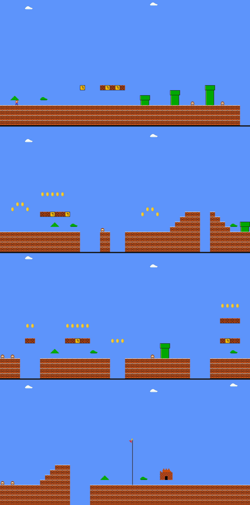
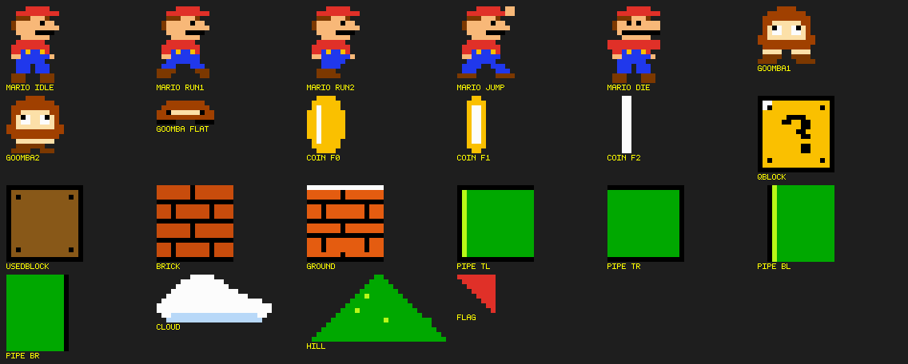
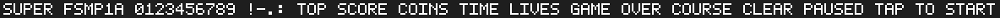

# 番外篇 | 在 FS-MP1A 上跑自研像素马里奥：纯 QPainter、零素材、全部源码在文内

> **系列说明**：本篇是全系列 38 篇收官之后的**番外篇**，不对应课件任何一节——它把整门课攒下的家当（buildroot 交叉 Qt 工具链、NFS 根文件系统、出厂内核的显示/触摸驱动）拼到一起，在开发板的 MIPI 屏上跑一个**从零手写的像素马里奥**：纯 QPainter 画图、零图片素材、零第三方库、零音频依赖，游戏里的每一颗像素都是代码画出来的，全部源代码就贴在本篇内。前置：实验三十六（QT 运行环境）+ 实验三十七（Qt 交叉编译闭环）。

> **素材与出处**：本篇没有课件素材——游戏为**自研**（不是课件或资料包内容），工程三件套随本篇放在仓库 `08_GUI应用程序开发/fsmp1a-mario/`（`fsmp1a-mario.pro` / `main.cpp` / `pixelart.h`，UTF-8 无 BOM）。编译与部署用的全是前 38 篇建好的设施：buildroot 产物 `output/host/`（实验三十六）、NFS 根 `/home/cnu/nfsboot/rfs-buildroot`（实验二十八/二十九部署、实验三十六升级为带 QT 的根）、出厂内核启动变量 `fcsys`（实验三十六步骤 5）。

## 一、这是什么

一个横版平台跳跃游戏，FC 超级马里奥第一章（1-1）的风味：跑、跳、顶砖出金币、踩板栗仔、跳沟壑、摸旗杆通关。为 FS-MP1A + buildroot Qt 5.12 + linuxfb + 电容触摸屏量身定制，带完整的状态机（标题 → 游戏 → 死亡 → 结算）、记分栏、最高分存档（`/opt/hiscore.txt`，NFS 根上断电不丢）。

"零素材"是这样做到的：

- **全部贴图 = 字符画**。马里奥、板栗仔、金币、砖块、水管、云朵……每一张"图"在源码里就是一个字符串数组，一个字符一个像素（`pixelart.h`）——想改皮肤直接改字符，不用任何图片编辑器；
- **全部文字 = 自带 5×7 点阵字库**。不依赖板上字体文件，也绕开了根文件系统没有中文字体的坑（界面用复古英文，跟 FC 原作一个气质）；
- **云朵换色即树丛**：同一套字符画换一张调色板（任天堂当年真这么干过）。

关卡、精灵、字库的设计预览（开发期用脚本按游戏同款渲染逻辑生成的图，非实拍；实拍截图发布前替换/补充在这里）：


> 图：1-1 全景（开发期渲染预览）——200 列宽的关卡：问号块、三根渐高水管、双沟、浮空砖、双层砖、终点阶梯、旗杆与城堡；共 10 只板栗仔、27 枚金币、7 个 ? 块。


> 图：全部 22 张字符画精灵（开发期渲染预览）——马里奥五姿态（待机/两帧跑步/跳/死亡）、板栗仔（两帧脚步 + 踩扁）、金币四帧旋转、方块、水管、云朵、山、旗。


> 图：5×7 点阵字库样张（开发期渲染预览）——A-Z、0-9 与 `!` `-` `.` `:` 四个符号，每个字形 5 字节宽、7 行高，放大取整数倍保持像素感。

**分辨率自适应**：竖屏（MIPI050 这类 480×800）按 240×400 逻辑分辨率整数倍放大；横屏则切 400×240 并让镜头纵向跟随。想知道屏幕实际分辨率，板上敲：

```
cat /sys/class/graphics/fb0/virtual_size
```

## 二、怎么玩

**操作**（屏幕按钮，支持双指同按——左手拇指按方向、右手食指点跳，这才是马里奥的正确姿势）：

| 按键 | 作用 |
|------|------|
| 左下 ◀ ▶ | 左右移动 |
| 右下 **A** | 跳跃：**长按跳得高，松手就落**（可变跳跃高度） |
| 右上角 ❚❚ | 暂停 / 继续 |
| 轻点任意处 | 标题/结算界面"确认" |

**规则**：

| 事项 | 数值 |
|------|------|
| 金币（吃或顶 ? 块） | +200 分；攒满 100 枚 +1 条命 |
| 踩板栗仔 | 100 → 200 → 400 → 800 连击翻倍；**踩的瞬间按住 A 弹得更高，可以连踩** |
| ? 块 | 从下方顶它：出金币、变深色 |
| 时间 | 300 起倒计时（每格 0.4 秒）；归零 = 死 |
| 通关奖励 | 剩余时间 × 10 分 |
| 死亡 | 掉沟、碰到板栗仔（顶不了要先跳踩）、超时；共 3 条命 |
| 通关 | 摸到旗杆：抱杆滑下 → 自动走进城堡 → 烟花 → COURSE CLEAR! |
| 最高分 | 自动存 `/opt/hiscore.txt` |

**手感细节**（藏在物理参数里的三个福利）：落地前 6 帧内按跳仍会起跳（coyote time，边缘起跳不憋屈）；落地前 7 帧内按跳会被记住（jump buffer，连跳顺手）；踩怪瞬间按住 A 弹得更高。

## 三、工程文件与全部源代码

工程就三个文件，与本文代码逐字一致（以后若改动，以仓库 `08_GUI应用程序开发/fsmp1a-mario/` 为准）：

| 文件 | 内容 |
|------|------|
| `fsmp1a-mario.pro` | qmake 工程文件，10 行 |
| `pixelart.h` | 全部字符画 + 点阵字库 + 画像素的小工具函数 |
| `main.cpp` | 游戏本体：关卡数据、物理、碰撞、状态机、双指触控、渲染 |

`fsmp1a-mario.pro`：

```qmake
#--------------------------------------------------------------------
# FS-MP1A 像素马里奥 —— 收官番外篇
# 编译（Ubuntu，用 buildroot 的 qmake，别用系统 qmake）：
#   <buildroot源码>/output/host/bin/qmake fsmp1a-mario.pro
#   make -j2
# 板上运行（出厂内核 + 新根）：
#   /opt/fsmp1a-mario -platform linuxfb
#--------------------------------------------------------------------
QT       += widgets
CONFIG   += c++11
TEMPLATE  = app
TARGET    = fsmp1a-mario

SOURCES  += main.cpp
HEADERS  += pixelart.h
```

`pixelart.h`：

```cpp
#ifndef PIXELART_H
#define PIXELART_H
//
// pixelart.h —— 本作的全部"美术"：像素字符画 + 5x7 点阵字库
//
// 规则：每个字符画是一个字符串数组，一个字符 = 一个像素；
//       '.' 或空格 = 透明，其余字符查 artColor() 上色。
// 想改外观：直接改下面的字符画再 make，不需要任何图片编辑器。
// 同一套云朵字符画换一张调色板就是树丛（任天堂当年也是这么省事的）。
//

#include <QImage>
#include <QPainter>
#include <QHash>
#include <QRgb>
#include <string.h>

// ---------------- 调色板 ----------------
inline QRgb artColor(char c)
{
    switch (c) {
    case 'R': return 0xFFE03028; // 红：帽子/上衣/旗子
    case 'U': return 0xFF2038EC; // 蓝：背带裤
    case 'S': return 0xFFF8B878; // 肤色
    case 'B': return 0xFF7C3800; // 深棕：头发/鞋/板栗仔脚
    case 'K': return 0xFF000000; // 黑：轮廓/眼睛/砖缝
    case 'W': return 0xFFFCFCFC; // 白
    case 'Y': return 0xFFFAC000; // 金：?块/金币
    case 'O': return 0xFFC84C0C; // 砖橙
    case 'E': return 0xFFE45C10; // 地面橙（比砖亮一档）
    case 'A': return 0xFF885818; // 深棕：顶过的?块
    case 'N': return 0xFFA04000; // 栗色：板栗仔身体
    case 'C': return 0xFFFCE0A8; // 米色：板栗仔脸
    case 'G': return 0xFF00A800; // 绿：树丛/山
    case 'P': return 0xFF00A800; // 绿：水管
    case 'L': return 0xFFB8F818; // 亮绿：水管高光/山头亮点
    case 'M': return 0xFF007000; // 暗绿：树丛阴影
    case 'c': return 0xFFB8D8F8; // 云底淡蓝
    default:  return 0x00000000; // 透明
    }
}

// ---------------- 字符画 → QImage ----------------
// remap：换色表（旧字符 → 新字符），树丛复用云朵字符画时用
template <int N>
inline QImage buildSprite(const char* const (&rows)[N], bool flip = false,
                          const QHash<char, char>& remap = QHash<char, char>())
{
    const int w = static_cast<int>(strlen(rows[0]));
    QImage img(w, static_cast<int>(N), QImage::Format_ARGB32_Premultiplied);
    for (int y = 0; y < static_cast<int>(N); ++y) {
        const char* r = rows[y];
        for (int x = 0; x < w; ++x) {
            char c = r[x];
            if (remap.contains(c))
                c = remap.value(c);
            img.setPixel(x, y, (c == '.' || c == ' ') ? 0x00000000 : artColor(c));
        }
    }
    return flip ? img.mirrored(true, false) : img;
}

// ---------------- 马里奥（12x16，朝右） ----------------
static const char* const MARIO_IDLE[] = {
    "....RRRRR...",
    "..RRRRRRRRR.",
    "..BBBSSSB...",
    ".BSSSSSKSS..",
    ".BSSSSSSSSS.",
    "..SSSSKKKK..",
    "...SSSSSS...",
    "..RRRRRR....",
    ".RRRRRRRR...",
    ".RRUYUUYR...",
    ".SSUUUUUUS..",
    "..UUUUUU....",
    "..UUU.UUU...",
    "..UUU.UUU...",
    ".BBB...BBB..",
    ".BBB...BBB..",
};

static const char* const MARIO_RUN1[] = {
    "....RRRRR...",
    "..RRRRRRRRR.",
    "..BBBSSSB...",
    ".BSSSSSKSS..",
    ".BSSSSSSSSS.",
    "..SSSSKKKK..",
    "...SSSSSS...",
    "..RRRRRR....",
    ".RRRRRRRR...",
    ".RRUYUUYR...",
    ".SSUUUUUU...",
    "..UUUUUUU...",
    ".UUU...UUU..",
    "BBBB....BBB.",
    "BBB......BB.",
    "............",
};

static const char* const MARIO_RUN2[] = {
    "....RRRRR...",
    "..RRRRRRRRR.",
    "..BBBSSSB...",
    ".BSSSSSKSS..",
    ".BSSSSSSSSS.",
    "..SSSSKKKK..",
    "...SSSSSS...",
    "..RRRRRR....",
    ".RRRRRRRR...",
    ".RRUYUUYR...",
    ".SSUUUUUUS..",
    "...UUUUU....",
    "...UUUU.....",
    "..BBBB......",
    "..BBBBB.....",
    "............",
};

static const char* const MARIO_JUMP[] = {
    "....RRRRR.SS",
    "..RRRRRRRRSS",
    "..BBBSSSB...",
    ".BSSSSSKSS..",
    ".BSSSSSSSSS.",
    "..SSSSKKKK..",
    "...SSSSSS...",
    "..RRRRRR....",
    ".RRRRRRRR...",
    ".RRUYUUYR...",
    ".SSUUUUUU...",
    "..UUUUUU....",
    ".UUUU..UUU..",
    ".UUU....UUU.",
    "BBBB....BBBB",
    "............",
};

static const char* const MARIO_DIE[] = {
    "....RRRRR...",
    "..RRRRRRRRR.",
    "..BBBSSSB...",
    ".BSSKSKSSSS.",
    ".BSSSSSSSSS.",
    "..SKKKKKKKK.",
    "...SSSSSS...",
    "RRRRRRRRRRR.",
    "RRRRRRRRRRR.",
    ".RRUYUUYR...",
    ".SSUUUUUUS..",
    "..UUUUUU....",
    "..UUU.UUU...",
    "..UUU.UUU...",
    ".BBB...BBB..",
    ".BBB...BBB..",
};

// ---------------- 板栗仔（12x12，两种脚步 + 踩扁） ----------------
static const char* const GOOMBA1[] = {
    "....NNNN....",
    "..NNNNNNNN..",
    ".NNNNNNNNNN.",
    ".NNCCCCCCNN.",
    ".NCKWCCWKCN.",
    ".NCWWCCWWCN.",
    "NNCCCCCCCCNN",
    "NNNNNNNNNNNN",
    ".NNNNNNNNNN.",
    ".CCCC..CCCC.",
    ".BBBB..BBBB.",
    "BBBB....BBBB",
};

static const char* const GOOMBA2[] = {
    "....NNNN....",
    "..NNNNNNNN..",
    ".NNNNNNNNNN.",
    ".NNCCCCCCNN.",
    ".NCKWCCWKCN.",
    ".NCWWCCWWCN.",
    "NNCCCCCCCCNN",
    "NNNNNNNNNNNN",
    ".NNNNNNNNNN.",
    "..CCCCCCCC..",
    "..BBBBBB....",
    ".BBBB..BBB..",
};

static const char* const GOOMBA_FLAT[] = {
    "............",
    "..NNNNNNNN..",
    ".NNNNNNNNNN.",
    "NNKCCCCCCKNN",
    "NNNNNNNNNNNN",
    "KKKK....KKKK",
};

// ---------------- 金币（8x12，四帧旋转） ----------------
static const char* const COIN_F0[] = {
    "..YYYY..",
    ".YYYYYY.",
    ".YWYYYY.",
    "YYWYYYYY",
    "YYWYYYYY",
    "YYWYYYYY",
    "YYWYYYYY",
    "YYWYYYYY",
    "YYWYYYYY",
    ".YWYYYY.",
    ".YYYYYY.",
    "..YYYY..",
};

static const char* const COIN_F1[] = {
    "...YY...",
    "..YYYY..",
    "..YWWY..",
    "..YWWY..",
    "..YWWY..",
    "..YWWY..",
    "..YWWY..",
    "..YWWY..",
    "..YWWY..",
    "..YWWY..",
    "..YYYY..",
    "...YY...",
};

static const char* const COIN_F2[] = {
    "...WW...",
    "...WW...",
    "...WW...",
    "...WW...",
    "...WW...",
    "...WW...",
    "...WW...",
    "...WW...",
    "...WW...",
    "...WW...",
    "...WW...",
    "...WW...",
};

// ---------------- 方块（16x16） ----------------
static const char* const QBLOCK[] = {
    "KKKKKKKKKKKKKKKK",
    "KWWYYYYYYYYYYYYK",
    "KWKYYYYYYYYYYKYK",
    "KYYYYYYYYYYYYYYK",
    "KYYYYYKKKKYYYYYK",
    "KYYYYKKYYKKYYYYK",
    "KYYYYYYYYKKYYYYK",
    "KYYYYYYYKKYYYYYK",
    "KYYYYYYYYKKYYYYK",
    "KYYYYYYYYYYYYYYK",
    "KYYYYYYYYKKYYYYK",
    "KYYYYYYYYKKYYYYK",
    "KYYYYYYYYYYYYYYK",
    "KYKYYYYYYYYYYKYK",
    "KYYYYYYYYYYYYYYK",
    "KKKKKKKKKKKKKKKK",
};

static const char* const USEDBLOCK[] = {
    "KKKKKKKKKKKKKKKK",
    "KAAAAAAAAAAAAAAK",
    "KAKAAAAAAAAAAKAK",
    "KAAAAAAAAAAAAAAK",
    "KAAAAAAAAAAAAAAK",
    "KAAAAAAAAAAAAAAK",
    "KAAAAAAAAAAAAAAK",
    "KAAAAAAAAAAAAAAK",
    "KAAAAAAAAAAAAAAK",
    "KAAAAAAAAAAAAAAK",
    "KAAAAAAAAAAAAAAK",
    "KAAAAAAAAAAAAAAK",
    "KAAAAAAAAAAAAAAK",
    "KAKAAAAAAAAAAKAK",
    "KAAAAAAAAAAAAAAK",
    "KKKKKKKKKKKKKKKK",
};

static const char* const BRICK[] = {
    "OOOOOOOKOOOOOOOO",
    "OOOOOOOKOOOOOOOO",
    "OOOOOOOKOOOOOOOO",
    "KKKKKKKKKKKKKKKK",
    "OOOKOOOOOOOKOOOO",
    "OOOKOOOOOOOKOOOO",
    "OOOKOOOOOOOKOOOO",
    "KKKKKKKKKKKKKKKK",
    "OOOOOOOKOOOOOOOO",
    "OOOOOOOKOOOOOOOO",
    "OOOOOOOKOOOOOOOO",
    "KKKKKKKKKKKKKKKK",
    "OOOKOOOOOOOKOOOO",
    "OOOKOOOOOOOKOOOO",
    "OOOKOOOOOOOKOOOO",
    "KKKKKKKKKKKKKKKK",
};

static const char* const GROUND[] = {
    "WWWWWWWWWWWWWWWW",
    "EEEEEEEKEEEEEEEE",
    "EEEEEEEKEEEEEEEE",
    "KKKKKKKKKKKKKKKK",
    "EEEKEEEEEEEEKEEE",
    "EEEKEEEEEEEEKEEE",
    "EEEKEEEEEEEEKEEE",
    "KKKKKKKKKKKKKKKK",
    "EEEEEEEKEEEEEEEE",
    "EEEEEEEKEEEEEEEE",
    "KKKKKKKKKKKKKKKK",
    "EEEKEEEEEEEEKEEE",
    "EEEKEEEEEEEEKEEE",
    "EEEKEEEEEEEEKEEE",
    "EEEEEEEKEEEEEEEE",
    "KKKKKKKKKKKKKKKK",
};

// ---------------- 水管（左右两半，各 16x16） ----------------
static const char* const PIPE_TL[] = {
    "KKKKKKKKKKKKKKKK",
    "KLPPPPPPPPPPPPPP",
    "KLPPPPPPPPPPPPPP",
    "KLPPPPPPPPPPPPPP",
    "KLPPPPPPPPPPPPPP",
    "KLPPPPPPPPPPPPPP",
    "KLPPPPPPPPPPPPPP",
    "KLPPPPPPPPPPPPPP",
    "KLPPPPPPPPPPPPPP",
    "KLPPPPPPPPPPPPPP",
    "KLPPPPPPPPPPPPPP",
    "KLPPPPPPPPPPPPPP",
    "KLPPPPPPPPPPPPPP",
    "KLPPPPPPPPPPPPPP",
    "KLPPPPPPPPPPPPPP",
    "KKKKKKKKKKKKKKKK",
};

static const char* const PIPE_TR[] = {
    "KKKKKKKKKKKKKKKK",
    "PPPPPPPPPPPPPPPK",
    "PPPPPPPPPPPPPPPK",
    "PPPPPPPPPPPPPPPK",
    "PPPPPPPPPPPPPPPK",
    "PPPPPPPPPPPPPPPK",
    "PPPPPPPPPPPPPPPK",
    "PPPPPPPPPPPPPPPK",
    "PPPPPPPPPPPPPPPK",
    "PPPPPPPPPPPPPPPK",
    "PPPPPPPPPPPPPPPK",
    "PPPPPPPPPPPPPPPK",
    "PPPPPPPPPPPPPPPK",
    "PPPPPPPPPPPPPPPK",
    "PPPPPPPPPPPPPPPK",
    "KKKKKKKKKKKKKKKK",
};

static const char* const PIPE_BL[] = {
    "..KLPPPPPPPPPPPP",
    "..KLPPPPPPPPPPPP",
    "..KLPPPPPPPPPPPP",
    "..KLPPPPPPPPPPPP",
    "..KLPPPPPPPPPPPP",
    "..KLPPPPPPPPPPPP",
    "..KLPPPPPPPPPPPP",
    "..KLPPPPPPPPPPPP",
    "..KLPPPPPPPPPPPP",
    "..KLPPPPPPPPPPPP",
    "..KLPPPPPPPPPPPP",
    "..KLPPPPPPPPPPPP",
    "..KLPPPPPPPPPPPP",
    "..KLPPPPPPPPPPPP",
    "..KLPPPPPPPPPPPP",
    "..KLPPPPPPPPPPPP",
};

static const char* const PIPE_BR[] = {
    "PPPPPPPPPPPPK...",
    "PPPPPPPPPPPPK...",
    "PPPPPPPPPPPPK...",
    "PPPPPPPPPPPPK...",
    "PPPPPPPPPPPPK...",
    "PPPPPPPPPPPPK...",
    "PPPPPPPPPPPPK...",
    "PPPPPPPPPPPPK...",
    "PPPPPPPPPPPPK...",
    "PPPPPPPPPPPPK...",
    "PPPPPPPPPPPPK...",
    "PPPPPPPPPPPPK...",
    "PPPPPPPPPPPPK...",
    "PPPPPPPPPPPPK...",
    "PPPPPPPPPPPPK...",
    "PPPPPPPPPPPPK...",
};

// ---------------- 云朵（24x10，换色即树丛） ----------------
static const char* const CLOUD[] = {
    ".......WWWWW............",
    ".....WWWWWWWWW..........",
    "....WWWWWWWWWWW.........",
    "...WWWWWWWWWWWWWW.......",
    "..WWWWWWWWWWWWWWWWW.....",
    ".WWWWWWWWWWWWWWWWWWWWW..",
    "WWWWWWWWWWWWWWWWWWWWWWWW",
    "WWWWWWWWWWWWWWWWWWWWWWWW",
    ".WWccccccccccccccccccWW.",
    "..cccccccccccccccccccc..",
};

// ---------------- 山（32x14） ----------------
static const char* const HILL[] = {
    "..............PP..............",
    ".............PPPP.............",
    "............PPPPPP............",
    "...........PPPPPPPP...........",
    "..........PPLPPPPPPP..........",
    ".........PPPPPPPPPPPP.........",
    "........PPPPPPPPPPPPPP........",
    ".......PPPLPPPPPPPPPPPP.......",
    "......PPPPPPPPPPPPPPPPPP......",
    ".....PPPPPPPPPPPLPPPPPPPPP....",
    "....PPPPPPPPPPPPPPPPPPPPPP....",
    "...PPPPPPPPPPPPPPPPPPPPPPPP...",
    "..PPPPPPPPPPPPPPPPPPPPPPPPPP..",
    ".PPPPPPPPPPPPPPPPPPPPPPPPPPPP.",
};

// ---------------- 旗（10x8，右缘贴旗杆） ----------------
static const char* const FLAG[] = {
    "RRRRRRRR..",
    ".RRRRRRR..",
    "..RRRRRR..",
    "...RRRRR..",
    "....RRRR..",
    ".....RRR..",
    "......RR..",
    ".......R..",
};

// ---------------- 5x7 点阵字库（够用的字符集） ----------------
static const char* const FONT_AZ[26][7] = {
    {".XXX.","X...X","X...X","XXXXX","X...X","X...X","X...X"}, // A
    {"XXXX.","X...X","X...X","XXXX.","X...X","X...X","XXXX."}, // B
    {".XXX.","X...X","X....","X....","X....","X...X",".XXX."}, // C
    {"XXXX.","X...X","X...X","X...X","X...X","X...X","XXXX."}, // D
    {"XXXXX","X....","X....","XXXX.","X....","X....","XXXXX"}, // E
    {"XXXXX","X....","X....","XXXX.","X....","X....","X...."}, // F
    {".XXX.","X...X","X....","X.XXX","X...X","X...X",".XXXX"}, // G
    {"X...X","X...X","X...X","XXXXX","X...X","X...X","X...X"}, // H
    {"XXXXX","..X..","..X..","..X..","..X..","..X..","XXXXX"}, // I
    {"....X","....X","....X","....X","X...X","X...X",".XXX."}, // J
    {"X...X","X..X.","X.X..","XX...","X.X..","X..X.","X...X"}, // K
    {"X....","X....","X....","X....","X....","X....","XXXXX"}, // L
    {"X...X","XX.XX","X.X.X","X.X.X","X...X","X...X","X...X"}, // M
    {"X...X","XX..X","X.X.X","X..XX","X...X","X...X","X...X"}, // N
    {".XXX.","X...X","X...X","X...X","X...X","X...X",".XXX."}, // O
    {"XXXX.","X...X","X...X","XXXX.","X....","X....","X...."}, // P
    {".XXX.","X...X","X...X","X...X","X.X.X","X..X.",".XX.X"}, // Q
    {"XXXX.","X...X","X...X","XXXX.","X.X..","X..X.","X...X"}, // R
    {".XXXX","X....","X....",".XXX.","....X","....X","XXXX."}, // S
    {"XXXXX","..X..","..X..","..X..","..X..","..X..","..X.."}, // T
    {"X...X","X...X","X...X","X...X","X...X","X...X",".XXX."}, // U
    {"X...X","X...X","X...X","X...X","X...X",".X.X.","..X.."}, // V
    {"X...X","X...X","X...X","X.X.X","X.X.X","XX.XX","X...X"}, // W
    {"X...X","X...X",".X.X.","..X..",".X.X.","X...X","X...X"}, // X
    {"X...X","X...X",".X.X.","..X..","..X..","..X..","..X.."}, // Y
    {"XXXXX","....X","...X.","..X..",".X...","X....","XXXXX"}, // Z
};

static const char* const FONT_09[10][7] = {
    {".XXX.","X...X","X..XX","X.X.X","XX..X","X...X",".XXX."}, // 0
    {"..X..",".XX..","..X..","..X..","..X..","..X..","XXXXX"}, // 1
    {".XXX.","X...X","....X","...X.","..X..",".X...","XXXXX"}, // 2
    {".XXX.","X...X","....X","..XX.","....X","X...X",".XXX."}, // 3
    {"...X.","..XX.",".X.X.","X..X.","XXXXX","...X.","...X."}, // 4
    {"XXXXX","X....","XXXX.","....X","....X","X...X",".XXX."}, // 5
    {".XXX.","X....","X....","XXXX.","X...X","X...X",".XXX."}, // 6
    {"XXXXX","....X","...X.","..X..",".X...",".X...",".X..."}, // 7
    {".XXX.","X...X","X...X",".XXX.","X...X","X...X",".XXX."}, // 8
    {".XXX.","X...X","X...X",".XXXX","....X","....X",".XXX."}, // 9
};

inline const char* const* glyphFor(char c)
{
    if (c >= 'A' && c <= 'Z') return FONT_AZ[c - 'A'];
    if (c >= '0' && c <= '9') return FONT_09[c - '0'];
    switch (c) {
    case '!': { static const char* const g[7] = {"..X..","..X..","..X..","..X..","..X..",".....","..X.."}; return g; }
    case '-': { static const char* const g[7] = {".....",".....",".....","XXXXX",".....",".....","....."}; return g; }
    case '.': { static const char* const g[7] = {".....",".....",".....",".....",".....",".XX..",".XX.."}; return g; }
    case ':': { static const char* const g[7] = {".....",".XX..",".XX..",".....",".XX..",".XX..","....."}; return g; }
    default: return 0;
    }
}

// 画一个字符（scale = 放大倍数，整数倍保持像素风）
inline void drawGlyph(QPainter& p, char c, int x, int y, int scale, QRgb color)
{
    const char* const* g = glyphFor(c);
    if (!g)
        return;
    for (int r = 0; r < 7; ++r)
        for (int col = 0; col < 5; ++col)
            if (g[r][col] == 'X')
                p.fillRect(x + col * scale, y + r * scale, scale, scale, QColor(color));
}

// 画一行文字；shadow 非 0 时先画一层偏移的影子，保证在花哨背景上也读得清
inline void drawTextPx(QPainter& p, int x, int y, const QString& s, int scale,
                       QRgb color, QRgb shadow = 0)
{
    int cx = x;
    for (int i = 0; i < s.length(); ++i) {
        const QChar qc = s.at(i);
        const char c = qc.toLatin1();
        if (shadow)
            drawGlyph(p, c, cx + scale, y + scale, scale, shadow);
        drawGlyph(p, c, cx, y, scale, color);
        cx += 6 * scale;
    }
}

inline int textW(const QString& s, int scale)
{
    return qMax(0, s.length() * 6 - 1) * scale;
}

#endif // PIXELART_H
```

`main.cpp`：

```cpp
//
// main.cpp —— FS-MP1A 像素马里奥（收官番外篇）
//
// 纯 QPainter 手绘的横版平台跳跃游戏：零图片素材、零音频依赖，
// 所有"美术"都在 pixelart.h 的字符画里。专为 FS-MP1A（STM32MP157A）
// + buildroot Qt 5.12 + linuxfb + 电容触摸屏编写。
//
//   编译：buildroot 的 qmake + make（见 fsmp1a-mario.pro 头部注释）
//   运行：/opt/fsmp1a-mario -platform linuxfb
//   操作：屏幕左下 ◀ ▶ 移动，右下 A 跳（支持双指同按：拇指跑动食指跳）
//         顶 ? 块吃金币、踩板栗仔、跳沟、摸到旗杆通关
//
// 游戏手感的几个小设计：
//   · 长按 A 跳得高、松手就落（可变跳跃高度）
//   · 落地前的 6 帧内按跳仍然起跳（coyote time），边缘起跳不憋屈
//   · 落地前 7 帧内按跳会被记住（jump buffer），连跳顺手
//   · 踩怪瞬间按住 A 弹得更高，可以连踩
//

#include <QApplication>
#include <QWidget>
#include <QPainter>
#include <QImage>
#include <QTimer>
#include <QElapsedTimer>
#include <QTouchEvent>
#include <QMouseEvent>
#include <QKeyEvent>
#include <QVector>
#include <QMap>
#include <QFile>
#include <QScreen>
#include <QGuiApplication>
#include <QRandomGenerator>
#include <QDebug>
#include <cmath>

#include "pixelart.h"

// ---------------- 全局常数 ----------------
static const int   TILE      = 16;    // 逻辑瓦片 16px，屏幕上放大 2 倍 = 32px
static const int   LEVEL_W   = 200;   // 关卡宽（瓦片数）
static const int   LEVEL_H   = 24;    // 关卡高（瓦片数），竖屏刚好铺满
static const int   HUD_H     = 16;    // 顶部记分栏高度
static const int   PW = 10, PH = 15;  // 马里奥碰撞盒
static const int   GW = 12, GH = 12;  // 板栗仔碰撞盒
static const float WALK_ACC  = 0.09f;
static const float MAX_VX    = 1.5f;
static const float FRICTION  = 0.08f;
static const float JUMP_V    = -5.2f; // 满跳约 5 格高
static const float G_HOLD    = 0.16f; // 按住 A 时的重力（跳得高）
static const float G_FALL    = 0.34f; // 松开后的重力（松手就落）
static const float MAX_FALL  = 5.5f;
static const int   FLAG_TX   = 176;   // 旗杆所在列
static const int   CASTLE_PX = 182 * TILE; // 城堡（程序化绘制）位置

static const QRgb SKY = 0xFF5C94FC;   // 经典 FC 天空蓝

// ---------------- 关卡地图 ----------------
// 字符含义：' '空气 '#'地面 'B'砖 '?'问号块 'X'顶过的块
//           'o'金币 'g'板栗仔 'M'出生点 'F'旗杆
//           'I'/'i' 水管顶(左/右半)  'H'/'h' 水管身(左/右半)
static char g_map[LEVEL_H][LEVEL_W + 1];

static void put(int x, int y, char c)
{
    if (x >= 0 && x < LEVEL_W && y >= 0 && y < LEVEL_H)
        g_map[y][x] = c;
}

static char tileAt(int tx, int ty)
{
    if (tx < 0 || tx >= LEVEL_W) return '#'; // 左右出界当墙
    if (ty < 0 || ty >= LEVEL_H) return ' '; // 上下出界当空气（掉出下边界=摔死）
    return g_map[ty][tx];
}

static bool isSolid(char c)
{
    return c == '#' || c == 'B' || c == '?' || c == 'X' ||
           c == 'I' || c == 'i' || c == 'H' || c == 'h';
}

// 两格宽的水管，h = 高出地面的格数
static void putPipe(int x, int h)
{
    const int top = 20 - h;
    put(x, top, 'I');
    put(x + 1, top, 'i');
    for (int y = top + 1; y < 20; ++y) {
        put(x, y, 'H');
        put(x + 1, y, 'h');
    }
}

// 连续填一格列（阶梯用）
static void putCol(int x, int y0, int y1)
{
    for (int y = y0; y <= y1; ++y)
        put(x, y, '#');
}

static void buildLevel()
{
    for (int y = 0; y < LEVEL_H; ++y) {
        for (int x = 0; x < LEVEL_W; ++x)
            g_map[y][x] = ' ';
        g_map[y][LEVEL_W] = '\0';
    }

    // 地面：底下四行
    for (int x = 0; x < LEVEL_W; ++x)
        for (int y = 20; y < LEVEL_H; ++y)
            g_map[y][x] = '#';

    // 沟（掉下去摔死）。第一章的节奏：小沟热身 → 双沟考验 → 大沟冲刺
    static const int GAPS[] = {
        48, 49,  66, 67, 68, 69,  72, 73, 74,  90, 91,
        104, 105, 106, 107,  122, 123, 124,  138, 139, 140, 141,  164, 165, 166, 167,
    };
    for (unsigned i = 0; i < sizeof(GAPS) / sizeof(GAPS[0]); ++i)
        for (int y = 20; y < LEVEL_H; ++y)
            g_map[y][GAPS[i]] = ' ';

    // 出生点
    put(3, 19, 'M');

    // 第一问号：学会顶砖
    put(16, 16, '?');

    // 第一组砖排：B?B?B
    put(20, 16, 'B'); put(21, 16, '?'); put(22, 16, 'B');
    put(23, 16, '?'); put(24, 16, 'B');

    // 三根水管，一根比一根高；中间夹两只板栗仔
    putPipe(28, 2);
    putPipe(34, 3);
    putPipe(41, 4);
    put(38, 19, 'g');
    put(44, 19, 'g');

    // 第一条沟之后的金币弧
    put(52, 15, 'o'); put(53, 14, 'o'); put(54, 14, 'o'); put(55, 15, 'o');

    // 砖排 + 高处金币一排
    for (int x = 58; x <= 63; ++x)
        put(x, 16, (x == 60 || x == 63) ? '?' : 'B');
    for (int x = 58; x <= 62; ++x)
        put(x, 12, 'o');

    // 双沟之间的落点
    put(70, 19, 'g');

    // 金币小弧
    put(78, 16, 'o'); put(79, 15, 'o'); put(80, 15, 'o'); put(81, 16, 'o');

    // 上-平-下阶梯，中间夹一道小沟
    putCol(84, 19, 19);
    putCol(85, 18, 19);
    putCol(86, 17, 19);
    putCol(87, 16, 19);
    putCol(88, 16, 19);
    putCol(89, 16, 19);
    putCol(92, 16, 19);
    putCol(93, 17, 19);
    putCol(94, 18, 19);
    putCol(95, 19, 19);

    // 水管 + 双板栗仔
    putPipe(98, 2);
    put(100, 19, 'g');
    put(102, 19, 'g');

    // 沟上的浮空砖平台
    put(105, 16, 'B'); put(106, 16, 'B');
    put(105, 13, 'o'); put(106, 13, 'o');

    // 砖排 + 高处金币
    for (int x = 113; x <= 117; ++x)
        put(x, 16, (x == 115) ? '?' : 'B');
    for (int x = 113; x <= 117; ++x)
        put(x, 13, 'o');

    // 沟上金币
    put(122, 16, 'o'); put(123, 16, 'o'); put(124, 16, 'o');

    // 水管 + 板栗仔
    putPipe(132, 3);
    put(130, 19, 'g');

    // 双层砖：下层 '?'
    for (int x = 144; x <= 147; ++x)
        put(x, 16, (x == 145) ? '?' : 'B');
    for (int x = 144; x <= 147; ++x)
        put(x, 12, 'B');
    for (int x = 144; x <= 147; ++x)
        put(x, 9, 'o');

    // 终点前的双板栗仔
    put(150, 19, 'g');
    put(152, 19, 'g');

    // 终点阶梯 + 大沟（从高处起跳，正好飞过去）
    putCol(158, 19, 19);
    putCol(159, 18, 19);
    putCol(160, 17, 19);
    putCol(161, 16, 19);
    putCol(162, 16, 19);
    putCol(163, 16, 19);

    // 旗杆（10 格高）
    for (int y = 11; y <= 19; ++y)
        put(FLAG_TX, y, 'F');

    // 城堡在 FLAG_TX 之后，程序化绘制，不占地图字符
}

// ---------------- 实体 ----------------
struct Player {
    float x, y, vx, vy;
    bool onGround;
    bool faceRight;
    int animT;
    int stompCombo;
    int coyote;   // 离地后仍可起跳的剩余帧数
    int jbuf;     // 跳跃预输入剩余帧数
};

struct Goomba {
    float x, y, vx, gvy;
    bool alive, active, squashed;
    int squashT;
};

struct CoinEnt {
    float x, y;
    bool taken;
};

struct Particle {
    float x, y, vx, vy;
    int life;
    int kind;   // 0=?块顶出的金币 1=尘土/火花 2=烟花
};

struct Bump {
    int tx, ty, t;
};

enum GState { ST_TITLE, ST_PLAY, ST_DYING, ST_GAMEOVER, ST_WIN };
enum Btn { B_NONE, B_LEFT, B_RIGHT, B_JUMP, B_PAUSE };

// ---------------- 精灵集合 ----------------
struct Sprites {
    QImage mIdleR, mRun1R, mRun2R, mJumpR, mDieR;
    QImage mIdleL, mRun1L, mRun2L, mJumpL;
    QImage goomba1, goomba2, goombaFlat;
    QImage coin[4];
    QImage qblock, used, brick, ground;
    QImage pipeTL, pipeTR, pipeBL, pipeBR;
    QImage cloud, bush, hill, flag;

    Sprites()
    {
        mIdleR = buildSprite(MARIO_IDLE);
        mRun1R = buildSprite(MARIO_RUN1);
        mRun2R = buildSprite(MARIO_RUN2);
        mJumpR = buildSprite(MARIO_JUMP);
        mDieR  = buildSprite(MARIO_DIE);
        mIdleL = mIdleR.mirrored(true, false);
        mRun1L = mRun1R.mirrored(true, false);
        mRun2L = mRun2R.mirrored(true, false);
        mJumpL = mJumpR.mirrored(true, false);

        goomba1    = buildSprite(GOOMBA1);
        goomba2    = buildSprite(GOOMBA2);
        goombaFlat = buildSprite(GOOMBA_FLAT);

        coin[0] = buildSprite(COIN_F0);
        coin[1] = buildSprite(COIN_F1);
        coin[2] = buildSprite(COIN_F2);
        coin[3] = coin[1].mirrored(true, false);

        qblock = buildSprite(QBLOCK);
        used   = buildSprite(USEDBLOCK);
        brick  = buildSprite(BRICK);
        ground = buildSprite(GROUND);

        pipeTL = buildSprite(PIPE_TL);
        pipeTR = buildSprite(PIPE_TR);
        pipeBL = buildSprite(PIPE_BL);
        pipeBR = buildSprite(PIPE_BR);

        cloud = buildSprite(CLOUD);
        bush  = buildSprite(CLOUD, false, QHash<char, char>{{'W', 'G'}, {'c', 'M'}});
        hill  = buildSprite(HILL);
        flag  = buildSprite(FLAG);
    }
};

static Sprites& spr()
{
    static Sprites s;
    return s;
}

// ---------------- 装饰物位置（世界坐标，像素） ----------------
struct Decor { int x, y; };
static const Decor HILLS[]   = { {2 * 16, 0}, {60 * 16, 0}, {110 * 16, 0}, {170 * 16, 0} };
static const Decor BUSHES[]  = { {8 * 16, 0}, {64 * 16, 0}, {96 * 16, 0}, {118 * 16, 0}, {146 * 16, 0}, {178 * 16, 0} };
static const Decor CLOUDS[]  = { {5 * 16, 20}, {30 * 16, 8}, {55 * 16, 40}, {80 * 16, 24},
                                 {105 * 16, 10}, {130 * 16, 36}, {155 * 16, 18}, {180 * 16, 30}, {196 * 16, 12} };

// 云朵/树丛字符画高 10px、山高 14px：画的时候再落到地面顶上
static const int HILL_H = 14, CLOUD_H = 10;
static const int GROUND_TOP = 20 * TILE;

// 跳跃输入的按下沿标记（触屏/键盘事件里置位，物理步进里消费）
struct Input {
    bool jumpPress = false;
};

// ---------------- 主窗口（同时是整个游戏） ----------------
class GameWidget : public QWidget
{
public:
    GameWidget(int lw, int lh, int scale, QWidget* parent = nullptr)
        : QWidget(parent), mLw(lw), mLh(lh), mScale(scale)
    {
        setWindowTitle(QStringLiteral("FS-MP1A Pixel Mario"));
        setAttribute(Qt::WA_AcceptTouchEvents, true);
        canvas = QImage(mLw, mLh, QImage::Format_RGB32);

        mHiscore = loadHiscore();
        resetAll();
        state = ST_TITLE;

        connect(&timer, &QTimer::timeout, this, [this] { tick(); });
        timer.start(16);
        clock.start();
    }

protected:
    bool event(QEvent* e) override
    {
        switch (e->type()) {
        case QEvent::TouchBegin:
        case QEvent::TouchUpdate:
        case QEvent::TouchEnd:
        case QEvent::TouchCancel: {
            QTouchEvent* te = static_cast<QTouchEvent*>(e);
            const bool cancel = (e->type() == QEvent::TouchCancel);
            const QList<QTouchEvent::TouchPoint> pts = te->touchPoints();
            for (int i = 0; i < pts.size(); ++i) {
                const QTouchEvent::TouchPoint& tp = pts.at(i);
                if (cancel || tp.state() == Qt::TouchPointReleased) {
                    touchBind.remove(tp.id());
                } else if (tp.state() == Qt::TouchPointPressed) {
                    onPress(tp.pos());
                    touchBind.insert(tp.id(), hitButton(tp.pos()));
                }
            }
            if (cancel)
                touchBind.clear();
            refreshButtons();
            e->accept();
            return true;
        }
        default:
            return QWidget::event(e);
        }
    }

    void mousePressEvent(QMouseEvent* e) override
    {
        onPress(e->localPos());
        mouseBtn = hitButton(e->localPos());
        refreshButtons();
    }

    void mouseReleaseEvent(QMouseEvent*) override
    {
        mouseBtn = B_NONE;
        refreshButtons();
    }

    void keyPressEvent(QKeyEvent* e) override
    {
        if (e->isAutoRepeat())
            return;
        switch (e->key()) {
        case Qt::Key_Left:  kbL = true; break;
        case Qt::Key_Right: kbR = true; break;
        case Qt::Key_Space:
        case Qt::Key_Up:
        case Qt::Key_W:
            if (!kbJ) { kbJ = true; in.jumpPress = true; }
            break;
        case Qt::Key_Return:
        case Qt::Key_Enter:
            tapRequest = true;
            break;
        case Qt::Key_P:
            if (state == ST_PLAY)
                paused = !paused;
            break;
        default:
            break;
        }
    }

    void keyReleaseEvent(QKeyEvent* e) override
    {
        if (e->isAutoRepeat())
            return;
        switch (e->key()) {
        case Qt::Key_Left:  kbL = false; break;
        case Qt::Key_Right: kbR = false; break;
        case Qt::Key_Space:
        case Qt::Key_Up:
        case Qt::Key_W: kbJ = false; break;
        default:
            break;
        }
    }

    void paintEvent(QPaintEvent*) override
    {
        mOffX = (width() - mLw * mScale) / 2;   // 屏幕不是整数倍时的居中黑边
        mOffY = (height() - mLh * mScale) / 2;
        QPainter p(this);
        p.fillRect(rect(), Qt::black);                       // 字母屏之外的边
        p.drawImage(QRect(mOffX, mOffY, mLw * mScale, mLh * mScale), canvas);
        if (state == ST_PLAY || state == ST_DYING || state == ST_WIN)
            drawButtons(p);
    }

private:
    // ---------- 主循环 ----------
    void tick()
    {
        qint64 ms = clock.restart();
        mAcc += ms;
        if (mAcc > 100) mAcc = 100;   // 卡顿保护，防止追帧螺旋
        while (mAcc >= 16) {
            mAcc -= 16;
            step();
        }
        render();
        update();
    }

    void step()
    {
        ++frame;

        // 任意界面上的"确认"键
        if (tapRequest) {
            tapRequest = false;
            if (state == ST_TITLE) {
                startGame();
            } else if (state == ST_GAMEOVER && stateT > 45) {
                state = ST_TITLE; stateT = 0;
            } else if (state == ST_WIN && winPhase == 2 && stateT > 120) {
                state = ST_TITLE; stateT = 0;
            }
        }
        if (state != ST_PLAY)
            in.jumpPress = false;   // 非游玩状态攒下的跳跃沿作废，防止重生自动起跳

        switch (state) {
        case ST_TITLE:
        case ST_GAMEOVER:
            ++stateT;
            break;
        case ST_PLAY:
            if (!paused)
                stepPlay();
            break;
        case ST_DYING:
            stepDying();
            break;
        case ST_WIN:
            stepWin();
            break;
        }
    }

    // ---------- 游戏状态 ----------
    void resetAll()
    {
        score = 0; coinsCnt = 0; lives = 3;
        resetLevel();
    }

    void startGame()
    {
        resetAll();
        state = ST_PLAY;
        stateT = 0;
        paused = false;
    }

    void resetLevel()
    {
        buildLevel();

        goombas.clear(); coins.clear(); parts.clear(); bumps.clear();
        for (int ty = 0; ty < LEVEL_H; ++ty) {
            for (int tx = 0; tx < LEVEL_W; ++tx) {
                const char c = g_map[ty][tx];
                if (c == 'o') {
                    coins.append(CoinEnt{ float(tx * TILE + 4), float(ty * TILE + 2), false });
                    g_map[ty][tx] = ' ';
                } else if (c == 'g') {
                    goombas.append(Goomba{ float(tx * TILE + 2), float(GROUND_TOP - GH),
                                           -0.4f, 0.f, true, false, false, 0 });
                    g_map[ty][tx] = ' ';
                } else if (c == 'M') {
                    spawnX = tx * TILE;
                    g_map[ty][tx] = ' ';
                }
            }
        }

        p.x = float(spawnX); p.y = float(GROUND_TOP - PH);
        p.vx = 0; p.vy = 0;
        p.onGround = true; p.faceRight = true;
        p.animT = 0; p.stompCombo = 0;
        p.coyote = 0; p.jbuf = 0;

        timeLeft = 300;
        camX = 0; camY = 0;
        winPhase = 0;
        stateT = 0;
    }

    void stepPlay()
    {
        // —— 水平：加速 / 摩擦 ——
        const bool left  = tL || kbL;
        const bool right = tR || kbR;
        if (left && !right) {
            p.vx -= WALK_ACC;
            p.faceRight = false;
        } else if (right && !left) {
            p.vx += WALK_ACC;
            p.faceRight = true;
        } else {
            if (p.vx > 0) p.vx = qMax(0.f, p.vx - FRICTION);
            else          p.vx = qMin(0.f, p.vx + FRICTION);
        }
        p.vx = qBound(-MAX_VX, p.vx, MAX_VX);

        // —— 跳跃：预输入 + 土狼时间 + 可变高度 ——
        if (p.onGround) p.coyote = 6; else --p.coyote;
        if (in.jumpPress) { p.jbuf = 7; in.jumpPress = false; }
        else if (p.jbuf > 0) --p.jbuf;
        if (p.jbuf > 0 && p.coyote > 0) {
            p.vy = JUMP_V;
            p.jbuf = 0; p.coyote = 0;
            p.onGround = false;
        }
        const float g = (p.vy < 0 && (tJ || kbJ)) ? G_HOLD : G_FALL;
        p.vy += g;
        if (p.vy > MAX_FALL) p.vy = MAX_FALL;

        movePlayerX();
        movePlayerY();

        // 掉出下边界
        if (p.y > float(LEVEL_H * TILE + 32)) {
            playerDie();
            return;
        }

        // 计时
        if (frame % 24 == 0 && timeLeft > 0) {
            --timeLeft;
            if (timeLeft == 0) {
                playerDie();
                return;
            }
        }

        updateGoombas();
        if (state != ST_PLAY)
            return;               // 踩怪失败/碰到板栗仔已切到死亡状态
        updateCoins();
        updateParticles();
        updateBumps();

        // 到旗杆 → 通关
        if (p.x + PW >= FLAG_TX * TILE + 6)
            startWin();

        updateCamera();
    }

    void movePlayerX()
    {
        p.x += p.vx;
        const int topTy = int(p.y) / TILE;
        const int botTy = int(p.y + PH - 1) / TILE;
        if (p.vx > 0) {
            const int tx = int(p.x + PW - 1) / TILE;
            for (int ty = topTy; ty <= botTy; ++ty) {
                if (isSolid(tileAt(tx, ty))) { p.x = float(tx * TILE - PW); p.vx = 0; break; }
            }
        } else if (p.vx < 0) {
            const int tx = int(p.x) / TILE;
            for (int ty = topTy; ty <= botTy; ++ty) {
                if (isSolid(tileAt(tx, ty))) { p.x = float((tx + 1) * TILE); p.vx = 0; break; }
            }
        }
        if (p.x < 0) { p.x = 0; p.vx = 0; }
        if (p.x > float(LEVEL_W * TILE - PW)) { p.x = float(LEVEL_W * TILE - PW); p.vx = 0; }
    }

    void movePlayerY()
    {
        p.y += p.vy;
        p.onGround = false;
        const int leftTx = int(p.x) / TILE;
        const int rightTx = int(p.x + PW - 1) / TILE;
        if (p.vy >= 0) {
            const int ty = int(p.y + PH) / TILE;
            for (int tx = leftTx; tx <= rightTx; ++tx) {
                if (isSolid(tileAt(tx, ty))) {
                    p.y = float(ty * TILE - PH);
                    p.vy = 0;
                    p.onGround = true;
                    p.stompCombo = 0;
                    break;
                }
            }
        } else {
            const int ty = int(p.y) / TILE;
            int hitTx = -1, best = 1 << 30;
            for (int tx = leftTx; tx <= rightTx; ++tx) {
                if (isSolid(tileAt(tx, ty))) {
                    const int d = qAbs(tx * TILE + 8 - int(p.x + PW / 2));
                    if (d < best) { best = d; hitTx = tx; }
                }
            }
            if (hitTx >= 0) {
                p.y = float((ty + 1) * TILE);
                p.vy = 0;
                bumpBlock(hitTx, ty);
            }
        }
    }

    void bumpBlock(int tx, int ty)
    {
        const char c = tileAt(tx, ty);
        if (c == '?') {
            g_map[ty][tx] = 'X';
            score += 200;
            collectCoin();
            parts.append(Particle{ float(tx * TILE + 4), float(ty * TILE - 14),
                                   0.f, -3.2f, 34, 0 });
            bumps.append(Bump{ tx, ty, 8 });
        } else if (c == 'B') {
            bumps.append(Bump{ tx, ty, 8 });
        }
    }

    void collectCoin()
    {
        ++coinsCnt;
        if (coinsCnt >= 100) { coinsCnt = 0; ++lives; }
    }

    void updateGoombas()
    {
        for (int i = 0; i < goombas.size(); ++i) {
            Goomba& gb = goombas[i];
            if (!gb.alive) continue;

            // 进入镜头附近才活动
            if (!gb.active) {
                if (gb.x < camX + mLw + 32 && gb.x > camX - 64)
                    gb.active = true;
                else
                    continue;
            }

            if (gb.squashed) {
                if (--gb.squashT <= 0) gb.alive = false;
                continue;
            }

            // 水平：撞墙折返
            gb.x += gb.vx;
            const int topTy = int(gb.y + 1) / TILE;
            const int botTy = int(gb.y + GH - 1) / TILE;
            if (gb.vx > 0) {
                const int tx = int(gb.x + GW - 1) / TILE;
                for (int ty = topTy; ty <= botTy; ++ty) {
                    if (isSolid(tileAt(tx, ty))) { gb.x = float(tx * TILE - GW); gb.vx = -gb.vx; break; }
                }
            } else if (gb.vx < 0) {
                const int tx = int(gb.x) / TILE;
                for (int ty = topTy; ty <= botTy; ++ty) {
                    if (isSolid(tileAt(tx, ty))) { gb.x = float((tx + 1) * TILE); gb.vx = -gb.vx; break; }
                }
            }

            // 垂直：重力 + 落地（会自己走下悬崖）
            gb.gvy += G_FALL;
            if (gb.gvy > MAX_FALL) gb.gvy = MAX_FALL;
            gb.y += gb.gvy;
            if (gb.gvy > 0) {
                const int ty = int(gb.y + GH) / TILE;
                const int ltx = int(gb.x) / TILE;
                const int rtx = int(gb.x + GW - 1) / TILE;
                for (int tx = ltx; tx <= rtx; ++tx) {
                    if (isSolid(tileAt(tx, ty))) {
                        gb.y = float(ty * TILE - GH);
                        gb.gvy = 0;
                        break;
                    }
                }
            }
            if (gb.y > float(LEVEL_H * TILE + 32))
                gb.alive = false;

            // 与马里奥的碰撞：从上方踩到 = 压扁，其余 = 死
            if (state == ST_PLAY && !gb.squashed &&
                p.x + 2 < gb.x + GW && p.x + PW - 2 > gb.x &&
                p.y + 2 < gb.y + GH && p.y + PH > gb.y + 2) {
                if (p.vy > 0.5f && (p.y + PH) - gb.y < 9) {
                    gb.squashed = true;
                    gb.squashT = 30;
                    score += 100 << qMin(p.stompCombo, 3);
                    if (p.stompCombo < 4) ++p.stompCombo;
                    p.vy = (tJ || kbJ) ? -4.6f : -3.2f;   // 按住 A 弹得高，可连踩
                    p.onGround = false;
                    for (int k = 0; k < 4; ++k)
                        parts.append(Particle{ gb.x + 6, gb.y + 10,
                                               float(k - 2) * 0.4f, -1.2f, 18, 1 });
                } else {
                    playerDie();
                    return;
                }
            }
        }
    }

    void updateCoins()
    {
        for (int i = 0; i < coins.size(); ++i) {
            CoinEnt& cn = coins[i];
            if (cn.taken) continue;
            if (p.x + 2 < cn.x + 8 && p.x + PW - 2 > cn.x &&
                p.y < cn.y + 12 && p.y + PH > cn.y) {
                cn.taken = true;
                score += 200;
                collectCoin();
                parts.append(Particle{ cn.x, cn.y, 0.f, -1.8f, 16, 1 });
            }
        }
    }

    void updateParticles()
    {
        for (int i = parts.size() - 1; i >= 0; --i) {
            Particle& pt = parts[i];
            if (pt.kind == 0) {
                pt.vy += 0.2f;
            } else if (pt.kind == 2) {
                pt.vy += 0.06f;
                pt.vx *= 0.98f;
            }
            pt.x += pt.vx;
            pt.y += pt.vy;
            if (--pt.life <= 0)
                parts.removeAt(i);
        }
    }

    void updateBumps()
    {
        for (int i = bumps.size() - 1; i >= 0; --i) {
            if (--bumps[i].t <= 0)
                bumps.removeAt(i);
        }
    }

    void playerDie()
    {
        state = ST_DYING;
        stateT = 0;
        p.vx = 0;
        p.vy = 0;
    }

    void stepDying()
    {
        ++stateT;
        if (stateT == 20)
            p.vy = -5.f;
        if (stateT > 20) {
            p.vy += 0.3f;
            p.y += p.vy;
        }
        if (stateT > 150 || p.y > float(LEVEL_H * TILE + 96)) {
            --lives;
            if (lives > 0) {
                resetLevel();
                state = ST_PLAY;
            } else {
                saveHiscore();
                state = ST_GAMEOVER;
                stateT = 0;
            }
        }
    }

    void startWin()
    {
        state = ST_WIN;
        winPhase = 0;
        stateT = 0;
        timeBonus = timeLeft * 10;
        score += timeBonus;
        p.vx = 0; p.vy = 0;
        p.x = float(FLAG_TX * TILE - 4);
        p.faceRight = false;
        saveHiscore();
    }

    void stepWin()
    {
        ++stateT;
        updateParticles();
        if (winPhase == 0) {                       // 抱着旗杆滑下来
            p.y += 2.2f;
            if (p.y >= float(GROUND_TOP - PH)) {
                p.y = float(GROUND_TOP - PH);
                p.onGround = true;
                winPhase = 1;
                stateT = 0;
                p.faceRight = true;
            }
        } else if (winPhase == 1) {                // 走进城堡
            p.x += 1.1f;
            if (p.x >= float(CASTLE_PX + 32)) {
                winPhase = 2;
                stateT = 0;
            }
        } else {                                   // 烟花 + 通关面板
            if (stateT % 16 == 0)
                spawnFirework();
        }
        updateCamera();
    }

    void spawnFirework()
    {
        const float fx = camX + float(QRandomGenerator::global()->bounded(mLw - 40) + 20);
        const float fy = float(QRandomGenerator::global()->bounded(80) + 40);
        const QRgb cols[4] = { 0xFFE03028, 0xFFFAC000, 0xFFFCFCFC, 0xFF00A800 };
        const QRgb col = cols[QRandomGenerator::global()->bounded(4)];
        for (int k = 0; k < 20; ++k) {
            const float a = float(k) * 3.14159f / 10.f;
            parts.append(Particle{ fx, fy, cosf(a) * 1.8f, sinf(a) * 1.8f, 46, 2 });
        }
        fireworkCol = col;
    }

    void updateCamera()
    {
        const float target = p.x + PW / 2.f - mLw / 2.f;
        camX = qBound(0.f, target, float(LEVEL_W * TILE - mLw));
        const int visH = mLh - HUD_H;
        if (visH < LEVEL_H * TILE)
            camY = qBound(0, int(p.y - visH * 0.6f), LEVEL_H * TILE - visH);
        else
            camY = 0;
    }

    // ---------- 触控按钮 ----------
    void onPress(const QPointF& pos)
    {
        tapRequest = true;      // 状态机自己决定要不要消费（标题/结算界面用）
        if (state == ST_PLAY && hitButton(pos) == B_PAUSE)
            paused = !paused;
    }

    Btn hitButton(const QPointF& pos) const
    {
        const qreal W = width(), H = height();
        if (QRectF(W - 58, 18, 44, 44).contains(pos))
            return B_PAUSE;
        struct { Btn b; QPointF c; qreal r; } defs[3] = {
            { B_LEFT,  QPointF(W * 0.16, H - H * 0.11),          qMin(W, H) * 0.095 },
            { B_RIGHT, QPointF(W * 0.38, H - H * 0.11),          qMin(W, H) * 0.095 },
            { B_JUMP,  QPointF(W * 0.82, H - H * 0.11),          qMin(W, H) * 0.11  },
        };
        for (int i = 0; i < 3; ++i) {
            const QPointF d = pos - defs[i].c;
            if (d.x() * d.x() + d.y() * d.y() <= (defs[i].r + 8) * (defs[i].r + 8))
                return defs[i].b;
        }
        return B_NONE;
    }

    void refreshButtons()
    {
        tL = tR = tJ = tPause = false;
        for (QMap<int, int>::const_iterator it = touchBind.constBegin();
             it != touchBind.constEnd(); ++it) {
            if (it.value() == B_LEFT)  tL = true;
            if (it.value() == B_RIGHT) tR = true;
            if (it.value() == B_JUMP)  tJ = true;
            if (it.value() == B_PAUSE) tPause = true;
        }
        if (mouseBtn == B_LEFT)  tL = true;
        if (mouseBtn == B_RIGHT) tR = true;
        if (mouseBtn == B_JUMP)  tJ = true;
        if (mouseBtn == B_PAUSE) tPause = true;
        if (tJ && !prevTJ) in.jumpPress = true;   // 触屏没有自动重复，自己检测按下沿
        prevTJ = tJ;
    }

    // ---------- 渲染 ----------
    void render()
    {
        canvas.fill(SKY);
        QPainter c(&canvas);

        if (state == ST_TITLE) {
            drawTitle(c);
        } else {
            drawScene(c);
            if (state == ST_GAMEOVER) drawGameOver(c);
            if (state == ST_WIN && winPhase == 2) drawWinPanel(c);
            if (paused && state == ST_PLAY) drawPaused(c);
            drawHud(c);
        }
    }

    void drawScene(QPainter& c)
    {
        const int camXi = int(camX);

        // 装饰：山、树丛、云
        for (unsigned i = 0; i < sizeof(HILLS) / sizeof(HILLS[0]); ++i)
            c.drawImage(HILLS[i].x - camXi, GROUND_TOP - HILL_H - camY + HUD_H, spr().hill);
        for (unsigned i = 0; i < sizeof(BUSHES) / sizeof(BUSHES[0]); ++i)
            c.drawImage(BUSHES[i].x - camXi, GROUND_TOP - CLOUD_H - camY + HUD_H, spr().bush);
        for (unsigned i = 0; i < sizeof(CLOUDS) / sizeof(CLOUDS[0]); ++i)
            c.drawImage(CLOUDS[i].x - camXi, CLOUDS[i].y - camY + HUD_H, spr().cloud);

        // 瓦片
        const int tx0 = qMax(0, camXi / TILE);
        const int tx1 = qMin(LEVEL_W - 1, (camXi + mLw) / TILE + 1);
        const int ty0 = qMax(0, camY / TILE);
        const int ty1 = qMin(LEVEL_H - 1, (camY + mLh - HUD_H) / TILE);
        for (int ty = ty0; ty <= ty1; ++ty) {
            for (int tx = tx0; tx <= tx1; ++tx) {
                const char ch = g_map[ty][tx];
                if (ch == ' ' || ch == 'o' || ch == 'g' || ch == 'M') continue;
                int sx = tx * TILE - camXi;
                int sy = ty * TILE - camY + HUD_H;
                // 顶砖时的上弹位移
                int dy = 0;
                for (int i = 0; i < bumps.size(); ++i)
                    if (bumps[i].tx == tx && bumps[i].ty == ty)
                        dy = -qMin(bumps[i].t, 8 - bumps[i].t);
                sy += dy;
                switch (ch) {
                case '#': c.drawImage(sx, sy, spr().ground); break;
                case 'B': c.drawImage(sx, sy, spr().brick); break;
                case '?': c.drawImage(sx, sy, spr().qblock); break;
                case 'X': c.drawImage(sx, sy, spr().used); break;
                case 'I': c.drawImage(sx, sy, spr().pipeTL); break;
                case 'i': c.drawImage(sx, sy, spr().pipeTR); break;
                case 'H': c.drawImage(sx, sy, spr().pipeBL); break;
                case 'h': c.drawImage(sx, sy, spr().pipeBR); break;
                case 'F':
                    c.fillRect(sx + 7, sy, 2, TILE, QColor(0xFF3C3C3C));
                    if (tileAt(tx, ty - 1) != 'F') {          // 杆顶：金球 + 旗
                        c.fillRect(sx + 5, sy - 4, 6, 6, QColor(artColor('Y')));
                        c.drawImage(sx - 3, sy + 2, spr().flag);
                    }
                    break;
                default: break;
                }
            }
        }

        // 城堡（终点，程序化画）
        drawCastle(c, CASTLE_PX - camXi, GROUND_TOP - camY + HUD_H);

        // 金币
        const QImage* coinFrames[4] = { &spr().coin[0], &spr().coin[1],
                                        &spr().coin[2], &spr().coin[3] };
        const QImage* cf = coinFrames[(frame / 8) % 4];
        for (int i = 0; i < coins.size(); ++i)
            if (!coins[i].taken)
                c.drawImage(int(coins[i].x) - camXi, int(coins[i].y) - camY + HUD_H, *cf);

        // 粒子
        for (int i = 0; i < parts.size(); ++i) {
            const Particle& pt = parts[i];
            const int px = int(pt.x) - camXi, py = int(pt.y) - camY + HUD_H;
            if (pt.kind == 0)
                c.drawImage(px, py, *coinFrames[(frame / 4) % 4]);
            else if (pt.kind == 1)
                c.fillRect(px, py, 2, 2, QColor(0xFFFCE0A8));
            else
                c.fillRect(px, py, 2, 2, QColor(fireworkCol));
        }

        // 板栗仔
        for (int i = 0; i < goombas.size(); ++i) {
            const Goomba& gb = goombas[i];
            if (!gb.alive) continue;
            const int gx = int(gb.x) - camXi, gy = int(gb.y) - camY + HUD_H;
            if (gx < -20 || gx > mLw + 20) continue;
            if (gb.squashed) c.drawImage(gx, gy + 6, spr().goombaFlat);
            else c.drawImage(gx, gy, (frame / 12) % 2 ? spr().goomba1 : spr().goomba2);
        }

        // 马里奥（走进城堡后不再画）
        if (!(state == ST_WIN && winPhase == 2))
            drawPlayer(c);
    }

    void drawPlayer(QPainter& c)
    {
        const QImage* img;
        if (state == ST_DYING)
            img = &spr().mDieR;
        else if (state == ST_WIN && winPhase == 0)
            img = p.faceRight ? &spr().mJumpR : &spr().mJumpL;   // 抱杆下滑
        else if (state == ST_WIN && winPhase == 1)
            img = ((frame / 6) % 2) ? (p.faceRight ? &spr().mRun1R : &spr().mRun1L)
                                    : (p.faceRight ? &spr().mRun2R : &spr().mRun2L);
        else if (!p.onGround)
            img = p.faceRight ? &spr().mJumpR : &spr().mJumpL;
        else if (qAbs(p.vx) > 0.15f)
            img = ((frame / 6) % 2) ? (p.faceRight ? &spr().mRun1R : &spr().mRun1L)
                                    : (p.faceRight ? &spr().mRun2R : &spr().mRun2L);
        else
            img = p.faceRight ? &spr().mIdleR : &spr().mIdleL;
        c.drawImage(int(p.x) - 1 - int(camX), int(p.y) - 1 - camY + HUD_H, *img);
    }

    void drawCastle(QPainter& c, int x, int yBase)
    {
        const QRgb wall = artColor('O');
        const QRgb blk = QColor(0, 0, 0).rgba();
        if (x < -90 || x > mLw + 10) return;

        // 主体（5 瓦宽 3 瓦高）+ 上层塔（3 瓦宽 1 瓦高）
        c.fillRect(x, yBase - 48, 80, 48, QColor(wall));
        c.fillRect(x + 16, yBase - 64, 48, 16, QColor(wall));
        // 城垛
        for (int i = 0; i < 5; ++i) c.fillRect(x + i * 16, yBase - 56, 8, 8, QColor(wall));
        for (int i = 0; i < 3; ++i) c.fillRect(x + 20 + i * 16, yBase - 72, 8, 8, QColor(wall));
        // 砖缝
        for (int yy = yBase - 48; yy < yBase; yy += 8) c.fillRect(x, yy, 80, 1, QColor(blk));
        for (int r = 0; r < 6; ++r) {
            const int off = (r % 2) ? 0 : 8;
            for (int xx = x + off; xx < x + 80; xx += 16)
                c.fillRect(xx, yBase - 48 + r * 8, 1, 8, QColor(blk));
        }
        // 大门与两扇窗
        c.fillRect(x + 32, yBase - 24, 16, 24, QColor(blk));
        c.fillRect(x + 34, yBase - 28, 12, 6, QColor(blk));
        c.fillRect(x + 8,  yBase - 40, 8, 10, QColor(blk));
        c.fillRect(x + 64, yBase - 40, 8, 10, QColor(blk));
    }

    void drawHud(QPainter& c)
    {
        const QRgb wh = 0xFFFCFCFC, bk = 0xFF000000;
        drawTextPx(c, 4, 2, QStringLiteral("SCORE %1").arg(score, 6, 10, QChar('0')),
                   1, wh, bk);
        const QString coinsStr = QStringLiteral("COINS %1").arg(coinsCnt, 2, 10, QChar('0'));
        drawTextPx(c, mLw - textW(coinsStr, 1) - 4, 2, coinsStr, 1, wh, bk);
        drawTextPx(c, 4, 9, QStringLiteral("TIME %1").arg(timeLeft, 3, 10, QChar('0')),
                   1, wh, bk);
        const QString livesStr = QStringLiteral("LIVES %1").arg(lives);
        drawTextPx(c, mLw - textW(livesStr, 1) - 4, 9, livesStr, 1, wh, bk);
    }

    void drawTitle(QPainter& c)
    {
        // 地面画在画面最底下四行（竖屏横屏都对得上游戏里的坐标）
        const int groundTop = mLh - 64;
        for (int tx = 0; tx <= mLw / TILE; ++tx) {
            c.drawImage(tx * TILE, groundTop, spr().ground);
            c.drawImage(tx * TILE, groundTop + 16, spr().ground);
            c.drawImage(tx * TILE, groundTop + 32, spr().ground);
            c.drawImage(tx * TILE, groundTop + 48, spr().ground);
        }
        c.drawImage(8 * 16, groundTop - CLOUD_H, spr().bush);
        c.drawImage(30 * 16, groundTop - CLOUD_H, spr().bush);
        c.drawImage(16, 24, spr().cloud);
        c.drawImage(150, 40, spr().cloud);

        // 马里奥与一只板栗仔压阵
        c.drawImage(24, groundTop - 16, spr().mIdleR);
        c.drawImage(150, groundTop - 12, (frame / 12) % 2 ? spr().goomba1 : spr().goomba2);

        const int y1 = int(mLh * 0.17);
        drawCentered(c, QStringLiteral("SUPER"), 3, y1, 0xFFFCFCFC);
        drawCentered(c, QStringLiteral("FSMP1A"), 3, y1 + 34, artColor('Y'));
        drawCentered(c, QStringLiteral("PIXEL ADVENTURE WORLD 1-1"), 1, y1 + 70, 0xFFFCFCFC);

        const int yTap = int(mLh * 0.42);
        if ((frame / 30) % 2 == 0)
            drawCentered(c, QStringLiteral("TAP TO START"), 1, yTap, 0xFFFCFCFC);
        drawCentered(c, QStringLiteral("TOP %1").arg(mHiscore, 6, 10, QChar('0')), 1, yTap + 30, artColor('Y'));
        drawCentered(c, QStringLiteral("RUN  JUMP  STOMP  REACH FLAG"), 1, yTap + 52, 0xFFB8D8F8);
        drawCentered(c, QStringLiteral("QT 5.12 LINUXFB FS-MP1A"), 1, yTap + 70, 0xFFB8D8F8);
    }

    void drawGameOver(QPainter& c)
    {
        c.fillRect(0, 0, mLw, mLh, QColor(0, 0, 0, 190));
        drawCentered(c, QStringLiteral("GAME OVER"), 2, 150, 0xFFE03028);
        drawCentered(c, QStringLiteral("SCORE %1").arg(score, 6, 10, QChar('0')), 1, 190, 0xFFFCFCFC);
        if (stateT > 45 && (frame / 30) % 2 == 0)
            drawCentered(c, QStringLiteral("TAP TO CONTINUE"), 1, 230, 0xFFFCFCFC);
    }

    void drawWinPanel(QPainter& c)
    {
        drawCentered(c, QStringLiteral("COURSE CLEAR!"), 2, 90, 0xFFFCFCFC);
        drawCentered(c, QStringLiteral("TIME BONUS %1").arg(timeBonus), 1, 124, artColor('Y'));
        drawCentered(c, QStringLiteral("SCORE %1").arg(score, 6, 10, QChar('0')), 1, 140, 0xFFFCFCFC);
        if (stateT > 120 && (frame / 30) % 2 == 0)
            drawCentered(c, QStringLiteral("TAP TO CONTINUE"), 1, 170, 0xFFFCFCFC);
    }

    void drawPaused(QPainter& c)
    {
        c.fillRect(0, 0, mLw, mLh, QColor(0, 0, 0, 150));
        drawCentered(c, QStringLiteral("PAUSED"), 2, 180, 0xFFFCFCFC);
        drawCentered(c, QStringLiteral("TAP TOP-RIGHT TO RESUME"), 1, 214, 0xFFB8D8F8);
    }

    void drawCentered(QPainter& c, const QString& s, int scale, int y, QRgb color)
    {
        drawTextPx(c, (mLw - textW(s, scale)) / 2, y, s, scale, color, 0xFF000000);
    }

    // 屏幕按钮（画在缩放后的原生分辨率上，半透明不挡路）
    void drawButtons(QPainter& p)
    {
        const qreal W = width(), H = height();
        const qreal r = qMin(W, H) * 0.095;
        const QPointF cL(W * 0.16, H - H * 0.11);
        const QPointF cR(W * 0.38, H - H * 0.11);
        const QPointF cJ(W * 0.82, H - H * 0.11);

        p.setRenderHint(QPainter::Antialiasing, true);
        drawCircleBtn(p, cL, r, tL);
        drawCircleBtn(p, cR, r, tR);
        drawCircleBtn(p, cJ, r * 1.15, tJ);

        // 三个图形：◀ ▶ 和 A
        QPolygonF tri;
        const QColor ink = QColor(255, 255, 255, 230);
        tri << QPointF(cL.x() - r * 0.40, cL.y())
            << QPointF(cL.x() + r * 0.18, cL.y() - r * 0.36)
            << QPointF(cL.x() + r * 0.18, cL.y() + r * 0.36);
        p.setPen(Qt::NoPen); p.setBrush(ink);
        p.drawPolygon(tri);
        tri.clear();
        tri << QPointF(cR.x() + r * 0.40, cR.y())
            << QPointF(cR.x() - r * 0.18, cR.y() - r * 0.36)
            << QPointF(cR.x() - r * 0.18, cR.y() + r * 0.36);
        p.drawPolygon(tri);
        p.setBrush(Qt::NoBrush);
        drawGlyph(p, 'A', int(cJ.x() - 12), int(cJ.y() - 14), 4, 0xFFFCFCFC);

        // 右上角暂停键
        const QRectF pr(W - 58, 18, 44, 44);
        p.setPen(QPen(QColor(255, 255, 255, 130), 2));
        p.setBrush(QColor(255, 255, 255, tPause ? 90 : 38));
        p.drawRoundedRect(pr, 10, 10);
        p.setPen(Qt::NoPen);
        p.setBrush(ink);
        p.fillRect(pr.x() + 14, pr.y() + 13, 5, 18, ink);
        p.fillRect(pr.x() + 25, pr.y() + 13, 5, 18, ink);
        p.setRenderHint(QPainter::Antialiasing, false);
    }

    void drawCircleBtn(QPainter& p, const QPointF& c, qreal r, bool on)
    {
        p.setPen(Qt::NoPen);
        p.setBrush(QColor(255, 255, 255, on ? 90 : 38));
        p.drawEllipse(c, r, r);
        p.setPen(QPen(QColor(255, 255, 255, on ? 210 : 120), 2));
        p.setBrush(Qt::NoBrush);
        p.drawEllipse(c, r, r);
        p.setPen(Qt::NoPen);
    }

    // ---------- 最高分 ----------
    int loadHiscore() const
    {
        QFile f(QCoreApplication::applicationDirPath() + QStringLiteral("/hiscore.txt"));
        if (f.open(QIODevice::ReadOnly)) {
            const QByteArray b = f.read(32);
            return b.toInt();
        }
        return 0;
    }

    void saveHiscore()
    {
        if (score <= mHiscore)
            return;
        mHiscore = score;
        QFile f(QCoreApplication::applicationDirPath() + QStringLiteral("/hiscore.txt"));
        if (f.open(QIODevice::WriteOnly | QIODevice::Truncate))
            f.write(QByteArray::number(mHiscore));
    }

private:
    QImage canvas;
    int mLw, mLh, mScale, mOffX = 0, mOffY = 0;
    QTimer timer;
    QElapsedTimer clock;
    qint64 mAcc = 0;
    int frame = 0;

    int state = ST_TITLE;
    int stateT = 0;
    int winPhase = 0;
    bool paused = false;

    int score = 0, coinsCnt = 0, lives = 3, timeLeft = 300, timeBonus = 0;
    int mHiscore = 0;
    int spawnX = 48;
    float camX = 0;
    int camY = 0;
    QRgb fireworkCol = 0xFFFCFCFC;

    Player p;
    QVector<Goomba> goombas;
    QVector<CoinEnt> coins;
    QVector<Particle> parts;
    QVector<Bump> bumps;

    Input in;
    bool kbL = false, kbR = false, kbJ = false;
    bool tL = false, tR = false, tJ = false, tPause = false;
    bool prevTJ = false;
    bool tapRequest = false;
    Btn mouseBtn = B_NONE;
    QMap<int, int> touchBind;
};

int main(int argc, char* argv[])
{
    QApplication app(argc, argv);

    // 按屏幕形状挑逻辑分辨率：竖屏 240x400，横屏 400x240；整数倍放大保持像素感
    QRect scr = QGuiApplication::primaryScreen()->availableGeometry();
    if (scr.width() <= 0 || scr.height() <= 0)
        scr = QRect(0, 0, 480, 800);   // 查不到屏幕时的兜底（MIPI050 竖屏）
    const bool portrait = scr.height() >= scr.width();
    const int lw = portrait ? 240 : 400;
    const int lh = portrait ? 400 : 240;
    const int scale = qMax(1, qMin(scr.width() / lw, scr.height() / lh));

    GameWidget w(lw, lh, scale);
    w.showFullScreen();

    qDebug() << "screen" << scr.size() << "logical" << QSize(lw, lh) << "scale" << scale;
    return app.exec();
}
```

实现速览（读码导览，细节都在源码注释里）：

| 模块 | 做法 |
|------|------|
| 主循环 | 16ms 定时器 + 固定步长累积器：物理恒定 60 步/秒，渲染每帧一次，卡顿不追帧 |
| 碰撞 | 16px 瓦片网格，先横后纵分离轴；头顶撞块取离马里奥中心最近的列触发 |
| 镜头 | 横向跟随（钳在关卡两端）；竖屏关卡正好铺满、横屏纵向跟随 |
| 触控 | `QTouchEvent` 多点跟踪：每个触点绑定到命中测试出的按钮，支持双指；另备鼠标回退（桌面调试）与键盘 |
| 渲染 | 先把游戏画进 240×400 的离屏 `QImage`，再整数倍放大贴屏（像素锐利）；按钮画在最上层原生分辨率，半透明不挡路 |
| 关卡 | `buildLevel()` 里 `put(x, y, 字符)` 摆放——改关卡就是改这几十行"施工图" |

## 四、编译（Ubuntu 侧）

**开工自检（10 秒）**：`ls <buildroot源码>/output/host/bin/qmake` 在（实验三十六产物）；实验三十七的 qt-demo 还编得动（工具链健康）。

**步骤 1：把工程拷进共享目录（Windows 侧）**

把整个 `fsmp1a-mario` 文件夹复制进 VMware 共享文件夹对应的 Windows 目录——就是当年拷 `busybox-1.32.0.tar.bz2`、`buildroot-2020.02.6.tar.bz2` 的那个地方。到 Ubuntu 里确认：

```bash
ls <共享目录>/fsmp1a-mario
```

通过的样子：列出 `fsmp1a-mario.pro`、`main.cpp`、`pixelart.h` 三件。**不通过先查什么**：共享文件夹挂载点了没（`ls <共享目录>` 是否能看到 Test2 等既有目录）。

**步骤 2：qmake + make**

```bash
cd <共享目录>/fsmp1a-mario
B=<buildroot源码>/output/host/bin
$B/qmake fsmp1a-mario.pro
make -j2
```

`<共享目录>`、`<buildroot源码>` 换成你的真实路径（本机示例分别为 `~/Desktop/LINUX-gy/Test2` 与 `~/Desktop/LINUX-gy/Test2/buildroot-2020.02.6`）——照抄占位符会报"没有那个文件或目录"。qmake 必须**用 buildroot 的这一个**（它会自动带上 `devices/linux-buildroot-g++` 规格与 sysroot，实验三十七的题眼），编完 `make` 最后一行是链接命令，无报错即成功；改了源码之后重编，直接再敲 `make -j2`（增量编译，秒级）。

**就地验证**：

```bash
file fsmp1a-mario
```

通过的样子：`ELF 32-bit LSB executable, ARM, EABI5, ... dynamically linked, interpreter /lib/ld-linux-armhf.so.3`——ARM 产物实锤。**不通过先查什么**：报 x86 就是 qmake 用错成了系统 qmake；`qmake: not found` 就是 `B` 变量路径不对。

**关联后续步骤**：产物 `fsmp1a-mario` 就是下一步要拷上板子的全部——它动态链接板根里现成的 Qt 库（实验三十六装好的），不需要拷任何 `.so`。

## 五、拷贝部署（进 NFS 根）

```bash
sudo cp fsmp1a-mario /home/cnu/nfsboot/rfs-buildroot/opt/
ls -l /home/cnu/nfsboot/rfs-buildroot/opt/fsmp1a-mario
```

**为什么带 sudo**：`rfs-buildroot` 里的文件归 root（实验二十九 chown 归位之后的老规矩），不带 sudo 会报 Permission denied。

通过的样子：`ls -l` 列出文件，字节数与 Ubuntu 编译目录里一致。**板子不用重启**——NFS 根是同一份目录，文件放进去板上 `/opt` 立即可见（实验二十九"两副面孔"的正面利用）。

## 六、运行开玩（板上）

**前提**：板子跑的是**出厂内核 + 新根**（`run fcsys`）——显示与触摸驱动只有出厂内核编全了，这是第 10 章的题眼；自制内核跑 GUI 黑屏属预期。串口在 U-Boot 倒计时内回车拦停后：

```
run fcsys
```

等登录提示（root / 123，密码来自实验二十八步骤 4），然后：

```
/opt/fsmp1a-mario -platform linuxfb
```

**`-platform linuxfb` 不能省**——板上只编了 linuxfb 后端，QT 默认找 eglfs 必报 `Could not find the Qt platform plugin "eglfs"`（实验三十七的题眼重演）。

屏上先出标题（SUPER FSMP1A + TAP TO START 闪烁），轻点屏幕开局。也可以走 ssh：`ssh root@192.168.0.8` 登进去敲同一条命令，效果一样。**退出**：程序所在终端按 `Ctrl+C`。

跑起来之后把一局打完——从顶第一块 ? 块，到旗杆烟花，这条流程走通，这门课的 GUI 篇章就是真正意义上的"玩明白了"。

## 七、验证点一览表

| 验证点 | 命令/操作 | 通过的样子 | 在哪一步敲 |
|--------|-----------|-----------|-----------|
| 产物架构 | `file fsmp1a-mario` | ARM EABI5 动态链接 | 步骤四 |
| 部署在位 | `ls -l /opt/fsmp1a-mario`（板上） | 字节数与编译目录一致 | 步骤五/六 |
| 标题屏 | 运行程序 | SUPER FSMP1A、金币栏、TAP TO START 闪烁 | 步骤六 |
| 触摸 | 点屏幕 | 开局进入 1-1，◀ ▶ A 都有响应 | 步骤六 |
| 双指 | 按住 ◀ 不放、另一指点 A | 边跑边跳（板栗仔克星指法） | 步骤六 |
| 全流程 | 打到旗杆 | 滑杆 → 城堡 → 烟花 + COURSE CLEAR! + TIME BONUS | 步骤六 |
| 最高分 | 板上 `cat /opt/hiscore.txt` | 打出更高分后数值更新 | 步骤六 |

**排查表**：

| 症状 | 先查什么 |
|------|---------|
| `Could not find the Qt platform plugin "eglfs"` | `-platform linuxfb` 参数加了没（报错会列出可用的插件清单） |
| 板上报 `cannot open shared object file: libQt5Widgets...` | 编译用的 qmake 是不是 buildroot `output/host/bin/` 的——系统 qmake 编出的程序板上缺库，回步骤四重编 |
| 屏幕黑 | `uname -a` 确认是出厂内核（编译者 oe-user、日期 Apr 2020）；再不行回看实验三十六的白屏教训（MIPI 排线重插） |
| 触摸没反应 | `cat /proc/bus/input/devices \| grep -i -A4 goodix` 找到 eventX，改用 `QT_QPA_GENERIC_PLUGINS=evdevtouch:/dev/input/eventX /opt/fsmp1a-mario -platform linuxfb` |
| 画面叠影/花屏 | 上一个 QT 程序没退（calculator 还开着？Ctrl+C 或 kill 再开） |
| `sudo cp` 报 Permission denied | sudo 加了没 |
| 游戏跑得卡 | 正常应满帧；关掉其他占屏程序，确认没在跑两个 GUI |

## 八、素材录制与晒图建议

- **必拍三张**：① 标题屏特写（SUPER FSMP1A + 闪烁的 TAP TO START）；② 游玩中景——顶砖冒金币或踩扁板栗仔的瞬间（连按快门）；③ 通关烟花 + COURSE CLEAR!。拍屏建议关灯/侧光，MIPI 屏反光会吃掉对比度。
- **视频一段**：竖屏持机从开局跟拍到旗杆，30 秒内最有说服力；串口侧可同步录一条"敲命令 → 标题亮起"的开场。
- **朋友圈文案**（任选或魔改）：
  1. 「38 个实验之后，这块开发板终于长出了自己的游戏——纯手写 QPainter 像素马里奥，零图片素材，每一帧都是代码画出来的。」
  2. 「从 U-Boot 移植、内核编译、根文件系统到 Qt 交叉开发：STM32MP157 现在跑着我写的马里奥。」
  3. 「别人的开发板点灯，我的开发板跳关。」

## 九、想魔改？（源码即攻略）

- **换皮肤**：`pixelart.h` 里 `MARIO_IDLE` 等字符画就是贴图本体，改字符重新 `make` 即可；调色板在 `artColor()`。
- **改关卡**：`main.cpp` 的 `buildLevel()`——`put(x, y, '?')` 想放哪放哪，沟壑在 `GAPS[]` 里。
- **改手感**：`JUMP_V`（起跳力度）、`G_HOLD/G_FALL`（长按/松手重力）、`MAX_VX`（跑速）都在文件头的常数区。
- **清最高分**：板上 `rm /opt/hiscore.txt`。

——全系列 38 篇 + 本篇番外，到这里真正收官。这块板子从点亮第一条串口日志开始，到屏幕上跑起自己写的游戏结束，每一步都是自己的。
