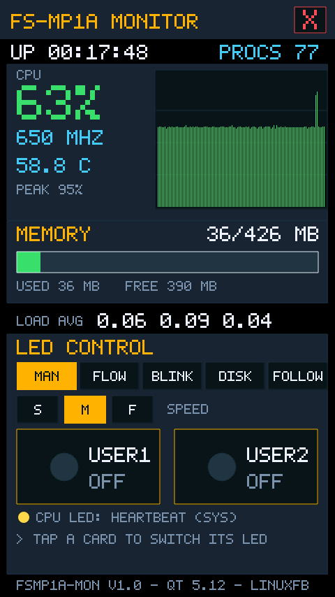
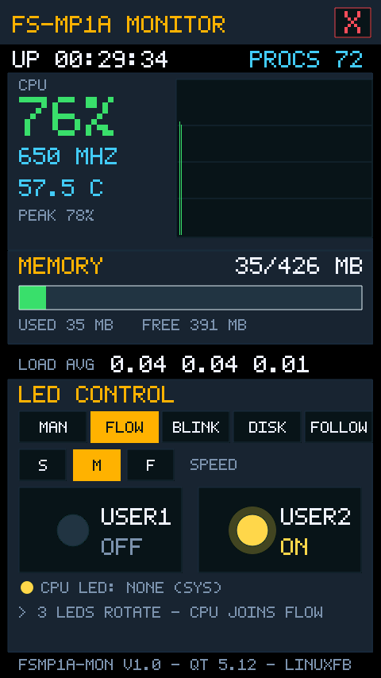
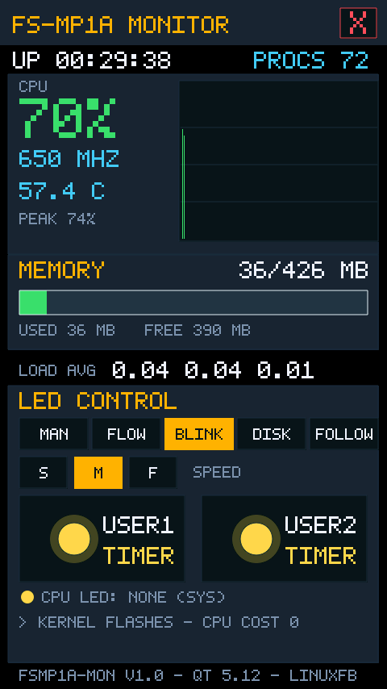
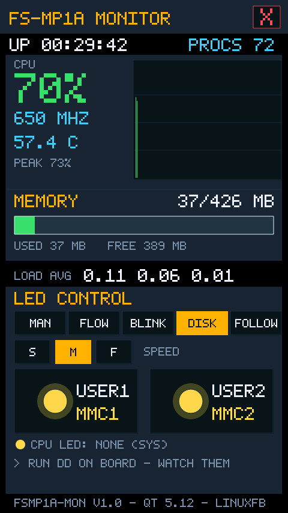
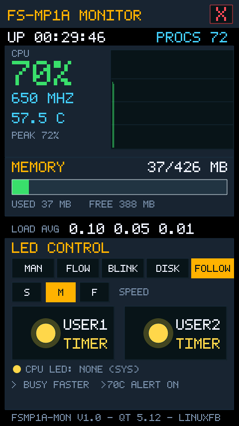

# 番外篇之二 | 在 FS-MP1A 上跑自研系统监视器：读系统状态、触屏控 LED、全部源码在文内

> **系列说明**：本篇是**番外篇之二**，不对应课件任何一节——番外一《板上像素马里奥》证明了这块屏能玩游戏，本篇证明它能当**仪器**：把 `/proc` 与 `/sys` 里的系统数据画成实时仪表，再把指尖操作直通板载 LED——屏幕上的按钮按下，板上的灯真的亮。前置环境与番外一完全相同：实验三十六（QT 运行环境）+ 实验三十七（Qt 交叉编译闭环），或按各册恢复手册恢复出来的配置好的板子。

> **素材与出处**：本篇没有课件素材——监视器为**自研**（不是课件或资料包内容），工程三件套随本篇放在仓库 `08_GUI应用程序开发/fsmp1a-mon/`（`fsmp1a-mon.pro` / `font5x7.h` / `main.cpp`，UTF-8 无 BOM）。编译与部署用的全是前 38 篇建好的设施：buildroot 产物 `output/host/`（实验三十六）、NFS 根 `/home/cnu/nfsboot/rfs-buildroot`（实验二十八/二十九部署、实验三十六升级为带 QT 的根）、出厂内核启动变量 `fcsys`（实验三十六步骤 5）。板上环境的能力边界与调试工具（fb0 抓帧、清屏、排查总表）见《附录 | FS-MP1A 板上 Qt 开发环境速查》。

## 一、这是什么

一块 480×854 竖屏上的复古仪表盘（深底琥珀配色，字库沿用马里奥那套 5×7 点阵，像素风 integer 放大）：屏幕实时跳动板子的"生命体征"，指尖一按让板载灯真亮真灭。单点触摸即可——第一触点会被 Qt 自动合成鼠标事件，所以连 `QTouchEvent` 都不用（要双指同按的玩法请回番外一）。

屏幕上的每一块都是真数据：

| 区块 | 内容 | 数据来源（板上实测路径） |
|------|------|------------------------|
| 标题栏 | 程序名 + 右上角 [X] 退出钮 | — |
| 信息行 | 开机时长 / 进程总数 | `/proc/uptime`、`/proc/loadavg` 第 4 字段 |
| CPU | 占用率大数字 + 2 分钟滚动曲线（120 点×1 秒）+ 实时频率 + 温度 + 历史峰值 | `/proc/stat` 差分、`/sys/devices/system/cpu/cpu0/cpufreq/cpuinfo_cur_freq`、`/sys/class/thermal/thermal_zone0/temp` |
| MEMORY | 已用/总量 + 横条（按 MemAvailable 算） | `/proc/meminfo` |
| LOAD AVG | 1/5/15 分钟负载 | `/proc/loadavg` |
| LED CONTROL | 五个模式按钮 + 速度档 + 两张灯卡片 + 心跳灯状态行 | `/sys/class/leds/`（内核 LED 子系统） |

实机抓帧（验收时经 fb0 帧缓冲直接抓的屏——抓出来的就是 LCD 上正在显示的每一帧，抓帧方法见《附录 | FS-MP1A 板上 Qt 开发环境速查》调试工具箱）：


> 图：MAN 模式主界面（fb0 抓帧）——CPU 63%、曲线满图（PEAK 95% 是刚跑完编译的余温）、MEM 36/426 MB、LOAD AVG 0.06 0.09 0.04、温度 58.8 C、开机 17 分钟；底部 "CPU LED: HEARTBEAT (SYS)" 说明本轮开机出厂内核自带的心跳灯在位。

**板上硬件摸底实录**（2026-09-30，出厂内核 5.4.31 下实测，程序的数据源全部据此定案）：

- `/sys/class/leds/` 下有 **cpu / user1 / user2 三颗灯**：驱动 leds-gpio（**非零即亮，无调光**——所以没有呼吸灯模式）；user 灯 `trigger=none`、最大亮度 255，写 `brightness` 即开关；
- cpu 灯的 trigger **随开机轮次见过 `[heartbeat]` 与 `[none]` 两种**——出厂内核默认 + 环境因素共同决定，程序启动时实测取值、退出时按启动现场恢复，不做任何假设；
- trigger 列表里躺着 timer / oneshot / heartbeat / mmc0 / mmc1 / mmc2 / cpu0 / cpu1 等一排内核白送的能力（下文模式会用到 timer 与 mmc）；
- mmc host 映射（`/sys/block` 反查）：**SD 卡 = mmc1、eMMC = mmc2、mmc0 空置**——磁盘灯绑对了才闪；
- 温度实测 55~60°C（cpu-thermal，毫摄氏度读数 ÷1000）；频率 650 MHz 起步，ondemand 调频下随负载跳。

## 二、怎么玩

**操作**（全部单指点击）：

| 位置 | 作用 |
|------|------|
| 模式按钮 MAN/FLOW/BLINK/DISK/FOLLOW | 切换 LED 模式（单选，选中变琥珀色） |
| SPEED 的 S / M / F | 流水的轮换间隔、闪烁的亮灭周期（慢/中/快） |
| USER1 / USER2 卡片 | **MAN 模式下点击 = 单独开关对应板载灯**；其他模式下显示该灯当前状态 |
| 右上角 [X] | 退出——**自动把每颗灯恢复成程序启动前的样子** |

**五个 LED 模式**：

| 模式 | 玩法 | 实现机制 |
|------|------|---------|
| MAN | 两颗 user 灯独立开关，每颗灯珠单独控 | 写 `brightness` 0/255 |
| FLOW | 三灯轮播 ●○○→○●○→○○●（**cpu 心跳灯也临时出列加入流水**），速度三档 | 软件定时器轮写 brightness |
| BLINK | 三灯同闪（实际两颗 user 灯），快/中/慢三档周期 | **内核 timer 触发器** + `delay_on`/`delay_off` 写毫秒值 |
| DISK | user1 = SD 卡活动灯、user2 = eMMC 活动灯 | **内核 mmc1/mmc2 触发器**：任何对卡/ eMMC 的读写都让灯闪 |
| FOLLOW | 负载越高闪得越急（即时 CPU% 主导，周期 850→120 ms）；**温度超 70°C 两颗 user 灯常亮告警** + CPU 面板红边 | 软件按 1 秒采样动态改 timer 周期 |

**LED 原理小课堂（为什么这个程序是"软硬结合"的现成教案）**：BLINK/DISK/FOLLOW 三个模式用的是内核 **LED trigger 子系统**——`echo timer > /sys/class/leds/user1/trigger` 之后闪灯就是内核的事，本程序睡着了灯照样闪，`top` 里 CPU 占用为零；FLOW 流水灯没有现成 trigger，只能软件轮写。两条路各占一个模式，对照体会：这就是"内核代劳"与"应用层轮询"的差别。另一条工程规矩：**程序退出（含 `killall`）会把每颗灯的 trigger 和亮度恢复成启动前的现场**——程序要像个合格的设备管理员，不给系统留垃圾状态。

**实机抓帧——其余四模式**：


> 图：FLOW 模式（fb0 抓帧）——USER2 卡片灯珠金色点亮带光晕、状态 ON（此刻抓帧恰轮到它亮，三灯轮播进行中），USER1 熄灭；说明行 "3 LEDS ROTATE - CPU JOINS FLOW"。


> 图：BLINK 模式（fb0 抓帧）——两卡片状态 TIMER、说明行 "KERNEL FLASHES - CPU COST 0"；此刻抓帧恰逢亮相位，灯珠由内核 timer 触发器驱动闪烁。


> 图：DISK 模式（fb0 抓帧）——两卡片状态 MMC1 / MMC2（SD 卡 / eMMC 活动指示）、说明行 "RUN DD ON BOARD - WATCH THEM"。


> 图：FOLLOW 模式（fb0 抓帧）——两卡片状态 TIMER、说明行 "BUSY=FASTER >70C=ALERT ON"；空载时闪灯周期约 850 ms，负载上来后明显变急促。

**一分钟压测演示**（FOLLOW 模式下，给板子加负载看灯变急、曲线抬头——这就是实拍视频的脚本）：

```bash
ssh root@192.168.0.8 'yes > /dev/null &'
```

看完杀掉（`killall yes`）。**⚠ 注意**：实测板子在双核长时间满载后出现过**自动重启**（根因未查，疑似看门狗相关）——演示用单核、十几秒即可，别拿它烤机。

## 三、工程文件与全部源代码

工程就三个文件，与本文代码逐字一致（以后若改动，以仓库 `08_GUI应用程序开发/fsmp1a-mon/` 为准）：

| 文件 | 内容 |
|------|------|
| `fsmp1a-mon.pro` | qmake 工程文件 |
| `font5x7.h` | 5×7 点阵字库 + 画字小工具（搬自马里奥 `pixelart.h`，补 `%` `/` `(` `)` `>` 五个字形） |
| `main.cpp` | 本体：数据采样、LED 抽象、五模式状态机、单点触摸、全部渲染 |

`fsmp1a-mon.pro`：

```qmake
#--------------------------------------------------------------------
# FS-MP1A 板上系统监视器 —— 番外篇之二
# 编译（Ubuntu，用 buildroot 的 qmake，别用系统 qmake）：
#   <buildroot源码>/output/host/bin/qmake fsmp1a-mon.pro
#   make -j2
# 板上运行（出厂内核 + 新根）：
#   /opt/fsmp1a-mon -platform linuxfb
#   可选 --mode=man|flow|blink|disk|follow 直接进入某模式
#--------------------------------------------------------------------
QT       += widgets
CONFIG   += c++11
TEMPLATE  = app
TARGET    = fsmp1a-mon

SOURCES  += main.cpp
HEADERS  += font5x7.h
```

`font5x7.h`：

```cpp
#ifndef FONT5X7_H
#define FONT5X7_H
//
// font5x7.h —— 本作的全部"美术"：5x7 点阵字库
//
// 板子的根文件系统里没有可用的界面字体（只有西文 DejaVu），
// 所以和番外篇《板上像素马里奥》一样自带点阵字库：一个字形
// 是 7 个字符串、每个字符一笔，'X' = 亮点，'.' = 熄灭。
// 整数倍放大渲染，像素风且放大不糊，零 QFont 依赖。
// （字库本体搬自番外篇 pixelart.h，监视器另补了 % / ( ) > 五个字形。）
//

#include <QPainter>
#include <QString>
#include <QRgb>

static const char* const FONT_AZ[26][7] = {
    {".XXX.","X...X","X...X","XXXXX","X...X","X...X","X...X"}, // A
    {"XXXX.","X...X","X...X","XXXX.","X...X","X...X","XXXX."}, // B
    {".XXX.","X...X","X....","X....","X....","X...X",".XXX."}, // C
    {"XXXX.","X...X","X...X","X...X","X...X","X...X","XXXX."}, // D
    {"XXXXX","X....","X....","XXXX.","X....","X....","XXXXX"}, // E
    {"XXXXX","X....","X....","XXXX.","X....","X....","X...."}, // F
    {".XXX.","X...X","X....","X.XXX","X...X","X...X",".XXXX"}, // G
    {"X...X","X...X","X...X","XXXXX","X...X","X...X","X...X"}, // H
    {"XXXXX","..X..","..X..","..X..","..X..","..X..","XXXXX"}, // I
    {"....X","....X","....X","....X","X...X","X...X",".XXX."}, // J
    {"X...X","X..X.","X.X..","XX...","X.X..","X..X.","X...X"}, // K
    {"X....","X....","X....","X....","X....","X....","XXXXX"}, // L
    {"X...X","XX.XX","X.X.X","X.X.X","X...X","X...X","X...X"}, // M
    {"X...X","XX..X","X.X.X","X..XX","X...X","X...X","X...X"}, // N
    {".XXX.","X...X","X...X","X...X","X...X","X...X",".XXX."}, // O
    {"XXXX.","X...X","X...X","XXXX.","X....","X....","X...."}, // P
    {".XXX.","X...X","X...X","X...X","X.X.X","X..X.",".XX.X"}, // Q
    {"XXXX.","X...X","X...X","XXXX.","X.X..","X..X.","X...X"}, // R
    {".XXXX","X....","X....",".XXX.","....X","....X","XXXX."}, // S
    {"XXXXX","..X..","..X..","..X..","..X..","..X..","..X.."}, // T
    {"X...X","X...X","X...X","X...X","X...X","X...X",".XXX."}, // U
    {"X...X","X...X","X...X","X...X","X...X",".X.X.","..X.."}, // V
    {"X...X","X...X","X...X","X.X.X","X.X.X","XX.XX","X...X"}, // W
    {"X...X","X...X",".X.X.","..X..",".X.X.","X...X","X...X"}, // X
    {"X...X","X...X",".X.X.","..X..","..X..","..X..","..X.."}, // Y
    {"XXXXX","....X","...X.","..X..",".X...","X....","XXXXX"}, // Z
};

static const char* const FONT_09[10][7] = {
    {".XXX.","X...X","X..XX","X.X.X","XX..X","X...X",".XXX."}, // 0
    {"..X..",".XX..","..X..","..X..","..X..","..X..","XXXXX"}, // 1
    {".XXX.","X...X","....X","...X.","..X..",".X...","XXXXX"}, // 2
    {".XXX.","X...X","....X","..XX.","....X","X...X",".XXX."}, // 3
    {"...X.","..XX.",".X.X.","X..X.","XXXXX","...X.","...X."}, // 4
    {"XXXXX","X....","XXXX.","....X","....X","X...X",".XXX."}, // 5
    {".XXX.","X....","X....","XXXX.","X...X","X...X",".XXX."}, // 6
    {"XXXXX","....X","...X.","..X..",".X...",".X...",".X..."}, // 7
    {".XXX.","X...X","X...X",".XXX.","X...X","X...X",".XXX."}, // 8
    {".XXX.","X...X","X...X",".XXXX","....X","....X",".XXX."}, // 9
};

inline const char* const* glyphFor(char c)
{
    if (c >= 'A' && c <= 'Z') return FONT_AZ[c - 'A'];
    if (c >= '0' && c <= '9') return FONT_09[c - '0'];
    switch (c) {
    case '!': { static const char* const g[7] = {"..X..","..X..","..X..","..X..","..X..",".....","..X.."}; return g; }
    case '%': { static const char* const g[7] = {"XX..X","XX.X.","...X.","..X..",".X...","X.XX.","X..XX"}; return g; }
    case '/': { static const char* const g[7] = {"....X","...X.","...X.","..X..",".X...","X....","X...."}; return g; }
    case '(': { static const char* const g[7] = {"..XX.",".X...","X....","X....","X....",".X...","..XX."} ; return g; }
    case ')': { static const char* const g[7] = {".XX..","...X.","....X","....X","....X","...X.",".XX.."} ; return g; }
    case '>': { static const char* const g[7] = {"X....",".X...","..X..","...X.","..X..",".X...","X...."}; return g; }
    case '-': { static const char* const g[7] = {".....",".....",".....","XXXXX",".....",".....","....."}; return g; }
    case '.': { static const char* const g[7] = {".....",".....",".....",".....",".....",".XX..",".XX.."}; return g; }
    case ':': { static const char* const g[7] = {".....",".XX..",".XX..",".....",".XX..",".XX..","....."}; return g; }
    default: return 0;
    }
}

// 画一个字符（scale = 放大倍数，整数倍保持像素风）
inline void drawGlyph(QPainter& p, char c, int x, int y, int scale, QRgb color)
{
    const char* const* g = glyphFor(c);
    if (!g)
        return;
    for (int r = 0; r < 7; ++r)
        for (int col = 0; col < 5; ++col)
            if (g[r][col] == 'X')
                p.fillRect(x + col * scale, y + r * scale, scale, scale, QColor(color));
}

// 画一行文字；shadow 非 0 时先画一层偏移的影子，保证在花哨背景上也读得清
inline void drawTextPx(QPainter& p, int x, int y, const QString& s, int scale,
                       QRgb color, QRgb shadow = 0)
{
    int cx = x;
    for (int i = 0; i < s.length(); ++i) {
        const QChar qc = s.at(i);
        const char c = qc.toLatin1();
        if (shadow)
            drawGlyph(p, c, cx + scale, y + scale, scale, shadow);
        drawGlyph(p, c, cx, y, scale, color);
        cx += 6 * scale;
    }
}

inline int textW(const QString& s, int scale)
{
    return qMax(0, s.length() * 6 - 1) * scale;
}

#endif // FONT5X7_H
```

`main.cpp`：

```cpp
//
// main.cpp —— FS-MP1A 板上系统监视器（番外篇之二）
//
// 纯 QPainter 手绘的仪表盘：把 /proc 与 /sys 里的系统数据画成
// 实时仪表，并把指尖操作通到板载 LED（/sys/class/leds，内核
// LED 子系统）。零图片素材、零音频依赖、单点触摸即可（第一触点
// 会被 Qt 自动合成鼠标事件，所以连 QTouchEvent 都不用——要双指
// 同按的请看番外篇马里奥）。专为 FS-MP1A（STM32MP157A）+ 出厂
// 内核 + buildroot Qt 5.12 + linuxfb 编写。
//
//   编译：buildroot 的 qmake + make（见 fsmp1a-mon.pro 头部注释）
//   运行：/opt/fsmp1a-mon -platform linuxfb
//         可选 --mode=man|flow|blink|disk|follow 直接进入某模式
//   操作：MAN 模式点 USER1/USER2 卡片 = 单独开关对应板载灯；
//         右上角 [X] 退出，退出时自动把每颗灯恢复成启动前的样子
//
// 为什么有些灯"自己会闪"：
//   BLINK/DISK/FOLLOW 三个模式用的是内核 LED trigger（timer /
//   mmc1 / mmc2）——闪灯是内核在闪，本程序睡着了灯照样闪，
//   CPU 占用为零；FLOW 流水灯没有现成 trigger，由本程序定时
//   轮写 brightness。两条路各占一个模式，正好对照体会：
//   这就是 LED trigger 子系统与软件轮写的差别。
//
// 板上实测的数据源（出厂内核 5.4.31，2026-09-30）：
//   /proc/stat、/proc/meminfo、/proc/loadavg、/proc/uptime —— 内核标配
//   /sys/class/thermal/thermal_zone0/temp —— cpu-thermal，毫摄氏度
//   /sys/devices/system/cpu/cpu0/cpufreq/cpuinfo_cur_freq —— ondemand 调频
//   /sys/class/leds/{cpu,user1,user2} —— 驱动 leds-gpio（非零即亮，无调光）
//   mmc host 映射（/sys/block 反查）：SD 卡 = mmc1、eMMC = mmc2、mmc0 空置
//

#include <QApplication>
#include <QWidget>
#include <QPainter>
#include <QTimer>
#include <QMouseEvent>
#include <QKeyEvent>
#include <QVector>
#include <QDir>
#include <QFile>
#include <QScreen>
#include <QGuiApplication>
#include <QDebug>
#include <csignal>

#include "font5x7.h"

// ---------------- 配色（深底仪表风） ----------------
static const QRgb COL_BG    = 0xFF0E141B;  // 整屏底
static const QRgb COL_PANEL = 0xFF182430;  // 区块面板
static const QRgb COL_GRID  = 0xFF243646;  // 边框/网格/熄灭的灯
static const QRgb COL_AMBER = 0xFFFFB000;  // 琥珀：标题/选中按钮
static const QRgb COL_GREEN = 0xFF3ADF6E;  // 绿：CPU 曲线/正常数值
static const QRgb COL_CYAN  = 0xFF41C8F4;  // 青：次要数据
static const QRgb COL_RED   = 0xFFFF4D5E;  // 红：告警
static const QRgb COL_DIM   = 0xFF7C93A8;  // 暗灰蓝：说明文字
static const QRgb COL_WHITE = 0xFFE9F2FA;  // 亮白
static const QRgb COL_GOLD  = 0xFFFFD54A;  // 灯珠点亮色

// ---------------- 设计画布（板上实测 480x854；其他分辨率居中显示） ----------------
static const int CW = 480;
static const int CH = 854;

// ---------------- sysfs / procfs 读写小工具 ----------------
static QString sysRead(const QString& path)
{
    QFile f(path);
    if (!f.open(QIODevice::ReadOnly))
        return QString();
    return QString::fromLatin1(f.readAll()).simplified();
}

static bool sysWrite(const QString& path, const QString& value)
{
    QFile f(path);
    if (!f.open(QIODevice::WriteOnly | QIODevice::Truncate))
        return false;
    const QByteArray data = value.toLatin1();
    return f.write(data) == data.size();
}

// trigger 文件内容形如 "none rfkill-any ... [heartbeat] ..."，方括号里是当前值
static QString parseTrigger(const QString& raw)
{
    const int b = raw.indexOf('[');
    const int e = raw.indexOf(']');
    if (b < 0 || e <= b)
        return raw.split(' ').value(0);
    return raw.mid(b + 1, e - b - 1);
}

// ---------------- CPU 占用：/proc/stat 两次采样差分 ----------------
struct CpuTick { long long idle = 0, total = 0; bool ok = false; };

static CpuTick readCpuTick()
{
    CpuTick t;
    QFile f(QStringLiteral("/proc/stat"));
    if (!f.open(QIODevice::ReadOnly))
        return t;
    // 首行："cpu  user nice system idle iowait irq softirq steal ..."
    const QStringList v = QString::fromLatin1(f.readAll())
                              .split(' ', QString::SkipEmptyParts);
    if (v.size() < 5 || v.at(0) != QStringLiteral("cpu"))
        return t;
    long long sum = 0, idle = 0;
    for (int i = 1; i < v.size(); ++i) {
        const long long n = v.at(i).toLongLong();
        sum += n;
        if (i == 4 || i == 5)       // idle + iowait 都算空闲
            idle += n;
    }
    t.idle = idle;
    t.total = sum;
    t.ok = (sum > 0);
    return t;
}

// ---------------- 一次系统采样 ----------------
struct SysStats {
    int cpuPct = 0;
    long long memTotalKB = 0, memAvailKB = 0;
    int uptimeSec = 0;
    int procs = 0;
    double load1 = 0, load5 = 0, load15 = 0;
    int freqMHz = 0;      bool freqOk = false;
    double tempC = 0;     bool tempOk = false;
};

// /proc 文件 stat 出来的 size 是 0，atEnd() 在首次读之前就为真——
// 所以这里一律 readAll() 拿全量内容再自行分行，绝不用 atEnd 循环
static long long meminfoValue(const QString& key)      // 返回 kB
{
    QFile f(QStringLiteral("/proc/meminfo"));
    if (!f.open(QIODevice::ReadOnly))
        return 0;
    const QStringList lines = QString::fromLatin1(f.readAll()).split('\n');
    for (int i = 0; i < lines.size(); ++i) {
        if (lines.at(i).startsWith(key)) {
            const QStringList v = lines.at(i).split(' ', QString::SkipEmptyParts);
            return v.size() > 1 ? v.at(1).toLongLong() : 0;
        }
    }
    return 0;
}

static void sampleStats(const CpuTick& prev, const CpuTick& now, SysStats& st)
{
    if (now.ok && prev.ok && now.total > prev.total) {
        const long long dTotal = now.total - prev.total;
        const long long dIdle  = now.idle  - prev.idle;
        st.cpuPct = qBound(0, int(100 - 100.0 * dIdle / dTotal + 0.5), 100);
    }

    st.memTotalKB = meminfoValue(QStringLiteral("MemTotal:"));
    st.memAvailKB = meminfoValue(QStringLiteral("MemAvailable:"));

    // "/proc/loadavg 一行拿三个指标：1.00 0.81 0.60 2/72 318"
    QFile f(QStringLiteral("/proc/loadavg"));
    if (f.open(QIODevice::ReadOnly)) {
        const QStringList v = QString::fromLatin1(f.readAll())
                                  .split(' ', QString::SkipEmptyParts);
        if (v.size() >= 3) {
            st.load1  = v.at(0).toDouble();
            st.load5  = v.at(1).toDouble();
            st.load15 = v.at(2).toDouble();
        }
        if (v.size() >= 4) {
            const QStringList rp = v.at(3).split('/');
            if (rp.size() == 2)
                st.procs = rp.at(1).toInt();   // "运行/总数" 取总数
        }
    }

    QFile up(QStringLiteral("/proc/uptime"));
    if (up.open(QIODevice::ReadOnly)) {
        const QStringList v = QString::fromLatin1(up.readAll())
                                  .split(' ', QString::SkipEmptyParts);
        if (!v.isEmpty())
            st.uptimeSec = int(v.at(0).toDouble());
    }

    const QString freq = sysRead(QStringLiteral(
        "/sys/devices/system/cpu/cpu0/cpufreq/cpuinfo_cur_freq"));
    st.freqOk = !freq.isEmpty();
    if (st.freqOk)
        st.freqMHz = freq.toInt() / 1000;      // kHz → MHz

    const QString temp = sysRead(QStringLiteral(
        "/sys/class/thermal/thermal_zone0/temp"));
    st.tempOk = !temp.isEmpty();
    if (st.tempOk)
        st.tempC = temp.toDouble() / 1000.0;   // 毫摄氏度 → 摄氏度
}

// ---------------- LED：一颗板载灯的抽象 ----------------
struct Led {
    QString name;             // cpu / user1 / user2
    QString dir;              // /sys/class/leds/<name>
    bool present = false;
    QString origTrigger;      // 启动现场（退出时恢复）
    int origBrightness = 0;
    bool lit = false;         // 此刻亮吗（brightness 镜像，仅 none 触发器下可靠）
    QString trigger = QStringLiteral("none");

    bool setBrightness(int v)
    {
        const bool ok = sysWrite(dir + QStringLiteral("/brightness"),
                                 QString::number(v));
        if (ok) {
            lit = (v > 0);
            trigger = QStringLiteral("none");
        }
        return ok;
    }
    bool setTrigger(const QString& t)
    {
        const bool ok = sysWrite(dir + QStringLiteral("/trigger"), t);
        if (ok) {
            trigger = t;
            lit = false;      // 交给内核摆布后，镜像不再代表"亮"
        }
        return ok;
    }
    bool setPeriod(int onMs, int offMs)   // 仅 timer 触发器有效
    {
        bool ok = sysWrite(dir + QStringLiteral("/delay_on"),
                           QString::number(onMs));
        ok = sysWrite(dir + QStringLiteral("/delay_off"),
                      QString::number(offMs)) && ok;
        return ok;
    }
};

static QVector<Led> scanLeds()
{
    QVector<Led> out;
    QDir dir(QStringLiteral("/sys/class/leds"));
    if (!dir.exists())
        return out;
    const QStringList names = dir.entryList(QDir::Dirs | QDir::NoDotAndDotDot);
    for (int i = 0; i < names.size(); ++i) {
        Led led;
        led.name = names.at(i);
        led.dir = dir.absoluteFilePath(names.at(i));
        led.present = true;
        led.origTrigger = parseTrigger(
            sysRead(led.dir + QStringLiteral("/trigger")));
        led.origBrightness = sysRead(
            led.dir + QStringLiteral("/brightness")).toInt();
        led.trigger = led.origTrigger;
        led.lit = (led.origBrightness > 0);
        out.append(led);
    }
    return out;   // 字母序：cpu, user1, user2 正好是想要的顺序
}

// ---------------- 模式 ----------------
enum Mode { MODE_MAN, MODE_FLOW, MODE_BLINK, MODE_DISK, MODE_FOLLOW, MODE_COUNT };
static const char* const MODE_NAME[MODE_COUNT] = {
    "MAN", "FLOW", "BLINK", "DISK", "FOLLOW"
};
static const char* const MODE_HINT[MODE_COUNT] = {
    "TAP A CARD TO SWITCH ITS LED",     // MAN
    "3 LEDS ROTATE - CPU JOINS FLOW",   // FLOW
    "KERNEL FLASHES - CPU COST 0",      // BLINK
    "RUN DD ON BOARD - WATCH THEM",     // DISK
    "BUSY=FASTER  >70C=ALERT ON",       // FOLLOW
};
static const int SPEED_TICK_MS[3] = { 600, 300, 200 };   // FLOW 轮换间隔
static const int SPEED_ON_MS[3]   = { 1000, 450, 150 };  // BLINK 亮时长
static const int SPEED_OFF_MS[3]  = { 1000, 450, 150 };  // BLINK 灭时长
static const char  SPEED_CHAR[4]  = "SMF";
static const int    FOLLOW_MAX_MS = 850;   // 负载为零时的闪周期
static const int    FOLLOW_MIN_MS = 120;   // 满载时的闪周期
static const double TEMP_ALERT_C  = 70.0;  // 温度告警阈值（摄氏度）

// ---------------- 主窗口 ----------------
class MonWidget : public QWidget
{
public:
    explicit MonWidget(int initialMode, QWidget* parent = 0)
        : QWidget(parent)
    {
        setWindowTitle(QStringLiteral("FS-MP1A Monitor"));
        leds = scanLeds();
        prevTick = readCpuTick();
        mode = Mode(initialMode);
        applyMode(mode);                       // 进场就把灯接管起来
        connect(&timer, &QTimer::timeout, this, [this] { tick(); });
        timer.start(100);
    }
    ~MonWidget() { restoreAll(); }

    // 把每颗灯恢复成程序启动前的样子——"合格的设备管理员"
    void restoreAll()
    {
        for (int i = 0; i < leds.size(); ++i) {
            Led& led = leds[i];
            if (!led.present)
                continue;
            sysWrite(led.dir + QStringLiteral("/trigger"), led.origTrigger);
            sysWrite(led.dir + QStringLiteral("/brightness"),
                     QString::number(led.origBrightness));
            led.trigger = led.origTrigger;
            led.lit = (led.origBrightness > 0);
        }
        alertActive = false;
    }

protected:
    // 单点触摸已被 Qt 合成鼠标事件，收鼠标就够了
    void mousePressEvent(QMouseEvent* e) override
    {
        const int offX = (width() - CW) / 2;
        const int offY = (height() - CH) / 2;
        onPress(QPointF(e->localPos().x() - offX, e->localPos().y() - offY));
    }

    void keyPressEvent(QKeyEvent* e) override
    {
        if (e->key() == Qt::Key_Escape) {      // 板上没键盘，ssh 调试备用
            restoreAll();
            close();
        }
    }

    void paintEvent(QPaintEvent*) override
    {
        QPainter p(this);
        p.fillRect(rect(), QColor(0xFF000000));          // 屏比画布宽/窄时的边
        p.translate((width() - CW) / 2, (height() - CH) / 2);
        p.setRenderHint(QPainter::Antialiasing, true);   // 给 LED 圆珠用
        render(p);
    }

private:
    // ---------- 布局（设计坐标 480x854） ----------
    static QRect modeBtnRect(int i)  { return QRect(24 + i * 90, 518, 86, 40); }
    static QRect speedBtnRect(int i) { return QRect(24 + i * 68, 566, 60, 40); }
    static QRect userCardRect(int i) { return QRect(24 + i * 226, 614, 206, 108); }
    static QRect exitBtnRect()       { return QRect(CW - 58, 10, 46, 38); }

    // ---------- 交互 ----------
    void onPress(const QPointF& scene)
    {
        const QPoint pt = scene.toPoint();
        if (exitBtnRect().contains(pt)) {
            restoreAll();
            close();
            return;
        }
        for (int i = 0; i < MODE_COUNT; ++i)
            if (modeBtnRect(i).contains(pt)) { applyMode(Mode(i)); return; }
        for (int i = 0; i < 3; ++i)
            if (speedBtnRect(i).contains(pt)) { setSpeed(i); return; }
        if (mode == MODE_MAN)
            for (int i = 0; i < 2; ++i)
                if (userCardRect(i).contains(pt)) { toggleUser(i); return; }
    }

    void toggleUser(int i)
    {
        Led* led = ledByName(i == 0 ? "user1" : "user2");
        if (!led || !led->present)
            return;
        if (led->trigger != QStringLiteral("none"))
            led->setTrigger(QStringLiteral("none"));
        userOn[i] = !userOn[i];
        led->setBrightness(userOn[i] ? 255 : 0);
        update();
    }

    // ---------- 模式 ----------
    void applyMode(Mode m)
    {
        restoreAll();              // 先把三颗灯还原成启动现场，再接管
        mode = m;
        sub = 0;
        flowIdx = 0;
        userOn[0] = userOn[1] = false;

        Led* u1 = ledByName("user1");
        Led* u2 = ledByName("user2");
        switch (m) {
        case MODE_MAN:
            break;                 // 亮度全凭指尖
        case MODE_FLOW: {
            // 流水灯没有现成 trigger，软件轮写；请 cpu 灯临时离开心跳
            Led* c = ledByName("cpu");
            if (c && c->present)
                c->setTrigger(QStringLiteral("none"));
            flowStep();
            break;
        }
        case MODE_BLINK:
            // 内核 timer 触发器闪灯：本程序睡了灯照样闪
            if (u1) u1->setTrigger(QStringLiteral("timer"));
            if (u2) u2->setTrigger(QStringLiteral("timer"));
            applyBlinkPeriod();
            break;
        case MODE_DISK:
            // 磁盘活动灯：SD 卡 = mmc1，eMMC = mmc2（板上 /sys/block 反查实测）
            if (u1) u1->setTrigger(QStringLiteral("mmc1"));
            if (u2) u2->setTrigger(QStringLiteral("mmc2"));
            break;
        case MODE_FOLLOW:
            if (u1) u1->setTrigger(QStringLiteral("timer"));
            if (u2) u2->setTrigger(QStringLiteral("timer"));
            followStep();
            break;
        default:
            break;
        }
        update();
    }

    void setSpeed(int i)
    {
        speedIdx = i;
        if (mode == MODE_BLINK)
            applyBlinkPeriod();
        update();
    }

    void applyBlinkPeriod()
    {
        for (int i = 0; i < 2; ++i) {
            Led* led = ledByName(i == 0 ? "user1" : "user2");
            if (led && led->present)
                led->setPeriod(SPEED_ON_MS[speedIdx], SPEED_OFF_MS[speedIdx]);
        }
    }

    // FLOW：按 user1 → user2 → cpu 的顺序轮播
    void flowStep()
    {
        static const char* const order[3] = { "user1", "user2", "cpu" };
        for (int k = 0; k < 3; ++k) {
            Led* led = ledByName(order[k]);
            if (led && led->present)
                led->setBrightness(0);
        }
        Led* cur = ledByName(order[flowIdx % 3]);
        if (cur && cur->present)
            cur->setBrightness(255);
        ++flowIdx;
    }

    // FOLLOW：负载越高闪得越急；温度超阈值转常亮告警
    void followStep()
    {
        // 即时占用率主导（1 秒差分，响应快），1 分钟负载兜底（双核 load 2.0 = 满载）
        const double busy = qMax(st.cpuPct / 100.0,
                                 qMin(1.0, st.load1 / 2.0));
        const int period = FOLLOW_MAX_MS
                         - int((FOLLOW_MAX_MS - FOLLOW_MIN_MS) * busy);
        alertActive = false;
        for (int i = 0; i < 2; ++i) {
            Led* led = ledByName(i == 0 ? "user1" : "user2");
            if (!led || !led->present)
                continue;
            if (st.tempOk && st.tempC >= TEMP_ALERT_C) {
                if (led->trigger != QStringLiteral("none"))
                    led->setTrigger(QStringLiteral("none"));
                led->setBrightness(255);
                alertActive = true;
            } else {
                if (led->trigger != QStringLiteral("timer"))
                    led->setTrigger(QStringLiteral("timer"));
                led->setPeriod(period, period);
            }
        }
    }

    // ---------- 主循环：100ms 一拍，数据每秒采一次 ----------
    void tick()
    {
        ++sub;
        if (sub % 10 == 0) {
            const CpuTick now = readCpuTick();
            sampleStats(prevTick, now, st);
            prevTick = now;
            hist.append(st.cpuPct);
            if (hist.size() > CURVE_N)
                hist.removeFirst();
            if (st.cpuPct > peakCpu)
                peakCpu = st.cpuPct;
            if (mode == MODE_FOLLOW)
                followStep();
            update();
        }
        if (mode == MODE_FLOW
                && sub % (SPEED_TICK_MS[speedIdx] / 100) == 0) {
            flowStep();
            update();
        }
    }

    // ---------- 绘制 ----------
    void render(QPainter& p)
    {
        // 标题栏
        p.fillRect(QRect(0, 0, CW, 56), QColor(COL_PANEL));
        drawTextPx(p, 16, 20, QStringLiteral("FS-MP1A MONITOR"), 3, COL_AMBER);
        p.fillRect(exitBtnRect(), QColor(COL_BG));
        p.setPen(QColor(COL_RED));
        p.drawRect(exitBtnRect().adjusted(0, 0, -1, -1));
        drawGlyph(p, 'X', exitBtnRect().center().x() - 10,
                  exitBtnRect().center().y() - 14, 4, COL_RED);

        // 信息行
        const int up = st.uptimeSec;
        const QString upStr = QStringLiteral("%1:%2:%3")
                .arg(up / 3600, 2, 10, QChar('0'))
                .arg((up / 60) % 60, 2, 10, QChar('0'))
                .arg(up % 60, 2, 10, QChar('0'));
        drawTextPx(p, 16, 64, QStringLiteral("UP ") + upStr, 3, COL_WHITE);
        const QString procStr = QStringLiteral("PROCS %1").arg(st.procs);
        drawTextPx(p, 456 - textW(procStr, 3), 64, procStr, 3, COL_CYAN);

        // CPU 区
        drawPanel(p, QRect(10, 92, 460, 224),
                  alertActive ? COL_RED : COL_GRID);
        drawTextPx(p, 24, 100, QStringLiteral("CPU"), 2, COL_DIM);
        drawTextPx(p, 24, 122, QStringLiteral("%1%").arg(st.cpuPct), 7, COL_GREEN);
        const QString freqStr = st.freqOk
                ? QStringLiteral("%1 MHZ").arg(st.freqMHz)
                : QStringLiteral("-- MHZ");
        drawTextPx(p, 24, 186, freqStr, 3, COL_CYAN);
        const bool hot = st.tempOk && st.tempC >= TEMP_ALERT_C;
        const QString tempStr = st.tempOk
                ? QStringLiteral("%1 C").arg(st.tempC, 0, 'f', 1)
                : QStringLiteral("--.- C");
        drawTextPx(p, 24, 226, tempStr, 3, hot ? COL_RED : COL_CYAN);
        drawTextPx(p, 24, 264, QStringLiteral("PEAK %1%").arg(peakCpu), 2, COL_DIM);

        const QRect curve(222, 100, 248, 200);
        p.fillRect(curve, QColor(COL_BG));
        p.setPen(QColor(COL_GRID));
        p.setBrush(Qt::NoBrush);
        p.drawRect(curve.adjusted(0, 0, -1, -1));
        for (int g = 1; g <= 3; ++g) {           // 25/50/75% 三条网格线
            const int y = 296 - 184 * g / 4;
            p.drawLine(224, y, 468, y);
        }
        for (int i = 0; i < hist.size(); ++i) {  // 每样本一根 1px 柱，2px 步距
            const int x = 226 + i * 2;
            const int h = qMax(1, hist.at(i) * 184 / 100);
            p.fillRect(x, 296 - h, 1, h, QColor(COL_GREEN));
        }

        // MEMORY 区
        drawPanel(p, QRect(10, 316, 460, 118));
        drawTextPx(p, 24, 324, QStringLiteral("MEMORY"), 3, COL_AMBER);
        const long long usedMB = (st.memTotalKB - st.memAvailKB) / 1024;
        const long long freeMB = st.memAvailKB / 1024;
        const int memPct = st.memTotalKB > 0
                ? int((st.memTotalKB - st.memAvailKB) * 100 / st.memTotalKB) : 0;
        const QString memStr = QStringLiteral("%1/%2 MB")
                .arg(usedMB).arg(st.memTotalKB / 1024);
        drawTextPx(p, 456 - textW(memStr, 3), 324, memStr, 3, COL_WHITE);
        p.fillRect(QRect(24, 360, 432, 30), QColor(COL_GRID));
        p.fillRect(QRect(24, 360, 432 * memPct / 100, 30),
                   QColor(memPct > 85 ? COL_RED : COL_GREEN));
        p.setPen(QColor(COL_WHITE));
        p.setBrush(Qt::NoBrush);
        p.drawRect(QRect(24, 360, 432, 30));
        drawTextPx(p, 24, 402,
                   QStringLiteral("USED %1 MB   FREE %2 MB").arg(usedMB).arg(freeMB),
                   2, COL_DIM);

        // LOAD AVG 行
        drawTextPx(p, 24, 452, QStringLiteral("LOAD AVG"), 2, COL_DIM);
        drawTextPx(p, 140, 448,
                   QStringLiteral("%1 %2 %3").arg(st.load1, 0, 'f', 2)
                           .arg(st.load5, 0, 'f', 2).arg(st.load15, 0, 'f', 2),
                   3, COL_WHITE);

        // LED 区
        drawPanel(p, QRect(10, 478, 460, 344));
        drawTextPx(p, 24, 486, QStringLiteral("LED CONTROL"), 3, COL_AMBER);
        for (int i = 0; i < MODE_COUNT; ++i)
            drawBtn(p, modeBtnRect(i), QLatin1String(MODE_NAME[i]), i == mode, 2);
        for (int i = 0; i < 3; ++i)
            drawBtn(p, speedBtnRect(i), QString(QChar(SPEED_CHAR[i])),
                    i == speedIdx, 2);
        drawTextPx(p, 240, 578, QStringLiteral("SPEED"), 2, COL_DIM);

        for (int i = 0; i < 2; ++i) {            // 两张灯卡片
            Led* led = ledByName(i == 0 ? "user1" : "user2");
            const QRect r = userCardRect(i);
            p.fillRect(r, QColor(COL_BG));
            p.setPen(QColor(mode == MODE_MAN ? COL_AMBER : COL_GRID));
            p.setBrush(Qt::NoBrush);
            p.drawRect(r.adjusted(0, 0, -1, -1));

            const bool on = led && led->present
                    ? (led->trigger == QStringLiteral("none") ? led->lit : true)
                    : false;
            const QPointF c(r.x() + 68, r.y() + 54);
            if (on) {
                p.setPen(Qt::NoPen);
                p.setBrush(QColor(255, 213, 74, 70));      // 光晕
                p.drawEllipse(c, 30, 30);
                p.setBrush(QColor(COL_GOLD));
                p.drawEllipse(c, 20, 20);
            } else {
                p.setPen(Qt::NoPen);
                p.setBrush(QColor(COL_GRID));
                p.drawEllipse(c, 20, 20);
            }
            p.setBrush(Qt::NoBrush);
            p.setPen(QColor(COL_GRID));
            p.drawEllipse(c, 20, 20);

            drawTextPx(p, r.x() + 104, r.y() + 26,
                       i == 0 ? QStringLiteral("USER1") : QStringLiteral("USER2"),
                       3, COL_WHITE);
            QString sstat;
            if (!led || !led->present)
                sstat = QStringLiteral("N/A");
            else if (led->trigger == QStringLiteral("none"))
                sstat = led->lit ? QStringLiteral("ON") : QStringLiteral("OFF");
            else
                sstat = led->trigger.toUpper();   // TIMER / MMC1 / MMC2
            drawTextPx(p, r.x() + 104, r.y() + 64, sstat, 3,
                       on ? COL_GOLD : COL_DIM);
        }

        // cpu 灯状态行（心跳灯只展示，不开关）
        Led* cpu = ledByName("cpu");
        const QPointF mc(34, 740);
        p.setPen(Qt::NoPen);
        p.setBrush(QColor(cpu ? COL_GOLD : COL_GRID));
        p.drawEllipse(mc, 8, 8);
        const QString cpuTrig = cpu ? cpu->trigger.toUpper()
                                    : QStringLiteral("N/A");
        drawTextPx(p, 52, 733, QStringLiteral("CPU LED: %1 (SYS)").arg(cpuTrig),
                   2, COL_DIM);

        // 当前模式说明行
        QString hint = QStringLiteral("> ");
        hint += alertActive ? QStringLiteral("TEMP ALERT - USER LEDS ON")
                            : QLatin1String(MODE_HINT[mode]);
        drawTextPx(p, 24, 764, hint, 2, alertActive ? COL_RED : COL_DIM);

        // 页脚
        drawTextPx(p, 24, 830,
                   QStringLiteral("FSMP1A-MON V1.0 - QT 5.12 - LINUXFB"),
                   2, COL_DIM);
    }

    // ---------- 小工具 ----------
    static void drawPanel(QPainter& p, const QRect& r, QRgb border = COL_GRID)
    {
        p.fillRect(r, QColor(COL_PANEL));
        p.setPen(QColor(border));
        p.setBrush(Qt::NoBrush);
        p.drawRect(r.adjusted(0, 0, -1, -1));
    }

    static void drawBtn(QPainter& p, const QRect& r, const QString& label,
                        bool active, int scale)
    {
        if (active) {
            p.fillRect(r, QColor(COL_AMBER));
            drawTextPx(p, r.x() + (r.width() - textW(label, scale)) / 2,
                       r.y() + (r.height() - 7 * scale) / 2, label, scale, COL_BG);
        } else {
            p.fillRect(r, QColor(COL_BG));
            p.setPen(QColor(COL_GRID));
            p.setBrush(Qt::NoBrush);
            p.drawRect(r.adjusted(0, 0, -1, -1));
            drawTextPx(p, r.x() + (r.width() - textW(label, scale)) / 2,
                       r.y() + (r.height() - 7 * scale) / 2, label, scale, COL_WHITE);
        }
    }

    Led* ledByName(const char* n)
    {
        for (int i = 0; i < leds.size(); ++i)
            if (leds.at(i).name == QLatin1String(n))
                return &leds[i];
        return 0;
    }

private:
    static const int CURVE_N = 120;      // 120 点 x 1 秒 = 2 分钟 CPU 历史
    QVector<Led> leds;
    SysStats st;
    CpuTick prevTick;
    QVector<int> hist;
    int peakCpu = 0;
    Mode mode;
    int speedIdx = 1;
    bool userOn[2];
    bool alertActive = false;
    QTimer timer;
    int sub = 0;
    int flowIdx = 0;
};

// ---------------- main ----------------
static void onTermSig(int)
{
    // killall 发 SIGTERM；转回事件循环正常退出，"恢复现场"才有路可走
    qApp->quit();
}

int main(int argc, char* argv[])
{
    QApplication app(argc, argv);
    signal(SIGTERM, onTermSig);
    signal(SIGINT, onTermSig);

    int initialMode = MODE_MAN;
    for (int i = 1; i < argc; ++i) {
        const QString a = QString::fromLocal8Bit(argv[i]);
        if (a.startsWith(QStringLiteral("--mode="))) {
            const QString m = a.mid(7).toUpper();
            for (int k = 0; k < MODE_COUNT; ++k)
                if (m == QLatin1String(MODE_NAME[k]))
                    initialMode = k;
        }
    }

    MonWidget w(initialMode);
    w.showFullScreen();

    const QRect scr = QGuiApplication::primaryScreen()->availableGeometry();
    qDebug("screen %dx%d canvas %dx%d mode %d",
           scr.width(), scr.height(), CW, CH, initialMode);

    const int rc = app.exec();
    w.restoreAll();     // 与析构双保险
    return rc;
}
```

## 四、编译（Ubuntu 侧）

**开工自检（10 秒）**：`ls <buildroot源码>/output/host/bin/qmake` 在（实验三十六产物）。

**步骤 1：把工程拷进共享目录（Windows 侧）**

把整个 `fsmp1a-mon` 文件夹复制进 VMware 共享文件夹对应的 Windows 目录——就是当年拷 `busybox-1.32.0.tar.bz2`、`buildroot-2020.02.6.tar.bz2` 的那个地方。到 Ubuntu 里确认：

```bash
ls <共享目录>/fsmp1a-mon
```

通过的样子：列出 `fsmp1a-mon.pro`、`font5x7.h`、`main.cpp` 三件。**不通过先查什么**：共享文件夹挂载点了没（`ls <共享目录>` 是否能看到 Test2 等既有目录）。

**步骤 2：qmake + make**

```bash
cd <共享目录>/fsmp1a-mon
B=<buildroot源码>/output/host/bin
$B/qmake fsmp1a-mon.pro
make -j2
```

`<共享目录>`、`<buildroot源码>` 换成你的真实路径（本机示例分别为 `~/Desktop/LINUX-gy/Test2` 与 `~/Desktop/LINUX-gy/Test2/buildroot-2020.02.6`）——照抄占位符会报"没有那个文件或目录"。qmake 必须**用 buildroot 的这一个**（自动带上 `devices/linux-buildroot-g++` 规格与 sysroot，实验三十七的题眼）。实机首编一次通过，唯一警告是 Qt 5.12 头文件自带的 deprecation（`-Wdeprecated-copy`，出自 `qvariant.h`），与工程代码无关；改了源码之后重编，直接再敲 `make -j2`（增量，秒级）。

**就地验证**：

```bash
file fsmp1a-mon
```

通过的样子：`ELF 32-bit LSB executable, ARM, EABI5, ... dynamically linked, interpreter /lib/ld-linux-armhf.so.3`（实测 70,092 字节，`not stripped` 带 debug_info 属正常）。**不通过先查什么**：报 x86 就是 qmake 用错成了系统 qmake；`qmake: not found` 就是 `B` 变量路径不对。

**关联后续步骤**：产物 `fsmp1a-mon` 就是下一步要拷上板子的全部——它动态链接板根里现成的 Qt 库（实验三十六装好的），不需要拷任何 `.so`。

## 五、拷贝部署（进 NFS 根）

```bash
sudo cp fsmp1a-mon /home/cnu/nfsboot/rfs-buildroot/opt/
ls -l /home/cnu/nfsboot/rfs-buildroot/opt/fsmp1a-mon
```

**为什么带 sudo**：`rfs-buildroot` 里的文件归 root（实验二十九 chown 归位之后的老规矩），不带 sudo 会报 Permission denied。

通过的样子：`ls -l` 列出文件，字节数与 Ubuntu 编译目录里一致。**板子不用重启**——NFS 根是同一份目录，文件放进去板上 `/opt` 立即可见（实验二十九"两副面孔"的正面利用）。

## 六、运行使用（板上）

**前提**：板子跑的是**出厂内核 + 新根**（`run fcsys`）——显示与触摸驱动只有出厂内核编全了，这是第 10 章的题眼；自制内核跑 GUI 黑屏属预期。串口在 U-Boot 倒计时内回车拦停后：

```
run fcsys
```

等登录提示（root / 123，密码来自实验二十八步骤 4），然后：

```
/opt/fsmp1a-mon -platform linuxfb
```

**`-platform linuxfb` 不能省**——板上只编了 linuxfb 后端，QT 默认找 eglfs 必报 `Could not find the Qt platform plugin "eglfs"`（实验三十七的题眼重演）。

想开机直接进某个模式，命令行带参数（验收与演示都方便）：

```
/opt/fsmp1a-mon --mode=flow -platform linuxfb
```

`--mode=` 可取 `man` / `flow` / `blink` / `disk` / `follow`（缺省 man）。ssh 拉起一条命令（日志落在板子 `/tmp/mon.log`）：

```bash
ssh root@192.168.0.8 'nohup /opt/fsmp1a-mon -platform linuxfb > /tmp/mon.log 2>&1 &'
```

**退出（四条路，任选）**：

| 方式 | 操作 | 说明 |
|------|------|------|
| ① 屏上退出 | 右上角 [X] | **自动恢复每颗灯的启动现场**，日常首选 |
| ② 终端 Ctrl+C | 程序所在终端按 `Ctrl+C` | 同样走恢复逻辑（SIGINT） |
| ③ 板上 killall | `killall fsmp1a-mon` | 程序装了 SIGTERM 处理，killall 也会恢复现场再退——**这是本程序与普通 QT 程序的差别** |
| ④ 远程 killall | `ssh root@192.168.0.8 killall fsmp1a-mon` | 人不在板子旁时 |

恢复得对不对，板上一验便知（三颗灯的 trigger 与亮度应回到程序启动前的值，例如出厂默认的 heartbeat 回到心跳）：

```bash
for L in cpu user1 user2; do echo "$L: $(cat /sys/class/leds/$L/trigger | tr ' ' '\n' | grep '^\[')"; done
```

**为什么退出后屏幕可能冻着最后一帧**：进程终止后没人再写 framebuffer，LCD 停在最后一帧——不是没退掉（`ps | grep fsmp1a-mon` 可验证进程已没）。擦掉它一条命令（ENOSPC 报错是写满帧缓冲的正常现象，实验三十六讲过）：

```
dd if=/dev/zero of=/dev/fb0 bs=1024 count=854
```

**再次运行**：

```
/opt/fsmp1a-mon -platform linuxfb
```

## 七、验证点一览表

| 验证点 | 命令/操作 | 通过的样子 | 在哪一步敲 |
|--------|-----------|-----------|-----------|
| 产物架构 | `file fsmp1a-mon` | ARM EABI5 动态链接 | 步骤四 |
| 部署在位 | `ls -l /opt/fsmp1a-mon`（板上） | 字节数与编译目录一致 | 步骤五/六 |
| 主仪表 | 运行程序看屏 | CPU% 数字与曲线 1 秒一跳、MEM/温度/频率在动 | 步骤六 |
| 数据对账 | 板上 `cat /proc/uptime` 对屏显 UP 值 | 差几秒以内 | 步骤六 |
| MAN 控灯 | 屏上点 USER1 卡片 | 对应板载灯亮灭 + `cat /sys/class/leds/user1/brightness` 值跟着变 | 步骤六 |
| BLINK | 切 BLINK 模式后板上 `cat /sys/class/leds/user1/trigger` | 方括号在 `[timer]`，`delay_on/delay_off` 等于速度档毫秒值 | 步骤六 |
| DISK | 切 DISK 后板上跑 `dd if=/dev/zero of=/tmp/t bs=1M count=64` | user2（eMMC）灯狂闪 | 步骤六 |
| FOLLOW | 切 FOLLOW 后 `cat /sys/class/leds/user1/delay_on` | 空载约 850；加 `yes` 负载后明显变小 | 步骤六 |
| 现场恢复 | `killall fsmp1a-mon` 后再 cat 三颗灯 | trigger/亮度回到程序启动前的值 | 步骤六 |

**排查表**：

| 症状 | 先查什么 |
|------|---------|
| `Could not find the Qt platform plugin "eglfs"` | `-platform linuxfb` 参数加了没 |
| 板上报 `cannot open shared object file: libQt5Widgets...` | 编译用的 qmake 是不是 buildroot `output/host/bin/` 的——回步骤四重编 |
| 屏幕黑 | `uname -a` 确认是出厂内核（编译者 oe-user、日期 Apr 2020）；再不行回看实验三十六的白屏教训（MIPI 排线重插） |
| 触摸没反应 | `cat /proc/bus/input/devices \| grep -i -A4 goodix` 找到 eventX，改用 `QT_QPA_GENERIC_PLUGINS=evdevtouch:/dev/input/eventX /opt/fsmp1a-mon -platform linuxfb` |
| 画面叠影/花屏 | 上一个 QT 程序没退（马里奥/calculator 还开着？killall 再开） |
| `sudo cp` 报 Permission denied | sudo 加了没 |
| 卡片全显示 N/A | `/sys/class/leds/` 下没有灯节点——`ls /sys/class/leds/` 看本轮开机导出了什么（程序按实探测，找不到就不装假） |
| BLINK 灯不闪 | 速度档切到 S 试试；板上 `cat .../trigger` 确认 `[timer]` 在、`delay_on` 值是多少 |
| DISK 灯不闪 | 灯要看见 IO 才闪——`dd` 目标换成对应介质（SD 是 mmc1、eMMC 是 mmc2；往 `/tmp` 写走的是内存不是盘） |
| 内存/负载数值不动 | 板上 `cat /proc/meminfo` 有没有输出；本程序读 procfs 全走 `readAll()`——自己魔改时别用 `atEnd()` 循环（/proc 文件 stat 尺寸为 0，atEnd 首读前即真，循环直接跳过） |

## 八、素材录制与晒图建议

- **视频一段**：FOLLOW 模式 + 压测最有戏剧性——屏上曲线抬头、板载灯从慢闪变急促，15 秒讲完"指尖 ↔ 硬件 ↔ 系统"的闭环；FLOW 流水灯拍 5 秒即可。压缩后以 `<video>` 嵌入本篇第一节（压制规格同番外一 `_metool` 版）。
- **必拍三张**：① 主仪表盘特写（曲线在走的那一屏）；② MAN 模式**屏与板同框**——手指按下屏幕卡片、板载灯亮（一张照片同时证明"触屏"与"真灯"）；③ DISK 模式下 `dd` 时灯闪的瞬间（视频截帧亦可）。拍屏建议关灯/侧光，MIPI 屏反光会吃掉对比度。
- **朋友圈文案**（任选或魔改）：
  1. 「马里奥证明这块屏能玩游戏，监视器证明它能当仪器——STM32MP157 的 CPU 曲线、温度、甚至板载灯，都在我写的界面里跳动。」
  2. 「屏幕上按一下，板子上的灯就亮：Qt 触摸直通内核 LED 子系统，37 个实验攒的家当一屏收编。」
  3. 「别人的开发板闪灯靠改代码，我的开发板闪灯靠指尖——还带 CPU 曲线、温度告警和磁盘活动灯。」

## 九、想魔改？（源码即攻略）

- **加监控项**：照 `sampleStats()` 的样子再加一条——网速读 `/proc/net/dev`、磁盘 IO 读 `/proc/diskstats`，UI 在 `render()` 里加一个区块（照 MEMORY 区抄）。
- **改配色**：`main.cpp` 头部 `COL_*` 常数一排，改完重编即换肤。
- **改 FOLLOW 手感**：`FOLLOW_MAX_MS / FOLLOW_MIN_MS`（周期范围）、`TEMP_ALERT_C`（告警阈值）都在常数区。
- **加一个 LED 模式**：`Mode` 枚举 + `MODE_NAME/MODE_HINT` 表 + `applyMode()` 一个 case + `modeBtnRect()` 自动排位——比如把 cpu 心跳灯换成 `oneshot` 玩玩。
- **补字形**：`font5x7.h` 的 `glyphFor()` 里按 5×7 点阵画一个新 case（本程序的字库就是这么补出 `%` `/` `(` `)` `>` 的）。
- **清数据源疑问**：任何"这个文件在板上到底长什么样"，先 `cat` 再说——本程序的数据源与实测值都写在 `main.cpp` 头注释里，照着核对。

——番外篇之二到这里。从马里奥到监视器，这块板子的屏已经既会玩游戏、又会报家底：GUI 是面子，前 38 篇攒下的内核、驱动、文件系统才是里子。
