<!-- Slide number: 1 -->
# 第10章 GUI应用程序开发

<!-- Slide number: 2 -->
# 10.1 概述
Linux内核并不支持图形化界面（Graphical User Interface），所有GUI都是在应用层实现的
嵌入式系统中实现GUI的方案很多，目前常用的有LVGL（Light and Versatile Embedded Graphics Library）和QT
LVGL既可用于Linux环境，也可以用于非Linux环境
LVGL需要自己移植到Linux，比较复杂

<!-- Slide number: 3 -->
# 10.1 概述
QT已集成到Buildroot、Yocto等项目中，在制作根文件系统时，就可以生成QT的运行环境（各种库及环境变量配置）和开发环境（交叉编译工具链、qmake）
本章介绍基于Buildroot的QT运行和开发环境搭建
Buildroot目前只支持QT5，并不支持QT6

<!-- Slide number: 4 -->
# 10.1 概述
在嵌入Linux系统中，QT5有四种主要的显示后端
eglfs (which requires an OpenGL/EGL graphics stack)
linuxfb (which uses a simple legacy framebuffer interface)
wayland (for Wayland, obviously)
xcb (for X.org)
我们编译的QT运行环境支持linuxfb，在运行QT应用程序时要加上参数“-platform linuxfb”

<!-- Slide number: 5 -->
# 10.2 Buildroot中支持QT5
在第6章制作的Buildroot版根文件系统的基础上，增加新模块，支持QT应用程序的开发和运行，任务包括：
（1）修改busybox，添加stat命令，以便调试程序时增量部署
（2）添加gdbserver，以便gdb调试
（3）添加openssh，以便部署、调试、运行程序
（4）添加QT5

<!-- Slide number: 6 -->
# 10.2 Buildroot中支持QT5
（1）支持stat命令
在Buildroot源码顶层目录执行以下命令，打开busybox配置界面
       make busybox-menuconfig
按以下路径选中STAT

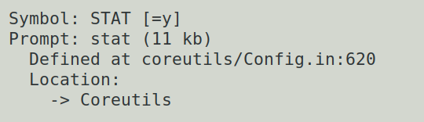
> 图：busybox-menuconfig 搜索结果界面：Symbol: STAT [=y]，Prompt: stat (11 kb)，Defined at coreutils/Config.in:620，Location: -> Coreutils。即在 busybox 配置的 Coreutils 子菜单中选中 stat 命令。

<!-- Slide number: 7 -->
# 10.2 Buildroot中支持QT5
（2）使能gdbserver
在Buildroot源码顶层目录执行以下命令，打开配置界面
	     make menuconfig
按以下路径选中BR2_TOOLCHAIN_EXTERNAL_GDB_SERVER_COPY

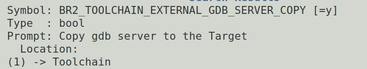
> 图：menuconfig 搜索结果界面：Symbol: BR2_TOOLCHAIN_EXTERNAL_GDB_SERVER_COPY [=y]，Type: bool，Prompt: Copy gdb server to the Target，Location: -> Toolchain。即在 Toolchain 子菜单中选中该项，使 gdbserver 被复制到目标板。

<!-- Slide number: 8 -->
# 10.2 Buildroot中支持QT5
调试原理
开发板运行gdbserver，作为服务器
电脑运行交叉调试工具（cross-debugger）gdb，作为客户端
客户端通过网络连接到服务器
在开发板（Target）上运行被调试的程序，在电脑（Host）上运行调试工具——交叉调试

<!-- Slide number: 9 -->
# 10.2 Buildroot中支持QT5
（3）使能openssh
在Buildroot配置中，按以下路径选中BR2_PACKAGE_OPENSSH

注意，如果原来的根文件系统没有设置登录密码，须设置登录密码，以便用root用户ssh登录

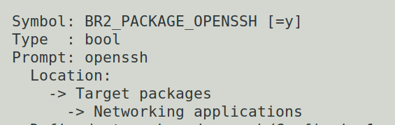
> 图：menuconfig 搜索结果界面：Symbol: BR2_PACKAGE_OPENSSH [=y]，Type: bool，Prompt: openssh，Location: -> Target packages -> Networking applications。即在 Target packages -> Networking applications 路径下选中 openssh。

<!-- Slide number: 10 -->

> 图：Buildroot menuconfig 的 System configuration 配置：-> System hostname = ATK-stm32mp1（平台名字，自行设置）；-> System banner = Welcome to alientek STM32MP157（欢迎语）；-> Init system = BusyBox（使用 busybox）；-> /dev management = Dynamic using devtmpfs + mdev（使用 mdev）；-> [*] Enable root login with password (NEW)（使能登录密码）；-> Root password = 123456（登录密码为 123456）。

<!-- Slide number: 11 -->
# 10.2 Buildroot中支持QT5
（4）使能QT5
在Buildroot配置中选中以下配置项
<1> BR2_PACKAGE_QT5
<2>BR2_PACKAGE_QT5BASE_GUI
<3>BR2_PACKAGE_QT5BASE_WIDGETS
<4>BR2_PACKAGE_QT5BASE_EXAMPLES
<5>BR2_PACKAGE_QT5BASE_FONTCONFIG
<6>BR2_PACKAGE_DEJAVU

<!-- Slide number: 12 -->
# 10.2 Buildroot中支持QT5
（4）使能QT5
在Buildroot配置中选中以下配置项
<1> BR2_PACKAGE_QT5
which enables Qt as a whole, and automatically selects the core Qt module called qt5base

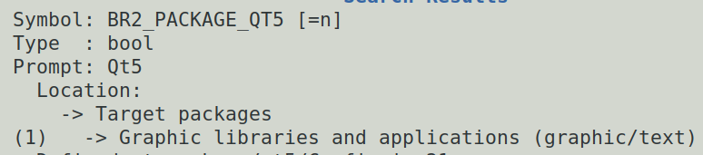
> 图：menuconfig 搜索结果界面：Symbol: BR2_PACKAGE_QT5 [=n]，Type: bool，Prompt: Qt5，Location: -> Target packages -> Graphic libraries and applications (graphic/text)。即 QT5 位于 Target packages 下的 Graphic libraries and applications 子菜单中。

<!-- Slide number: 13 -->
# 10.2 Buildroot中支持QT5
（4）使能QT5
在Buildroot配置中选中以下配置项
<2>BR2_PACKAGE_QT5BASE_GUI
which enables GUI support in qt5base. The linuxfb backend is automatically selected, but provided the appropriate dependencies are enabled, other display backends can be enabled as well. In our case, we’ll use the linuxfb backend so the default selection will work for us.

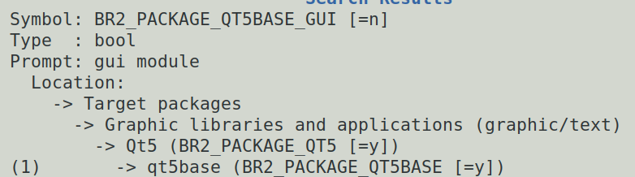
> 图：menuconfig 搜索结果界面：Symbol: BR2_PACKAGE_QT5BASE_GUI [=n]，Type: bool，Prompt: gui module，Location: -> Target packages -> Graphic libraries and applications (graphic/text) -> Qt5 (BR2_PACKAGE_QT5 [=y]) -> qt5base (BR2_PACKAGE_QT5BASE [=y])。

<!-- Slide number: 14 -->
# 10.2 Buildroot中支持QT5
（4）使能QT5
在Buildroot配置中选中以下配置项
<3>BR2_PACKAGE_QT5BASE_WIDGETS
which enables the Qt5 Widget library, which allows to easily write graphical applications with buttons, text boxes, drop down lists and other familiar graphical widgets

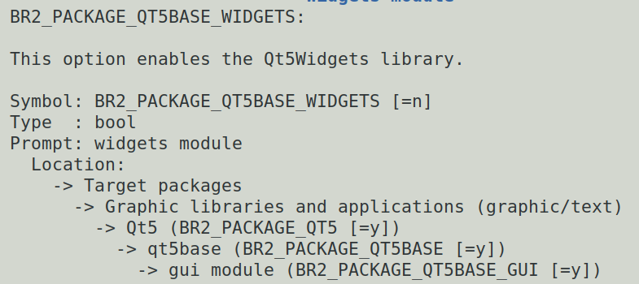
> 图：menuconfig 搜索结果界面：BR2_PACKAGE_QT5BASE_WIDGETS: This option enables the Qt5Widgets library. Symbol: BR2_PACKAGE_QT5BASE_WIDGETS [=n]，Type: bool，Prompt: widgets module，Location: -> Target packages -> Graphic libraries and applications (graphic/text) -> Qt5 (BR2_PACKAGE_QT5 [=y]) -> qt5base (BR2_PACKAGE_QT5BASE [=y]) -> gui module (BR2_PACKAGE_QT5BASE_GUI [=y])。

<!-- Slide number: 15 -->
# 10.2 Buildroot中支持QT5
（4）使能QT5
在Buildroot配置中选中以下配置项
<4>BR2_PACKAGE_QT5BASE_EXAMPLES
to enable the example Qt5 applications

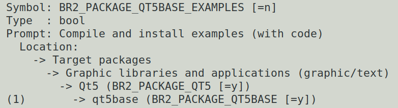
> 图：menuconfig 搜索结果界面：Symbol: BR2_PACKAGE_QT5BASE_EXAMPLES [=n]，Type: bool，Prompt: Compile and install examples (with code)，Location: -> Target packages -> Graphic libraries and applications (graphic/text) -> Qt5 (BR2_PACKAGE_QT5 [=y]) -> qt5base (BR2_PACKAGE_QT5BASE [=y])。

<!-- Slide number: 16 -->
# 10.2 Buildroot中支持QT5
（4）使能QT5
在Buildroot配置中选中以下配置项
<5>BR2_PACKAGE_QT5BASE_FONTCONFIG
to enable the fontconfig support in Qt. This allows Qt to discover the fonts available on our system to render text

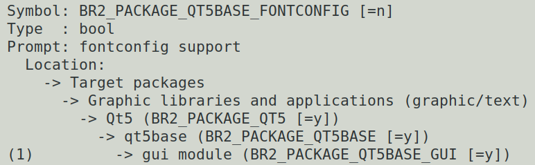
> 图：menuconfig 搜索结果界面：Symbol: BR2_PACKAGE_QT5BASE_FONTCONFIG [=n]，Type: bool，Prompt: fontconfig support，Location: -> Target packages -> Graphic libraries and applications (graphic/text) -> Qt5 (BR2_PACKAGE_QT5 [=y]) -> qt5base (BR2_PACKAGE_QT5BASE [=y]) -> gui module (BR2_PACKAGE_QT5BASE_GUI [=y])。

<!-- Slide number: 17 -->
# 10.2 Buildroot中支持QT5
（4）使能QT5
在Buildroot配置中选中以下配置项
<6>BR2_PACKAGE_DEJAVU
which will provide one font to render text. Without this, Qt applications would run, but no text would be rendered

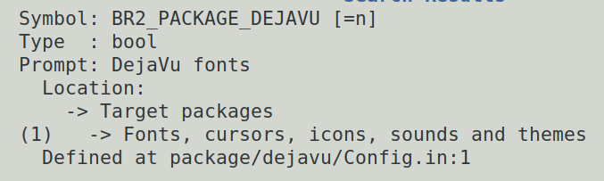
> 图：menuconfig 搜索结果界面：Symbol: BR2_PACKAGE_DEJAVU [=n]，Type: bool，Prompt: DejaVu fonts，Location: -> Target packages -> Fonts, cursors, icons, sounds and themes，Defined at package/dejavu/Config.in:1。

<!-- Slide number: 18 -->
# 10.2 Buildroot中支持QT5
（4）使能QT5
在Buildroot配置中选中以下配置项
<7>BR2_PACKAGE_QT5BASE_EGLFS
which enables the eglfs (OpenGL) display backend, some dependencies should be enabled to make this option available

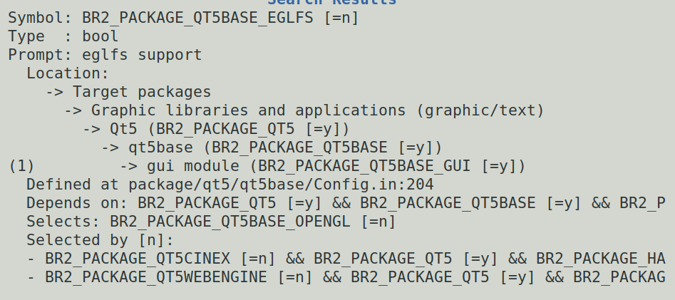
> 图：menuconfig 搜索结果界面：Symbol: BR2_PACKAGE_QT5BASE_EGLFS [=n]，Type: bool，Prompt: eglfs support，Location: -> Target packages -> Graphic libraries and applications (graphic/text) -> Qt5 (BR2_PACKAGE_QT5 [=y]) -> qt5base (BR2_PACKAGE_QT5BASE [=y]) -> gui module (BR2_PACKAGE_QT5BASE_GUI [=y])；Defined at package/qt5/qt5base/Config.in:204；Depends on: BR2_PACKAGE_QT5 [=y] && BR2_PACKAGE_QT5BASE [=y] && BR2_P...（截断）；Selects: BR2_PACKAGE_QT5BASE_OPENGL [=n]；Selected by [n]: BR2_PACKAGE_QT5CINEX [=n] && BR2_PACKAGE_QT5 [=y] && ...、BR2_PACKAGE_QT5WEBENGINE [=n] && BR2_PACKAGE_QT5 [=y] && ...。
这一选项没有验证，请自行验证

<!-- Slide number: 19 -->
# 10.2 Buildroot中支持QT5
完成以上全部配置后，执行以下命令，重新编译Buildroot：
        make clean        //必须清除原有编译重新编译，否
                                   //则有些模块不会被编译
        make                  //编译时间按小时计，耐心等待

<!-- Slide number: 20 -->
# 10.3 用新镜像启动系统
本课程前序章节制作的系统不完善，需要做如下替换：
（1）Linux内核及设备树，替换成开发板出厂文件
（2）根文件系统替换成本章制作的新根文件系统

<!-- Slide number: 21 -->
# 10.3 用新镜像启动系统
（1）替换Linux内核及设备树
我们自己制作的Linux内核缺少设备驱动（特别是此处要用到的显示和触摸屏驱动）
用开发板出厂内核和设备树文件进行替换
出厂文件已在开发板的eMMC中，在u-boot中使用以下命令，设置如下环境变量即可使用出厂文件启动系统
setenv fcsys “ext4load mmc 1:2 c2000000 uImage; ext4load mmc 1:2 c4000000 stm32mp157a-fsmp1a-mipi050.dtb; bootm c2000000 - c4000000”              //设置fcsys环境变量。 这3行是一条命令，要完
			 //整复制
saveenv                    //保存环境变量
run fcsys                   //用fcsys启动系统。以后启动系统只需执行这
                                  //一条命令

<!-- Slide number: 22 -->
# 10.3 用新镜像启动系统
（2）替换根文件系统
先备份旧的根文件系统！！！
在<buildroot source>/output/images目录下有rootfs.tar压缩包，它是新生成的根文件系统
把rootfs.tar复制到原有根文件系统的目录下(rfs目录)，用以下命令解压，新文件即可覆盖旧文件
           tar -xvf rootfs.tar

<!-- Slide number: 23 -->
# 10.3 用新镜像启动系统
启动开发板进入Linux系统
在开发板的命令行界面执行以下程序：/usr/lib/qt/examples/widgets/widgets/calculator/calculator -platform linuxfb
如果显示正常，且触摸屏能正常点击，则触摸屏驱动已正常，Qt运行环境已正常

<!-- Slide number: 24 -->

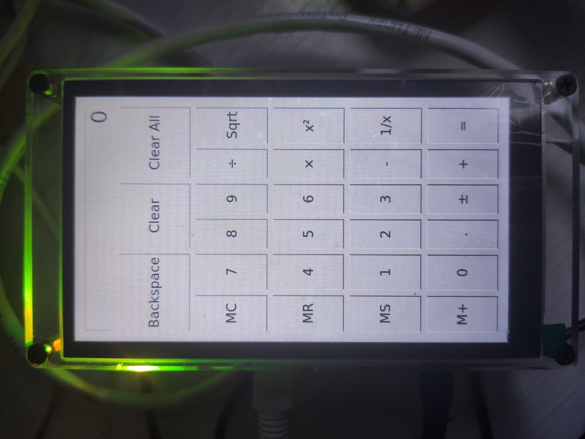
> 图：开发板实拍照片：FS-MP1A 开发板的 LCD 屏幕上运行 Qt 自带的 calculator（计算器）示例程序，屏显显示 "0"，并显示 Backspace、Clear、Clear All 按键，数字键 0-9、"."、"±"、"+"、"-"、"×"、"÷"，以及 Sqrt、x²、1/x、"=" 和 MC、MR、MS、M+ 内存按键。显示和触摸均正常，说明出厂内核的显示、触摸屏驱动及 Qt 的 linuxfb 运行环境正常。

<!-- Slide number: 25 -->
# 10.3 用新镜像启动系统
（3）配置openssh
openssh在系统启动时会自动启动sshd服务，首次启动时可能会显示“sshd: /var/empty must be owned by root and not group or world-writable.”，提示sshd启动失败，执行以下命令修改/var/empty的用户和组
                chown root:root /var/empty
修改开发板文件系统中的/etc/ssh/sshd_config文件，允许root用户使用ssh登录

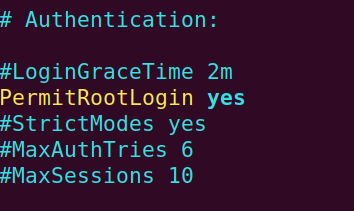
> 图：开发板 /etc/ssh/sshd_config 文件的 Authentication 部分截图，其中 "PermitRootLogin yes" 一行的注释符 "#" 已被删掉（该行以黄色高亮显示），周围各行为 #LoginGraceTime 2m、#StrictModes yes、#MaxAuthTries 6、#MaxSessions 10，仍保持注释状态。

注意：“#”是注释符号，要把本行的“#”删掉

<!-- Slide number: 26 -->
# 10.3 用新镜像启动系统
修改完毕，执行以下命令重启sshd服务
              /etc/init.d/S50sshd restart
在电脑的Linux系统中用ssh登录开发板，测试sshd是否正常

其中192.168.0.2是开发板ip，根据自己的网络配置填写

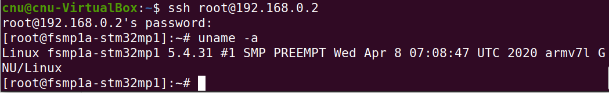
> 图：电脑 Linux 终端 ssh 登录测试：提示符 cnu@cnu-VirtualBox:~$ 下执行 ssh root@192.168.0.2，输入密码后成功登录到开发板，出现提示符 [root@fsmp1a-stm32mp1]:~#，执行 uname -a 输出 "Linux fsmp1a-stm32mp1 5.4.31 #1 SMP PREEMPT Wed Apr 8 07:08:47 UTC 2020 armv7l GNU/Linux"，说明 sshd 服务正常。

<!-- Slide number: 27 -->
# 10.4 搭建Qt开发环境
本小节的环境全部是指电脑Linux的环境
1. 安装软件
（1）安装Qt Creator
        sudo apt install qtcreator
（2）安装gdb调试工具的依赖库
gdb调试器依赖的库可能缺少，造成gdb无法运行
执行以下命令，测试gdb能否运行
<buildroot source>/output/host/bin/arm-none-linux-gnueabihf-gdb

<!-- Slide number: 28 -->

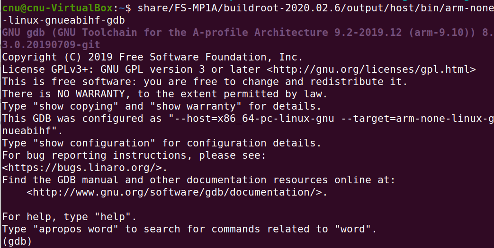
> 图：终端运行交叉调试器验证截图：cnu@cnu-VirtualBox:~$ 执行 share/FS-MP1A/buildroot-2020.02.6/output/host/bin/arm-none-linux-gnueabihf-gdb，输出 "GNU gdb (GNU Toolchain for the A-profile Architecture 9.2-2019.12 (arm-9.10)) 8.3.0.20190709-git"、版权及 License GPLv3+ 信息、"This GDB was configured as \"--host=x86_64-pc-linux-gnu --target=arm-none-linux-gnueabihf\""，bug 报告地址 <https://bugs.linaro.org/>，最后停在 "(gdb)" 提示符，说明 gdb 可正常运行。
gdb调试器运行正常截图

<!-- Slide number: 29 -->
# 10.4 搭建Qt开发环境
如果不能正常运行，根据提示安装缺少的库
你可能需要安装以下库：
sudo apt install libtinfo5
sudo apt install libncursesw5
sudo apt install libpython2.7

<!-- Slide number: 30 -->
# 10.4 搭建Qt开发环境
2. 配置Qt Creator
编译Qt应用程序所需的交叉编译工具链已由Buildroot生成，配置到Qt Creator中即可
（1）新建Kits
打开 Tools->Options->Kits

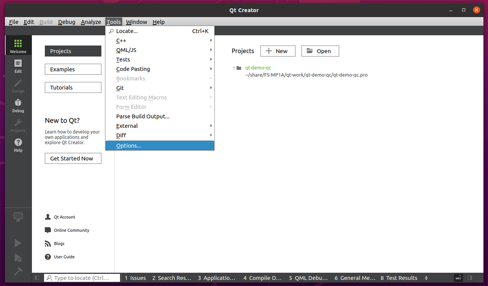
> 图：Qt Creator 主界面截图：Projects 面板中已有项目 qt-demo-qc（路径 ~/share/FS-MP1A/qt-work/qt-demo-qc/qt-demo-qc.pro）；正打开菜单栏 Tools 菜单并高亮选中 Options...（菜单中还有 Locate... Ctrl+K、C++、QML/JS、Tests、Code Pasting、Bookmarks、Git、Text Editing Macros、Form Editor、Parse Build Output...、External、Diff 等项）。

<!-- Slide number: 31 -->

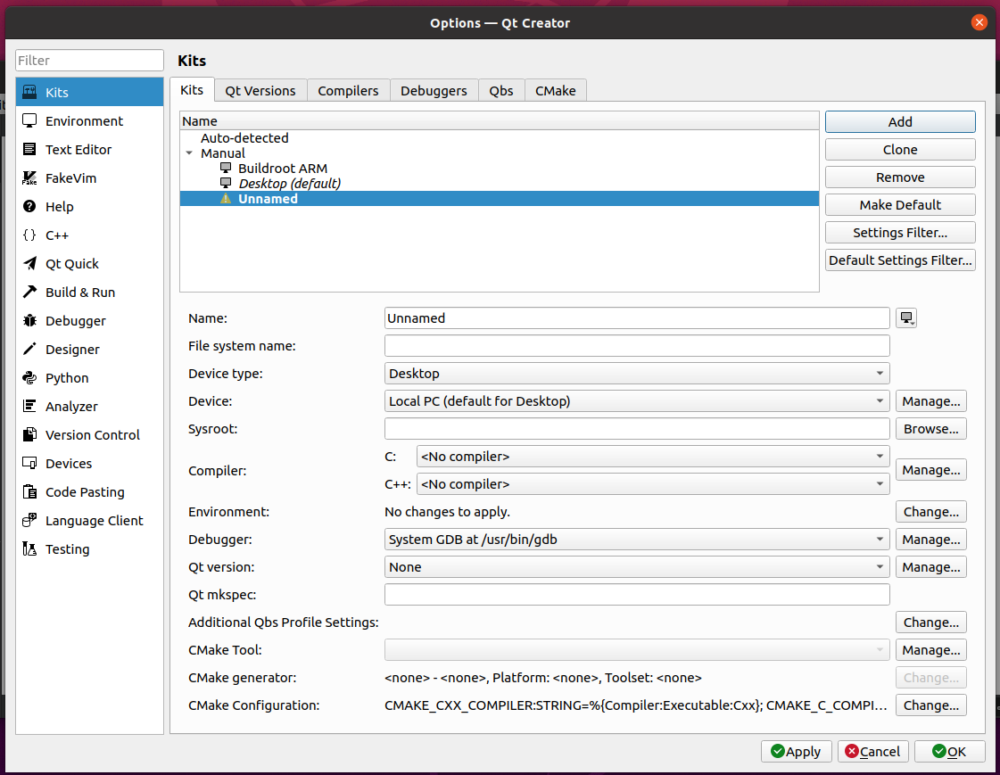
> 图：Options - Qt Creator 对话框的 Kits 页（子标签：Kits、Qt Versions、Compilers、Debuggers、Qbs、CMake）。Kit 列表 Auto-detected 下仅有 Desktop (default)，另有一个新建后未配置、带黄色感叹号的 Unnamed kit；下方表单为：Name: Unnamed，Device type: Desktop，Device: Local PC (default for Desktop)，Sysroot 空，Compiler C/C++: <No compiler>，Debugger: System GDB at /usr/bin/gdb，Qt version: None，Qt mkspec 空。右侧有 Add、Clone、Remove、Make Default 等按钮，即点击 Add 新建 kit 后的初始状态。

<!-- Slide number: 32 -->
# 10.4 搭建Qt开发环境
在Kits界面中，点右上角的Add，新建一个配置，填写如下：
Name: Buildroot ARM
Device type: Generic Linux Device
Sysroot: <buildroot source>/output/host/arm-buildroot-linux-gnueabihf/sysroot/
Compiler: 点击右侧的Manage，切换到Compiler界面：
添加一个GCC C编译器，name为Buildroot GCC，路径为<buildroot source>/output/host/bin/arm-none-linux-gnueabihf-gcc
添加一个GCC C++编译器，name为Buildroot G++，路径为<buildroot source>/output/host/bin/arm-none-linux-gnueabihf-g++
添加完成，回到Kits界面，选择Buildroot GCC 和 Buildroot G++ 编译器作为C和C++编译器

<!-- Slide number: 33 -->
# 10.4 搭建Qt开发环境
Debugger: 点击右侧的Manage ，切换到Debugger界面
添加一个调试器，name为Buildroot GDB，路径为<buildroot source>/output/host/bin/arm-none-linux-gnueabihf-gdb
   添加完成，回到Kits界面，选择Buildroot GDB作为调试器
Qt version: 点击右侧的Manage ，切换到Qt Versions界面
点击右上角的Add，选择<buildroot source>/output/host/bin/qmake打开，会自动检测到Qt版本为5.12.8。把version name改为Qt %{Qt:Version} (Buildroot)，以表示它是用于开版上的Qt程序
   添加完成，回到Kits界面，选择 Qt 5.12.8 (Buildroot)
Qt mkspec: 填写devices/linux-buildroot-g++。 mkspec是一个目录，它位于<buildroot source>/output/build/qt5base-5.12.8/mkspecs/devices/linux-buildroot-g++，其中有关于Qt的配置文件，由buildroot编译Qt时生成的，使用qmake构建应用程序时需要用到这些文件

<!-- Slide number: 34 -->
填写好的配置如图所示

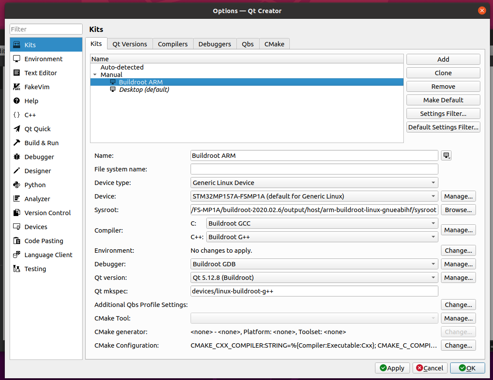
> 图：Qt Creator Kits 页中配置完成的 Buildroot ARM kit：Name: Buildroot ARM；Device type: Generic Linux Device；Device: STM32MP157A-FSMP1A (default for Generic Linux)；Sysroot: /FS-MP1A/buildroot-2020.02.6/output/host/arm-buildroot-linux-gnueabihf/sysroot；Compiler C: Buildroot GCC，C++: Buildroot G++；Debugger: Buildroot GDB；Qt version: Qt 5.12.8 (Buildroot)；Qt mkspec: devices/linux-buildroot-g++。
Kits界面

<!-- Slide number: 35 -->

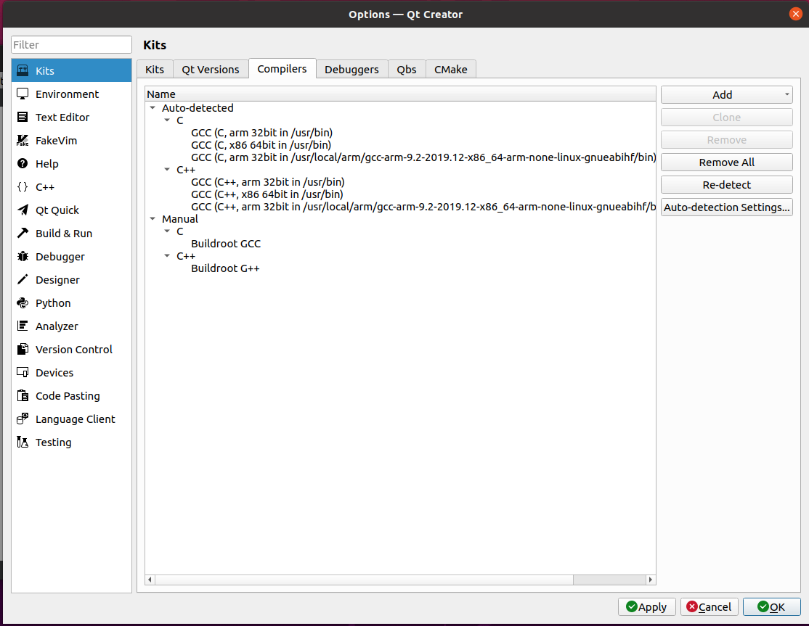
> 图：Qt Creator Options 对话框的 Compilers 页：Auto-detected 下列出 GCC (C, arm 32bit in /usr/bin)、GCC (C, x86 64bit in /usr/bin)、GCC (C, arm 32bit in /usr/local/arm/gcc-arm-9.2-2019.12-x86_64-arm-none-linux-gnueabihf/bin) 以及对应的 GCC (C++, ...) 条目；Manual 下 C 编译器为 Buildroot GCC，C++ 编译器为 Buildroot G++。
Compiler界面

<!-- Slide number: 36 -->

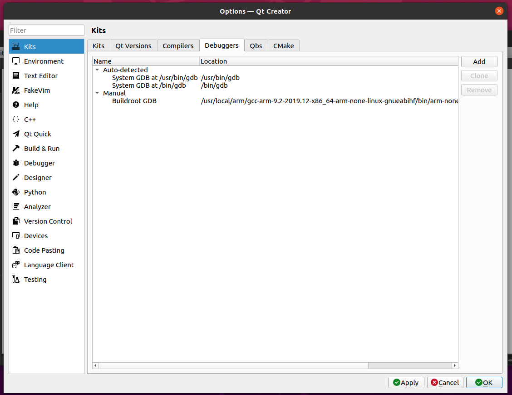
> 图：Qt Creator Options 对话框的 Debuggers 页：Name/Location 列表中，Auto-detected 下有 System GDB at /usr/bin/gdb（/usr/bin/gdb）和 System GDB at /bin/gdb（/bin/gdb）；Manual 下新增 Buildroot GDB，Location 为 /usr/local/arm/gcc-arm-9.2-2019.12-x86_64-arm-none-linux-gnueabihf/bin/arm-none...（截图截断，即 arm-none-linux-gnueabihf-gdb）。
Debugger界面

<!-- Slide number: 37 -->

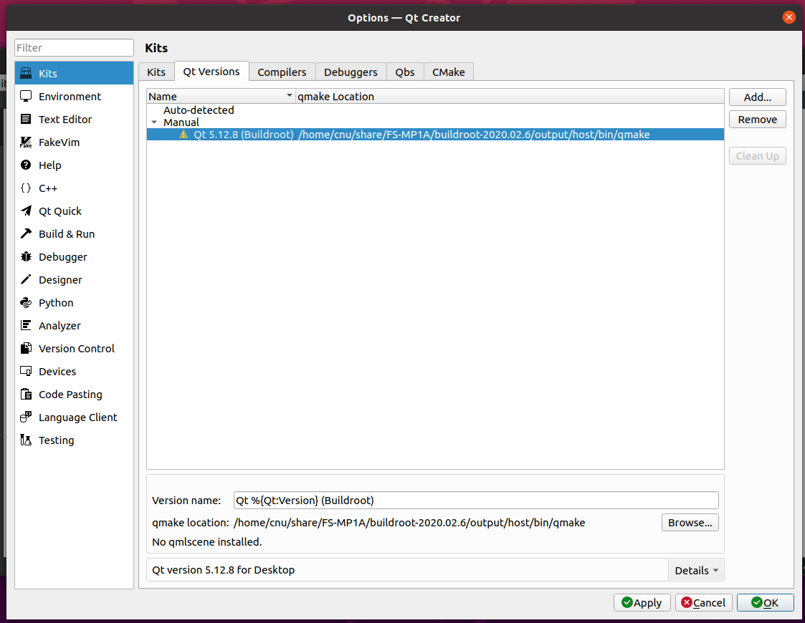
> 图：Qt Creator Options 对话框的 Qt Versions 页：Manual 下添加了 Qt 5.12.8 (Buildroot)，qmake Location 为 /home/cnu/share/FS-MP1A/buildroot-2020.02.6/output/host/bin/qmake；下方 Version name: Qt %{Qt:Version} (Buildroot)，qmake location: /home/cnu/share/FS-MP1A/buildroot-2020.02.6/output/host/bin/qmake，提示 No qmlscene installed，概要为 "Qt version 5.12.8 for Desktop"。
Qt versions界面

<!-- Slide number: 38 -->
# 10.4 搭建Qt开发环境
（2）新建一个设备
为了使Qt Creator能把应用程序部署到开发板上，并在开发板调试和运行程序，需要在Qt Creator中创建一个设备，以表示我们的开发板
打开Tools -> Options -> Devices 界面

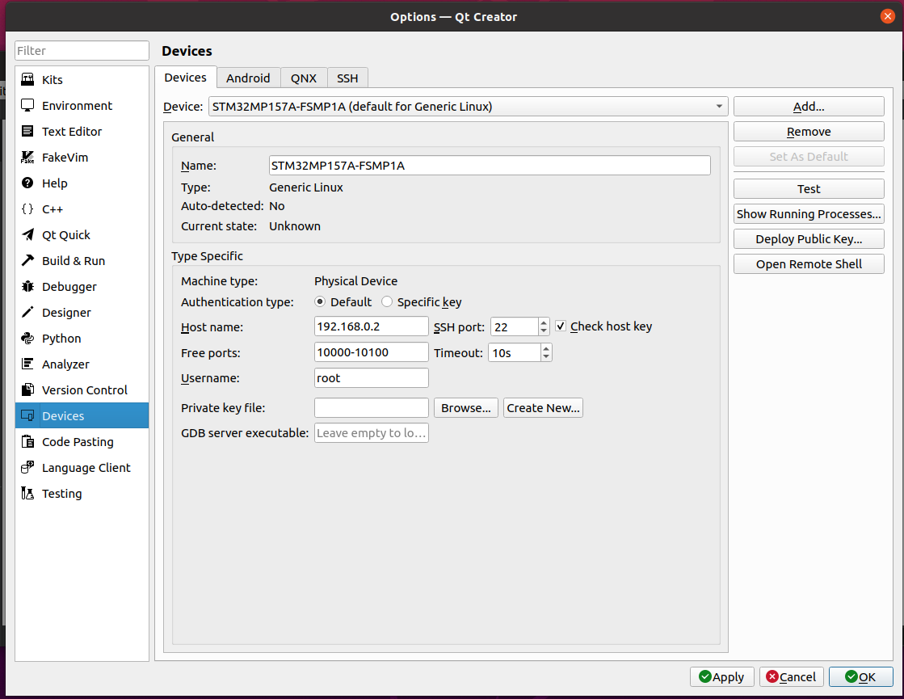
> 图：Qt Creator Options 对话框的 Devices 页：左侧选中 Devices，设备下拉框为 STM32MP157A-FSMP1A (default for Generic Linux)。General 区：Name: STM32MP157A-FSMP1A，Type: Generic Linux，Auto-detected: No，Current state: Unknown；Type Specific 区：Machine type: Physical Device，Authentication type: Default（选中）/ Specific key，Host name: 192.168.0.2，SSH port: 22，勾选 Check host key，Free ports: 10000-10100，Timeout: 10s，Username: root，Private key file 空，GDB server executable 留空。右侧按钮有 Add...、Remove、Test、Show Running Processes...、Deploy Public Key...、Open Remote Shell。

<!-- Slide number: 39 -->
# 10.4 搭建Qt开发环境
点击右上角的Add，新增一个设备。根据提示，逐步设置
设备类型选择Generic Linux Device

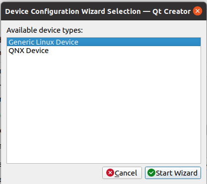
> 图：Device Configuration Wizard Selection - Qt Creator 对话框：Available device types 列表中选中 Generic Linux Device（另一选项为 QNX Device），底部为 Cancel 和 Start Wizard 按钮。

<!-- Slide number: 40 -->
# 10.4 搭建Qt开发环境
设备名：填一个能描述开发板的名字，例如STM32MP157A-FSMP1A
IP：填开发板的实际IP
用户名：开发板上的用户名

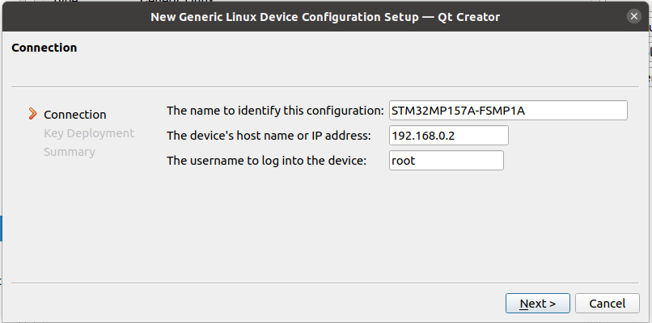
> 图：New Generic Linux Device Configuration Setup - Qt Creator 向导的 Connection 页：The name to identify this configuration: STM32MP157A-FSMP1A；The device's host name or IP address: 192.168.0.2；The username to log into the device: root。左侧步骤为 Connection（当前）→ Key Deployment → Summary，底部 Next > / Cancel 按钮。

<!-- Slide number: 41 -->
# 10.4 搭建Qt开发环境
部署Key跳过，可以直接用密码登录开发板

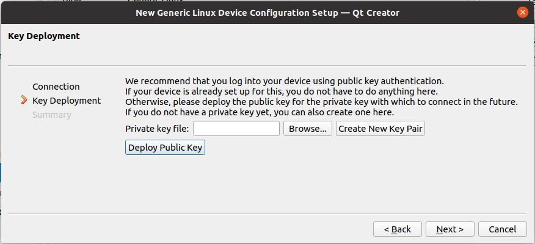
> 图：New Generic Linux Device Configuration Setup 向导的 Key Deployment 页：提示 "We recommend that you log into your device using public key authentication..."，Private key file 输入框留空，另有 Browse...、Create New Key Pair、Deploy Public Key 按钮，底部 <Back、Next >、Cancel。此步可跳过，直接用密码登录开发板。

<!-- Slide number: 42 -->
# 10.4 搭建Qt开发环境
一路next，直到finish，之后会自动测试能否登录开发板，如果电脑没有连接开发板，直接关闭测试即可
把开发板和电脑连接好，并且开发板启动进入到Linux
Authentica type选为Default，点击右侧的Test，测试能否登录开发板

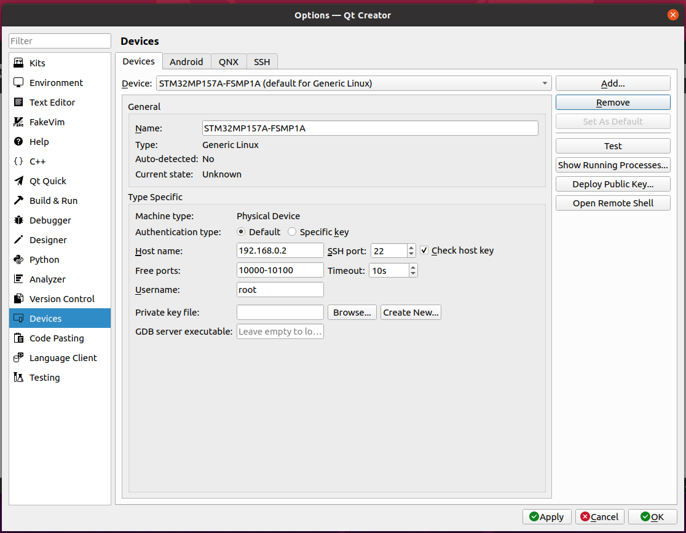
> 图：Qt Creator Devices 页中新建设备完成后的界面：设备下拉框为 STM32MP157A-FSMP1A (default for Generic Linux)；Name: STM32MP157A-FSMP1A，Type: Generic Linux，Auto-detected: No，Current state: Unknown；Authentication type 选为 Default，Host name: 192.168.0.2，SSH port: 22，Free ports: 10000-10100，Timeout: 10s，Username: root。右侧点击 Test 按钮即可测试能否登录开发板。

选择新创建的设备

<!-- Slide number: 43 -->
成功登录开发板

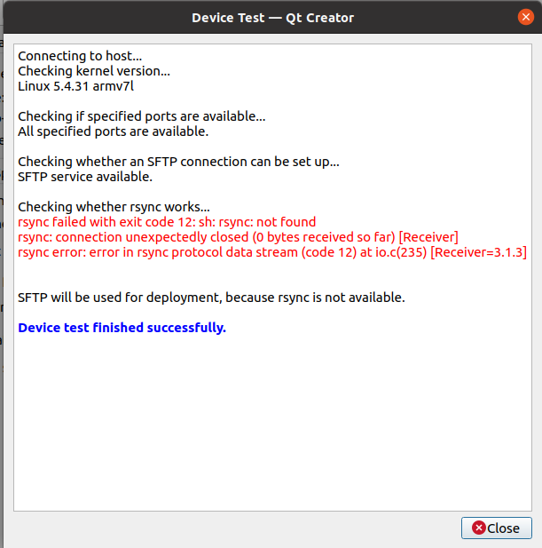
> 图：Device Test - Qt Creator 设备测试结果窗口：依次输出 "Connecting to host..."、"Checking kernel version... Linux 5.4.31 armv7l"、"Checking if specified ports are available... All specified ports are available."、"Checking whether an SFTP connection can be set up... SFTP service available."；"Checking whether rsync works..." 一步显示红色错误 "rsync failed with exit code 12: sh: rsync not found"、"rsync: connection unexpectedly closed (0 bytes received so far) [Receiver]"、"rsync error: error in rsync protocol data stream (code 12) at io.c(235) [Receiver=3.1.3]"，随后提示 "SFTP will be used for deployment, because rsync is not available."，最后以蓝色字 "Device test finished successfully." 结束，表示成功登录/连接开发板。

<!-- Slide number: 44 -->
# 10.5 Qt应用程序开发
导入项目
已有一个名为main.cpp的源文件，和名为qt-demo-qc.pro的项目配置文件，内容如下
#include <QApplication>
#include <QPushButton>

int main(int argc, char* argv[])
{
    QApplication app(argc, argv);
    QPushButton hello("Hello world!");
    hello.resize(100,30);
    hello.show();
    return app.exec();
}

main.cpp

<!-- Slide number: 45 -->
# 10.5 Qt应用程序开发
在Qt Creator中点击File -> Open File or Project，在打开的窗口中把main.cpp和qt-demo-qc.pro都选中打开
Qt Creator 会打开项目配置窗口，Kits选择之前创建的Buildroot ARM，然后点Configure Project

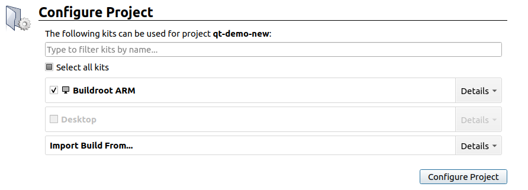
> 图：Qt Creator 的 Configure Project 项目配置页面："The following kits can be used for project qt-demo-new:" 下方的 kit 列表中勾选了 Buildroot ARM（Desktop 一项为灰色不可选），右侧有 Details 按钮，底部为 "Configure Project" 按钮，即选择 Buildroot ARM kit 后点击 Configure Project 完成项目配置。

<!-- Slide number: 46 -->
# 10.5 Qt应用程序开发
编译项目
项目已导入，可以通过Build -> Build All进行编译了

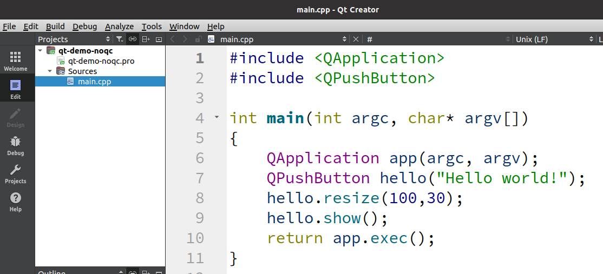
> 图：Qt Creator 编辑器截图：左侧 Projects 面板显示项目 qt-demo-noqc（qt-demo-noqc.pro，Sources 下有 main.cpp），编辑器打开 main.cpp，代码为 #include <QApplication>、#include <QPushButton>，main 函数中 QApplication app(argc, argv);、QPushButton hello("Hello world!");、hello.resize(100,30);、hello.show();、return app.exec();。此时可通过 Build -> Build All 编译项目。

<!-- Slide number: 47 -->
# 10.5 Qt应用程序开发
你可能会看到一些错误或警告的提示，如图所示

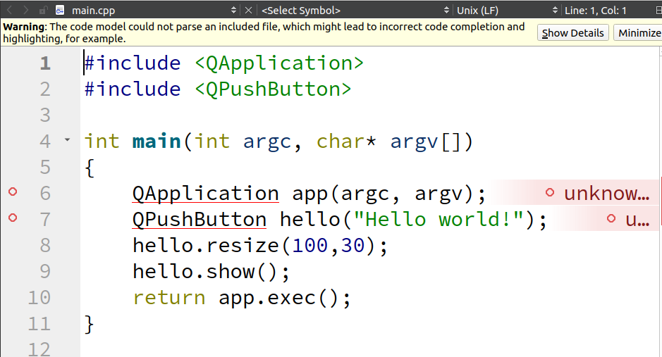
> 图：main.cpp 编辑器顶部出现黄色警告条："Warning: The code model could not parse an included file, which might lead to incorrect code completion and highlighting, for example."（附 Show Details / Minimize 按钮）；第 6、7 行 QApplication app(argc, argv); 和 QPushButton hello("Hello world!"); 下方有红色错误波浪线并显示 unknown... 错误标记——这些错误/警告提示是假象。

<!-- Slide number: 48 -->
# 10.5 Qt应用程序开发
都是假象，在Help ->About Plugins中把ClangCodeModel 关闭即可

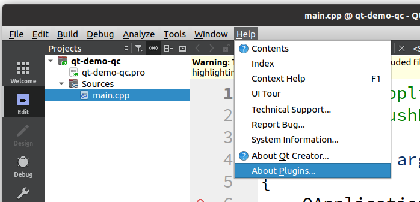
> 图：Qt Creator 菜单栏 Help 菜单展开的截图，菜单项包括 Contents、Index、Context Help (F1)、UI Tour、Technical Support...、Report Bug...、System Information...、About Qt Creator...，当前高亮选中 About Plugins...。左侧项目树显示 qt-demo-qc 项目。

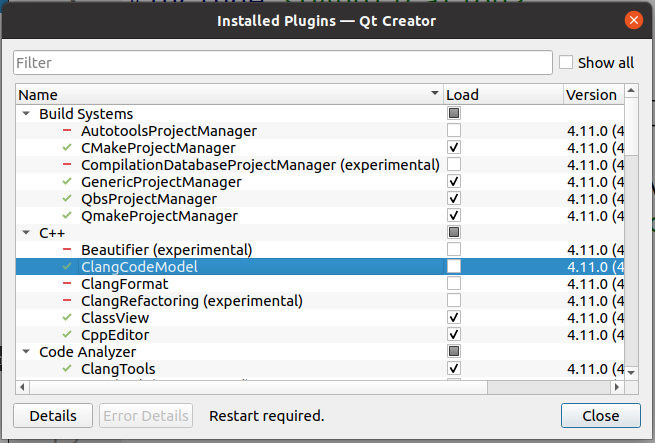
> 图：Installed Plugins - Qt Creator 插件列表对话框（版本 4.11.0）：Build Systems、C++、Code Analyzer 等分组下的插件及各自 Load 复选框，其中 C++ 分组下的 ClangCodeModel 行被选中且 Load 复选框已取消勾选，底部提示 "Restart required."（需重启 Qt Creator 生效）。

<!-- Slide number: 49 -->
# 10.5 Qt应用程序开发
部署和运行
点     会把生成的可执行程序部署到开发板上，并运行程序
程序在开发板上的位置在.pro文件中设置，如图所示的.pro文件指定把程序部署到/opt目录

> 图：Qt Creator 界面左下角的绿色三角"运行（Run）"按钮图标，点击它即可把编译生成的可执行程序部署到开发板上并运行。

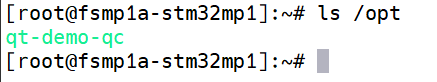
> 图：开发板终端截图：提示符 [root@fsmp1a-stm32mp1]:~# 下执行 ls /opt，输出 qt-demo-qc（绿色显示），说明程序已成功部署到开发板的 /opt 目录。
开发板上的文件

<!-- Slide number: 50 -->
# 10.5 Qt应用程序开发
目前运行程序会出错，需要在projects -> run中添加命令行参数“-platform linuxfb”
这是由于Qt默认使用eglfs作为显示后端，但我们编译的Qt仅支持了linuxfb后端

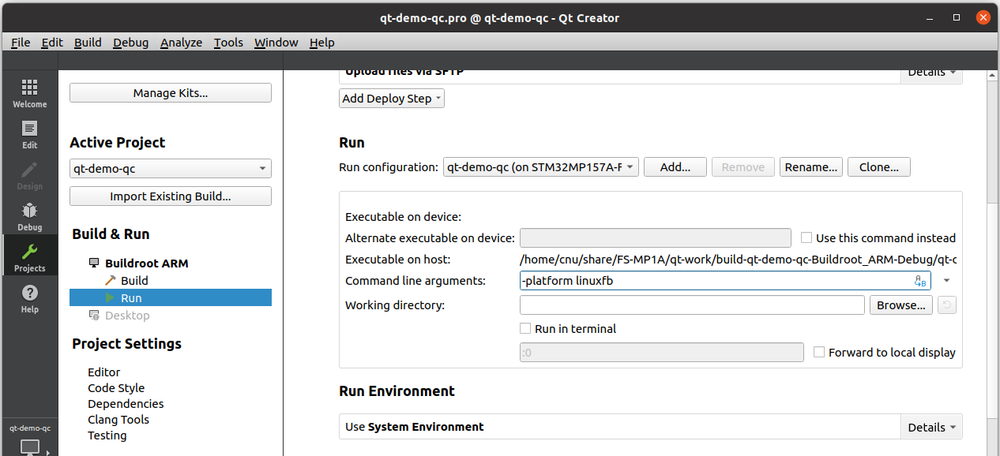
> 图：Qt Creator 左侧 Projects -> Build Settings 下的 Run 运行设置页（kit 为 Buildroot ARM）：Run configuration: qt-demo-qc (on STM32MP157A-F...)，Executable on host: /home/cnu/share/FS-MP1A/qt-work/build-qt-demo-qc-Buildroot_ARM-Debug/qt-...，Command line arguments 一栏填写了 "-platform linuxfb"，Working directory 为空，未勾选 Run in terminal；上方 Deploy Steps 中为 Upload files via SFTP；下方 Run Environment 选择 Use System Environment。

<!-- Slide number: 51 -->

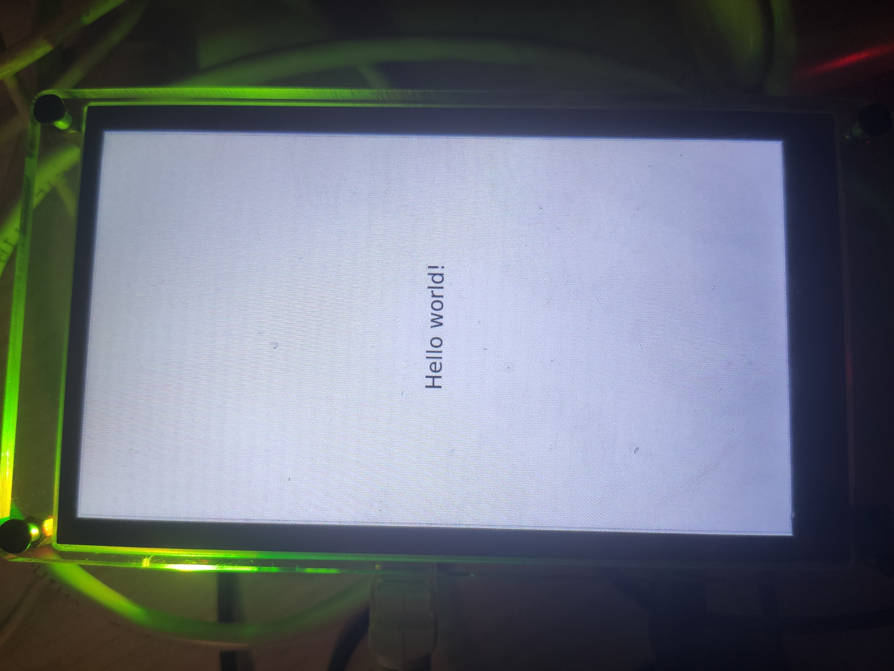
> 图：开发板 LCD 屏实拍照片：屏幕上显示一个 QPushButton 按钮，按钮文字为 "Hello world!"，即 Qt 应用程序成功部署并在开发板上运行。
开发板上的运行结果

<!-- Slide number: 52 -->

> 图：开发板 LCD 屏实拍照片：屏幕上显示 "Hello world!" 按钮，程序运行结果正常。
开发板上的运行结果

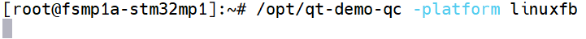
> 图：开发板终端截图：提示符 [root@fsmp1a-stm32mp1]:~# 下执行 /opt/qt-demo-qc -platform linuxfb，即在开发板上通过命令行加 "-platform linuxfb" 参数运行 Qt 程序。
在开发板上通过命令运行

<!-- Slide number: 53 -->
# 10.5 Qt应用程序开发
调试
要调试程序需要编译产物放在项目目录下，在projects -> build 中取消Shadow build选项

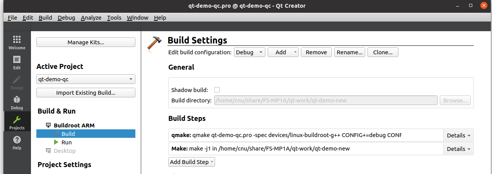
> 图：Qt Creator 左侧 Projects -> Build Settings（kit 为 Buildroot ARM，Build 步骤）设置页：Edit build configuration: Debug；General 区中 Shadow build 复选框已取消勾选，Build directory: /home/cnu/share/FS-MP1A/qt-work/qt-demo-new；Build Steps 区显示 qmake: qmake qt-demo-qc.pro -spec devices/linux-buildroot-g++ CONFIG+=debug CONF...（Details 展开）和 Make: make -j1 in /home/cnu/share/FS-MP1A/qt-work/qt-demo-new，以及 Add Build Step 按钮。

<!-- Slide number: 54 -->
# 10.5 Qt应用程序开发
在.pro文件中添加编译参数，如图
-g：在生成的程序中加入调试信息，缺少此参数会造成无法进入断点
-O0：不进行编译优化，缺少此参数程序有些行会被优化掉，不利于单步调试，且有些变量也会被优化掉，无法查看

<!-- Slide number: 55 -->
# 10.5 Qt应用程序开发
点    ，可以正常调试程序了

> 图：Qt Creator 界面左下角的"开始调试（Start Debugging）"按钮图标：绿色三角与甲虫（bug）图标叠加，点击它即可启动对开发板上程序的调试。

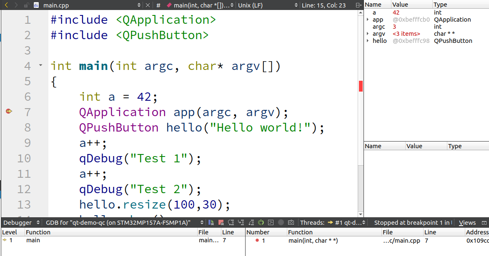
> 图：Qt Creator 调试运行截图：main.cpp 中代码增加了 int a = 42;、a++;、qDebug("Test 1");、qDebug("Test 2"); 等语句，第 7 行 QApplication app(argc, argv); 处设置了断点（行号旁有断点标记），调试器 GDB for "qt-demo-qc (on STM32MP157A-FSMP1A)" 已停在断点上（底部状态栏显示 Stopped at breakpoint 1，断点列表 Number 1，Function main(int, char * *)，File .../main.cpp，Line 7，Address 0x109c...）；右侧局部变量窗口显示 a=42 (int)、app @0xbefffcb0 (QApplication)、argc 3 (int)、argv <3 items> (char * *)、hello @0xbefffc98 (QPushButton)，说明可以正常进入断点并查看变量。
