<!-- Slide number: 1 -->
# 第1章 FS-MP1A开发板简介

<!-- Slide number: 2 -->
# 1.1 开发板概述
本课程使用华清远见FS-MP1A开发板

> 图：FS-MP1A开发板（板丝印 FS-MP1A V3.1）实物照片。红色PCB，正中为ST主处理器芯片，丝印"STM32MP157AAA3、AA 187 VQ、TUN AA 333"；其左侧为WiFi/蓝牙模组（ANT天线焊点及陶瓷天线走线）和内存芯片，右侧为HDMI发送芯片（丝印 IEP77 D9SHD TX75）；下方有ST电源管理芯片（丝印 GLB060 GLS060 109P00）和 Cirrus 音频codec（丝印 ON CIRRUS 42L51C）；底部中间为 HanRun HY911130A（21/28）千兆以太网RJ45网口，两侧为USB Host双口（USB A母座）、mini USB OTG口、MicroSD卡槽、四段3.5mm耳机接口、5V/2A电源插座（板上丝印 5V-2A、USER、NRST按键）；顶部有JTAG/SWD调试排针，以及DVP摄像头（CAMERA）、MIPI-DSI（DSI）等FPC软排线连接器。

<!-- Slide number: 3 -->
# 1.1 开发板概述
FS-MP1A开发板是基于ST（意法半导体）公司的STM32MP1系列处理器而设计（参考ST官方的stm32mp157a-dk1开发板设计）
FS-MP1A开发板使用的是该系列中的STM32MP157AAA3型号处理器
STM32MP1系列处理器采用异构多核架构，集成了ARM Cortex-A7和Cortex-M4两种处理器内核
本课程的程序都运行在Cortex-A7内核上
Cortex-A7 基于ARMv7-A架构（ISA）
Cortex-M4 基于ARMv7-M架构

<!-- Slide number: 4 -->
# 1.1 开发板概述

> 图：STM32MP1系列处理器异构多核架构框图（WMF矢量图，据上下文绘制）：处理器内部由双核ARM Cortex-A7内核与单核Cortex-M4内核组成，Cortex-A7基于ARMv7-A架构、运行本课程的程序（Linux系统），Cortex-M4基于ARMv7-M架构，两类内核通过内部总线互连并可共享外设资源。

<!-- Slide number: 5 -->
# 1.1 开发板概述
STM32MP1系列处理器 https://www.st.com/zh/microcontrollers-microprocessors/stm32mp1-series.html

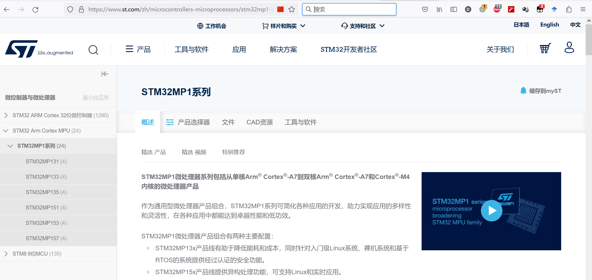
> 图：ST官网STM32MP1系列产品页截图（https://www.st.com/zh/microcontrollers-microprocessors/stm32mp1-series.html）。左侧导航树：微控制器与微处理器 → STM32 Arm Cortex MPU (24) → STM32MP1系列 (24)，其下有 STM32MP131 (4)、STM32MP133 (4)、STM32MP135 (4)、STM32MP151 (4)、STM32MP153 (4)、STM32MP157 (4)。正文标题"STM32MP1微处理器系列包括从单核Arm® Cortex®-A7到双核Arm® Cortex®-A7和Cortex®-M4内核的微处理器产品"，并说明STM32MP1产品组合有两种主要配置：STM32MP13x产品线有助于降低能耗和成本，同时针对入门级Linux系统、裸机系统和基于RTOS的系统提供经过认证的安全功能；STM32MP15x产品线提供异构处理功能，可支持Linux和实时应用。页面右侧为"STM32MP1 series microprocessor broadening STM32 MPU family"宣传视频。

<!-- Slide number: 6 -->
# 1.2 开发板硬件资源
处理器：STM32MP157AAA3处理器
双核ARM Cortex-A7/@650MHz + 单核Cortex-M4/@209MHz

见数据手册DS12504  （stm32mp157a.pdf）

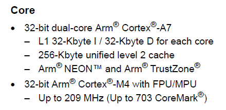
> 图：数据手册DS12504（stm32mp157a.pdf）"Core（内核）"一节摘录：32-bit dual-core Arm® Cortex®-A7——每核 L1 32-Kbyte I / 32-Kbyte D，256-Kbyte unified level 2 cache，Arm® NEON™ 和 Arm® TrustZone®；32-bit Arm® Cortex®-M4 with FPU/MPU——最高 209 MHz（Up to 703 CoreMark®）。

<!-- Slide number: 7 -->

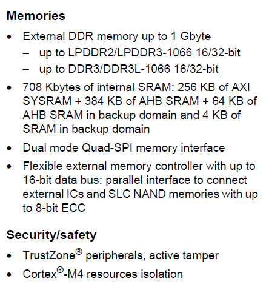
> 图：数据手册"Memories（存储器）"一节摘录：外部DDR存储器最大 1 Gbyte——支持 LPDDR2/LPDDR3-1066 16/32-bit、DDR3/DDR3L-1066 16/32-bit；708 Kbytes 内部SRAM：256 KB AXI SYSRAM + 384 KB AHB SRAM + 64 KB backup domain AHB SRAM + 4 KB backup domain SRAM；双模式 Quad-SPI 存储器接口；灵活外部存储器控制器（FMC），16-bit数据总线，可并行连接外部IC和最大8-bit ECC的SLC NAND。下方"Security/safety（安全）"一节：TrustZone® 外设、active tamper；Cortex®-M4 资源隔离。

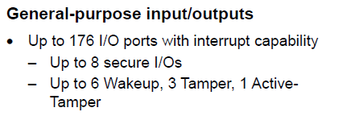
> 图：数据手册"General-purpose input/outputs（通用输入输出）"一节摘录：最多 176 个带中断能力的 I/O 端口（Up to 176 I/O ports with interrupt capability）；最多 8 个安全 I/O（Up to 8 secure I/Os）；最多 6 个唤醒（Wakeup）、3 个 Tamper、1 个 Active-Tamper。

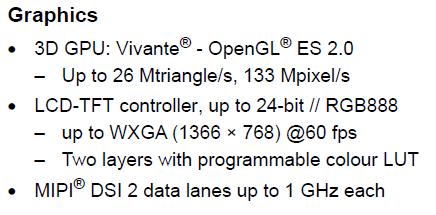
> 图：数据手册"Graphics（图形）"一节摘录：3D GPU 为 Vivante® 内核，支持 OpenGL® ES 2.0，最高 26 Mtriangle/s、133 Mpixel/s；LCD-TFT 控制器，最高 24-bit // RGB888，最高 WXGA（1366 × 768）@60 fps，两层图层带可编程彩色查找表（programmable colour LUT）；MIPI® DSI 接口 2 条数据通道，每条最高 1 GHz。

<!-- Slide number: 8 -->

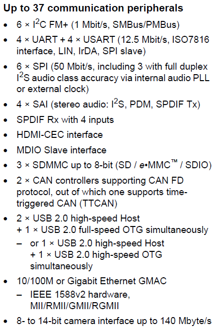
> 图：数据手册通信外设摘录"Up to 37 communication peripherals（多达37个通信外设）"：6 × I²C FM+（1 Mbit/s，SMBus/PMBus）；4 × UART + 4 × USART（12.5 Mbit/s，ISO7816接口、LIN、IrDA、SPI slave）；6 × SPI（50 Mbit/s，其中3个可经内部音频PLL或外部时钟实现全双工 I²S 音频精度）；4 × SAI（立体声音频：I²S、PDM、SPDIF Tx）；SPDIF Rx 带4路输入；HDMI-CEC 接口；MDIO Slave 接口；3 × SDMMC（最高8-bit，SD / e•MMC™ / SDIO）；2 × CAN 控制器支持 CAN FD 协议（其中一个支持时间触发CAN TTCAN）；2 × USB 2.0 high-speed Host + 1 × USB 2.0 full-speed OTG 可同时工作，或 1 × USB 2.0 high-speed Host + 1 × USB 2.0 high-speed OTG 同时工作；10/100M 或千兆以太网 GMAC——IEEE 1588v2 硬件、MII/RMII/GMII/RGMII；8-至14-bit 摄像头接口，最高 140 Mbyte/s。
更完整的芯片资源介绍，见数据手册DS12504（stm32mp157a.pdf）

<!-- Slide number: 9 -->

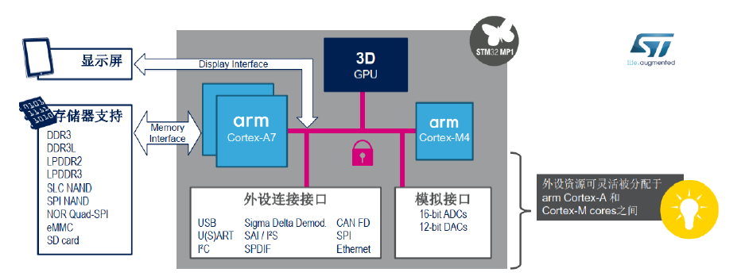
> 图：ST官方STM32MP1系列处理器结构示意图。左侧"显示屏"经 Display Interface 连接芯片，"存储器支持"经 Memory Interface 连接，支持的存储器有 DDR3、DDR3L、LPDDR2、LPDDR3、SLC NAND、SPI NAND、NOR Quad-SPI、eMMC、SD card；芯片内部包括 arm Cortex-A7、arm Cortex-M4 两个处理器子系统和 3D GPU，二者经总线互连（带锁图标，示意资源保护）；下方"外设连接接口"包括 USB、U(S)ART、I2C、Sigma Delta Demod、SAI/P S、S/PDIF、CAN FD、SPI、Ethernet，右侧"模拟接口"包括 16-bit ADCs、12-bit DACs；右下角注释"外设资源可灵活被分配于 arm Cortex-A7 和 Cortex-M4 cores 之间"。

<!-- Slide number: 10 -->
# 1.2 开发板硬件资源
存储器
片内SRAM：708KB（其中SYSRAM 256KB）
外接DDR：512MB @533MHz DRR3L
eMMC：4GB
支持SD卡

<!-- Slide number: 11 -->
# 1.2 开发板硬件资源
外设
1 路 10/100/1000 Mbps自适应以太网接口
板载 WiFi /蓝牙模组
1 个 Micro SD 卡槽接口
1 路复位按键， 1 路中断唤醒按键， 3 路板载 LED 指示
4 路 USB HOST 接口， 1 路 mini USB OTG 接口
1 路 HDMI 1.4a 接口，1 路 RGB 接口， 1 路 MIPI-DSI 接口
1 路 DVP 摄像头接口
1 路四段耳机接口
1路 SWD/JTAG 调试端口， 1 路 UART 调试端口

<!-- Slide number: 12 -->

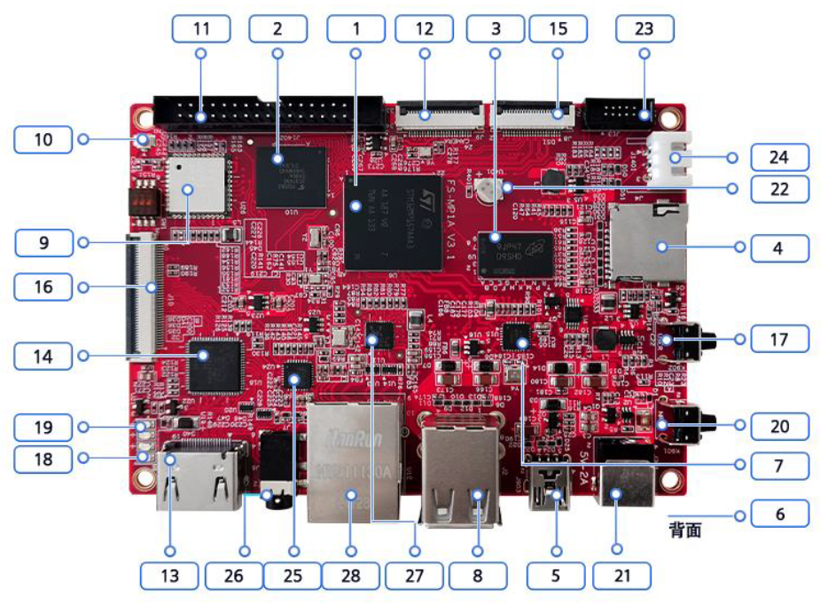
> 图：FS-MP1A开发板正面实物标注图，红色PCB上以带数字的圆角方框标注了 1、2、3、12、15、23、11（顶部一排）、10、9、16、14、19、18（左侧）、24、22、4、17、20、7、6（右侧，6位于"背面"）、13、26、25、28、27、8、5、21（底部一排）共28个部件位置，各编号含义见下一张图的图例。

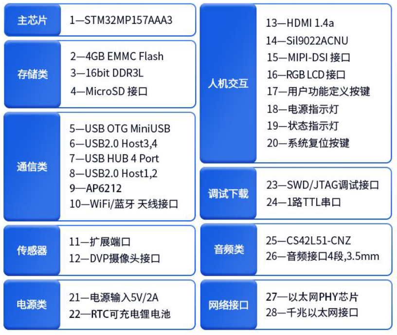
> 图：FS-MP1A开发板各标注编号的图例（分类表）：
> - 主芯片：1—STM32MP157AAA3
> - 存储类：2—4GB EMMC Flash；3—16bit DDR3L；4—MicroSD 接口
> - 通信类：5—USB OTG MiniUSB；6—USB2.0 Host3,4；7—USB HUB 4 Port；8—USB2.0 Host1,2；9—AP6212；10—WiFi/蓝牙 天线接口
> - 传感器：11—扩展端口；12—DVP摄像头接口
> - 人机交互：13—HDMI 1.4a；14—SiI9022ACNU；15—MIPI-DSI 接口；16—RGB LCD 接口；17—用户功能定义按键；18—电源指示灯；19—状态指示灯；20—系统复位按键
> - 调试下载：23—SWD/JTAG调试接口；24—1路TTL串口
> - 音频类：25—CS42L51-CNZ；26—音频接口4段,3.5mm
> - 电源类：21—电源输入5V/2A；22—RTC可充电锂电池
> - 网络接口：27—以太网PHY芯片；28—千兆以太网接口

<!-- Slide number: 13 -->
# 1.2 开发板软件资源
开发板出厂自带的部分软件如下
软件资源的详细情况，见开发板产品手册（FS-MP1A产品手册V3.pdf）

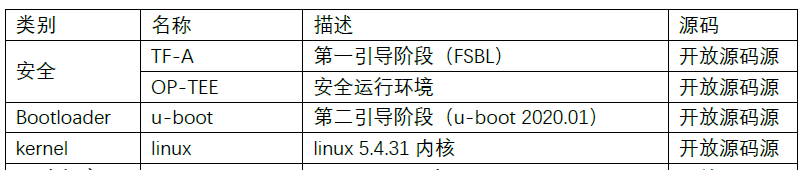
> 图：开发板出厂软件资源表（上半部分，列为"类别 / 名称 / 描述 / 源码"）：安全类——TF-A，第一引导阶段（FSBL），开放源码；OP-TEE，安全运行环境，开放源码；Bootloader——u-boot，第二引导阶段（u-boot 2020.01），开放源码；kernel——linux，linux 5.4.31 内核，开放源码。

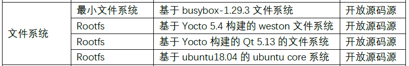
> 图：开发板出厂软件资源表（下半部分"文件系统"类，列为"类别 / 名称 / 描述 / 源码"）：最小文件系统——基于 busybox-1.29.3 文件系统；Rootfs——基于 Yocto 5.4 构建的 weston 文件系统；Rootfs——基于 Yocto 构建的 Qt 5.13 的文件系统；Rootfs——基于 ubuntu18.04 的 ubuntu core 系统；以上均为开放源码。
