<!-- Slide number: 1 -->
# 第2章 STM32MP1启动详解

<!-- Slide number: 2 -->
# 2.0 Linux系统的启动流程
任何一个嵌入式Linux系统，从系统上电开始，到进入Linux系统的用户空间，程序执行的基本流程如图所示

> 图：嵌入式Linux系统启动基本流程图（WMF矢量图）：自下而上依次为——Bootloader（BootLoader阶段，完成CPU/内存等硬件初始化，把Linux内核从Flash等外部存储设备中读入内存并启动内核）→ Linux内核（内核初始化、挂载根文件系统、启动用户空间的init进程）→ 用户空间的应用程序（根文件系统中的应用程序），即从系统上电到进入Linux用户空间的程序执行基本流程。

<!-- Slide number: 3 -->
# 2.0 Linux系统的启动流程
STM32MP1的Linux启动流程

> 图：STM32MP1的Linux启动流程图（图5.5.1 MP1 Linux 启动流程）。自下而上四个阶段：①ROM（<128KBytes）中的ROM Code——ROM代码会初始化基本的时钟、从选定的启动设备中加载FSBL代码、启动FSBL代码；②内部RAM（<256KBytes）中的First Stage Boot Loader（FSBL）——完成整个时钟树初始化、初始化DDR、从选定的驱动设备中加载SSBL代码、启动SSBL代码；③外部RAM（≥512MBytes）中的Second Stage Boot Loader（SSBL）——从外部存储设备或者网络中加载Linux系统、通过启动画面向用户反馈启动过程、启动Linux内核；④Linux内核——Linux内核初始化、挂载根文件系统、启动用户空间的init程序；最上层为Linux用户空间（也就是根文件系统里面）。图下方为上电标志，箭头自下而上表示执行顺序。

<!-- Slide number: 4 -->
# 2.1 STM32MP1启动模式
STM32MP1芯片内部有一个ROM
该ROM用于启动系统，不开放给用户使用
其中存有ST官方编写的一段程序（一般称为ROM Code），该程序用于系统的启动
该ROM的内存地址分配如图

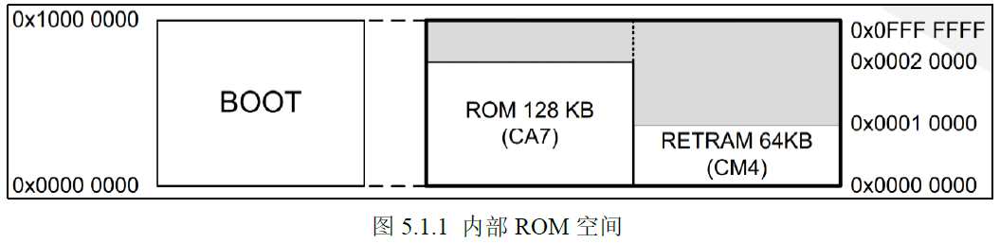
> 图：内部ROM空间（图5.1.1）。0x0000 0000~0x1000 0000 地址区间为BOOT区域（映射到0x0000 0000处）：其中ROM 128 KB（CA7，供Cortex-A7访问，地址0x0000 0000~0x0002 0000）；RETRAM 64KB（CM4，供Cortex-M4访问，地址0x0001 0000~0x0002 0000），其余为保留区域，最高地址为0x0FFF FFFF。
来源：处理器参考手册RM0436（STM32MP157-datasheet.pdf, P157）

<!-- Slide number: 5 -->
# 2.1 STM32MP1启动模式
STM32MP157A的内存映射如下图

<!-- Slide number: 6 -->

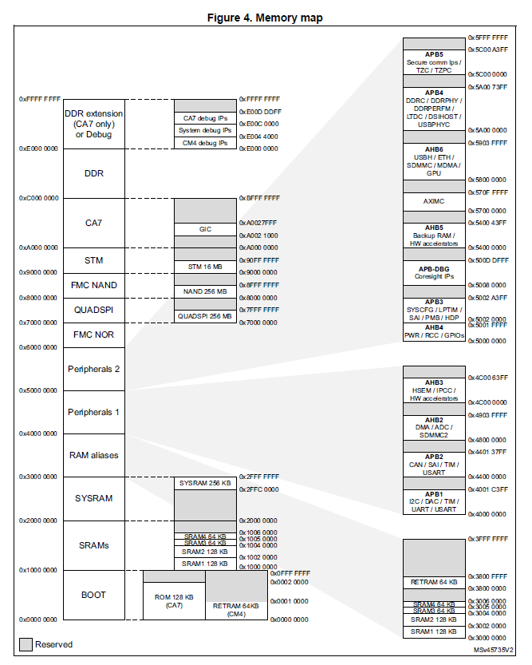
> 图：STM32MP157内存映射图（Memory map）。左侧主地址空间自下而上：0x0000 0000 BOOT区（内含ROM 128 KB（CA7）和RETRAM 64KB（CM4））、0x1000 0000 SRAMs（SRAM1 128 KB@0x1000 0000、SRAM2 128 KB@0x1002 0000、SRAM3 64 KB@0x1004 0000、SRAM4 64 KB@0x1005 0000）、0x2000 0000 SYSRAM（SYSRAM 256 KB，0x2FFC 0000~0x2FFF FFFF）、0x3000 0000 RAM aliases、0x4000 0000 Peripherals 1、0x5000 0000 Peripherals 2、0x6000 0000 FMC NOR、0x7000 0000 QUADSPI（QUADSPI 256 MB）、0x8000 0000 FMC NAND（NAND 256 MB）、0x9000 0000 STM（STM 16 MB）、0xA000 0000 CA7（GIC：0xA002 1000~0xA003 2FFF）、0xC000 0000 DDR、0xE000 0000 DDR extension (CA7 only) or Debug（CA7 debug IPs、System debug IPs、CM4 debug IPs）；右侧为AHB/APB各总线外设的细分地址分配（APB1、APB2、APB3、AHB2、AHB3、AHB4、AHB5、AXIMC、AHB6等，直到0x8FFF FFFF）。灰色为保留（Reserved）区域。

<!-- Slide number: 7 -->
# 2.1 STM32MP1启动模式
处理器上电时，Cortex-A7 Core0首先开始工作（Core1、M4-Core由Core0通过程序启动）
ARM处理器上电执行的第一条指令地址始终为0x00000000
因此，开发板上电启动时，首先执行该ROM中的程序

> 图：内部ROM空间（图5.1.1）。BOOT区域被映射到0x0000 0000起始处：ROM 128 KB（CA7，0x0000 0000~0x0002 0000）和RETRAM 64KB（CM4，0x0001 0000~0x0002 0000）。由于ARM处理器上电执行的第一条指令地址始终为0x00000000，因此上电后Cortex-A7 Core0首先执行的就是这片ROM中的ROM Code。

<!-- Slide number: 8 -->
# 2.1 STM32MP1启动模式
STM32MP1支持从多种设备启动
EMMC、 SD、 NAND、 NOR、 USB、 UART等
处理器芯片有3个BOOT引脚（如图）
通过设置3个引脚高/低电平的值，来选择启动设备
通过开发板上的拨码开关可以设置引脚的电平（ON=1，OFF=0）
来源：开发板原理图（FS-MP1A原理图 V3.1(2022.03.10).pdf, P14）
BOOT原理图

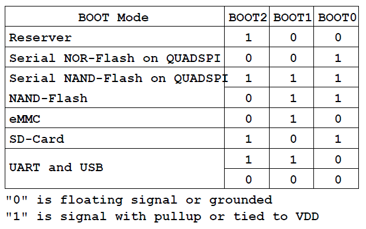
> 图：BOOT启动模式设置表。BOOT Mode与BOOT2/BOOT1/BOOT0三个引脚电平的对应关系：Reserver（保留）=100；Serial NOR-Flash on QUADSPI=001；Serial NAND-Flash on QUADSPI=111；NAND-Flash=011；eMMC=010；SD-Card=101；UART and USB=110或000。表下方注释："0" is floating signal or grounded（"0"为悬空或接地）；"1" is signal with pullup or tied to VDD（"1"为上拉或接VDD）。

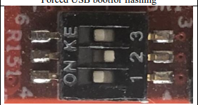
> 图：开发板上启动模式拨码开关实物照片。红色PCB上为一个3位拨码开关，丝印标注"ON"方向及"KE""123"字样，图中开关处于全OFF（1、2、3均拨到OFF侧）状态，照片上方文字为"Forced USB bootor flashing"（即000=UART and USB强制USB烧写启动模式）。拨码开关ON=1、OFF=0，用于设置BOOT0~BOOT2引脚电平。

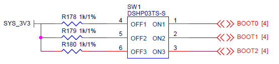
> 图：BOOT拨码开关原理图。SYS_3V3电源经三个1k/1%的上拉电阻R178、R179、R180分别接至拨码开关SW1（型号DSH03TS-S）的第4、5、6脚（OFF1/ON1、OFF2/ON2、OFF3/ON3），开关另一侧输出三个网络BOOT0 [4]、BOOT1 [4]、BOOT2 [4]，即通过拨动开关选择各BOOT引脚接3.3V（ON=1，经上拉到VDD）或接地/悬空（OFF=0）。

<!-- Slide number: 9 -->
# 2.1 STM32MP1启动流程
当BOOT0~BOOT2取不同值时，ROM Code会从不同的设备把程序加载到片内SDRAM中执行，实现从不同设备启动

> 图：BOOT启动模式设置表。列出BOOT2、BOOT1、BOOT0三位取值对应的启动设备：001=Serial NOR-Flash on QUADSPI；111=Serial NAND-Flash on QUADSPI；011=NAND-Flash；010=eMMC；101=SD-Card；110/000=UART and USB；100=Reserver（保留）。并注明"0"为悬空或接地电平、"1"为上拉或接VDD电平。

<!-- Slide number: 10 -->
# 2.1 STM32MP1启动流程
ROM Code支持的功能有
Secure boot（安全启动），不管是串行启动(UART或USB）还是从 Flash 启动，启动Linux就是用的该启动方式
Engineering boot，当 BOOT2~BOOT0 设置为 100 的时候，就可以通过 STLINK 访问 A7 或者 M4 内核，一般是通过此方法来调试 M4 内核代码
Secondary core boot，启动A7 Core1。上电时只会启动A7 Core0，Core1在执行死循环。启动Core1需执行额外程序
RMA (Return Material Analysis) boot
低功耗唤醒
提供安全相关服务

<!-- Slide number: 11 -->

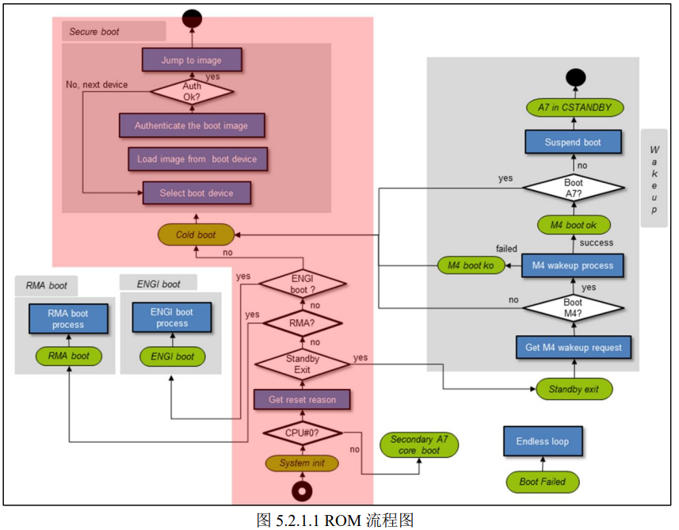
> 图：ROM Code启动流程图（图5.2.1.1 ROM 流程图）。中央竖列（红色高亮，即上电启动流程）：System init（系统初始化）→ CPU#0?（判断是否为CPU0，否→走Secondary A7 core boot启动第二个A7核）→ Get reset reason（获取复位原因）→ StandBy Exit? → RMA? → ENGI boot?（是→ENGI boot process，即Engineering boot流程）→ 各判断均为否则进入Cold boot（冷启动）→ Select boot device（选择启动设备）→ Load image from boot device（从启动设备加载镜像）→ Authenticate the boot image（对启动镜像鉴权）→ Auth Ok?（鉴权是否成功：否→No, next device，返回重新选择下一个启动设备；是→Jump to image，跳转到镜像执行）。左下角为RMA boot分支（RMA boot process→RMA boot）。右侧灰色区域为唤醒/M4相关流程：Get M4 wakeup request → Boot M4?（是→M4 wakeup process，failed则M4 boot ko/Boot Failed→Endless loop死循环；success则M4 boot ok）→ Boot A7?（no→Suspend boot；yes→A7 in CSTANDBY/Wakeup）→ Standby exit分支。其中红色部分（Cold boot到Jump to image的Secure boot安全启动分支）是上电启动的流程。
其中红色部分是上电启动的流程

<!-- Slide number: 12 -->
# 2.1 STM32MP1启动流程
Bootloader启动的两个阶段
在安全启动流程中，ROM Code将启动Bootloader
Bootloader可分为FSBL和SSBL两个文件
FSBL（First Stage Boot Loader）是第一阶段启动文件
SSBL（Second Stage Boot Loader）是第二阶段启动文件
FSBL加载到片内SRAM运行，它完成一些系统初始的工作，特别是DRAM的初始化，为SSBL准备好环境
SSBL加载到DRAM运行

<!-- Slide number: 13 -->
# 2.1 STM32MP1启动流程
当设置BOOT引脚，从Flash（如eMMC、SD卡、NAND或NOR等）启动系统时，则进入安全启动流程
安全启动的基本流程为：
ROM Code把FSBL加载到SYSRAM
对FSBL镜像文件进行鉴权
如果鉴权成功，则跳转到FSBL的入口，开始执行FSBL

<!-- Slide number: 14 -->
# 2.1 STM32MP1启动流程
片内SRAM
ROM Code并没有对DRAM进行初始化，因此FSBL无法在DRAM中运行
在处理器内部有一个直接可用的256KB的片内SRAM（称为SYSRAM），FSBL加载到此存储器中运行
SYSRAM的地址范围是0x2FFC 0000~0x2FFF FFFF

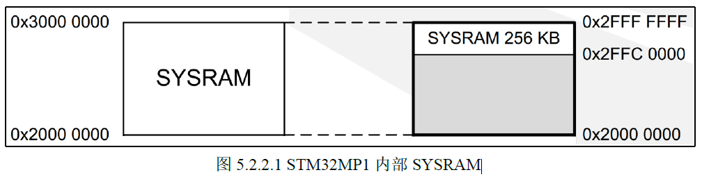
> 图：STM32MP1内部SYSRAM存储映射（图5.2.2.1 STM32MP1 内部 SYSRAM）。左侧0x2000 0000~0x3000 0000为SYSRAM所在地址段，实际映射的是其中末尾的SYSRAM 256 KB，地址范围为0x2FFC 0000~0x2FFF FFFF，FSBL即加载到这片片内SRAM（SYSRAM）中运行。

<!-- Slide number: 15 -->
# 2.2 Bootloader第一阶段
FSBL镜像文件
FSBL的镜像文件被ROM Code加载到0x2FFC 2400
此镜像文件包含256（0x100）字节的文件头，因此FSBL镜像文件的程序起始地址为0x2FFC 2500
FSBL镜像文件鉴权成功后将跳转到0x2FFC 2500执行
由以上信息可知，FSBL镜像文件的大小不能超过：0x3000 0000 – 0x2FFC 2400 = 0x3 DC00 = 247KB

> 图：STM32MP1内部SYSRAM存储映射（图5.2.2.1）。SYSRAM 256 KB位于0x2FFC 0000~0x2FFF FFFF。FSBL镜像文件被ROM Code加载到0x2FFC 2400处，由此到SYSRAM末尾（0x3000 0000）的剩余空间247KB即为FSBL镜像文件的最大允许大小。

<!-- Slide number: 16 -->
# 2.2 Bootloader第一阶段
FSBL镜像文件的构成
FSBL镜像文件由文件头( STM32 Header)和二进制程序(Binary)构成
其中Binary可以是：
Uboot的SPL（Security Program Loader）的bin文件（但该文件无法在本开发板上启动Linux内核）
TF-A的bin文件（可启动Linux内核）
A7裸机程序（用于运行无操作系统的程序）
其中STM32 Header：
描述了FSBL文件的相关信息
文件头由ST官方提供的工具生成（源文件：<u-boot source>/tools/stm32image.c)
Header中包含了签名、公钥等信息，用于鉴权，实现安全启动

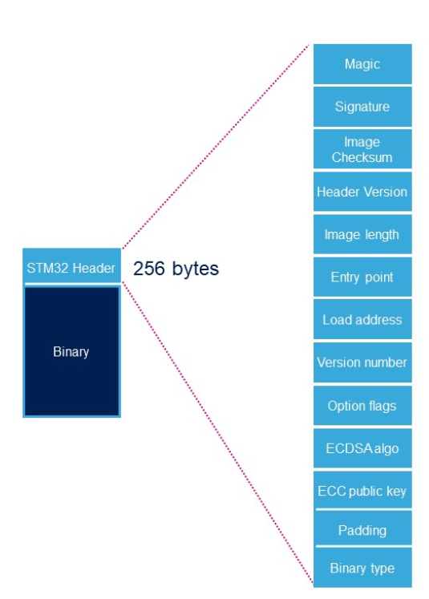
> 图：FSBL镜像文件构成图。FSBL镜像文件由两部分组成：头部的STM32 Header（256 bytes）和其后的Binary（二进制程序）。展开的STM32 Header从上到下包含字段：Magic、Signature、Image Checksum、Header Version、Image length、Entry point、Load address、Version number、Option flags、ECDSAalgo、ECC public key、Padding、Binary type。
FSBL镜像文件
来源： https://wiki.stmicroelectronics.cn/stm32mpu/wiki/STM32_header_for_binary_files#cite_note-21

<!-- Slide number: 17 -->
# 2.2 Bootloader第一阶段
STM32 Header为256字节，包含的字段如下

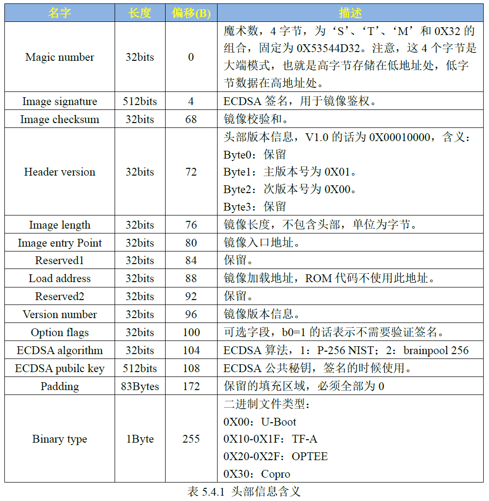
> 图：STM32 Header各字段含义表（表5.4.1 头部信息含义），列为字段"名字"、"长度"、"偏移(B)"、"描述"：Magic number，32bits，偏移0，魔术数4字节为'S'、'T'、'M'和0X32的组合，固定为0X53544D32（大端模式，高字节存储在低地址处）；Image signature，512bits，偏移4，ECDSA签名，用于镜像鉴权；Image checksum，32bits，偏移68，镜像校验和；Header version，32bits，偏移72，头部版本信息，V1.0为0X00010000（Byte0保留、Byte1主版本号0X01、Byte2次版本号0X00、Byte3保留）；Image length，32bits，偏移76，镜像长度（不包含头部，单位字节）；Image entry Point，32bits，偏移80，镜像入口地址；Reserved1，32bits，偏移84，保留；Load address，32bits，偏移88，镜像加载地址，ROM代码不使用此地址；Reserved2，32bits，偏移92，保留；Version number，32bits，偏移96，镜像版本信息；Option flags，32bits，偏移100，可选字段，b0=1表示不需要验证签名；ECDSA algorithm，32bits，偏移104，ECDSA算法：1=P-256 NIST、2=brainpool 256；ECDSA pbulic key，512bits，偏移108，ECDSA公共秘钥，签名的时候使用；Padding，83Bytes，偏移172，保留的填充区域，必须全部为0；Binary type，1Byte，偏移255，二进制文件类型：0X00=U-Boot、0X10-0X1F=TF-A、0X20-0X2F=OPTEE、0X30=Copro。

> 图：FSBL镜像文件构成示意图：STM32 Header（256 bytes）+ Binary（二进制程序），STM32 Header展开为Magic、Signature、Image Checksum、Header Version、Image length、Entry point、Load address、Version number、Option flags、ECDSAalgo、ECC public key、Padding、Binary type等字段。

<!-- Slide number: 18 -->
# 2.3 Flash设备启动要求
STM32MP1支持从 SD、 eMMC、 NAND或 NOR等 Flash设备启动（但是不同的Flash设备在启动时有一些差异）
传统的嵌入式Linux系统包括：bootloader、Linux kernel和rootfs三大组件
而STM32MP1，还需要TF-A、TEE等组件（用于系统安全）
这些组件需要分别烧写到Flash的不同分区
ST官方给出了Flash分区建议

<!-- Slide number: 19 -->

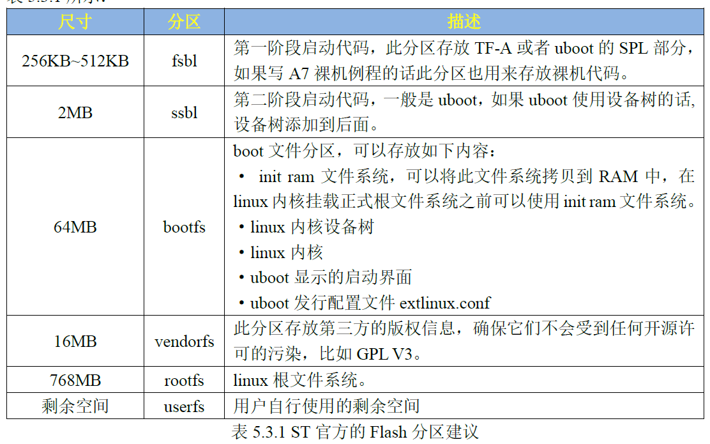
> 图：ST官方的Flash分区建议表（表5.3.1，列为"尺寸"、"分区"、"描述"）：fsbl，256KB~512KB，第一阶段启动代码，此分区存放TF-A或者uboot的SPL部分，如果写A7裸机例程的话此分区也用来存放裸机代码；ssbl，2MB，第二阶段启动代码，一般是uboot，如果uboot使用设备树的话设备树添加到后面；bootfs，64MB，boot文件分区，可以存放：init ram文件系统（可以将此文件系统拷贝到RAM中，在linux内核挂载正式根文件系统之前可以使用init ram文件系统）、linux内核设备树、linux内核、uboot显示的启动界面、uboot发行配置文件extlinux.conf；vendorfs，16MB，此分区存放第三方的版权信息，确保它们不会受到任何开源许可的污染，比如GPL V3；rootfs，768MB，linux根文件系统；userfs，剩余空间，用户自行使用的剩余空间。

<!-- Slide number: 20 -->
# 2.3 Flash设备启动要求
从eMMC启动
eMMC在物理结构上有 boot1、boot2、RPMB(Replay Protected Memory Block)、GPP(General Purpose Partitions，GPP 最多 4 个分区)、 UDA(User Data Area)这五种分区
boot1、boot2、RPMB三个分区大小固定，用户不能修改
通常情况下，用户使用的都是UDA分区

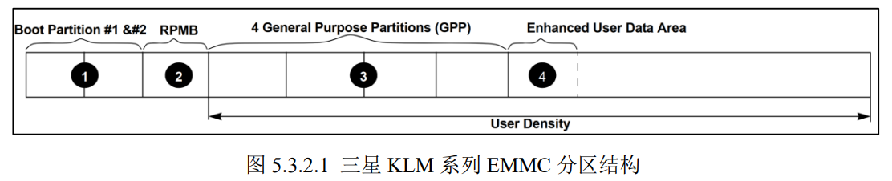
> 图：三星KLM系列EMMC分区结构图（图5.3.2.1）。从左到右依次为：①Boot Partition #1 &#2（boot1、boot2两个启动分区）；②RPMB；③4 General Purpose Partitions（GPP，通用用途分区，最多4个）；④Enhanced User Data Area（增强型用户数据区）。③④两区域合起来标注为User Density（用户容量）。

<!-- Slide number: 21 -->
# 2.3 Flash设备启动要求
从eMMC启动
ST使用eMMC的boot1和boot2这两个分区作为FSBL，但是同一时间只有一个有效，ROM Code会加载有效的那个FSBL
默认情况下ROM  Code使用连接到 SDMMC2 控制器上的eMMC

<!-- Slide number: 22 -->
# 2.3 Flash设备启动要求
从SD卡启动
SD卡没有boot1和boot2这样的物理分区
ROM Code会在SD卡上查找GPT分区：
先按分区名字查找，查找以“fsbl”开头的两个分区作为放置FSBL的分区
如果没找到，则继续按物理地址查找分区，两个分区的地址分别为LBA34和LBA546
LBA(Logical Block Address)表示SD卡的存储块，一个LBA的大小为512字节，因此地址LBA34=34*512=17408=0X4400，地址LBA546=546*512=279552=0X44400
和eMMC类似，SD卡中两个FSBL分区也只有一个有效，另一个作备用
ROM Code默认使用连接到SDMMC1控制器上的SD卡
