<!-- Slide number: 1 -->
# 第3章 移植U-Boot

<!-- Slide number: 2 -->
# 3.1 Bootloader 简介
Bootloader
系统启动初期执行的一段小程序，它对硬件初始化（如关闭看门狗、关闭中断、设置系统时钟、初始化存储控制器等，其中部分初始化功能也可能由ROM Code完成），准备好软件环境，最后调用操作系统内核
可带有一些开发用的增强功能（如支持网络、支持通过串口或网络下载文件、烧写文件等），这种Bootloader也称Monitor
非常依赖具体硬件，需要针对硬件进行开发或移植

<!-- Slide number: 3 -->
# 3.1 Bootloader 简介
Bootloader启动后，有两种操作模式：
启动加载（Boot loading）模式：直接加载操作系统，该模式用于最终产品
下载（Downloading）模式：可使用各种命令从主机下载文件、烧写文件，该模式用于开发
通常两种模式之间可以切换

<!-- Slide number: 4 -->
# 3.1 Bootloader 简介
Bootloader与内核的交互
Bootloader与内核的交互是单向的（内核启动后将不会再返回Bootloader）
Bootloader向内核传递启动参数的方式：
对于不支持设备树的Linux内核， Bootloader将启动参数放在内存中约定的地方，内核启动后从这里获取参数
对于支持设备树的Linux内核， Bootloader会把启动参数放在设备树中（在设备树的chosen节点下添加一个bootargs属性，属性的值即是启动参数）

<!-- Slide number: 5 -->
# 3.1 Bootloader 简介
常用Linux引导程序

> 图：表格“表15.1 开源源码的Linux引导程序”，逐行列出各Bootloader及其是否为Monitor、描述和对x86/ARM/PowerPC的支持：LILO（否，Linux磁盘引导程序，x86）；GRUB（否，GNU的LILO替代程序，x86）；Loadin（否，从DOS引导Linux，x86）；ROLO（否，从ROM引导Linux而不需要BIOS，x86）；Etherboot（否，通过以太网卡启动Linux系统的固件，x86）；LinuxBIOS（否，完全替代BIOS的Linux引导程序，x86）；BLOB（是，LART等硬件平台的引导程序，ARM）；U-Boot（是，通用引导程序，x86/ARM/PowerPC均支持）；RedBoot（是，基于eCos的引导程序，x86/ARM/PowerPC均支持）；Vivi（是，Mizi公司针对SAMSUNG的ARM CPU设计的引导程序，ARM）。

<!-- Slide number: 6 -->
# 3.2 U-Boot简介
U-Boot简介
U-Boot (Universal Boot Loader)，是遵循GPL条款的开源项目
其前身是德国DENX软件工程中心基于8xxROM的源码创建的PPCBOOT项目（只支持PowerPC架构的CPU）
后增加对其他架构CPU及多种开发板的支持，并增加更多功能（如启动Linux、网络启动等），更名为U-Boot

<!-- Slide number: 7 -->
# 3.2 U-Boot简介
U-Boot特性

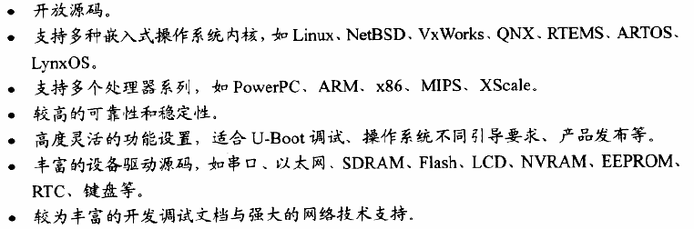
> 图：U-Boot特性列表（一）：开放源码；支持多种嵌入式操作系统内核，如Linux、NetBSD、VxWorks、QNX、RTEMS、ARTOS、LynxOS；支持多个处理器系列，如PowerPC、ARM、x86、MIPS、XScale；较高的可靠性和稳定性；高度灵活的功能设置，适合U-Boot调试、操作系统不同引导要求、产品发布等；丰富的设备驱动源码，如串口、以太网、SDRAM、Flash、LCD、NVRAM、EEPROM、RTC、键盘等；较为丰富的开发调试文档与强大的网络技术支持。

<!-- Slide number: 8 -->
# 3.2 U-Boot简介
U-Boot特性

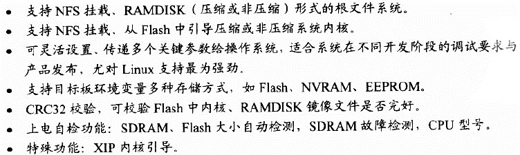
> 图：U-Boot特性列表（二）：支持NFS挂载、RAMDISK（压缩或非压缩）形式的根文件系统；支持NFS挂载，从Flash中引导压缩或非压缩系统内核；可灵活设置、传递多个关键参数给操作系统，适合系统在不同开发阶段的调试要求与产品发布，尤其对Linux支持最为强劲；支持目标板环境变量多种存储方式，如Flash、NVRAM、EEPROM；CRC32校验，可校验Flash中内核、RAMDISK镜像文件是否完好；上电自检功能：SDRAM、Flash大小自动检测，SDRAM故障检测，CPU型号；特殊功能：XIP内核引导。

<!-- Slide number: 9 -->
#

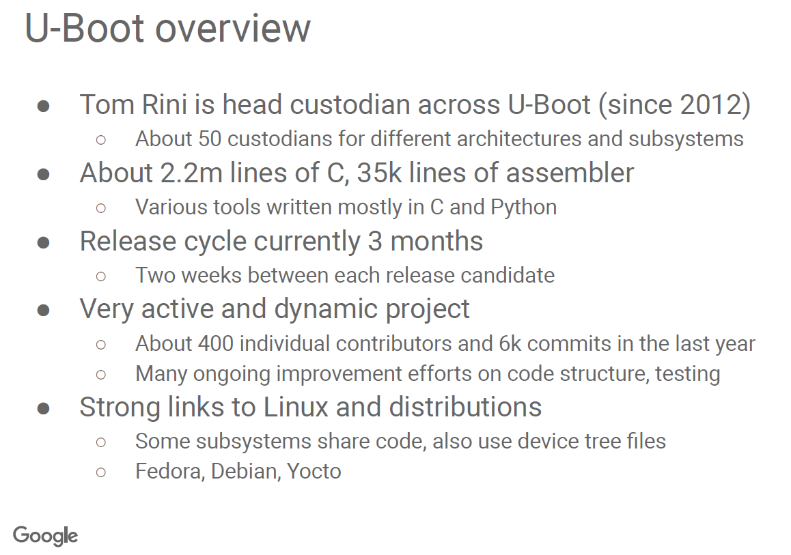
> 图：Google演示文稿页面“U-Boot overview”：Tom Rini自2012年起是U-Boot的total custodian，各架构和子系统约50名custodian；约220万行C代码、3.5万行汇编代码（各种工具大多用C和Python编写）；发布周期目前为3个月，每个release candidate间隔两周；非常活跃和动态的项目——最近一年约400名个人贡献者、6000次提交，代码结构、测试方面有许多持续的改进工作；与Linux及各发行版联系紧密——部分子系统共享代码、也使用设备树文件，如Fedora、Debian、Yocto。

<!-- Slide number: 10 -->

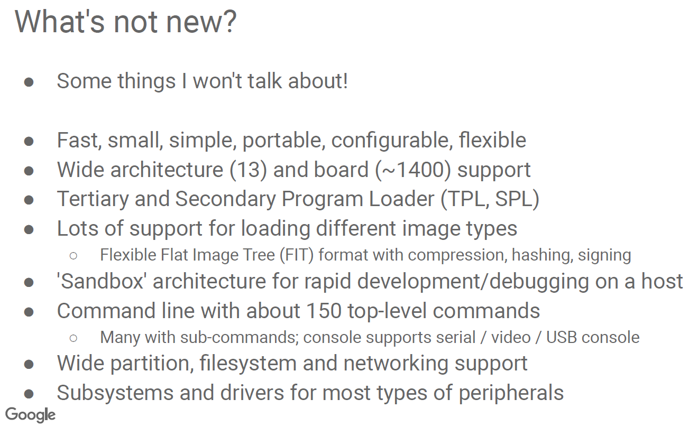
> 图：Google演示文稿页面“What's not new?”：一些不会展开讲的内容——快速、小巧、简单、可移植、可配置、灵活；广泛的架构（13种）和开发板（约1400块）支持；第三级和第二级程序加载器（TPL、SPL）；对加载多种镜像类型的大量支持（支持压缩、哈希、签名的Flexible Flat Image Tree (FIT)格式）；用于在宿主机上快速开发/调试的'Sandbox'架构；带约150个顶层命令的命令行（许多带子命令，控制台支持串口/视频/USB）；广泛的分区、文件系统和网络支持；大多数类型外设的子系统和驱动。

<!-- Slide number: 11 -->
#

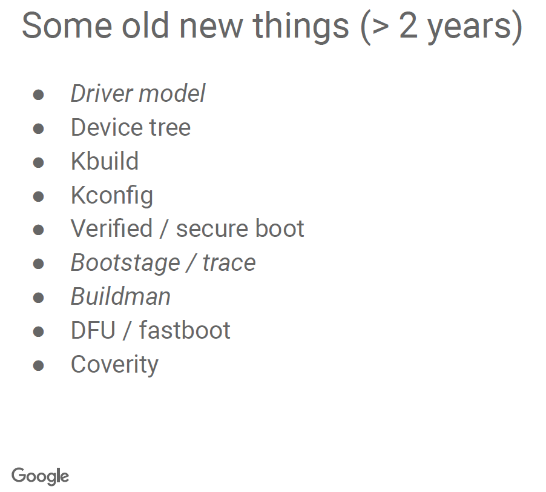
> 图：Google演示文稿页面“Some old new things (> 2 years)”：两年以上前引入的机制列表——Driver model（驱动模型）、Device tree（设备树）、Kbuild、Kconfig、Verified / secure boot（验证/安全启动）、Bootstage / trace、Buildman、DFU / fastboot、Coverity。

<!-- Slide number: 12 -->
#

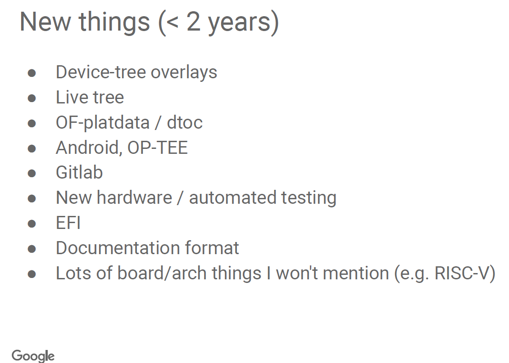
> 图：Google演示文稿页面“New things (< 2 years)”：两年内的新特性列表——Device-tree overlays（设备树叠加层）、Live tree、OF-platdata / dtoc、Android与OP-TEE、Gitlab、新硬件/自动化测试、EFI、文档格式，以及许多不会提到的board/arch相关内容（如RISC-V）。

<!-- Slide number: 13 -->
# 3.2 U-Boot简介
U-boot的源码可从其官方git仓库下载（地址： https://source.denx.de/u-boot/u-boot ），或者从官方ftp下载（地址： https://ftp.denx.de/pub/u-boot/）
官方源码是给半导体厂商使用的，半导体厂商会在官方源码的基础上添加自家芯片的支持，形成自己的定制版本，维护自己的定制版本
官方源码中一般也会支持各半导体厂商的芯片，但是绝对是没有半导体厂商自己维护的 u-boot 全面
ST在官方2020.01-r0版本的基础上，定制形成了自己的版本，支持STM32MP1系列芯片，

> 图：终端截图，在目录~/linux/atk-mp1/stm32mp1-openstlinux-5.4-dunfell-mp1-20-06-24/sources/arm-ostl-linux-gnueabi下执行ls，列出linux-stm32mp-5.4.31-r0、tf-a-stm32mp-2.2.r1-r0、u-boot-stm32mp-2020.01-r0（红框标出）、optee-os-stm32mp-3.9.0.r1-r0、tf-a-stm32mp-sp2.2-r1-r0，即ST SDK解压后sources目录下的内核、TF-A、U-Boot、OP-TEE源码包。

<!-- Slide number: 14 -->
# 3.2 U-Boot简介
半导体厂商维护的u-boot只支持自家的评估板，开发板厂商会在此基础上进行修改，支持自己的开发板
例如，本课程使用的FS-MP1A开发板的出厂u-boot，是华清远见在ST提供的u-boot源码基础上修改得到支持FS-MP1A开发板的u-boot
本课程将基于ST提供的源码进行修改，实现对FS-MP1A开发板的支持（基于ST的stm32mp157a-dk1开发板代码修改）

> 图：表格“表10.1.1 三种uboot的区别”，三行：“uboot官方的uboot代码——由uboot官方维护开发的uboot版本，版本更新快，基本包含所有常用的芯片”；“半导体厂商的uboot代码——半导体厂商维护的一个uboot，专门针对自家的芯片，在对自家芯片支持上要比uboot官方的好”；“开发板厂商的uboot代码——开发板厂商在半导体厂商提供的uboot基础上加入了对自家开发板的支持”。

<!-- Slide number: 15 -->
# 3.3 U-Boot工程目录分析
打完ST补丁的uboot目录（未编译）如下所示

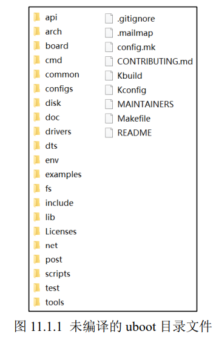
> 图：“图11.1.1 未编译的uboot目录文件”：文件夹api、arch、board、cmd、common、configs、disk、doc、drivers、dts、env、examples、fs、include、lib、Licenses、net、post、scripts、test、tools；文件.gitignore、.mailmap、config.mk、CONTRIBUTING.md、Kbuild、Kconfig、MAINTAINERS、Makefile、README。

<!-- Slide number: 16 -->
# 3.3 U-Boot工程目录分析
对uboot进行编译后，工程目录如下所示

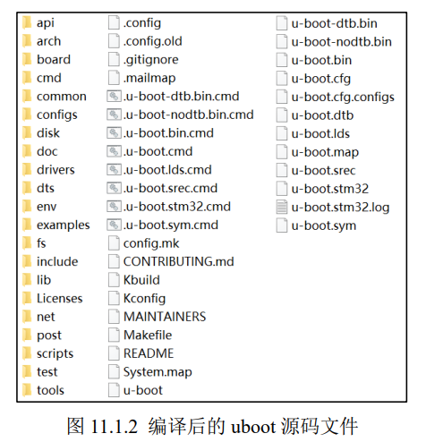
> 图：“图11.1.2 编译后的uboot源码文件”：相比编译前新增了config、.config.old、u-boot、System.map，以及一系列编译生成的文件：u-boot-dtb.bin、u-boot-nodtb.bin、u-boot.bin、u-boot.cfg、u-boot.cfg.configs、u-boot.dtb、u-boot.lds、u-boot.map、u-boot.srec、u-boot.stm32、u-boot.stm32.log、u-boot.sym，及对应的u-boot-dtb.bin.cmd、u-boot-nodtb.bin.cmd、u-boot.bin.cmd、u-boot.cmd、u-boot.lds.cmd、u-boot.srec.cmd、u-boot.stm32.cmd、u-boot.sym.cmd命令文件。

<!-- Slide number: 17 -->

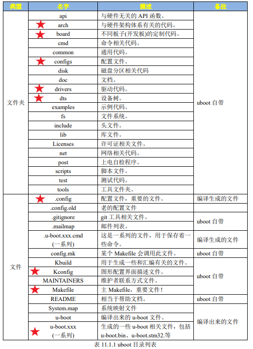
> 图：表格“表11.1.1 uboot目录列表”（带红五角星的为重要项）。文件夹（备注“uboot自带”）：api（与硬件无关的API函数）、arch（与硬件架构体系有关的代码）、board（不同板子(开发板)的定制代码）、cmd（命令相关代码）、common（通用代码）、configs（配置文件）、disk（磁盘分区相关代码）、doc（文档）、drivers（驱动代码）、dts（设备树）、examples（示例代码）、fs（文件系统）、include（头文件）、lib（库文件）、Licenses（许可证相关文件）、net（网络相关代码）、post（上电自检程序）、scripts（脚本文件）、test（测试代码）、tools（工具文件夹）。文件：.config（配置文件，重要的文件，编译生成的文件）、.config.old（老的配置文件）、.gitignore（git工具相关文件，uboot自带）、.mailmap（邮件列表，uboot自带）、u-boot.xxx.cmd（一系列，用于保存着一些命令，编译生成的文件）、config.mk（某个Makefile会调用此文件，uboot自带）、Kbuild（用于生成一些和汇编有关的文件）、Kconfig（图形配置界面描述文件，uboot自带）、MAINTAINERS（维护者联系表文件，uboot自带）、Makefile（主Makefile，重要文件！）、README（相当于帮助文档，uboot自带）、System.map（系统映射文件）、u-boot（编译出来的u-boot文件，编译出来的文件）、u-boot.xxx（一系列，生成的一些u-boot相关文件，包括u-boot.bin、u-boot.stm32等）。

<!-- Slide number: 18 -->
# 3.3 U-Boot工程目录分析
arch目录
存放处理器架构相关的文件
我们使用的是arm处理器，只关注arm目录即可

> 图：“图11.1.3 arch文件夹”：arch目录下按处理器架构分类的子目录arc、arm、m68k、microblaze、mips、nds32、nios2、powerpc、riscv、sandbox、sh、x86、xtensa（均为文件夹），以及.gitignore文件和Kconfig文件（时间戳2020-11-10）。

<!-- Slide number: 19 -->
# 3.3 U-Boot工程目录分析
在arch/arm目录下有“mach-”开头的目录，它与具体的处理器系列有关，对于我们使用的STM32MP1处理器，对应的目录为“mach-stm32mp”

> 图：“图11.1.4 arm文件夹”：arch/arm目录下的cpu、dts、include、lib文件夹，以及“mach-”开头、与具体处理器系列对应的目录mach-aspeed、mach-at91、mach-bcm283x、mach-bcmstb、mach-davinci、mach-exynos、mach-highbank、mach-imx、mach-integrator、mach-k3、mach-keystone等（时间戳2020-11-10，图中列表未截全）。

<!-- Slide number: 20 -->
# 3.3 U-Boot工程目录分析
arch/arm目录下的“cpu”目录与处理器内核架构（指令集本版）相关
STM32MP1处理器为Cortex-A7内核（armv7指令集），只关注“armv7”目录即可

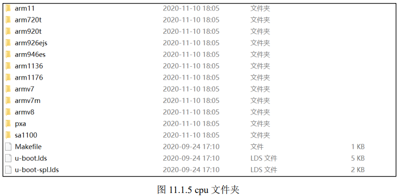
> 图：“图11.1.5 cpu文件夹”：arch/arm/cpu目录下按内核架构（指令集版本）分类的子目录arm11、arm720t、arm920t、arm926ejs、arm946es、arm1136、arm1176、armv7、armv7m、armv8、pxa、sa1100，以及Makefile、u-boot.lds、u-boot-spl.lds文件。

<!-- Slide number: 21 -->
# 3.3 U-Boot工程目录分析
arch/arm目录下的“dts”目录存放了设备树文件
较新版本的u-boot已支持设备树
每一款开发板有自己的设备树文件，设备树文件描述了该开发板有哪些设备驱动，以及各驱动的配置参数

> 图：arch/arm/dts目录下的设备树文件（列表片段）：stm32mp157a-ev1.dts、stm32mp157a-ev1-u-boot.dtsi、stm32mp157a-fsmp1a.dtb、stm32mp157a-fsmp1a.dts、stm32mp157a-fsmp1a-u-boot.dtsi、stm32mp157c-dk2.dtb、stm32mp157c-dk2.dts等，可见每款开发板都有自己的.dts/.dtsi设备树文件（及编译生成的.dtb）。
dts文件夹

<!-- Slide number: 22 -->
# 3.3 U-Boot工程目录分析
board目录
和具体的开发板相关，例如其中的st子目录是基于st公司的处理器制作的开发板

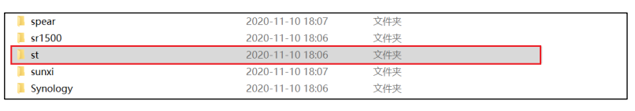
> 图：board目录下的开发板厂商子目录列表（片段）：spear、sr1500、st（红框标出）、sunxi、Synology，其中st目录即基于ST公司处理器制作的开发板目录。
board文件夹

<!-- Slide number: 23 -->
# 3.3 U-Boot工程目录分析
configs目录
存放了开发板的配置，每一款开发板都有自己的一个配置文件（文件名为：xxx_defconfig，其中xxx表示开发板的名字）

> 图：configs目录下各开发板的默认配置文件列表（片段）：spear600_usbtty_defconfig、spear600_usbtty_nand_defconfig、spring_defconfig、stih410-b2260_defconfig、stm32f429-discovery_defconfig、stm32f429-evaluation_defconfig、stm32f469-discovery_defconfig、stm32f746-disco_defconfig、stm32f769-disco_defconfig、stm32h743-disco_defconfig、stm32h743-eval_defconfig、stm32mp15_basic_defconfig、stm32mp15_dhcom_basic_defconfig、stm32mp15_fsmp1a_basic_defconfig、stm32mp15_fsmp1a_trusted_defconfig（选中高亮）、stm32mp15_trusted_defconfig、stmark2_defconfig。
configs文件夹

<!-- Slide number: 24 -->
# 3.3 U-Boot工程目录分析
早期版本的u-boot，都是直接修改配置文件（路径：<u-boot source>/include/configs/xxx.h）实现对开发板配置的修改
较新版本的u-boot，通过以下命令，把一款开发板的默认配置文件“xxx_defconfig”复制为工程顶层目录下的“.config”文件
         make xxx_defconfig
然后使用以下命令，进入图形化界面对开发板进行配置（修改记录在“.config”文件中）
         make menuconfig

<!-- Slide number: 25 -->
# 3.3 U-Boot工程目录分析
Kconfig文件
该文件用于生成图形化配置界面所显示的配置项
在各级子目录下也有Kconfig文件

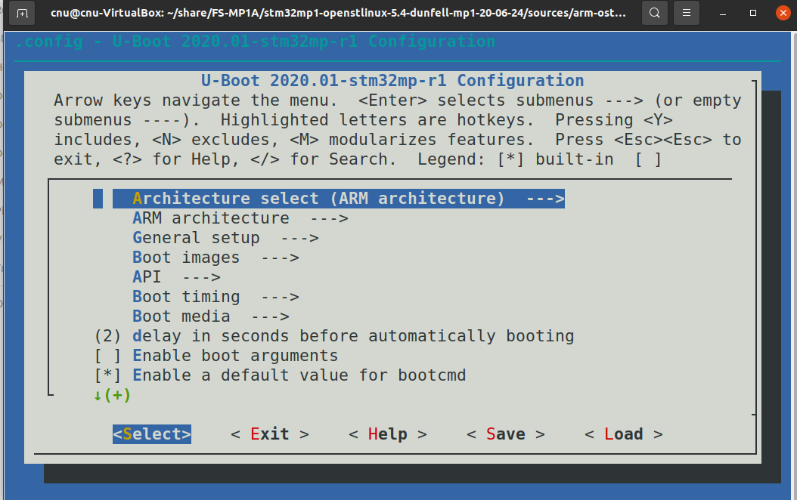
> 图：make menuconfig打开的图形化配置界面（VirtualBox终端，标题“.config - U-Boot 2020.01-stm32mp-r1 Configuration”，路径~/share/FS-MP1A/stm32mp1-openstlinux-5.4-dunfell-mp1-20-06-24/sources/arm-ostl...），标题为“U-Boot 2020.01-stm32mp-r1 Configuration”，菜单项：Architecture select (ARM architecture) --->（当前高亮）、ARM architecture --->、General setup --->、Boot images --->、API --->、Boot timing --->、Boot media --->、(2) delay in seconds before automatically booting、[ ] Enable boot arguments、[*] Enable a default value for bootcmd；底部按钮<Select>、<Exit>、<Help>、<Save>、<Load>。
图形化配置界面。其中的内容均根据Kconfig文件生成

<!-- Slide number: 26 -->
# 3.3 U-Boot工程目录分析
Makefile文件
在顶层目录和各级子目录下都有Makefile文件
顶层Makefile控制整个工程的编译
各级子目录下的Makefile控制各程序模块的编译
.u-boot*.cmd文件
这是一系列文件，并且它们都是隐藏文件（“.”开头）
这些文件都是编译生成的，是一些命令，用于生成对应的u-boot.xxx文件
u-boot.xxx与最终生成的u-boot可执行文件相关的各种文件

<!-- Slide number: 27 -->
# 3.4 U-boot移植
移植目标：使u-boot在FS-MP1A开发板上正常运行
移植任务：
需移植basic和trusted两个版本的u-boot
basic版本无法启动Linux，它可以独立运行（有完整FSBL和SSBL） ，首先移植basic版本，通过basic版本移植及验证驱动的正确性
trusted版本可以启动Linux，但它无法独立运行（trusted版本的u-boot只有SSBL，使用TF-A作为FSBL），移植trusted版本时直接添加basic版本已验证的驱动

<!-- Slide number: 28 -->
# 3.4 U-boot移植
安装交叉编译工具链
在本章中，使用ST提供的编译工具
从开发板出厂工具软件中找到en.SDK-x86_64-stm32mp1-openstlinux-5.4-dunfell-mp1-20-06-24.tar.xz
将以上压缩包复制到Linux系统下，并解压（解压命令：tar –xvf xxx）
在解压出的目录中有一个脚本文件

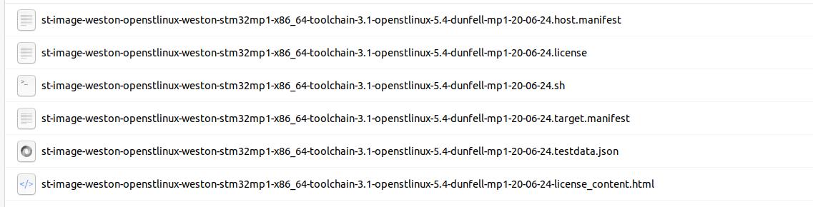
> 图：SDK压缩包解压后目录中的文件列表：st-image-weston-openstlinux-weston-stm32mp1-x86_64-toolchain-3.1-openstlinux-5.4-dunfell-mp1-20-06-24.host.manifest、…-.license、…-.sh（即用于安装工具链的脚本文件）、…-.target.manifest、…-.testdata.json、…-license_content.html。

<!-- Slide number: 29 -->
# 3.4 U-boot移植
在命令窗口中执行该脚本文件进行安装
根据提示完成安装
直接回车，安装到默认路径（/opt/st/stm32mp1/3.1-openstlinux-5.4-dunfell-mp1-20-06-24）

输入Y，确认安装

输入root用户密码

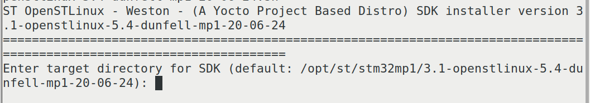
> 图：终端显示SDK安装脚本运行后的提示：“ST OpenSTLinux - Weston - (A Yocto Project Based Distro) SDK installer version 3.1-openstlinux-5.4-dunfell-mp1-20-06-24”，并提示“Enter target directory for SDK (default: /opt/st/stm32mp1/3.1-openstlinux-5.4-dunfell-mp1-20-06-24):”，此处直接回车使用默认安装路径。

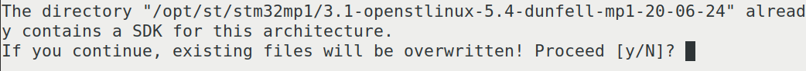
> 图：终端提示“The directory ”/opt/st/stm32mp1/3.1-openstlinux-5.4-dunfell-mp1-20-06-24“ already contains a SDK for this architecture. If you continue, existing files will be overwritten! Proceed [y/N]?”，此处输入Y确认继续安装。

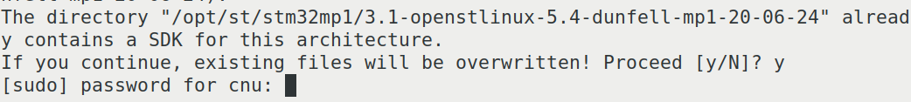
> 图：终端在“Proceed [y/N]?”后输入y确认，接着提示“[sudo] password for cnu:”，此处输入root（sudo）用户密码以继续安装。

<!-- Slide number: 30 -->
# 3.4 U-boot移植
在系统根目录下创建一个符号链接（此处命名为stm32env）指向工具链安装目录下的文件environment-setup-cortexa7t2hf-neon-vfpv4-ostl-linux-gnueabi，如果使用默认安装目录，命令如下：
sudo ln -s /opt/st/stm32mp1/3.1-openstlinux-5.4-dunfell-mp1-20-06-24/environment-setup-cortexa7t2hf-neon-vfpv4-ostl-linux-gnueabi /stm32env
使用以下命令，在当前命名窗口中导入工具链
     source /stm32env
    注意此操作只对当前窗口有效，新开命令窗口需重新执行此命令！
使用以下命令，验证工具链是否已生效
    $CC

看到arm-ostl-linux-gnueabi-gcc即生效

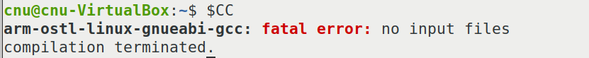
> 图：终端执行验证命令的截图：cnu@cnu-VirtualBox:~$ $CC，输出“arm-ostl-linux-gnueabi-gcc: fatal error: no input files”“compilation terminated.”，出现arm-ostl-linux-gnueabi-gcc字样说明交叉编译工具链已导入生效（无输入文件报错属正常现象）。

<!-- Slide number: 31 -->
# 3.4 U-boot移植
安装其它工具
在编译u-boot（及以后编译Linux内核、文件系统等）时，PC上还需要一些其它的工具，执行以下命令安装
		sudo apt update
		sudo apt install bison
		sudo apt install flex
		sudo apt install libncurses5-dev
		sudo apt install libyaml-dev
		sudo apt install libssl-dev

<!-- Slide number: 32 -->
# 3.4 U-boot移植
获取u-boot源码
从开发板提供的程序源码中，找到压缩包en.SOURCES-stm32mp1-openstlinux-5-4-dunfell-mp1-20-06-24.tar.xz，它包含了ST提供的u-boot、Linux内核、tf-a等源码
将压缩包复制到Linux系统，并解压
注意，解压路径中不要有中文、不要有空格，本课程中所有的路径都不要有中文、不要有空格！！！
例如，“make menuconfig”不能处理有空格的路径

<!-- Slide number: 33 -->
# 3.4 U-boot移植
在解压出的u-boot-stm32mp-2020.01-r0目录下有以下文件
    其中的压缩包为DENX官方u-boot源码
    数字开头的文件是ST制作针对STM32MP1处理器的补丁
    Makefile.sdk是编译此工程用到的Makefile文件
    README_HOW_TO.txt给出了编译的方法

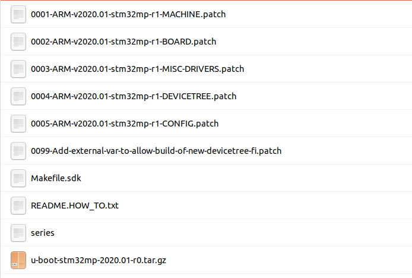
> 图：u-boot-stm32mp-2020.01-r0目录下的文件列表：补丁文件0001-ARM-v2020.01-stm32mp-r1-MACHINE.patch、0002-ARM-v2020.01-stm32mp-r1-BOARD.patch、0003-ARM-v2020.01-stm32mp-r1-MISC-DRIVERS.patch、0004-ARM-v2020.01-stm32mp-r1-DEVICETREE.patch、0005-ARM-v2020.01-stm32mp-r1-CONFIG.patch、0099-Add-external-var-to-allow-build-of-new-devicetree-fi.patch，以及Makefile.sdk、README.HOW_TO.txt、series和DENX官方u-boot源码压缩包u-boot-stm32mp-2020.01-r0.tar.gz。

<!-- Slide number: 34 -->
# 3.4 U-boot移植
准备好u-boot源码
按照README_HOW_TO.txt给出步骤，给源码打上ST提供的补丁

注意：此方法使用了git，PC上需已经安装并配置好git。git的安装配置方法，也可参考此文档

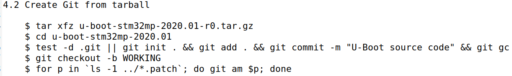
> 图：README_HOW_TO.txt中关于git的安装与配置说明：git安装——Ubuntu: sudo apt-get install git-core gitk，Fedora: sudo yum install git；若从未配置过git则执行：$ git config --global user.name "your_name"，$ git config --global user.email "your_email@example.com"。

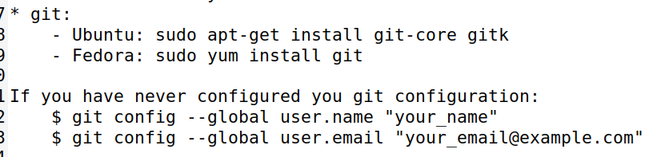
> 图：README_HOW_TO.txt小节“4.2 Create Git from tarball”给出的打补丁命令：
> $ tar xfz u-boot-stm32mp-2020.01-r0.tar.gz
> $ cd u-boot-stm32mp-2020.01
> $ test -d .git || git init . && git add . && git commit -m "U-Boot source code" && git gc
> $ git checkout -b WORKING
> $ for p in `ls -1 ../*.patch`; do git am $p; done

<!-- Slide number: 35 -->
# 3.5 U-boot移植-basic版
编译basic版u-boot
按顺序完成以下步骤：
A. 添加并加载开发板配置
B. 添加设备树文件
C. 编译源码
D. 烧写u-boot可执行程序到SD卡
E. 运行u-boot
F. 根据运行结果修改程序

<!-- Slide number: 36 -->
# 3.5 U-boot移植-basic版
A. 添加并加载开发板配置
进入u-boot源码顶层目录
添加FS-MP1A开发板的默认配置文件，执行以下命令
cp configs/stm32mp15_basic_defconfig configs/stm32mp15_fsmp1a_basic_defconfig
说明：实际上我们把ST提供的stm32mp15系列的配置文件复制了一份，作为我们自己开发板的默认配置文件
加载FS-MP1A开发板的默认配置，执行以下命令
make stm32mp15_fsmp1a_basic_defconfig
注意：执行此命令前，需确保编译工具链已加载，如果执行“$CC” 没出现红框中的信息，则需要执行“source /stm32env”

> 图：终端验证编译工具链是否生效的截图：cnu@cnu-VirtualBox:~$ $CC，输出“arm-ostl-linux-gnueabi-gcc: fatal error: no input files”“compilation terminated.”，即红框中应出现的信息（表示工具链已导入生效）。

<!-- Slide number: 37 -->
# 3.5 U-boot移植-basic版
默认配置加载后，可执行“make menuconfig”命令，打开图形化配置界面，修改配置

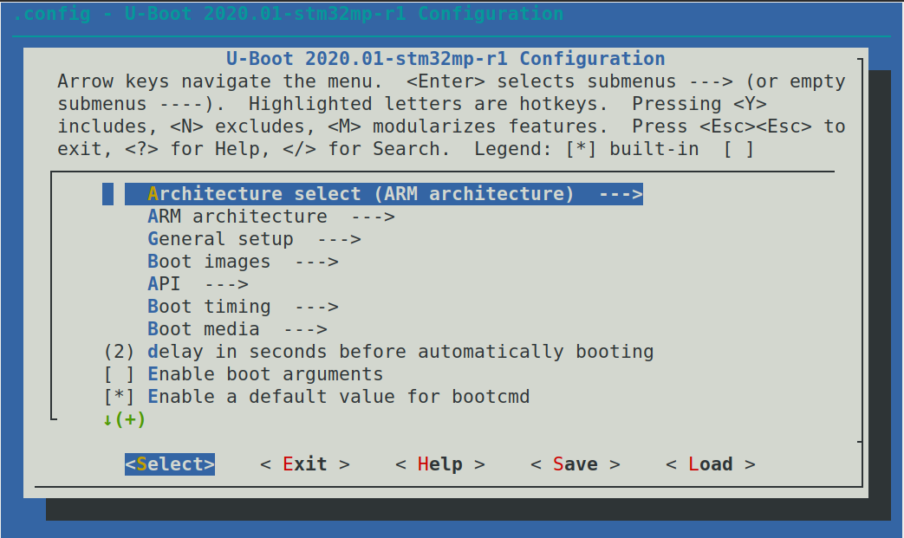
> 图：make menuconfig打开的图形化配置界面“U-Boot 2020.01-stm32mp-r1 Configuration”（顶部标题“.config - U-Boot 2020.01-stm32mp-r1 Configuration”），菜单项：Architecture select (ARM architecture) --->（当前高亮）、ARM architecture --->、General setup --->、Boot images --->、API --->、Boot timing --->、Boot media --->、(2) delay in seconds before automatically booting、[ ] Enable boot arguments、[*] Enable a default value for bootcmd；底部按钮<Select>、<Exit>、<Help>、<Save>、<Load>。
图形化配置界面

<!-- Slide number: 38 -->
# 3.5 U-boot移植-basic版
B. 添加设备树文件
添加FS-MP1A开发板的设备树文件
         cp arch/arm/dts/stm32mp157a-dk1.dts arch/arm/dts/stm32mp157a-fsmp1a.dts
         cp arch/arm/dts/stm32mp15xx-dkx.dtsi arch/arm/dts/stm32mp15xx-fsmp1x.dtsi
         cp arch/arm/dts/stm32mp157a-dk1-u-boot.dtsi arch/arm/dts/stm32mp157a-fsmp1a-u-boot.dtsi

说明：此处实际上把ST的stm32mp157a-dk1开发板的设备树文件复制了一份，作为我们的设备树文件

<!-- Slide number: 39 -->
# 3.5 U-boot移植-basic版
修改设备树文件。stm32mp157a-fsmp1a.dts为开发板直接的设备树文件，它会引用其它.dtsi设备树文件，根据步骤1中第2行复制操作，引用的文件发生了变化，因此stm32mp157a-fsmp1a.dts第13行需作改成以下内容：

修改arch/arm/dts/Makefile文件。修改此Makefile文件，使FS-MP1A开发板的设备树能够被编译
修改后的结果

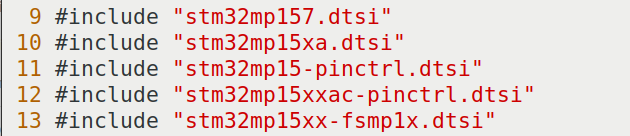
> 图：stm32mp157a-fsmp1a.dts文件第9~13行的include语句：#include "stm32mp157.dtsi"、#include "stm32mp15xa.dtsi"、#include "stm32mp15-pinctrl.dtsi"、#include "stm32mp15xxac-pinctrl.dtsi"、#include "stm32mp15xx-fsmp1x.dtsi"，其中第13行（红字）即修改后的内容，由原stm32mp15xx-dkx.dtsi改为引用复制出的stm32mp15xx-fsmp1x.dtsi。

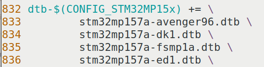
> 图：修改后的arch/arm/dts/Makefile文件第832~836行：dtb-$(CONFIG_STM32MP15x) += \ stm32mp157a-avenger96.dtb \ stm32mp157a-dk1.dtb \ stm32mp157a-fsmp1a.dtb（新增行）\ stm32mp157a-ed1.dtb \，使FS-MP1A开发板的设备树stm32mp157a-fsmp1a能被编译。

<!-- Slide number: 40 -->
# 3.5 U-boot移植-basic版
C. 编译源码
执行以下命令进行编译：
         make all DEVICE_TREE=stm32mp157a-fsmp1a
其中DEVICE_TREE=stm32mp157a-fsmp1a指定编译的设备树文件为stm32mp157a-fsmp1a.dts文件

以上命令还可以添加“-j2”参数进行多线程编译，提高编译速度。

可以配置默认编译的设备树文件，在编译时就不再需要在make命令中指定设备树，此时命令简化为“make all”
在图形化配置界面中，按以下路径设置默认设备树为stm32mp157a-fsmp1a
                                          Device Tree Control -->
	                                  Default Device Tree for DT Control

<!-- Slide number: 41 -->

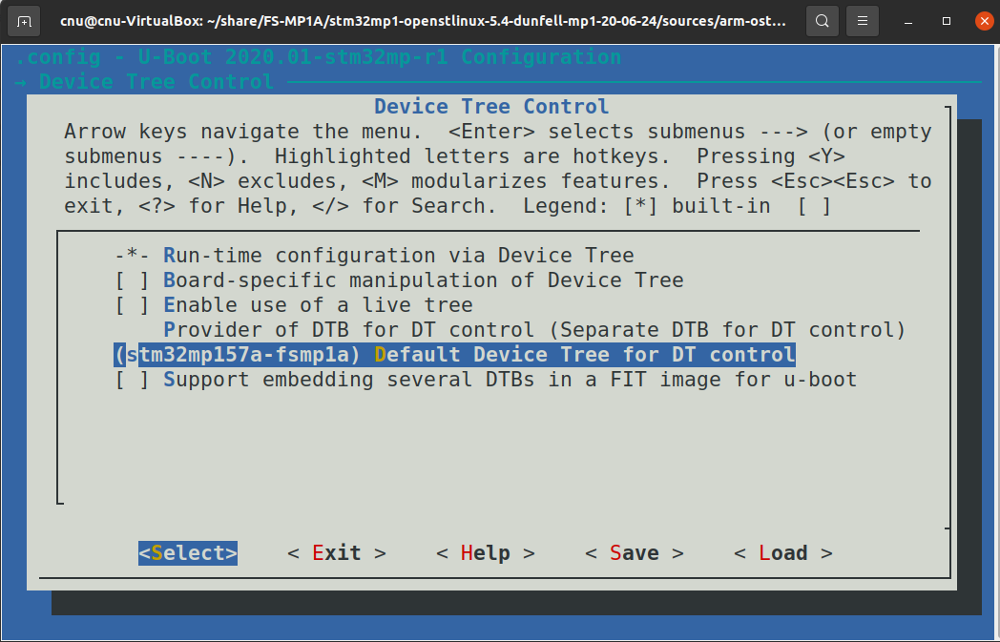
> 图：make menuconfig中“Device Tree Control”子菜单界面（终端路径~/share/FS-MP1A/stm32mp1-openstlinux-5.4-dunfell-mp1-20-06-24/sources/arm-ostl...），配置项：-*- Run-time configuration via Device Tree；[ ] Board-specific manipulation of Device Tree；[ ] Enable use of a live tree；Provider of DTB for DT control (Separate DTB for DT control)；(stm32mp157a-fsmp1a) Default Device Tree for DT control（高亮，即把默认设备树设置为stm32mp157a-fsmp1a）；[ ] Support embedding several DTBs in a FIT image for u-boot。

<!-- Slide number: 42 -->
# 3.5 U-boot移植-basic版
编译成功，在u-boot工程顶层目录下会生成u-boot-spl.stm32（spl是Secondary Program Loader的简称）和u-boot.img两个文件
它们分别是u-boot的FSBL和SSBL文件
把它们烧写到开发板的Flash上运行

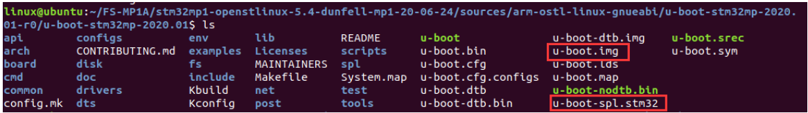
> 图：编译成功后u-boot源码目录（~/FS-MP1A/stm32mp1-openstlinux-5.4-dunfell-mp1-20-06-24/sources/arm-ostl-linux-gnueabi/u-boot-stm32mp-2020.01-r0/u-boot-stm32mp-2020.01）下执行ls的结果，生成物包括u-boot、u-boot.bin、u-boot.cfg、u-boot.dtb、u-boot-nodtb.bin、u-boot-dtb.bin、u-boot.lds、u-boot.map、u-boot.srec、u-boot.sym等，其中红框标出的u-boot.img和u-boot-spl.stm32即分别是SSBL和FSBL文件。

<!-- Slide number: 43 -->
# 3.5 U-boot移植-basic版
D. 烧写u-boot到SD卡
在开发过程中为了修改程序方便，我们选择把所有程序都烧写到SD卡，从SD卡启动系统。最终产品可以把程序烧写到eMMC。使用SD卡前需要对SD进行分区（注意：整个课程中只需要做一次分区操作）。分区的步骤如下：
接入SD卡前，执行以下命令，查看现有的磁盘设备
       ls /dev/sd*
然后Linux系统插入SD卡，重复上述命令，找出新增的磁盘设备即为SD卡，例如下图中“sdb*”是新增的

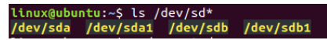
> 图：终端执行ls /dev/sd*的截图（linux@ubuntu:~$ ls /dev/sd*），输出/dev/sda、/dev/sda1、/dev/sdb、/dev/sdb1，其中高亮的/dev/sdb、/dev/sdb1即插入SD卡后新增的磁盘设备。

<!-- Slide number: 44 -->
# 3.5 U-boot移植-basic版
SD卡插入虚拟机

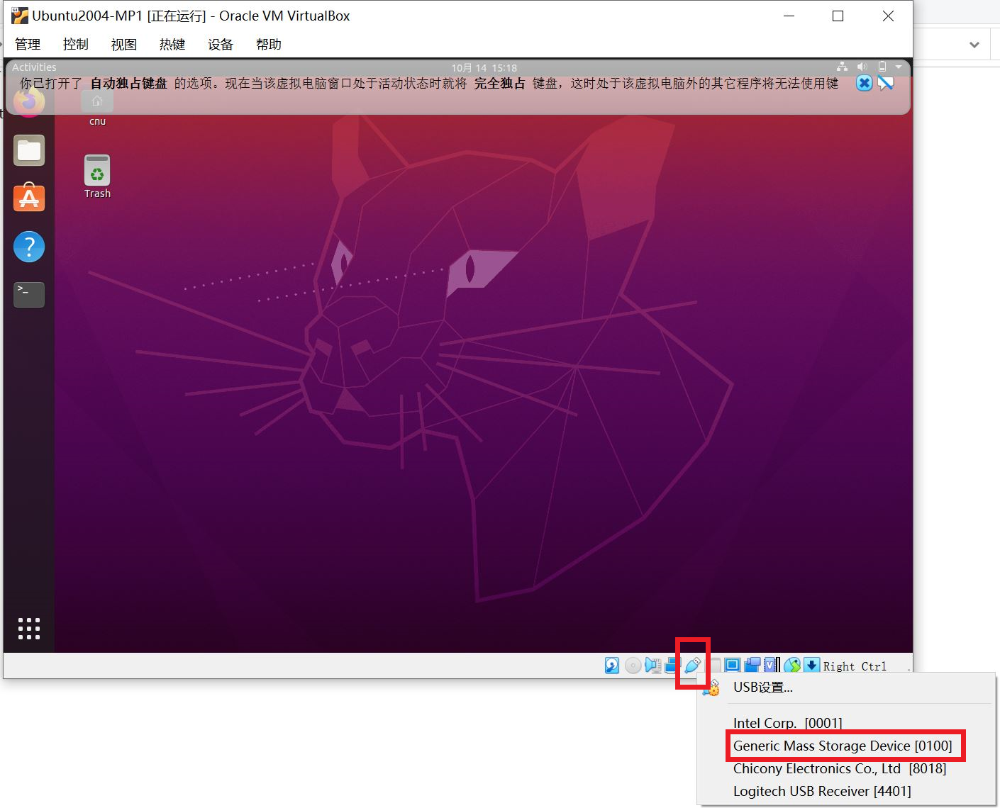
> 图：VirtualBox虚拟机（Ubuntu2004-MP1 [正在运行]）界面，右下角任务栏的USB（读卡器）图标上点击鼠标右键弹出的菜单：USB设置...、Intel Corp. [0001]、Generic Mass Storage Device [0100]（红框标出，选择此项把读卡器插入虚拟机）、Chicony Electronics Co., Ltd [8018]、Logitech USB Receiver [4401]。
鼠标右键点击这个图标
选择此项，把读卡器插入虚拟机

<!-- Slide number: 45 -->
# 3.5 U-boot移植-basic版
删除SD卡原有分区
        sudo parted -s /dev/sdb mklabel msdos      //此处的sdb需根据实际情况修改
                                                                             //删错了可能把现有磁盘的数据
                                                                            // 删掉！！！
故如果显现以下错误，表示设备已挂载，需卸载后再删除分区

卸载设备
       umount /dev/sdb1

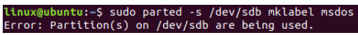
> 图：终端执行sudo parted -s /dev/sdb mklabel msdos删除分区的截图，报错“Error: Partition(s) on /dev/sdb are being used.”，表示设备已挂载，需先执行umount /dev/sdb1卸载后再删除分区。

<!-- Slide number: 46 -->
# 3.5 U-boot移植-basic版
对SD卡重新分区
sudo sgdisk --resize-table=128 -a 1 -n 1:34:545 -c 1:fsbl1 -n 2:546:1057 -c 2:fsbl2 -n 3:1058:5153 -c 3:ssbl -n 4:5154:136225 -c 4:bootfs -n 5:136226 -c 5:rootfs -A 4:set:2 -p /dev/sdb -g              //此处sdb需根据实际情况修改，弄错很危险！
此命令创建GPT分区表，并把SD卡分成如下的5个分区

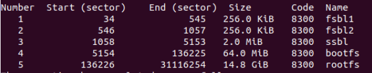
> 图：分区完成后的分区表（Number、Start (sector)、End (sector)、Size、Code、Name）：分区1：34~545，256.0 KiB，fsbl1；分区2：546~1057，256.0 KiB，fsbl2；分区3：1058~5153，2.0 MiB，ssbl；分区4：5154~136225，64.0 MiB，bootfs；分区5：136226~31116254，14.8 GiB，rootfs（Code均为8300）。

<!-- Slide number: 47 -->
# 3.5 U-boot移植-basic版
执行以下命令，把u-boot-spl.stm32和u-boot.img烧写到SD卡
             sudo dd if=u-boot-spl.stm32 of=/dev/sdb1 conv=fdatasync
             sudo dd if=u-boot-spl.stm32 of=/dev/sdb2 conv=fdatasync
             sudo dd if=u-boot.img of=/dev/sdb3 conv=fdatasync

说明：以上命令把u-boot-spl.stm32烧写了2次（sdb1、sdb2各一次），ROM Code默认加载sdb1中的内容，如果失败则尝试sdb2。参数conv=fdatasync表示在dd命令返回前，一次性的把数据写入SD卡。

<!-- Slide number: 48 -->
# 3.5 U-boot移植-basic版
E. 运行u-boot
将SD插入开发板
把开发板的拨码开关置为101（从SD卡启动开发板）
接上电源启动开发板
在PC上通过串口工具查看开发板的输出如下

提示电源初始化失败。目前的电源配置是ST官方dk1开发板的配置，而我们的开发板的电源部分在硬件上做了修改，所以程序无法运行。

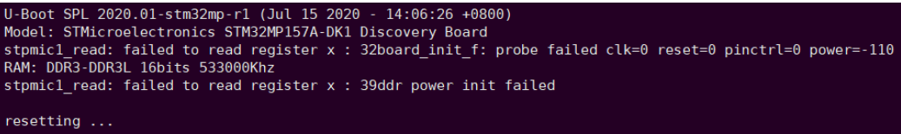
> 图：串口工具中开发板启动输出的截图：U-Boot SPL 2020.01-stm32mp-r1 (Jul 15 2020 - 14:06:26 +0800)、Model: STMicroelectronics STM32MP157A-DK1 Discovery Board、stmipmic1_read: failed to read register x : 32board_init_f: probe failed clk=0 reset=0 pinctrl=0 power=-110、RAM: DDR3-DDR3L 16bits 533000Khz、stpmic1_read: failed to read register x : 39ddr power init failed、resetting ...，即电源初始化失败（读不到PMIC寄存器），系统不断复位。

<!-- Slide number: 49 -->
# 3.5 U-boot移植-basic版
关于PC上的串口工具
在Linux中可以使用minicom
在Windows中可以使用MobaXterm
串口配置参数：
   设备（Linux）：/dev/ttyACM0；
   设备（Windows）：comX；
   波特率115200；
   数据位：8；
   停止位：1；
   校验：无。

<!-- Slide number: 50 -->
# 3.5 U-boot移植-basic版
F-1. 修改设备树电源配置
ST官方的dk1开发板使用了电源管理芯片（pmic），而我们的FS-MP1A开发板采用分离电路作为电源管理
在设备树中，dk1的pmic的配置需全部删除，然后新增固定电源的配置
dk1的pmic连接在I2C4总线上， FS-MP1A没使用I2C4总线，因此把设备树中I2C4节点删除
    （我怎么知道这些差异？开发板厂商说的！）

<!-- Slide number: 51 -->
# 3.5 U-boot移植-basic版
在arch/arm/dts/stm32mp15xx-fsmp1x.dtsi文件中删除以下内容

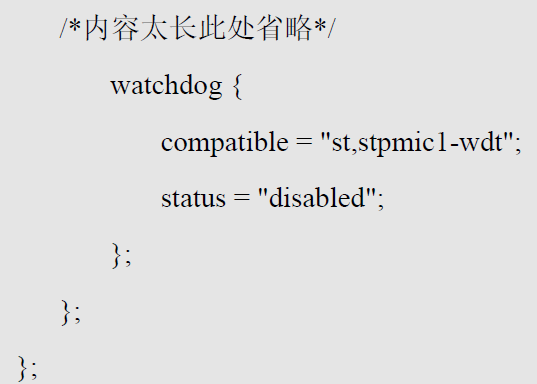
> 图：stm32mp15xx-fsmp1x.dtsi中要删除的&i2c4节点内容（起始部分）：pinctrl-names = "default", "sleep"; pinctrl-0 = <&i2c4_pins_a>; pinctrl-1 = <&i2c4_pins_sleep_a>; i2c-scl-rising-time-ns = <185>; i2c-scl-falling-time-ns = <20>; clock-frequency = <400000>;

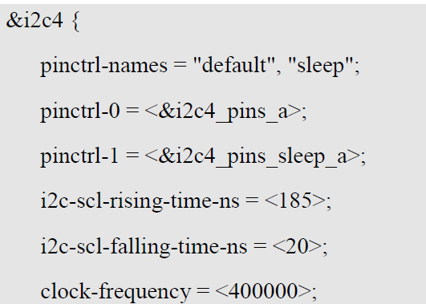
> 图：&i2c4节点中要删除内容的末尾部分（中间以/*内容太长此处省略*/代替）：watchdog { compatible = "st,stpmic1-wdt"; status = "disabled"; }; 及节点、根节点收尾的“};};};”。
删除这些内容
关于设备树的修改，现在不要问为什么，照着改就完了！留到驱动开发中再解释为什么，这个问题太多、太复杂。

<!-- Slide number: 52 -->
# 3.5 U-boot移植-basic版
引用了电源节点的也删除
arch/arm/dts/stm32mp15xx-fsmp1x.dtsi文件，删除如下内容：

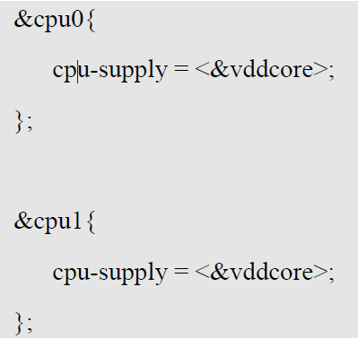
> 图：stm32mp15xx-fsmp1x.dtsi中引用了电源节点&vddcore、需要删除的内容：&cpu0{ cpu-supply = <&vddcore>; }; 与 &cpu1{ cpu-supply = <&vddcore>; };。

<!-- Slide number: 53 -->
# 3.5 U-boot移植-basic版
arch/arm/dts/stm32mp157a-fsmp1a-u-boot.dtsi文件，删除如下内容：

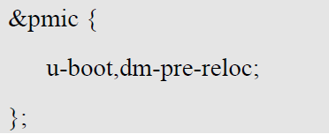
> 图：arch/arm/dts/stm32mp157a-fsmp1a-u-boot.dtsi中要删除的内容：&pmic { u-boot,dm-pre-reloc; };（pmic节点相关的U-Boot专用属性）。

<!-- Slide number: 54 -->
# 3.5 U-boot移植-basic版
dk1的还I2C4总线上还有一个USB type C控制器，随上面I2C4节点一起被删除了，引用该type C控制器的内容也要删除。
     arch/arm/dts/stm32mp15xx-fsmp1x.dtsi删除红色部分内容

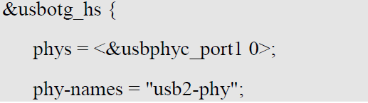
> 图：stm32mp15xx-fsmp1x.dtsi中&usbotg_hs节点要删除内容的前半部分（红字）：phys = <&usbphyc_port1 0>; phy-names = "usb2-phy";

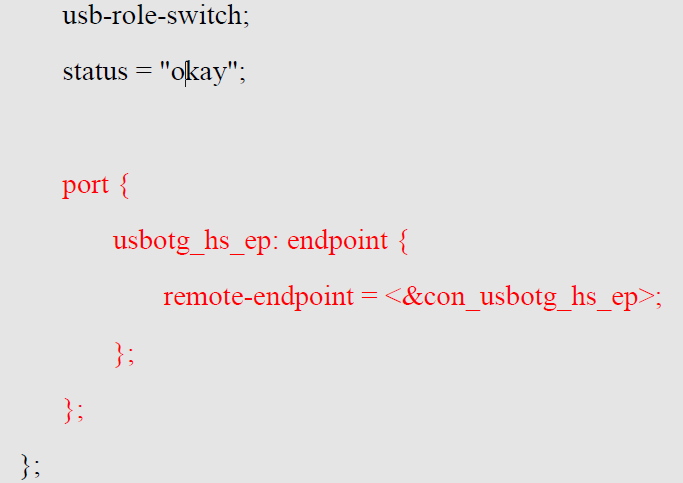
> 图：&usbotg_hs节点要删除内容的后半部分（红字）：usb-role-switch; status = "okay"; port { usbotg_hs_ep: endpoint { remote-endpoint = <&con_usbotg_hs_ep>; }; }; };，其中remote-endpoint引用了I2C4总线上的type C控制器。

<!-- Slide number: 55 -->
# 3.5 U-boot移植-basic版
添加固定电源的配置
arch/arm/dts/stm32mp15xx-fsmp1x.dtsi文件，在根节点“/”末尾，添加以下红字部分内容

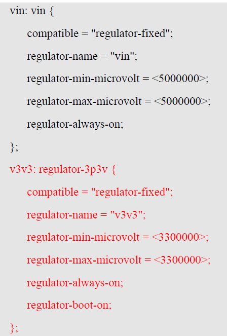
> 图：新增的固定电源配置（红字，其一）：vin: vin { compatible = "regulator-fixed"; regulator-name = "vin"; regulator-min-microvolt = <5000000>; regulator-max-microvolt = <5000000>; regulator-always-on; }; 以及 v3v3: regulator-3p3v { compatible = "regulator-fixed"; regulator-name = "v3v3"; regulator-min-microvolt = <3300000>; regulator-max-microvolt = <3300000>; regulator-always-on; regulator-boot-on; };

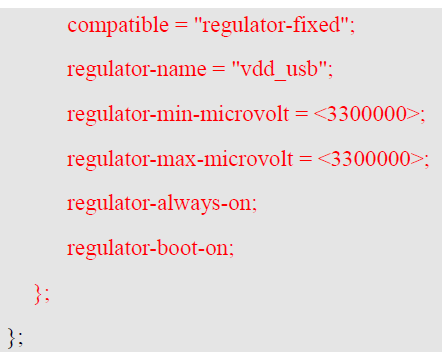
> 图：新增固定电源配置（红字，其二，vdd_usb节点）：compatible = "regulator-fixed"; regulator-name = "vdd_usb"; regulator-min-microvolt = <3300000>; regulator-max-microvolt = <3300000>; regulator-always-on; regulator-boot-on; 及节点、根节点收尾的“};};”。

<!-- Slide number: 56 -->
# 3.5 U-boot移植-basic版
根节点在这里：

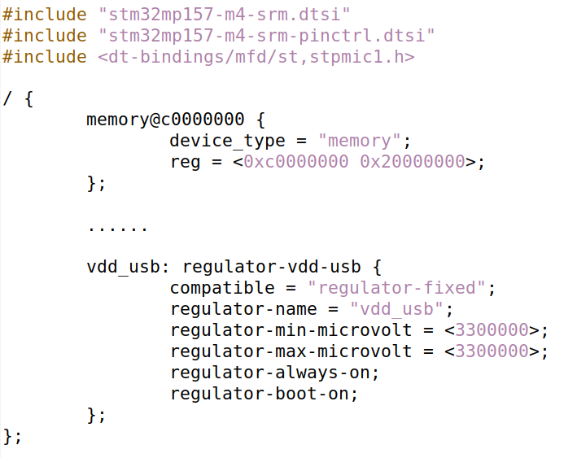
> 图：设备树源文件中的根节点“/”位置示意：文件开头为#include "stm32mp157-m4-srm.dtsi"、#include "stm32mp157-m4-srm-pinctrl.dtsi"、#include <dt-bindings/mfd/st,stpmic1.h>，随后 / { memory@c0000000 { device_type = "memory"; reg = <0xc0000000 0x20000000>; }; …… vdd_usb: regulator-vdd-usb { compatible = "regulator-fixed"; regulator-name = "vdd_usb"; regulator-min-microvolt = <3300000>; regulator-max-microvolt = <3300000>; regulator-always-on; regulator-boot-on; }; };，即新增内容位于根节点末尾。

<!-- Slide number: 57 -->
# 3.5 U-boot移植-basic版
修改uboot配置，去掉PMIC的配置项
执行“make menuconfig”，按以下路径，找到配置项，去掉[ ]中的*号

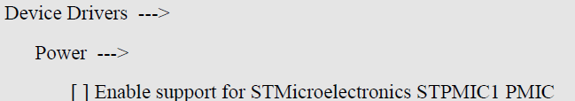
> 图：menuconfig中的菜单路径：Device Drivers ---> → Power ---> → [ ] Enable support for STMicroelectronics STPMIC1 PMIC（该项即为要去掉*号的PMIC配置项）。

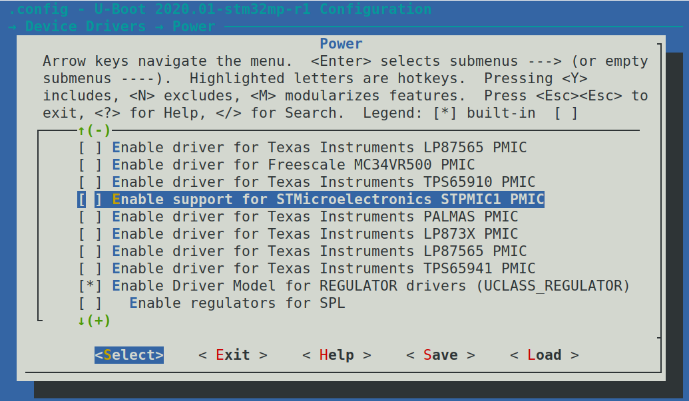
> 图：图形化配置界面“Device Drivers → Power”子菜单：[ ] Enable driver for Texas Instruments LP87565 PMIC、[ ] Enable driver for Freescale MC34VR500 PMIC、[ ] Enable driver for Texas Instruments TPS65910 PMIC、[ ] Enable support for STMicroelectronics STPMIC1 PMIC（高亮，去掉[ ]中的*号）、[ ] Enable driver for Texas Instruments PALMAS PMIC、[ ] Enable driver for Texas Instruments LP873X PMIC、[ ] Enable driver for Texas Instruments LP87565 PMIC、[ ] Enable driver for Texas Instruments TPS65941 PMIC、[*] Enable Driver Model for REGULATOR drivers (UCLASS_REGULATOR)、[ ] Enable regulators for SPL。

<!-- Slide number: 58 -->
# 3.5 U-boot移植-basic版
重新编译u-boot
      make all DEVICE_TREE=stm32mp157a-fsmp1a
重新烧写SD卡，用新的u-boot启动开发板，串口输出如下

     电源错误已经解决，出现新错误mmc初始化失败，这是由于我们选择从SD卡启动系统，SD卡使用的是SDMMC1控制器，该控制器的驱动有问题，无法正确加载SSBL程序

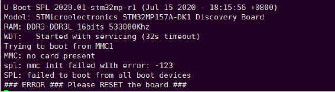
> 图：重新编译烧写后串口输出截图：U-Boot SPL 2020.01-stm32mp-r1 (Jul 15 2020 - 18:15:56 +0800)、Model: STMicroelectronics STM32MP157A-DK1 Discovery Board、RAM: DDR3-DDR3L 16bits 533000Khz、WDT: Started with servicing (32s timeout)、Trying to boot from MMC1、MMC: no card present、spl: mmc init failed with error: -123、SPL: failed to boot from all boot devices、### ERROR ### Please RESET the board ###，即电源错误已解决，出现新的MMC（SDMMC1）初始化失败错误。

<!-- Slide number: 59 -->
对于已完成的修改，如已验证没有错误，可以用git提交一个版本，以便后续修改有问题时返回到此节点重新修改
注意git不会跟踪<u-boot source>/.config文件，而此文件保存了开发板的配置
可以把<u-boot source>/.config文件复制为默认配置文件stm32mp15_fsmp1a_basic_defconfig，它能被git跟踪。执行命令进行复制:
cp .config configs/stm32mp15_fsmp1a_basic_defconfig

<!-- Slide number: 60 -->
# 3.5 U-boot移植-basic版
F-2. 修改SD卡驱动
只需修改设备树中的配置
对比dk1开发板和FS-MP1A开发板的原理图，SDMMC1控制器的CD引脚使用的芯片引脚不同（ dk1用的gpiob7脚， FS-MP1A用的gpioh3脚）
此引脚差异或者是开发板硬件设计者告知，或者是对比原理图发现

<!-- Slide number: 61 -->

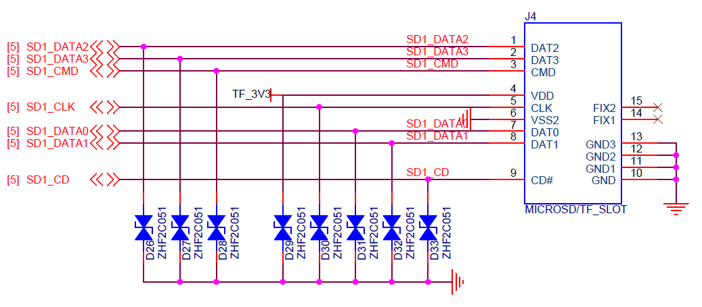
> 图：FS-MP1A开发板原理图——TF卡（MICROSD/TF_SLOT，J4）接口电路：SD卡信号SD1_DATA2、SD1_DATA3、SD1_CMD、SD1_CLK、SD1_DATA0、SD1_DATA1、SD1_CD，供电TF_3V3，各信号线上接ZHF2051（D26~D33）ESD保护二极管；插槽引脚1 DAT2、2 DAT3、3 CMD、4 VDD、5 CLK、6 VSS2、7 DAT0、8 DAT1、9 CD#，其中卡检测信号SD1_CD是后面修改设备树的关键。

<!-- Slide number: 62 -->

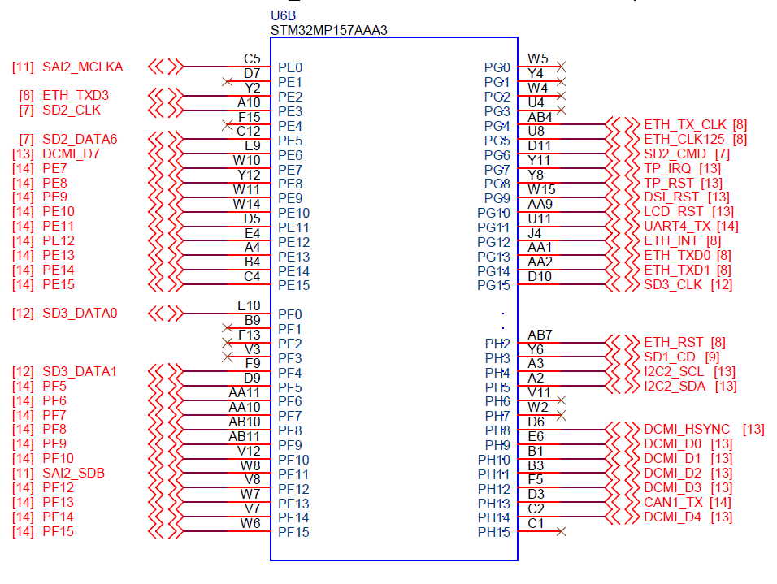
> 图：FS-MP1A开发板原理图——STM32MP157AAA3处理器（U6B）部分引脚定义：PH3引脚（引脚号Y6/A3）连接SD1_CD[9]，即SDMMC1的CD引脚使用的芯片引脚为PH3（gpioh3）；图中还可见ETH_TX_CLK[8]、ETH_TXD0/ETH_TXD1[8]、SD3_CLK[12]、SD3_DATA0/SD3_DATA1[12]、I2C2_SCL/I2C2_SDA[13]、DCMI系列[13]、UART4_TX[14]等信号。

<!-- Slide number: 63 -->
arch/arm/dts/stm32mp15xx-fsmp1x.dtsi文件，进行如下修改

> 图：stm32mp15xx-fsmp1x.dtsi中&sdmmc1节点的修改结果：pinctrl-names = "default", "opendrain", "sleep"; pinctrl-0 = <&sdmmc1_b4_pins_a>; pinctrl-1 = <&sdmmc1_b4_od_pins_a>; pinctrl-2 = <&sdmmc1_b4_sleep_pins_a>; cd-gpios = <&gpioh 3 (GPIO_ACTIVE_LOW | GPIO_PULL_UP)>;（红字，即修改后的CD引脚，由gpiob7改为gpioh3）；disable-wp; st,neg-edge; bus-width = <4>; vmmc-supply = <&v3v3>; status = "okay"; };
红字部分是修改后的结果

<!-- Slide number: 64 -->
# 3.5 U-boot移植-basic版
重新编译，烧写，并运行u-boot，已可以用进入u-boot的命令行界面

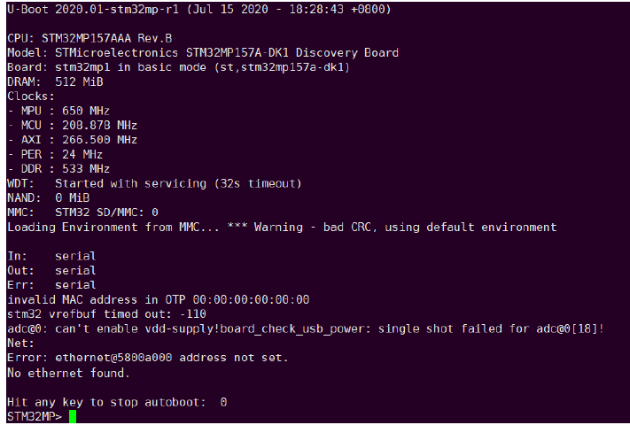
> 图：串口输出截图，已能进入u-boot命令行（提示符STM32MP>）：U-Boot 2020.01-stm32mp-r1 (Jul 15 2020 - 18:20:43 +0800)、CPU: STM32MP157AAA Rev.B、Model: STMicroelectronics STM32MP157A-DK1 Discovery Board、Board: stm32mp1 in basic mode (st,stm32mp157a-dk1)、DRAM: 512 MiB、Clocks: MPU 650 MHz / MCU 208.878 MHz / AXI 266.500 MHz / PER 24 MHz / DDR 533 MHz、WDT: Started with servicing (32s timeout)、NAND: 0 MiB、MMC: STM32 SD/MMC: 0、Loading Environment from MMC... *** Warning - bad CRC, using default environment、In/Out/Err: serial、invalid MAC address in OTP 00:00:00:00:00:00、stm32_vrefbuf timed out: -110、adc@0: can't enable vdd-supply!board_check_usb_power: single shot failed for adc@0[18]!、Net: Error: ethernet@5800a000 address not set.、No ethernet found.、Hit any key to stop autoboot: 0。

<!-- Slide number: 65 -->

> 图：同上一页的串口输出截图：u-boot已进入命令行（STM32MP>提示符），MMC0已被识别；但仍有一些错误提示——stm32_vrefbuf timed out: -110、adc@0: can't enable vdd-supply!board_check_usb_power: single shot failed for adc@0[18]!、Net: Error: ethernet@5800a000 address not set.、No ethernet found.，以及Loading Environment from MMC... *** Warning - bad CRC, using default environment。

u-boot启动过程中还有一些错误提示，我们将继续完善

<!-- Slide number: 66 -->
# 3.5 U-boot移植-basic版
F-3. 去掉ADC功能
以下错误提示是由于dk1开发板会通过ADC检测开机电流，而FS-MP1A开发板无此功能

在u-boot配置中，去掉ADC功能即可，按如下路径去掉[ ]的*号

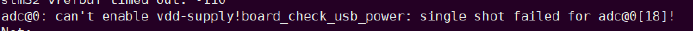
> 图：串口输出的错误信息截图（对应dk1开发板通过ADC检测开机电流的功能）：stm32_vrefbuf timed out: -110、adc@0: can't enable vdd-supply!board_check_usb_power: single shot failed for adc@0[18]!、Net:等字样，FS-MP1A开发板无ADC检测功能，需在u-boot配置中去掉ADC功能。

<!-- Slide number: 67 -->

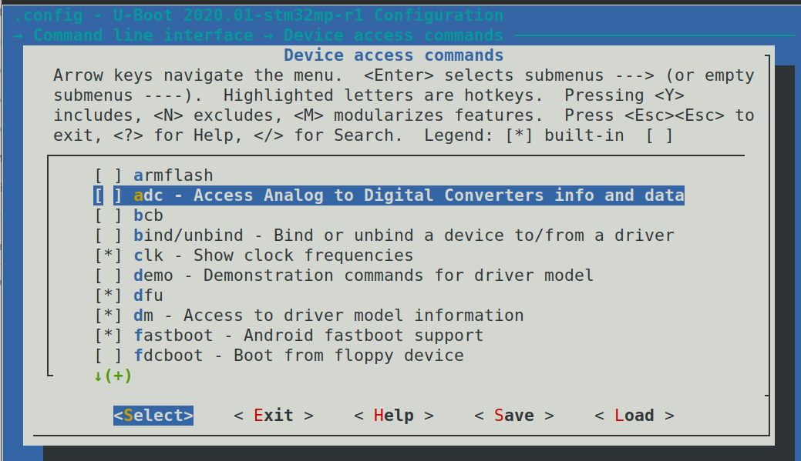
> 图：menuconfig中去掉ADC功能的菜单路径：Command line interface ---> → Device access commands ---> → [ ] adc - Access Analog to Digital Converters info and data；以及Device Drivers ---> → [ ] Enable ADC drivers using Driver Model。
此行不要选中

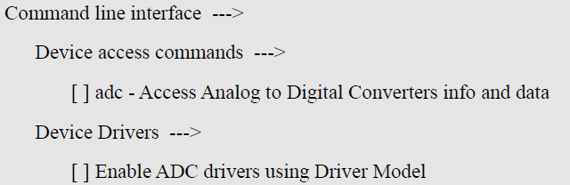
> 图：图形化配置界面“Command line interface → Device access commands”子菜单：[ ] armflash；[ ] adc - Access Analog to Digital Converters info and data（高亮，此行不要选中）；[ ] bcb；[ ] bind/unbind - Bind or unbind a device to/from a driver；[*] clk - Show clock frequencies；[ ] demo - Demonstration commands for driver model；[*] dfu；[*] dm - Access to driver model information；[*] fastboot - Android fastboot support；[ ] fdboot - Boot from floppy device。

<!-- Slide number: 68 -->

> 图：图形化配置界面“Device Drivers”子菜单：Generic Driver Options --->；[ ] Enable ADC drivers using Driver Model（高亮，此行不要选中，去掉[ ]中的*号）；[ ] Enable Exynos 54xx ADC driver；[ ] Enable Sandbox ADC test driver；[ ] Enable Amlogic Meson SARADC driver；[ ] Enable Rockchip SARADC driver；[ ] Support SATA controllers with driver model；[ ] Support SATA controllers；[ ] Enable SCSI interface to SATA devices；SATA/SCSI device support --->。
此行不要选中

> 图：同前页的“Command line interface → Device access commands”子菜单截图，其中[ ] adc - Access Analog to Digital Converters info and data（高亮）此行不要选中。

<!-- Slide number: 69 -->
# 3.5 U-boot移植-basic版
F-4. 关闭LTDC（LCD-TFT display controller ）
目前显示驱动还有问题，屏幕无法正常显现
在u-boot阶段不需要用到屏幕，因此关闭LTDC即可
arch/arm/dts/stm32mp15xx-fsmp1x.dtsi文件，作如下修改

> 图：stm32mp15xx-fsmp1x.dtsi中&ltdc节点的修改结果：pinctrl-names = "default", "sleep"; pinctrl-0 = <&ltdc_pins_a>; pinctrl-1 = <&ltdc_pins_sleep_a>; status = "disabled";（红字，即关闭LTDC显示控制器）。
红字部分是修改后的结果

<!-- Slide number: 70 -->
# 3.5 U-boot移植-basic版
F-5. 修改网卡驱动
FS-MP1A V3.0开发板改用了国产网卡芯片MAE0621A，u-boot中没此芯片的驱动，需要在u-boot中添加此芯片的驱动（不用自己写，芯片厂家会提供驱动源码）
在开发板的出厂源码中，可以找到u-boot所需的phy.c、maxio.c、dwc_eth_qos.c文件，把phy.c、maxio.c复制到<u-boot source>/drivers/net/phy 目录下：
cp phy.c  <u-boot source>/drivers/net/phy/
cp maxio.c  <u-boot source>/ drivers/net/phy/
    把dwc_eth_qos.c复制到<u-boot source>/drivers/net/ 目录下：
        cp dwc_eth_qos.c  <u-boot source>/drivers/net/

<!-- Slide number: 71 -->
# 3.5 U-boot移植-basic版
修改头文件，在include/phy.h文件中添加如下内容

修改drivers/net/phy/Makefile文件，使maxio.c能被编译

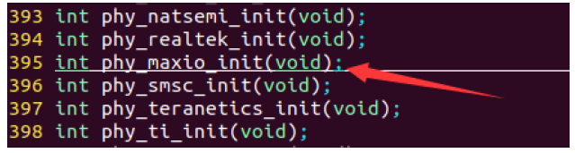
> 图：include/phy.h文件第393~398行的函数声明：int phy_natsemi_init(void); int phy_realtek_init(void); int phy_maxio_init(void);（红箭头所指，新增）int phy_smsc_init(void); int phy_teranetics_init(void); int phy_ti_init(void);，即在头文件中添加了maxio驱动初始化函数的声明。

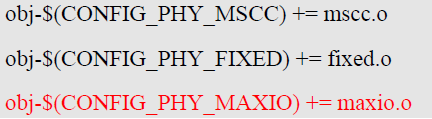
> 图：drivers/net/phy/Makefile文件中新增的编译项（红字）：obj-$(CONFIG_PHY_MAXIO) += maxio.o，其上两行为原有的obj-$(CONFIG_PHY_MSCC) += mscc.o和obj-$(CONFIG_PHY_FIXED) += fixed.o。
红字部分是新增的

<!-- Slide number: 72 -->
# 3.5 U-boot移植-basic版
在drivers/net/phy/Kconfig文件中添加MAE0621A驱动的配置项

> 图：drivers/net/phy/Kconfig文件中新增的配置项（红字）：config PHY_MAXIO / bool "supports the Maxio MAEXXXX PHY" / default n，其上为原有的config PHY_REALTEK / bool "Realtek Ethernet PHYs support"。
红字部分是新增的

<!-- Slide number: 73 -->
# 3.5 U-boot移植-basic版
配置u-boot，按以下路径配置选中新增的网卡

> 图：menuconfig中的菜单路径：Device Drivers ---> → -*- Ethernet PHY (physical media interface) support --->。

> 图：新增网卡驱动的配置项：[*] supports the Maxio MAEXXXX PHY（红字，即要选中的MAE0621A驱动配置项）。

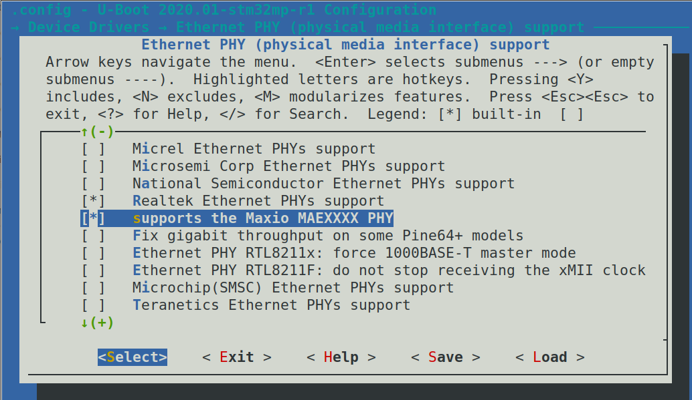
> 图：图形化配置界面“Device Drivers → Ethernet PHY (physical media interface) support”子菜单：[ ] Micrel Ethernet PHYs support、[ ] Microsemi Corp Ethernet PHYs support、[ ] National Semiconductor Ethernet PHYs support、[*] Realtek Ethernet PHYs support、[*] supports the Maxio MAEXXXX PHY（高亮，选中这一项）、[ ] Fix gigabit throughput on some Pine64+ models、[ ] Ethernet PHY RTL8211x: force 1000BASE-T master mode、[ ] Ethernet PHY RTL8211F: do not stop receiving the xMII clock、[ ] Microchip(SMSC) Ethernet PHYs support、[ ] Teranetics Ethernet PHYs support。
选中这一项

<!-- Slide number: 74 -->
# 3.5 U-boot移植-basic版
重新编译，烧写，并运行u-boot
给网卡配置MAC地址和IP地址，以下命令在u-boot的命令界面下执行：
setenv ethaddr 1A:1F:DB:0E:69:FD
setenv ipaddr 192.168.0.8
setenv netmask 255.255.255.0
saveenv
（注意：PC端桥接网卡的IP应为：192.168.0.X，子网掩码应为：255.255.255.0）
把开发板通过网线连入路由器或与PC直连，确保开发板与PC在同一子网，如果从开发板能ping通PC，则网卡已正常工作

<!-- Slide number: 75 -->
# 3.5 U-boot移植-basic版
F-6. 支持eMMC
FS-MP1A开发板有板载eMMC Flash存储器，但当前u-boot缺少eMMC驱动，无法访问eMMC
u-boot中已实现了eMMC的驱动代码，但当前的设备树没有eMMC的配置，因此需要修改设备树
支持eMMC有2个目的：一是后续移植工作可以借助eMMC中的出厂系统作验证；二是最终产品可以把程序烧到eMMC中，从eMMC启动系统

<!-- Slide number: 76 -->
# 3.5 U-boot移植-basic版
根据开发板厂商提供的资料，eMMC连接在SDMMC2总线上，并且eMMC芯片和处理器芯片的连接如下表所示，由此可以完成设备树的修改

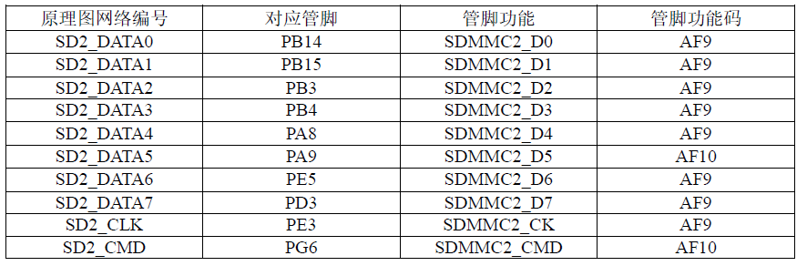
> 图：eMMC与处理器连接引脚表（原理图网络编号、对应管脚、管脚功能、管脚功能码）：SD2_DATA0→PB14→SDMMC2_D0→AF9；SD2_DATA1→PB15→SDMMC2_D1→AF9；SD2_DATA2→PB3→SDMMC2_D2→AF9；SD2_DATA3→PB4→SDMMC2_D3→AF9；SD2_DATA4→PA8→SDMMC2_D4→AF9；SD2_DATA5→PA9→SDMMC2_D5→AF10；SD2_DATA6→PE5→SDMMC2_D6→AF9；SD2_DATA7→PD3→SDMMC2_D7→AF9；SD2_CLK→PE3→SDMMC2_CK→AF9；SD2_CMD→PG6→SDMMC2_CMD→AF10。

<!-- Slide number: 77 -->
# 3.5 U-boot移植-basic版
确认引脚定义。STM32MP1默认引脚定义在文件 arch/arm/dts/stm32mp15-pinctrl.dtsi中，检查是否有上表中PB14等引脚的定义，并且定义是否和表中一致。经确认是一致的

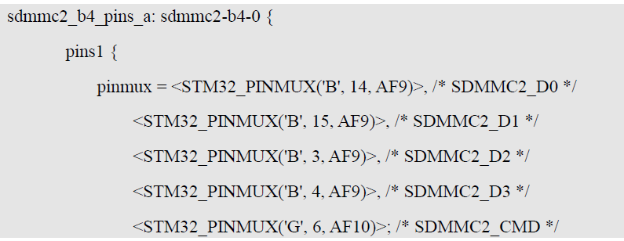
> 图：arch/arm/dts/stm32mp15-pinctrl.dtsi中的引脚定义（代码很长，后续省略）：sdmmc2_b4_pins_a: sdmmc2-b4-0 { pins1 { pinmux = <STM32_PINMUX('B', 14, AF9)>, /* SDMMC2_D0 */ <STM32_PINMUX('B', 15, AF9)>, /* SDMMC2_D1 */ <STM32_PINMUX('B', 3, AF9)>, /* SDMMC2_D2 */ <STM32_PINMUX('B', 4, AF9)>, /* SDMMC2_D3 */ <STM32_PINMUX('G', 6, AF10)>; /* SDMMC2_CMD */，与上表引脚定义一致。
设备树中的引脚定义。代码很长，后续省略

<!-- Slide number: 78 -->
# 3.5 U-boot移植-basic版
在arch/arm/dts/stm32mp15xx-fsmp1x.dtsi中，增加SDMMC2节点
	在原来sdmmc1节点下增加sdmmc2的内容如下：
&sdmmc2 {
    pinctrl-names = "default", "opendrain", "sleep";
    pinctrl-0 = <&sdmmc2_b4_pins_a &sdmmc2_d47_pins_a>;
    pinctrl-1 = <&sdmmc2_b4_od_pins_a &sdmmc2_d47_pins_a>;
    pinctrl-2 = <&sdmmc2_b4_sleep_pins_a &sdmmc2_d47_sleep_pins_a>;
    non-removable;
    no-sd;
    no-sdio;
    st,neg-edge;
    bus-width = <8>;
    vmmc-supply = <&v3v3>;
    vqmmc-supply = <&vdd>;
    mmc-ddr-3_3v;
    status = "okay";
};

> 图：stm32mp15xx-fsmp1x.dtsi中新增的&sdmmc2节点（第442~457行）：pinctrl-names = "default", "opendrain", "sleep"; pinctrl-0 = <&sdmmc2_b4_pins_a &sdmmc2_d47_pins_a>; pinctrl-1 = <&sdmmc2_b4_od_pins_a &sdmmc2_d47_pins_a>; pinctrl-2 = <&sdmmc2_b4_sleep_pins_a &sdmmc2_d47_sleep_pins_a>; non-removable; no-sd; no-sdio; st,neg-edge; bus-width = <8>; vmmc-supply = <&v3v3>; vqmmc-supply = <&vdd>; mmc-ddr-3_3v; status = "okay"; };

<!-- Slide number: 79 -->
# 3.5 U-boot移植-basic版
修改arch/arm/dts/stm32mp157a-fsmp1a-u-boot.dtsi文件，增加启动通道（红字部分为新增内容）

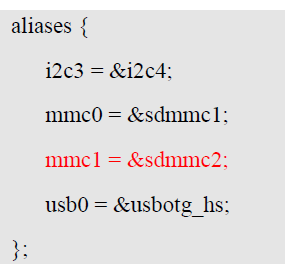
> 图：stm32mp157a-fsmp1a-u-boot.dtsi中的aliases节点（红字为新增内容）：aliases { i2c3 = &i2c4; mmc0 = &sdmmc1; mmc1 = &sdmmc2; usb0 = &usbotg_hs; };，即增加启动通道mmc1。

> 图：stm32mp157a-fsmp1a-u-boot.dtsi中的另一处修改（红字为新增内容）：&sdmmc1 { u-boot,dm-spl; }; &sdmmc2 { u-boot,dm-spl; };，即使sdmmc2也在SPL阶段可用。

<!-- Slide number: 80 -->
# 3.5 U-boot移植-basic版
重新编译，烧写，并运行u-boot，出现如图的MMC1即成功

> 图：重新编译烧写运行后的串口输出：U-Boot 2020.01-stm32mp-r1 (Jul 16 2020 - 10:41:56 +0800)、CPU: STM32MP157AAA Rev.B、Model: STMicroelectronics STM32MP157A-DK1 Discovery Board、Board: stm32mp1 in basic mode (st,stm32mp157a-dk1)、DRAM: 512 MiB、Clocks: MPU 650 MHz / MCU 208.878 MHz / AXI 266.500 MHz / PER 24 MHz / DDR 533 MHz、WDT: Started with servicing (32s timeout)、NAND: 0 MiB、MMC: STM32 SD/MMC: 0  STM32 SD/MMC: 1（红框，出现MMC1即eMMC支持成功）、Loading Environment from MMC... *** Warning - bad CRC, using default environment、In/Out/Err: serial、Net: eth0: ethernet@5800a000、Hit any key to stop autoboot: 0、STM32MP>。

<!-- Slide number: 81 -->
# 3.5 U-boot移植-basic版
至此，basic版的u-boot已完成必要的移植适配。我们将在basic版的基础上移植trusted版。

<!-- Slide number: 82 -->
# 3.6 U-boot移植-trusted版
basic版的移植工作主要是驱动的适配
trusted版直接使用basic版中已适配好的驱动即可
trusted版的移植，只需在图形化配置界面中简单修改配置即可
移植步骤如下

<!-- Slide number: 83 -->
# 3.6 U-boot移植-trusted版
保存basic版的配置到默认配置
	cp .config configs/stm32mp15_fsmp1a_basic_defconfig
清除配置及编译生成的文件
 make distclean
复制一份ST原厂开发板的trusted配置作为FS-MP1A开发板的trusted配置
cp configs/stm32mp15_trusted_defconfig configs/stm32mp15_fsmp1a_trusted_defconfig  //注意，两行是一
                                                                             //条命令
加载trusted版的默认配置
 make stm32mp15_fsmp1a_trusted_defconfig

<!-- Slide number: 84 -->
# 3.6 U-boot移植-trusted版
修改配置
 make menuconfig
在图形化配置界面中，按basic版修改的地方，原样修改一遍
编译
 make all DEVICE_TREE=stm32mp157a-fsmp1a
编译成功会在u-boot顶层目录下生成u-boot.stm32文件，它即是我们要使用的trusted版u-boot的可执行文件

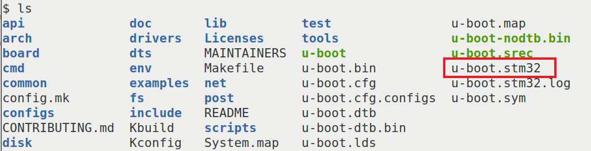
> 图：trusted版编译成功后u-boot顶层目录下执行ls的结果：api、arch、board、cmd、common、configs、disk、doc、drivers、dts、env、examples、fs、include、lib、net、post、scripts、test、tools等目录，以及u-boot、u-boot.bin、u-boot.cfg、u-boot.dtb、u-boot-dtb.bin、u-boot-nodtb.bin、u-boot.srec、u-boot.lds、u-boot.map、u-boot.sym、u-boot.stm32.log等文件，其中红框标出的u-boot.stm32即trusted版u-boot的可执行文件。

<!-- Slide number: 85 -->
# 3.6 U-boot移植-trusted版
烧写
编译生成的u-boot.stm32文件是bootloader的SSBL文件
FSBL文件需使用TF-A
我们不再移植TF-A，直接使用开发板出厂TF-A，在开发板的出厂软件包中可以找到tf-a-stm32mp157a-fsmp1a-trusted.stm32文件，它即是TF-A的可执行程序
通过以下命令把TF-A和u-boot烧写到SD卡
sudo dd if=tf-a-stm32mp157a-fsmp1a-trusted.stm32 of=/dev/sdb1 conv=fdatasync
sudo dd if=tf-a-stm32mp157a-fsmp1a-trusted.stm32 of=/dev/sdb2 conv=fdatasync
sudo dd if=u-boot.stm32 of=/dev/sdb3 conv=fdatasync

<!-- Slide number: 86 -->
# 3.6 U-boot移植-trusted版
运行
启动开发板，可以看到现在运行的已是trusted版的u-boot

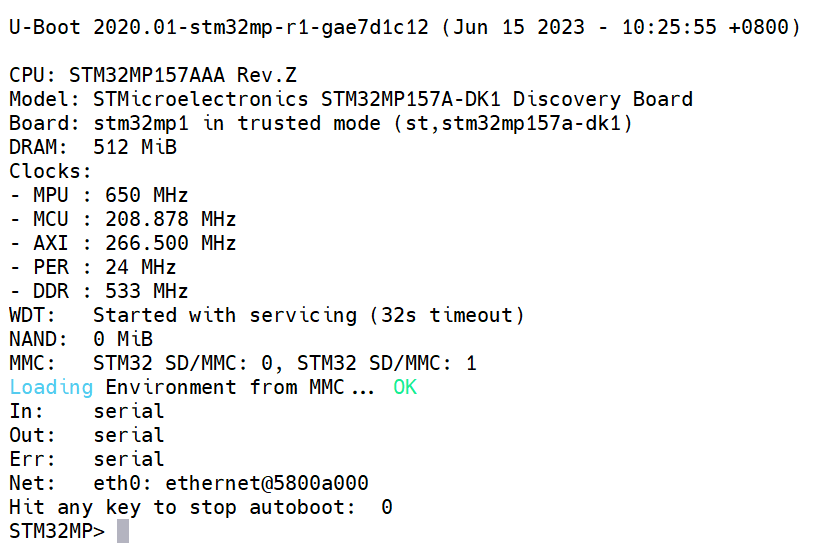
> 图：trusted版u-boot的串口输出：U-Boot 2020.01-stm32mp-r1-gae7d1c12 (Jun 15 2023 - 10:25:55 +0800)、CPU: STM32MP157AAA Rev.Z、Model: STMicroelectronics STM32MP157A-DK1 Discovery Board、Board: stm32mp1 in trusted mode (st,stm32mp157a-dk1)（即trusted模式）、DRAM: 512 MiB、Clocks: MPU 650 MHz / MCU 208.878 MHz / AXI 266.500 MHz / PER 24 MHz / DDR 533 MHz、WDT: Started with servicing (32s timeout)、NAND: 0 MiB、MMC: STM32 SD/MMC: 0, STM32 SD/MMC: 1、Loading Environment from MMC... OK、In/Out/Err: serial、Net: eth0: ethernet@5800a000、Hit any key to stop autoboot: 0，并进入STM32MP>命令行。

<!-- Slide number: 87 -->
# 至此，u-boot移植完成！！！
我们仅移植了一个可以启动Linux内核的u-boot，有些设备没有驱动，无法正常工作，如需使用某一特定设备，还要移植其驱动；u-boot的默认环境变量也没进行修改，可自行查阅资料进行修改。
