<!-- Slide number: 1 -->
# 第4章 使用U-boot

<!-- Slide number: 2 -->
# 4.1 U-boot命令
通过串口连接开发板和PC
在PC的串口工具中，可以查看开发板运行输出的信息
系统启动，在u-boot倒数计时结束前，通过串口输入任意按键，就可停留在u-boot的命令行界面
在此可以执行u-boot的各种命令

> 图：u-boot 启动串口打印并停在命令行。U-Boot 2020.01-stm32mp-r1-gae7d1c12 (Jun 15 2023 - 10:25:55 +0800)；CPU: STM32MP157AAA Rev.Z；Model: STMicroelectronics STM32MP157A-DK1 Discovery Board；Board: stm32mp1 in trusted mode (st,stm32mp157a-dk1)；DRAM: 512 MiB；Clocks：MPU 650 MHz、MCU 208.878 MHz、AXI 266.500 MHz、PER 24 MHz、DDR 533 MHz；WDT: Started with servicing (32s timeout)；NAND: 0 MiB；MMC: STM32 SD/MMC: 0, STM32 SD/MMC: 1；Loading Environment from MMC... OK；In/Out/Err: serial；Net: eth0: ethernet@5800a000；"Hit any key to stop autoboot: 0" 后停在 "STM32MP>" 提示符。

<!-- Slide number: 3 -->
# 4.1 U-boot命令
在命令行界面中输入“help”或“？”，可以查看u-boot支持的所有命令

> 图：串口执行 "STM32MP> help" 的输出（节选）：? - alias for 'help'；base - print or set address offset；bdinfo - print Board Info structure；blkcache - block cache diagnostics and control；bmp - manipulate BMP image data；bootcount - bootcount；bootefi - Boots an EFI payload from memory；bootm - boot application image from memory；bootp - boot image via network using BOOTP/TFTP protocol；bootstage - Boot stage command；bootz - boot Linux zImage image from memory；chpart - change active partition；clk - CLK sub-system；cls - clear screen；cmp - memory compare 等。

<!-- Slide number: 4 -->
# 4.1 U-boot命令
输入“help 命令名”或“？ 命令名”可查看命令的用法

> 图：串口执行 "STM32MP> ? printenv" 查看命令用法：printenv - print environment variables；Usage: printenv [-a] - print [all] values of all environment variables；printenv name ... - print value of environment variable 'name'。

<!-- Slide number: 5 -->
# 4.1 U-boot命令
当命令的前k个字符不与其它命令的前k个字符重复时，该命令可以只输入前k个字符，例如“print”与“printenv”效果相同

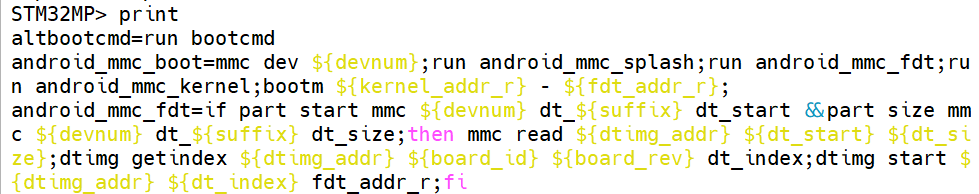
> 图：串口执行 "STM32MP> print" 输出环境变量（节选）：altbootcmd=run bootcmd；android_mmc_boot=mmc dev ${devnum};run android_mmc_splash;run android_mmc_fdt;run android_mmc_kernel;bootm ${kernel_addr_r} - ${fdt_addr_r}；android_mmc_fdt=if part start mmc ${devnum} dt_${suffix} dt_start &&part size mmc ${devnum} dt_${suffix} dt_size;then mmc read ${dtimg_addr} ${dt_start} ${dt_size};dtimg getindex ${dtimg_addr} ${board_id} ${board_rev} dt_index;dtimg start ${dtimg_addr} ${dt_index} fdt_addr_r;fi 等。

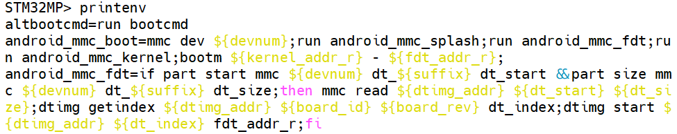
> 图：串口执行 "STM32MP> printenv" 输出与上图的 print 命令完全相同的环境变量内容（altbootcmd、android_mmc_boot、android_mmc_fdt 等），验证 "print" 与 "printenv" 效果相同。

<!-- Slide number: 6 -->
# 4.1 U-boot命令
命令支持Tab键补全
有些命令可重复执行，直接输入回车即执行上一次执行的命令
命令如果接受数值型参数，则一定是十六进制数，可以省略前缀“0x”或“0X”

<!-- Slide number: 7 -->
# 4.2 查询命令
bdinfo —— 查看开发板信息
printenv —— 查看环境变量
version —— 查看版本信息

<!-- Slide number: 8 -->
# 4.2 查询命令
bdinfo

boot_params:启动参数地址
DRAM bank -> start: DRAM内存起始地址
DRAM bank -> size: DRAM内存大小

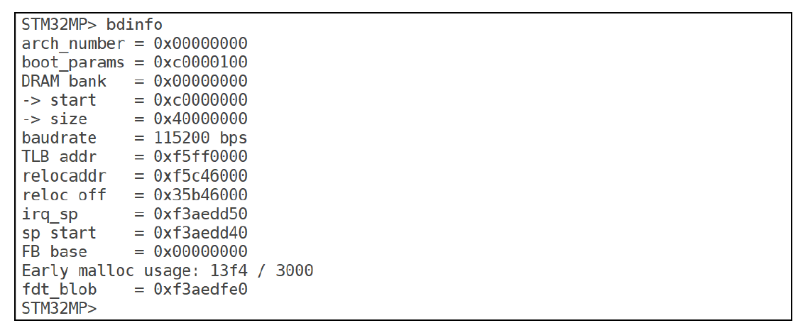
> 图：串口执行 "STM32MP> bdinfo" 输出开发板信息：arch_number = 0x00000000；boot_params = 0xc0000100；DRAM bank = 0x00000000，-> start = 0xc0000000，-> size = 0x40000000；baudrate = 115200 bps；TLB addr = 0xf5ff0000；relocaddr = 0xf5c46000；reloc off = 0x35b46000；irq_sp = 0xf3aedd50；sp_start = 0xf3aedd40；FB base = 0x00000000；Early malloc usage: 13f4 / 3000；fdt_blob = 0xf3aedfe0。

<!-- Slide number: 9 -->
# 4.2 查询命令
printenv
通常简写为print
查看全部环境变量：print
查看特定环境变量：print env_name

> 图：串口执行 "STM32MP> print" 查看全部环境变量（节选）：altbootcmd=run bootcmd；android_mmc_boot=mmc dev ${devnum};run android_mmc_splash;run android_mmc_fdt;run android_mmc_kernel;bootm ${kernel_addr_r} - ${fdt_addr_r}；android_mmc_fdt、android_mmc_kernel、android_mmc_splash（读取分区并加载内核/设备树/开机画面的脚本）；arch=arm；autoload=no；baudrate=115200；board=stm32mp1；board_name=stm32mp157d-atk；boot_a_script=load ${devtype} ${devnum}:${distro_bootpart} ${scriptaddr} ${prefix}${script}; source ${scriptaddr}；boot_device=mmc；boot_efi_binary、boot_extlinux 等。

<!-- Slide number: 10 -->
# 4.2 查询命令
version
查看uboot版本号

> 图：串口执行 "STM32MP> version" 输出：U-Boot 2020.01-stm32mp-r1 (Nov 24 2020 - 17:17:20 +0800)；arm-none-linux-gnueabihf-gcc (GNU Toolchain for the A-profile Architecture 9.2-2019.12 (arm-9.10)) 9.2.1 20191025；GNU ld (GNU Toolchain for the A-profile Architecture 9.2-2019.12 (arm-9.10)) 2.33.1.20191209。

<!-- Slide number: 11 -->
# 4.3 环境变量操作命令
printenv —— 查看环境变量
setenv —— 设置环境变量
saveenv —— 保存环境变量的修改到flash
env —— 所有环境变量操作的命令集合，可以不用，用前3个命令就足够了

<!-- Slide number: 12 -->
# 4.3 环境变量操作命令
setenv
设置环境变量：setenv env_name env_value
环境变量的值都是字符串，如果字符串中有空格用引号引起来
可以用于：增、删、改环境变量

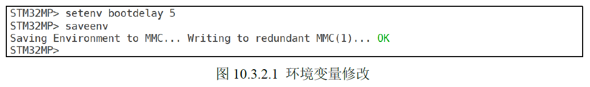
> 图：串口执行 "STM32MP> setenv bootdelay 5" 修改环境变量，再执行 "saveenv" 保存，输出 "Saving Environment to MMC... Writing to redundant MMC(1)... OK"。图注：图 10.3.2.1 环境变量修改。

<!-- Slide number: 13 -->
# 4.3 环境变量操作命令

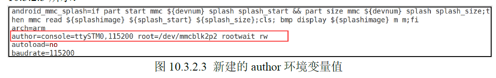
> 图：新增环境变量的命令：setenv author 'console=ttySTM0,11520 root=/dev/mmcblk2p2 rootwait rw '（值含空格用单引号引起来），随后执行 saveenv 保存。

> 图：print 输出中红框标出新建的环境变量：author=console=ttySTM0,11520 root=/dev/mmcblk2p2 rootwait rw（上下为 android_mmc_splash=…、arch=arm、autoload=no、baudrate=115200）。图注：图 10.3.2.3 新建的 author 环境变量值。

<!-- Slide number: 14 -->
# 4.3 环境变量操作命令
删除环境变量，只需给环境变量赋空值，例如删除author环境变量

对环境变量进行修改后，要用saveenv命令把修改保存到flash，否则修改只在内存中，重启会丢失

> 图：删除环境变量的命令：setenv author（给 author 赋空值即删除），随后执行 saveenv 保存。

<!-- Slide number: 15 -->
# 4.3 环境变量操作命令
重要的环境变量
bootcmd：启动命令（用于启动Linux内核）
bootargs：启动参数（Linux内核启动时传给内核的参数）
ipaddr：开发板IP
serverip：与开发板连接的电脑的IP
netmask：子网掩码，需使得ipaddr和serverip在同一子网
gatewayip：网关IP
ethaddr：网卡MAC地址（需先设置MAC地址网卡才能工作）

<!-- Slide number: 16 -->
# 4.3 环境变量操作命令
例：设置网络相关环境变量
设置电脑IP（与电脑的实际IP一致）
setenv serverip 192.168.1.249
设置开发板IP
setenv ipaddr 192.168.1.88
设置子网掩码
setenv netmask 255.255.255.0
保存设置到flash
saveenv

<!-- Slide number: 17 -->
# 4.4 网络操作命令
ping
dhcp
tftp —— tftp下载命令
nfs —— nfs下载命令

<!-- Slide number: 18 -->
# 4.4 网络操作命令
ping命令
用于检测开发板与电脑的连通性
只能从开发板ping电脑，电脑ping开发板无响应
例如电脑ip为192.168.1.249，ping命令如下：

> 图：串口执行 "STM32MP> ping 192.168.1.249"，输出 ethernet@5800a000 Waiting for PHY auto negotiation to complete............ done；Using ethernet@5800a000 device；host 192.168.1.249 is alive，说明开发板与电脑连通。

<!-- Slide number: 19 -->
# 4.4 网络操作命令
dhcp命令
如果开发板连接路由器，且路由器启用了dhcp服务，开发板可以通过dhcp命令自动获取ipaddr、netmask、gatewayip，就无需设置相关环境变量

还可用dhcp命令启动Linux内核（实际是调用TFTP）

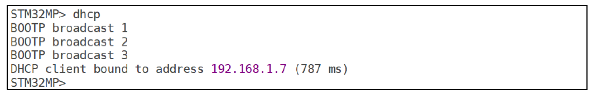
> 图：串口执行 "STM32MP> dhcp" 自动获取 IP，输出 BOOTP broadcast 1 / 2 / 3，DHCP client bound to address 192.168.1.7 (787 ms)。

> 图：串口执行 "STM32MP> ? dhcp" 查看 dhcp 命令帮助：dhcp - boot image via network using DHCP/TFTP protocol；Usage: dhcp [loadAddress] [[hostIPaddr:]bootfilename]。

<!-- Slide number: 20 -->
# 4.4 网络操作命令
tftp命令
通过tftp可以把电脑上的文件下载到开发板的内存（DRAM）
在电脑上需搭建好tftp服务器
例如，把电脑上名为uImage的文件下载到开发板DRAM的0xC2000000处

> 图：串口执行 "STM32MP> tftp c2000000 uImage" 下载文件，输出 Using ethernet@5800a000 device；TFTP from server 192.168.1.249; our IP address is 192.168.1.250；Filename 'uImage'.；Load address: 0xc2000000；Loading: ####（进度条）2.3 MiB/s；done；Bytes transferred = 7313888 (6f99e0 hex)。

<!-- Slide number: 21 -->
# 4.4 网络操作命令
有时候使用tftp命令下载文件的时候会出现如图所示的“Permission denied”错误

两个可能的原因：
要下载的文件所在目录无read权限
要下载的文件没有read权限
在电脑上用chmod命令修改权限即可

> 图：tftp 下载报错示例：串口执行 "STM32MP> tftp c2000000 uImage"，输出 TFTP from server 192.168.1.249; our IP address is 192.168.1.250；Filename 'uImage'.；Load address: 0xc2000000；Loading: *；TFTP error: 'Permission denied' (0)；Starting again，即 "Permission denied" 权限错误。

<!-- Slide number: 22 -->
# 4.4 网络操作命令
nfs命令
nfs也可以把电脑上的文件下载到开发板的内存（DRAM）
在电脑上需搭建好nfs服务器
与tftp不同，nfs必须给出要下载的文件在服务器上的完整路径，使用不太方便，例如：

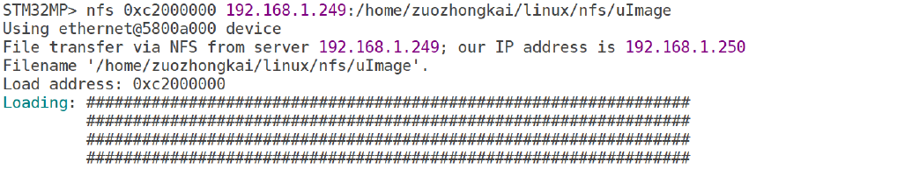
> 图：串口执行 "STM32MP> nfs 0xc2000000 192.168.1.249:/home/zuozhongkai/linux/nfs/uImage"，输出 Using ethernet@5800a000 device；File transfer via NFS from server 192.168.1.249; our IP address is 192.168.1.250；Filename '/home/zuozhongkai/linux/nfs/uImage'.；Load address: 0xc2000000；Loading: ####（下载进度）。

<!-- Slide number: 23 -->
# 4.5 eMMC和SD卡操作命令
eMMC和SD卡使用的相同的控制器，u-boot把它们视为相同的设备，通过mmc命令来操作
mmc是一组命令，其后跟不同的参数实现不同的功能

> 图：串口执行 "STM32MP> ? mmc" 输出 MMC 子系统帮助：mmc info - display info of the current MMC device；mmc read addr blk# cnt；mmc write addr blk# cnt；mmc erase blk# cnt；mmc rescan；mmc part - lists available partition on current mmc device；mmc dev [dev] [part] - show or set current mmc device [partition]；mmc list - lists available devices；mmc hwpartition [args...] - does hardware partitioning（含 WARNING: Partitioning is a write-once setting once it is set to complete. Power cycling is required to initialize partitions after set to complete.）；mmc bootbus dev boot_bus_width reset_boot_bus_width boot_mode；mmc bootpart-resize <dev> <boot part size MB> <RPMB part size MB>；mmc partconf [boot_ack boot_partition partition_access]；mmc rst-function dev value（WARNING: This is a write-once field and 0 / 1 / 2 are the only valid values.）；mmc setdsr <value> - set DSR register value。

<!-- Slide number: 24 -->

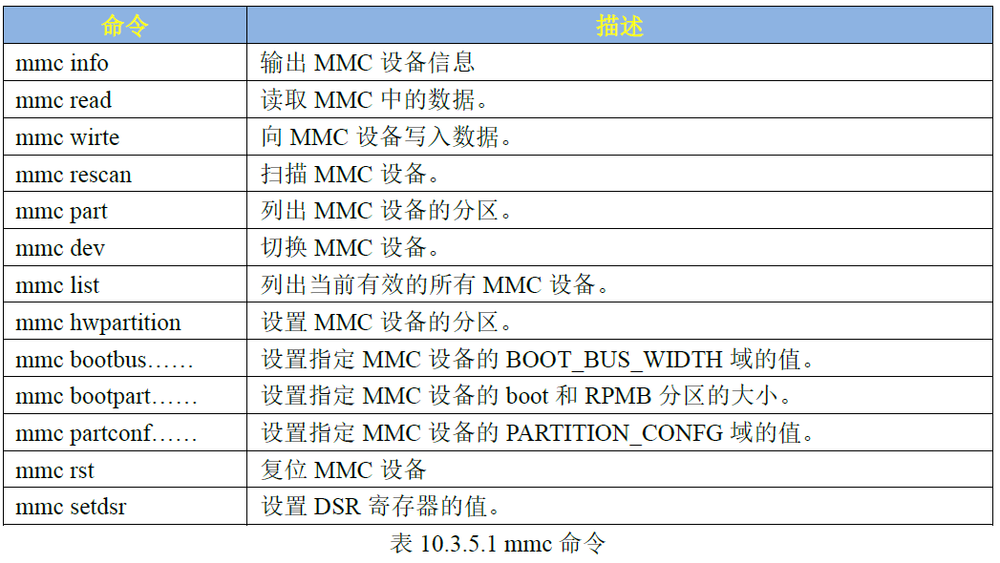
> 图：表格“表 10.3.5.1 mmc 命令”，两列“命令/描述”：mmc info-输出 MMC 设备信息；mmc read-读取 MMC 中的数据；mmc wirte-向 MMC 设备写入数据；mmc rescan-扫描 MMC 设备；mmc part-列出 MMC 设备的分区；mmc dev-切换 MMC 设备；mmc list-列出当前有效的所有 MMC 设备；mmc hwpartition-设置 MMC 设备的分区；mmc bootbus……-设置指定 MMC 设备的 BOOT_BUS_WIDTH 域的值；mmc bootpart……-设置指定 MMC 设备的 boot 和 RPMB 分区的大小；mmc partconf……-设置指定 MMC 设备的 PARTITION_CONFG 域的值；mmc rst-复位 MMC 设备；mmc setdsr-设置 DSR 寄存器的值。

<!-- Slide number: 25 -->
# 4.5 eMMC和SD卡操作命令
mmc info 命令
显示当前选中的mmc设备的信息，例如下图所示

当前设备的信息包括：设备是EMMC，EMMC芯片版本为5.1，容量为7.3GiB(EMMC为8GB)，总线速度为52000000Hz=52MHz，8位宽的总线。

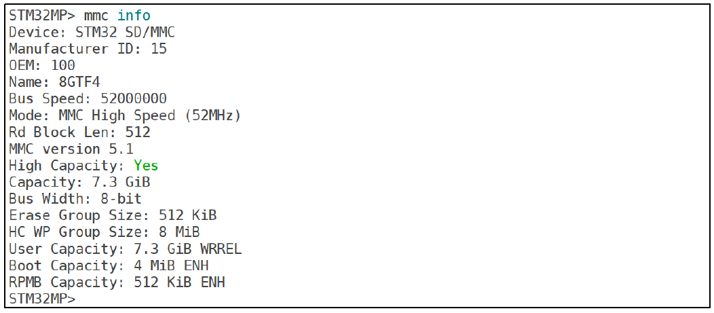
> 图：串口执行 "STM32MP> mmc info" 输出当前 eMMC 设备信息：Device: STM32 SD/MMC；Manufacturer ID: 15；OEM: 100；Name: 8GTF4；Bus Speed: 52000000；Mode: MMC High Speed (52MHz)；Rd Block Len: 512；MMC version 5.1；High Capacity: Yes；Capacity: 7.3 GiB；Bus Width: 8-bit；Erase Group Size: 512 KiB；HC WP Group Size: 8 MiB；User Capacity: 7.3 GiB WRREL；Boot Capacity: 4 MiB ENH；RPMB Capacity: 512 KiB ENH。

<!-- Slide number: 26 -->
# 4.5 eMMC和SD卡操作命令
mmc list 命令
列出开发板的全部mmc设备，例如：

其中，0号设备是SD卡，1号设备时eMMC

> 图：串口执行 "STM32MP> mmc list" 输出：STM32 SD/MMC: 0；STM32 SD/MMC: 1 (eMMC)，即 0 号设备是 SD 卡，1 号设备是 eMMC。

<!-- Slide number: 27 -->
# 4.5 eMMC和SD卡操作命令
mmc dev 命令
用于切换当前mmc设备
系统启动使用mmc设备为默认当前设备
例如，系统从eMMC启动，则1号设备为默认当前设备，如需切换到SD卡（0号设备），使用如下命令

> 图：串口执行 "STM32MP> mmc dev 0" 切换到 SD 卡，输出 switch to partitions #0, OK；mmc0 is current device。

<!-- Slide number: 28 -->
切换到SD卡后，再使用mmc info查看信息，变为如下信息

> 图：切换到 SD 卡后执行 "STM32MP> mmc info" 输出 SD 卡信息：Device: STM32 SD/MMC；Manufacturer ID: 3；OEM: 5344；Name: SC16G；Bus Speed: 50000000；Mode: SD High Speed (50MHz)；Rd Block Len: 512；SD version 3.0；High Capacity: Yes；Capacity: 14.8 GiB；Bus Width: 4-bit；Erase Group Size: 512 Bytes。

<!-- Slide number: 29 -->
如果一个mmc设备有多个分区，也可以把某一分区设置为当前设备
例如，例如把eMMC（1号设备）的2号分区设为当前分区，如图所示

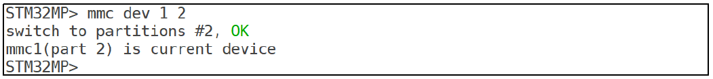
> 图：串口执行 "STM32MP> mmc dev 1 2" 把 eMMC（1 号设备）的 2 号分区设为当前设备，输出 switch to partitions #2, OK；mmc1(part 2) is current device。

<!-- Slide number: 30 -->
# 4.5 eMMC和SD卡操作命令
mmc part 命令
一个mmc设备通常有多个分区
用mmc part命令可以查看当前设备的分区，
例如，用mmc dev把1号设备设置为当前设备，用mmc part查看其分区，如下图所示

<!-- Slide number: 31 -->
图中有3个分区，第1分区为名为“ssbl”，用来存放uboot镜像，范围为：扇区0x400~0x13ff。第2分区名字为“boot”，用来存放linux内核镜像，范围为：扇区0x1400~0x213ff。第3分区名字为“rootfs”，用来存放根文件系统，占用了剩余的所有扇区，即扇区0x21400~0xe8fbff。

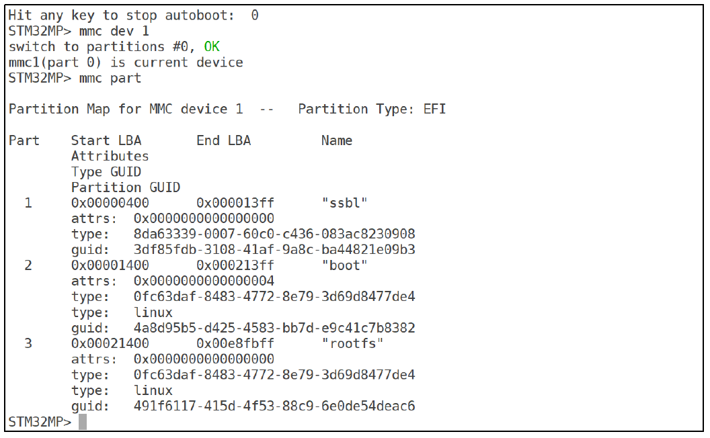
> 图：串口先执行 "mmc dev 1"（switch to partitions #0, OK，mmc1(part 0) is current device），再执行 "mmc part" 输出分区表：Partition Map for MMC device 1 -- Partition Type: EFI；第 1 分区 Start LBA 0x00000400、End LBA 0x000013ff，Name "ssbl"；第 2 分区 0x00001400~0x000213ff，Name "boot"（attrs: 0x0000000000000004，type: linux）；第 3 分区 0x00021400~0x00e8fbff，Name "rootfs"（type: linux），并给出各分区的 Attributes、Type GUID 与 Partition GUID。

<!-- Slide number: 32 -->
# 4.5 eMMC和SD卡操作命令
mmc read 命令
用于读取当前设备的数据到DRAM，命令格式如下：

addr 是DRAM中的地址（数据的起始地址）
blk# 要读取的起始扇区号
cnt 是读取的扇区数量（一个扇区为512Byte ）

> 图：mmc read 命令格式文本：mmc read addr blk# cnt。

<!-- Slide number: 33 -->
例如，读取eMMC的0x400扇区开始的数据，数据长度为0x10个扇区，读到DRAM的0xC0000000处：

> 图：串口执行 "STM32MP> mmc dev 1"（switch to partitions #0, OK，mmc1(part 0) is current device），再执行 "mmc read c0000000 400 10"，输出 MMC read: dev # 1, block # 1024, count 16 ... 16 blocks read: OK（其中 1024 和 16 为十进制显示）。
这些显示是10进制数

<!-- Slide number: 34 -->
# 4.5 eMMC和SD卡操作命令
mmc write 命令
用于把DRAM中的数据写入当前mmc设备中
命令格式为

mmc erase 命令
用于擦除当前mmc设备中的数据
在使用mmc write写入数据前，mmc相应区域需先擦除
命令格式为
mmc write addr blk# cnt
mmc erase blk# cnt

<!-- Slide number: 35 -->
# 4.6 ext文件系统操作命令
u-boot支持ext2和ext4两种文件系统格式
stm32mp1的系统镜像都是ext4格式，因此只关注ext4相关命令：
ext4ls —— ls命令
ext4load —— read命令
ext4write —— write命令

<!-- Slide number: 36 -->
# 4.6 ext文件系统操作命令
ext4ls 命令
用于列出某一ext4分区的文件和目录（类似Linux的ls命令）
命令格式如下

interface为设备接口，例如mmc
dev为设备号
part为分区号
directory为目录

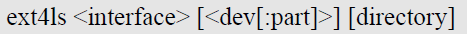
> 图：ext4ls 命令格式文本：ext4ls <interface> [<dev[:part]>] [directory]。

<!-- Slide number: 37 -->
例如，列出eMMC（1号mmc设备）的2号分区中的文件及目录

> 图：串口执行 "STM32MP> ext4ls mmc 1:2" 列出 eMMC 2 号分区内容：<DIR> 1024 .；<DIR> 1024 ..；2943 boot.scr.uimg；<DIR> 1024 lost+found；<DIR> 1024 mmc0_extlinux；<DIR> 1024 mmc1_extlinux；92670 splash.bmp；74594 stm32mp157d-atk.dtb；74014 stm32mp157d-atk-hdmi.dtb；74510 stm32mp157d-atk-spdif.dtb；8125872 uImage；3632241 uInitrd。

<!-- Slide number: 38 -->
# 4.6 ext文件系统操作命令
ext4load命令
用于读取ext4分区中的文件到DRAM中
命令格式为

interface、dev、part的作用与ext4ls命令中的对应参数相同
addr为DRAM中的地址
filename为所读文件的名字
bytes为读取的字节数（16进制表示），0或省略表示读到文件结束
pos为偏移量，0或省略表示从文件起始地址开始读

ext4load <interface> [<dev[:part]> [<addr> [<filename> [bytes [pos]]]]]

<!-- Slide number: 39 -->
例如，读取eMMC的2号分区中的uImage文件到DRAM的0xC2000000处

> 图：串口执行 "STM32MP> ext4load mmc 1:2 c2000000 uImage"，输出 8125872 bytes read in 207 ms (37.4 MiB/s)，即成功把 uImage 读到 DRAM 的 0xC2000000 处。

<!-- Slide number: 40 -->
# 4.6 ext文件系统操作命令
ext4write命令
用于把DRAM中的数据以文件存入ext4分区中
命令格式如下

absolute filename path 是带绝对路径的文件名
sizebytes 为文件大小
file offset 为文件偏移量

> 图：ext4write 命令格式文本：ext4write <interface> <dev[:part]> <addr> <absolute filename path> [sizebytes] [file offset]。

<!-- Slide number: 41 -->
例如，通过tftp把uImage下载到DRAM的0xC0000000处，然后将其写入eMMC的2号分区，保存成名为test_uImage的文件

> 图：串口执行 "STM32MP> tftp c0000000 uImage" 下载文件，输出 Using ethernet@5800a000 device；TFTP from server 192.168.1.249; our IP address is 192.168.1.250；Filename 'uImage'.；Load address: 0xc0000000；Loading: ####（进度条）2.4 MiB/s；done；Bytes transferred = 7313888 (6f99e0 hex)。

下载文件

<!-- Slide number: 42 -->

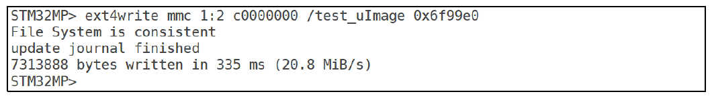
> 图：串口执行 "STM32MP> ext4write mmc 1:2 c0000000 /test_uImage 0x6f99e0" 把 DRAM 数据写入 eMMC 2 号分区，输出 File System is consistent；update journal finished；7313888 bytes written in 335 ms (20.8 MiB/s)。

> 图：串口执行 "STM32MP> ext4ls mmc 1:2" 查看写入结果，文件列表中红框标出新写入的 7313888 test_uImage（其余同 boot 分区原有文件 boot.scr.uimg、splash.bmp、stm32mp157d-atk.dtb、uImage、uInitrd 等）。
写入eMMC
查看写入结果

<!-- Slide number: 43 -->
# 4.7 启动Linux内核命令
u-boot本质上是为内核运行设置好软硬件环境，并启动内核，因此提供多种命令启动内核，包括：
bootm
bootz
boot
bootd

<!-- Slide number: 44 -->
# 4.7 启动Linux内核命令
bootm 命令
用于启动已下载到DRAM中的uImage镜像文件
uImage镜像文件是u-boot格式的内核镜像
bootm的命令格式为

addr为uImage文件在DRAM中的地址
“arg…”为其他可选参数
如果要使用initrd， “arg…”的第一个参数是initrd文件在DRAM中的地址
如果使用设备树， “arg…”的第二个参数设备树文件在DRAM中的地址
“arg…”的参数有固定的顺序，中间要省略的参数用“-”（减号）占位

> 图：bootm 命令格式文本：bootm [addr [arg ...]]。

<!-- Slide number: 45 -->
例1：通过tftp把内核镜像、设备树下载到DRAM，地址分别为0xC2000000、0xC4000000，然后启动内核

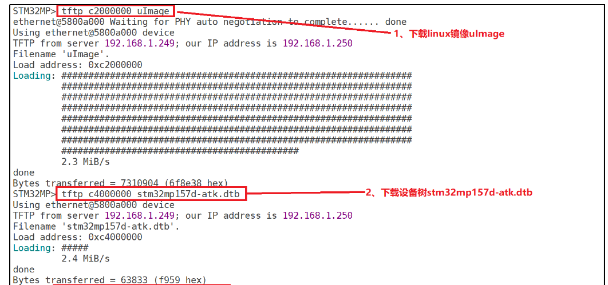
> 图：例 1 串口操作（红框标注）：1、下载linux镜像uImage：tftp c2000000 uImage，输出 TFTP from server 192.168.1.249; our IP address is 192.168.1.250，Filename 'uImage'.，Load address: 0xc2000000，Loading: #### 2.3 MiB/s，Bytes transferred = 7310904 (6f8e38 hex)；2、下载设备树stm32mp157d-atk.dtb：tftp c4000000 stm32mp157d-atk.dtb，输出 Load address: 0xc4000000，Loading: ##### 2.4 MiB/s，Bytes transferred = 63833 (f959 hex)。

### Notes:

<!-- Slide number: 46 -->

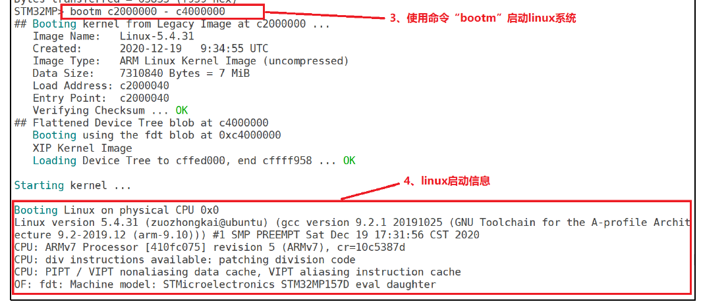
> 图：串口执行 "bootm c2000000 - c4000000"（红框标注 3、使用命令"bootm"启动linux系统），输出 ## Booting kernel from Legacy Image at c2000000 ...，Image Name: Linux-5.4.31，Created: 2020-12-19 9:34:55 UTC，Image Type: ARM Linux Kernel Image (uncompressed)，Data Size: 7310840 Bytes = 7 MiB，Load Address: c2000040，Entry Point: c2000040，Verifying Checksum ... OK，## Flattened Device Tree blob at c4000000，Booting using the fdt blob at 0xc4000000，XIP Kernel Image，Loading Device Tree to cfed0000, end cffff958 ... OK；随后 Starting kernel ...（4、linux启动信息）：Booting Linux on physical CPU 0x0，Linux version 5.4.31 (zuozhongkai@ubuntu) (gcc version 9.2.1 20191025 (GNU Toolchain for the A-profile Architecture 9.2-2019.12 (arm-9.10))) #1 SMP PREEMPT Sat Dec 19 17:31:56 CST 2020，CPU: ARMv7 Processor [410fc075] revision 5 (ARMv7), cr=10c5387d，CPU: div instructions available: patching division code，CPU: PIPT / VIPT nonaliasing data cache, VIPT aliasing instruction cache，OF: fdt: Machine model: STMicroelectronics STM32MP157D eval daughter。

<!-- Slide number: 47 -->
# 4.7 启动Linux内核命令
bootz 命令
bootz与bootm类，用于启动zImage镜像文件
zImage是另一种格式的内核镜像文件
使用zImage还是uImage取决于厂商提供哪种格式的文件
stm32mp1使用uImage
bootz与bootm的命令格式相同

<!-- Slide number: 48 -->
# 4.7 启动Linux内核命令
boot和bootd命令
boot和bootd是同一个命令
它用于执行bootcmd环境变量中保存的命令
在bootcmd环境变量中保存了启动内核的命令，所以boot能实现启动内核的效果
在ST提供的u-boot中没有使能boot命令，需要修改代码使能该命令，或者用“run bootcmd”达到等效效果

<!-- Slide number: 49 -->
例2：把例1中的下载内核、设备树，及启动内核的命令保存到bootcmd环境变量中，然后用boot命令启动内核。
   命令如下：

> 图：例 2 命令：setenv bootcmd 'tftp c2000000 uImage;tftp c4000000 stm32mp157d-atk.dtb;bootm c2000000 - c4000000'，然后 saveenv 保存，最后执行 boot 启动内核。

<!-- Slide number: 50 -->

> 图：例 2 运行结果：红框 1、设置环境变量并保存：setenv bootcmd 'tftp c2000000 uImage;tftp c4000000 stm32mp157d-atk.dtb;bootm c2000000 - c4000000' 与 saveenv，输出 Saving Environment to MMC... Writing to redundant MMC(1)... OK；2、使用命令boot启动linux：STM32MP> boot；3、bootcmd 环境变量运行，获取内核并启动：TFTP from server 192.168.1.249; our IP address is 192.168.1.250，Filename 'uImage'.，Load address: 0xc2000000，Bytes transferred = 8125072 (7bfdb0 hex)，Filename 'stm32mp157d-atk.dtb'.，Load address: 0xc4000000，Bytes transferred = 74594 (12362 hex)；随后 ## Booting kernel from Legacy Image at c2000000 ...，Image Name: Linux-5.4.31-g25d5f13e0，Data Size: 8125008 Bytes = 7.7 MiB，## Flattened Device Tree blob at c4000000，Starting kernel ...，最后打印内核启动信息：Booting Linux on physical CPU 0x0，Linux version 5.4.31-g25d5f13e0 (liangwencong@liangwencong) (gcc version 9.3.0 (GCC)) #28 SMP PT Fri Oct 30 12:31:03 CST 2020，CPU: ARMv7 Processor [410fc075] revision 5 (ARMv7), cr=10c5387d，OF: fdt: Machine model: STMicroelectronics STM32MP157C-DK2 Discovery Board。
运行结果：

<!-- Slide number: 51 -->
# 4.8 其他命令
reset 命令
用于重启开发板

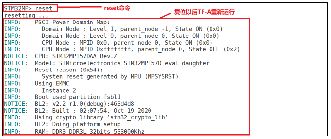
> 图：串口执行 "STM32MP> reset"（红框标注 reset命令）后输出 resetting ...，复位以后TF-A重新运行：PSCI Power Domain Map（Domain Node: Level 1/Level 0，CPU Node: MPID 0x0 State ON、MPID 0xffffffff State OFF），CPU: STM32MP157DAA Rev.Z，Model: STMicroelectronics STM32MP157D eval daughter，Reset reason (0x54): System reset generated by MPU (MPSYSRST)，Using EMMC Instance 2，Boot partition fsbl1，Boot: v2.2-r1.0(debug):463d4d8，BL2 Built : 02:07:54, Oct 19 2020，Using crypto library 'stm32_crypto_lib'，BL2: Doing platform setup，RAM: DDR3-DDR3L 32bits 533000Khz。

<!-- Slide number: 52 -->
# 4.8 其他命令
run 命令
用于运行环境变量中定义的命令
run命令最大的作用在于运行自定义的环境变量，以便在不同的启动方式之间切换，方便系统调试

<!-- Slide number: 53 -->
例3：在调试 Linux系统时，常常要在网络启动和 eMMC启动之间来回切换，而bootcmd只能保存一种启动方式，如果要换另外一种启动方式的话就得重写 bootcmd，会很麻烦。这里就可以通过自定义环境变量来实现不同的启动方式，比如定义环境变量mybootemmc表示从eMMC启动，定义mybootnet表示从网络启动。切换启动方式只需要运行“run mybootxxx (xxx为 emmc或 net)”即可

<!-- Slide number: 54 -->
创建环境变量mybootemmc和mybootnet，命令如下：

从eMMC启动，执行命令：

从网络启动，执行命令：

> 图：创建自定义启动环境变量的命令（红字提示“（有空格）”处须有空格占位）：setenv mybootemmc 'ext4load mmc 1:2 c2000000 uImage;ext4load mmc 1:2 c4000000（有空格）stm32mp157d-atk.dtb;bootm c2000000 - c4000000'；setenv mybootnet 'tftp c2000000 uImage;tftp c4000000 stm32mp157d-atk.dtb;bootm c2000000 -（有空格）c4000000'；最后 saveenv 保存。

> 图：从 eMMC 启动执行的命令：run mybootemmc。

> 图：从网络启动执行的命令：run mybootnet。

<!-- Slide number: 55 -->
# 4.8 其他命令
go 命令
用于跳到指定的地址处执行程序，命令格式如下：

addr是程序在 DRAM中的起始地址

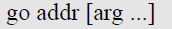
> 图：go 命令格式文本：go addr [arg ...]。
