<!-- Slide number: 1 -->
# 第5章 移植Linux内核

<!-- Slide number: 2 -->
# 5.1 Linux版本及特点
Linux内核版本可以从源代码顶层目录中的Makefile文件中看到

VERSION为主版本号；PATCHLEVEL次版本号； SUBLEVEL为修改次数
4.0版本之前， PATCHLEVEL奇数是开发中的版本，偶数是稳定版本，现在已不区分奇偶数
PATCHLEVEL按顺序递增，最大到19或20，之后VERSION加1
SUBLEVEL按顺序递增，在内核增加安全补丁、修复bug时会改变
EXTRAVERSION通常为空。有时是类似“-rc6”的字符串，代表预览版本（开发中的版本）

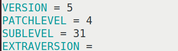
> 图：Linux内核源码顶层Makefile中的版本号定义：VERSION = 5，PATCHLEVEL = 4，SUBLEVEL = 31，EXTRAVERSION为空

<!-- Slide number: 3 -->

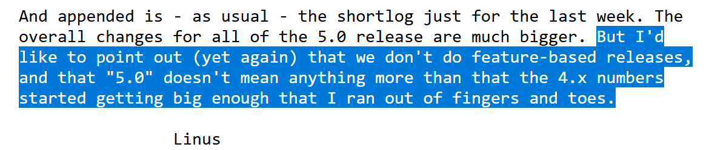
> 图：Linus关于5.0版本发布的邮件片段（英文）："And appended is - as usual - the shortlog just for the last week. The overall changes for all of the 5.0 release are much bigger. But I'd like to point out (yet again) that we don't do feature-based releases, and that \"5.0\" doesn't mean anything more than that the 4.x numbers started getting big enough that I ran out of fingers and toes."，署名Linus（说明版本号只是数字变大，并非按功能发布）

<!-- Slide number: 4 -->
# 5.1 Linux版本及特点
Linux内核最初版本（0.01）在1991年发布，是Linus Torvalds开发的一个类Unix操作系统内核
1994年发布1.0官方版本，支持386CPU（仅支持单CPU系统）
1995年发布1.2版本，这是第一个支持多平台（Alpha、Sparc、Mips等）的官方版本

<!-- Slide number: 5 -->
# 5.1 Linux版本及特点
1996年发布2.0版本，支持更多平台，这是第一个支持SMP（Symmetric Multi-Processing）体系的内核版本
2003年发布2.6版本，此版本有极大改进，支持更多处理器（从嵌入式系统到64位的服务器）；使用新的调度器；内核可被抢占；改进I/O子系统；改进文件系统；支持没有MMU的处理器
随着软硬件技术的不断发展，Linux内核也在不断加入新功能、新特性，详细情况可见： https://zhuanlan.zhihu.com/p/123987816
到2023年7月，最新稳定内核版本为6.4.5

<!-- Slide number: 6 -->
# 5.1 Linux版本及特点
内核源码可从官方网站 www.kernel.org 获取

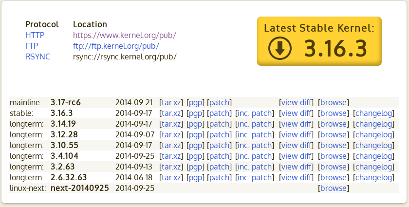
> 图：kernel.org官网页面截图：Protocol/Location列表——HTTP: https://www.kernel.org/pub/、FTP: ftp://ftp.kernel.org/pub/、RSYNC: rsync://rsync.kernel.org/pub/，右侧黄色徽标"Latest Stable Kernel: 3.16.3"；下方按mainline、stable、longterm、linux-next分类列出各版本：mainline 3.17-rc6（2014-09-21）、stable 3.16.3（2014-09-17）、longterm 3.14.19、3.12.28、3.10.55、3.4.104、3.2.63、2.6.32.63、linux-next next-20140925，每项附[tar.xz][pgp][patch][inc.patch][view diff][browse][changelog]等链接

<!-- Slide number: 7 -->
# 5.1 Linux版本及特点
内核源码可从官方网站 www.kernel.org 获取

> 图：www.kernel.org官网截图：可用HTTP（https://www.kernel.org/pub/）、FTP（ftp://ftp.kernel.org/pub/）、RSYNC（rsync://rsync.kernel.org/pub/）三种协议下载源码，"Latest Stable Kernel"徽标显示3.16.3，列表给出mainline 3.17-rc6、stable 3.16.3、longterm 3.14.19/3.12.28/3.10.55/3.4.104/3.2.63/2.6.32.63及linux-next next-20140925的发布日期与tar.xz、patch等下载链接

<!-- Slide number: 8 -->
# 5.1 Linux版本及特点
内核源码可从官方网站 www.kernel.org 获取

> 图：kernel.org网站截图：顶部为HTTP/FTP/RSYNC下载地址（https://www.kernel.org/pub/ 等），右上角"Latest Stable Kernel: 3.16.3"，下方依次列出mainline 3.17-rc6、stable 3.16.3、longterm 3.14.19、3.12.28、3.10.55、3.4.104、3.2.63、2.6.32.63、linux-next next-20140925，各版本附发布日期及tar.xz、pgp、patch、inc.patch、view diff、browse、changelog链接

<!-- Slide number: 9 -->

> 图：内核官方网站www.kernel.org页面：列出了HTTP、FTP、RSYNC三种源码获取地址（https://www.kernel.org/pub/ 等）和"Latest Stable Kernel: 3.16.3"徽标，以及mainline（3.17-rc6）、stable（3.16.3）、longterm（3.14.19、3.12.28、3.10.55、3.4.104、3.2.63、2.6.32.63）、linux-next（next-20140925）各类版本及下载链接
# 5.1 Linux版本及特点
内核源码可从官方网站 www.kernel.org 获取

<!-- Slide number: 10 -->
# 5.2 Linux源码目录结构
内核源码结构
    Linux内核文件有60K+个，代码有2.5M+行，非常复杂，但我们可以对其文件组织结构作初步了解

> 图：5.4.31版内核源码顶层目录截图：包含arch、block、certs、crypto、Documentation、drivers、fs、include、init、ipc、kernel、lib、LICENSES、mm、net、samples、scripts、security、sound、tools、usr、virt等目录，以及.git、CONTRIBUTING.md、COPYING、CREDITS、Kbuild、Kconfig、MAINTAINERS、Makefile、Module.symvers、modules.builtin、modules.builtin.modinfo、README、System.map、vmlinux、vmlinux.o、.clang-format、.cocciconfig、.config、.config.old、.get_maintainer.ignore、.gitattributes、.gitignore、.mailmap等文件，还有编译生成的.Makefile.swp、.missing-syscalls.d、.scmversion、.tmp_kallsyms1.o/.S、.tmp_kallsyms2.o/.S、.tmp_System.map、.tmp_vmlinux1、.tmp_vmlinux2、.version、.vmlinux.cmd等文件
5.4.31版内核源码顶层目录（含编译生成文件）

<!-- Slide number: 11 -->

> 图：内核源码顶层目录说明表（类型/名字/描述/备注三列，备注均为"Linux自带"的文件夹）：arch架构相关目录、block块设备相关目录、crypto加密相关目录、Documentation文档相关目录、drivers驱动相关目录、fs文件系统相关目录、include头文件相关目录、init初始化相关目录、ipc进程间通信相关目录、kernel内核相关目录、lib库相关目录、LICENSES许可相关目录、mm内存管理相关目录、net网络相关目录、samples例程相关目录、scripts脚本相关目录、security安全相关目录、sound音频处理相关目录

<!-- Slide number: 12 -->

> 图：目录说明表（续）：文件夹tools工具相关目录、usr与initramfs相关的目录（用于生成initramfs）、virt提供虚拟机技术(KVM)；文件.config为Linux最终使用的配置文件（编译生成的文件）、.gitignore（git工具相关文件）、.mailmap（邮件列表）、.version（和版本有关）、.vmlinux.cmd（cmd文件，用于生成vmlinux，Linux自带）、COPYING版权声明、CREDITS Linux贡献者、Kbuild（Makefile会读取此文件）、Kconfig（图形化配置界面的配置文件）、MAINTAINERS维护者名单、Makefile（Linux顶层Makefile）、Module.xx/modules.xx（一系列文件，和模块有关，编译生成）、README（Linux描述文件）、stm32mp157d_atk.sh（正点原子提供的Linux编译脚本）、System.map符号表、vmlinux（编译出来的、未压缩的ELF格式Linux文件，编译生成）、vmlinux.o（编译出来的vmlinux.o文件）

<!-- Slide number: 13 -->
# 5.2 Linux源码目录结构
1. arch目录
CPU架构相关目录，每种架构（x86、arm、arm64、risc-v等）对应其中一个子目录，
每种架构的子目录又包含很多子目录，如boot、 common、 configs等

<!-- Slide number: 14 -->

> 图：arch/arm目录截图，包含boot、common、configs、crypto、include、kernel、kvm、lib子目录，以及各平台目录mach-actions、mach-alpine、mach-artpec、mach-asm9260、mach-aspeed、mach-at91、mach-axxia、mach-bcm、mach-berlin、mach-clps711x、mach-cns3xxx、mach-davinci、mach-digicolor、mach-dove、mach-ebsa110、mach-efm32、mach-ep93xx、mach-exynos、mach-footbridge、mach-gemini、mach-highbank、mach-hisi、mach-imx、mach-integrator、mach-iop32x、mach-ixp4xx、mach-keystone、mach-lpc18xx、mach-lpc32xx、mach-mediatek、mach-meson、mach-milbeaut、mach-mmp、mach-moxart、mach-mv78xx0、mach-mvebu、mach-mxs、mach-nomadik、mach-npcm、mach-nspire、mach-omap1、mach-omap2、mach-orion5x、mach-oxnas、mach-picoxcell、mach-prima2、mach-pxa、mach-qcom、mach-rda、mach-realview、mach-rockchip、mach-rpc、mach-s3c24xx、mach-s3c64xx、mach-s5pv210、mach-sa1100、mach-shmobile、mach-socfpga、mach-spear、mach-sti、mach-stm32、mach-sunxi等
arch/arm目录

<!-- Slide number: 15 -->
# 5.2 Linux源码目录结构
arch/arm目录包含了32位arm处理器相关的文件
这些文件用于控制系统引导、系统调用、动态调频、主频设置等
arch/arm/configs目录中是不同平台（即开发板）的默认配置文件（xxx_defconfig），其中有fsmp1a开发板参考的配置multi_v7_defconfig，及我们生成的fsmp1a开发板的配置文件stm32mp1_fsmp1a_defconfig

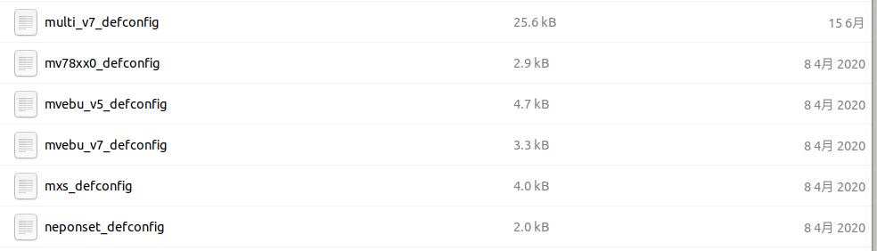
> 图：arch/arm/configs目录截图，列出各平台默认配置文件（xxx_defconfig）：multi_v7_defconfig（25.6 kB，15 6月）、mv78xx0_defconfig（2.9 kB）、mvebu_v5_defconfig（4.7 kB）、mvebu_v7_defconfig（3.3 kB）、mxs_defconfig（4.0 kB）、neponset_defconfig（2.0 kB），日期多为8 4月 2020
arch/arm/configs目录

<!-- Slide number: 16 -->
# 5.2 Linux源码目录结构
arch/arm/boot目录下有uImage、zImage、Image等编译生成的内核镜像文件
arch/arm/boot/dts目录下是设备树源文件，及编译生成的设备树二进制文件（xxx.dtb文件）
arch/arm/mach-xxx目录为相应平台的驱动和初始化文件，比如 mach-stm32目录里面就是STM32系列CPU的驱动和初始化文件

<!-- Slide number: 17 -->
# 5.2 Linux源码目录结构
2. Documentation目录
内核相关文档，如果要想了解 Linux某个功能模块或驱动，可以在 Documentation目录中查找有没有对应的文档
3. init目录
此目录存放 Linux内核启动时的初始化代码
4. kernel目录
Linux内核代码
5. drivers目录
驱动目录文件，根据驱动类型的不同，分门别类进行整理，如 drivers/i2c就I2C相关驱动目录，drivers/gpio是GPIO相关的驱动目录

<!-- Slide number: 18 -->
# 5.2 Linux源码目录结构
6. “.config”文件
项目配置文件，内核的当前配置记录在其中
编译时会读取此文件，根据此文件决定编译哪些功能和模块
注意是隐藏文件
7. Kconfig文件
图形化配置工具的配置文件
8. Makefile文件
顶层Makefile文件控制整个项目的编译
各子目录下的Makefile控制各功能模块的编译，并被上层Makefile引用
9. README文件
详细讲解了如何编译Linux源码，以及Linux源码的目录信息

<!-- Slide number: 19 -->
# 5.3 Linux编译准备
内核的Makefile文件
内核源码包含有多个Makefile文件，它们又包含其他一些文件（如配置信息、通用规则等）

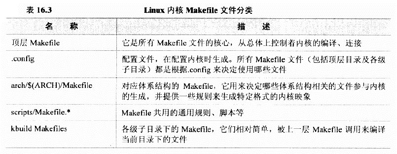
> 图：表16.3 Linux内核Makefile文件分类：顶层Makefile（所有Makefile文件的核心，从总体上控制着内核的编译、连接）、.config（配置文件，在配置内核时生成，所有Makefile文件（包括顶层目录及各级子目录）都是根据.config来决定使用哪些文件）、arch/$(ARCH)/Makefile（对应体系结构的Makefile，它用来决定哪些体系结构相关的文件参与内核的生成，并提供一些规则来生成特定格式的内核映象）、scripts/Makefile.*（Makefile共用的通用规则、脚本等）、kbuild Makefiles（各级子目录下的Makefile，它们相对简单，被上一层Makefile调用来编译当前目录下的文件）
文档Documentation/kbuild/makefiles.txt对各makefile文件有详细说明

<!-- Slide number: 20 -->
以上文件实现的功能：
（1）.config文件中定义了一系列变量，Makefile结合这些变量确定哪些文件被编进内核、哪些文件被编成模块、哪些文件不使用、涉及哪些子目录

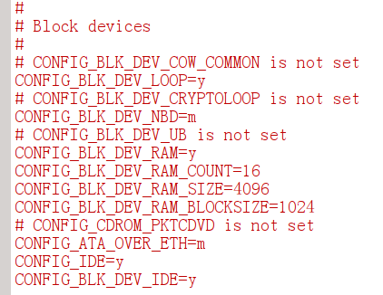
> 图：.config文件片段（Block devices块设备部分），体现三种配置结果——编进内核（=y）：CONFIG_BLK_DEV_LOOP=y、CONFIG_BLK_DEV_RAM=y、CONFIG_BLK_DEV_RAM_COUNT=16、CONFIG_BLK_DEV_RAM_SIZE=4096、CONFIG_BLK_DEV_RAM_BLOCKSIZE=1024、CONFIG_IDE=y、CONFIG_BLK_DEV_IDE=y；编成模块（=m）：CONFIG_BLK_DEV_NBD=m、CONFIG_ATA_OVER_ETH=m；不使用（is not set）："# CONFIG_BLK_DEV_COW_COMMON is not set"、"# CONFIG_BLK_DEV_CRYPTOLOOP is not set"、"# CONFIG_BLK_DEV_UB is not set"、"# CONFIG_CDROM_PKTCDVD is not set"
编进内核
编成模块
不使用

.config文件由内核配置工具自动生成，不要手动修改

<!-- Slide number: 21 -->
（2）顶层Makefile决定顶层目录下的哪些子目录编进内核
（3）arch/$(ARCH)/Makefile决定arch/$(ARCH)目录中哪些和架构相关的文件和子目录被编进内核
（4）各级子目录下的Makefile决定该目录下哪些文件编进内核、哪些编成模块，进入哪些子目录继续调用它们的Makefile
（5）顶层Makefile按照一定顺序组织文件，根据连接脚本arch/$(ARCH)/kernel/vmlinux.lds生成内核映像文件vmlinux

<!-- Slide number: 22 -->
# 5.3 Linux编译准备
内核文件
vmlinux：直接编译得到的最原始的ELF格式的内核文件，未压缩
Image：由vmlinux文件经格式转换得到的内核文件（vmlinux为ELF格式，Image为bin格式），未压缩
zImage：由Image压缩后得到的内核文件
uImage：U-Boot专用的压缩文件，在zImage基础上添加了64Byte（0x40）的文件头

<!-- Slide number: 23 -->
# 5.3 Linux编译准备
内核配置
在内核顶层目录下执行命令：
    make menuconfig
    可启动内核的配置工具

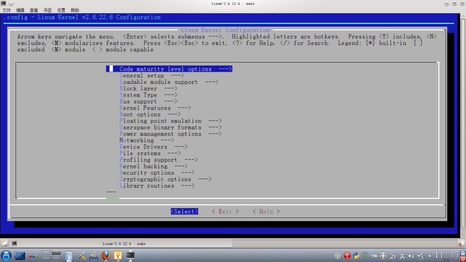
> 图：执行make menuconfig后启动的内核配置工具界面（.config - Linux Kernel v2.6.22.6 Configuration），顶部操作说明：Arrow keys navigate the menu. <Enter> selects submenus --->，Highlighted letters are hotkeys，Pressing <Y> includes、<N> excludes、<M> modularizes features，Press <Esc><Esc> to exit、<Top> for Help、</> for Search，Legend: [*] built-in [ ] excluded <M> module < > module capable；主菜单项：Code maturity level options --->、General setup --->、Loadable module support --->、Block layer --->、System Type --->、Bus support --->、Kernel Features --->、Boot options --->、Floating point emulation --->、Userspace binary formats --->、Power management options --->、Networking --->、Device Drivers --->、File systems --->、Profiling support --->、Kernel hacking --->、Security options --->、Cryptographic options --->、Library routines --->，底部按钮<Select>、<Exit>、<Help>

<!-- Slide number: 24 -->
通过上述工具逐项选择，对内核进行配置
配置界面中，以[ ]开头的选项表示相应功能被编进内核（[*]），或没有使用（[ ]）；< >表示相应功能可以编进内核（<*>），可被编成模块（<M>），可以不使用（< >）

还有一些选项，需要给它们赋值（十进制数、十六进制数，或字符串）

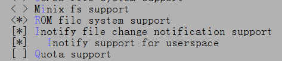
> 图：menuconfig中编进内核/编成模块选项示例：< > Minix fs system（未使用）、<*> ROM file system support（编进内核）、[*] Inotify file change notification support（编进内核）、[*] Inotify support for userspace（编进内核）、[ ] Quota support（未选中）

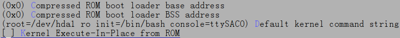
> 图：需要赋值的选项示例：（十六进制数）(0x0) Compressed ROM boot loader base address、(0x0) Compressed ROM boot loader BSS address；（字符串）(root=/dev/hda1 ro init=/bin/bash console=ttySAC0) Default kernel command string；[ ] Kernel Execute-In-Place from ROM

<!-- Slide number: 25 -->
内核的配置项有上千个，逐项配置难度很大（需要对每个选项的作用都了解），通常做法是在现有的某个配置相似的开发板的配置文件上进行修改

<!-- Slide number: 26 -->
# 5.4 Linux内核移植
移植目标
基于ST提供的5.4.31版Linux内核（它已适配ST官方开发板）进行移植，使其支持FS-MP1A开发板
移植MMC、网卡等最基本设备的驱动，使开发板能进入到Linux的命令行界面

<!-- Slide number: 27 -->
# 5.4 Linux内核移植
0. 安装交叉编译工具链
ST提供的编译器（编译u-boot使用的编译器）可以用来编译Linux内核，但使用上比较麻烦，编译过程容易出错
并且ST提供的编译器由于缺少一些库，无法直接编译busybox（下一章构建文件系统会用到）
因此本章安装新的编译器，用于后续程序的编译
ST建议的编译器如下图所示

<!-- Slide number: 28 -->

> 图：ST官方文档"5.2 ARM cross compiler"页面：说明交叉编译器来源有三种——(1) the SDK toolchain（见Cross-compile with OpenSTLinux SDK，PATH和CROSS_COMPILE自动更新）；(2) an existing package（例如在Ubuntu/Debian上安装gcc-arm-linux-gnueabihf：PC $> sudo apt-get）；(3) an existing toolchain：latest gcc toolchain provided by arm（https://developer.arm.com/open-source/gnu-toolchain/gnu-a/downloads）、gcc v7 toolchain provided by linaro（https://www.linaro.org/downloads）。并以gcc-arm-9.2-2019.12-x86_64-arm-none-linux-gnueabihf.tar.xz为例给出环境变量设置命令：PC $> export PATH=$HOME/gcc-arm-9.2-2019.12-x86_64-arm-none-linux-gnueabihf/bin:$PATH、PC $> export CROSS_COMPILE=arm-none-linux-gnueabihf-；以及gcc-linaro-7.2.1-2017.11-x86_64_arm-linux-gnueabi.tar.xz的对应export PATH/CROSS_COMPILE命令
（1）ST官方提供的编译器
（2）Linux系统提供的编译器
（3）其它现有的编译器

<!-- Slide number: 29 -->
# 5.4 Linux内核移植
安装交叉编译工具链
Linux系统提供的编译器和现有的一些编译器都可以用于编译内核
此处选择ARM官方提供的gcc-arm-9.2-2019.12-x86_64-arm-none-linux-gnueabihf 编译器
AMR官方编译器下载地址：https://developer.arm.com/downloads/-/gnu-a

<!-- Slide number: 30 -->

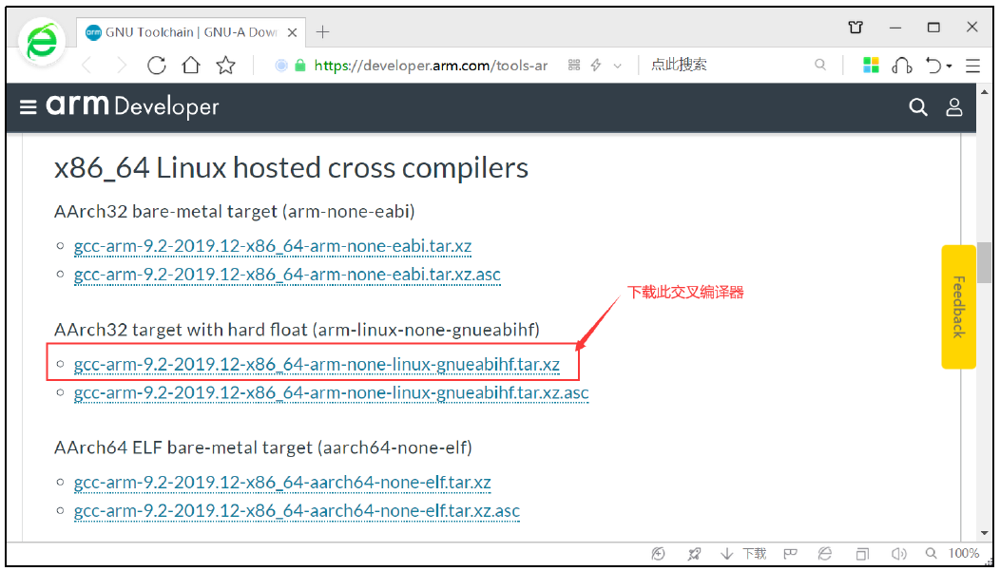
> 图：arm Developer网站（developer.arm.com/tools_ar）"x86_64 Linux hosted cross compilers"下载页面，分三组：AArch32 bare-metal target (arm-none-eabi)、AArch32 target with hard float (arm-linux-none-gnueabihf)、AArch64 ELF bare-metal target (aarch64-none-elf)；红框选中并标注"下载此交叉编译器"的是AArch32 target with hard float分组下的gcc-arm-9.2-2019.12-x86_64-arm-none-linux-gnueabihf.tar.xz（及其.asc校验文件）

<!-- Slide number: 31 -->
# 5.4 Linux内核移植
安装交叉编译工具链
将编译器安装包解压到PC的Linux的/usr/local/arm目录
编辑PC的Linux中/etc/profile文件，在末尾添加以下内容，添加编译器的搜索路径到PATH环境变量

实际上此处添加的是arm-none-linux-gnueabihf-gcc程序的路径
环境变量在重新登录系统后生效

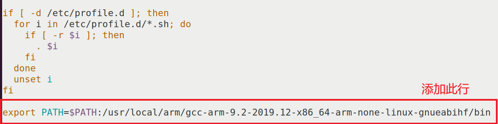
> 图：/etc/profile文件内容截图，原有内容为：if [ -d /etc/profile.d ]; then for i in /etc/profile.d/*.sh; do if [ -r $i ]; then . $i; fi; done; unset i; fi；末尾红框标注"添加此行"的新增内容：export PATH=$PATH:/usr/local/arm/gcc-arm-9.2-2019.12-x86_64-arm-none-linux-gnueabihf/bin

<!-- Slide number: 32 -->
# 5.4 Linux内核移植
安装交叉编译工具链
执行以下命令，能正确找到命令即安装成功

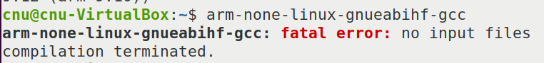
> 图：终端验证截图：提示符cnu@cnu-VirtualBox:~$后执行arm-none-linux-gnueabihf-gcc，输出"arm-none-linux-gnueabihf-gcc: fatal error: no input files / compilation terminated."——能找到该命令（仅提示无输入文件），说明交叉编译工具链安装成功

<!-- Slide number: 33 -->
# 5.4 Linux内核移植
交叉编译工具链的命名规则
arch [-vendor] [-os] [-(gnu)eabi]
arch : 架构的意思，如ARM ，MIPS
vendor： 工具链的提供厂商
os： 编译出的可执行程序所支持的操作系统
eabi：嵌入式应用二进制接口（Embedded Application Binary Interface）
例如arm-none-linux-gnueabihf-gcc表示生成的可执行程序支持arm架构，无特定厂商，支持Linux操作系统，支持eabi接口，hf支持硬件浮点计算（hard float）

<!-- Slide number: 34 -->
# 5.4 Linux内核移植
交叉编译工具链的命名规则
arm gcc还分为是否支持操作系统
支持操作系统： arm-none-linux-eabi-gcc
不支持操作系统：arm-none-eabi-gcc

<!-- Slide number: 35 -->
# 5.4 Linux内核移植
安装u-boot tools
编译内核生成uImage文件时需要用到一个工具程序mkimage

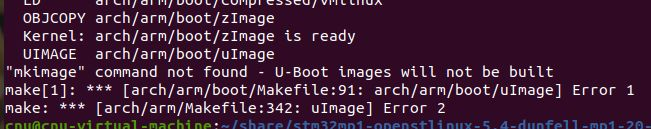
> 图：编译内核时缺少mkimage的报错截图：依次输出LD arch/arm/boot/compressed/vmlinux、OBJCOPY arch/arm/boot/Image、Kernel: arch/arm/boot/zImage is ready、UIMAGE arch/arm/boot/uImage，随后报错"mkimage" command not found - U-Boot images will not be built，make[1]: *** [arch/arm/Makefile:342: arch/arm/boot/uImage] Error 1，make: *** [arch/arm/Makefile:342: uImage] Error 2

编译内核时缺少mkimage的错误

<!-- Slide number: 36 -->
# 5.4 Linux内核移植
安装u-boot tools
mkimage的安装方法以下二选一：
mkimage可以在u-boot源码下的tools目录中找到（编译u-boot后会生成），将其复制到PC的"/bin"目录下，并设置可执行权限
    chmod +x /bin/mkimage
用以下命令安装Ubuntu提供的u-boot-tools软件包
    sudo apt install u-boot-tools

<!-- Slide number: 37 -->
# 5.4 Linux内核移植
1.获取源码
解压ST提供源码包，获取Linux源码，如图所示
其中linux-5.4.31.tar.xz为Linux官方源码（不含ST的代码）
.patch文件是ST提供的代码补丁
.config文件是ST提供的配置文件补丁

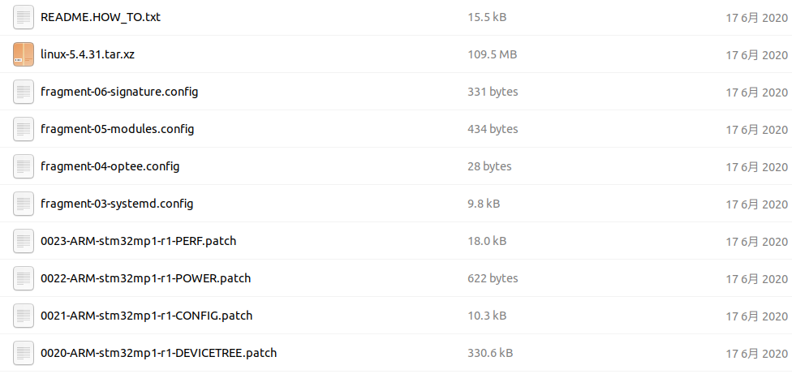
> 图：解压后源码包的文件列表：README.HOW_TO.txt（15.5 kB）、linux-5.4.31.tar.xz（109.5 MB）、fragment-06-signature.config（331 bytes）、fragment-05-modules.config（434 bytes）、fragment-04-optee.config（28 bytes）、fragment-03-systemd.config（9.8 kB）、0023-ARM-stm32mp1-r1-PERF.patch（18.0 kB）、0022-ARM-stm32mp1-r1-POWER.patch（622 bytes）、0021-ARM-stm32mp1-r1-CONFIG.patch（10.3 kB）、0020-ARM-stm32mp1-r1-DEVICETREE.patch（330.6 kB），日期均为17 6月 2020

<!-- Slide number: 38 -->
# 5.4 Linux内核移植
2. 给源码打上ST提供的补丁
按README.HOW_TO.txt给出的步骤完成

> 图：README.HOW_TO.txt第48-74行内容——"3. Prepare kernel source:"步骤：If you have the tarball and the list of patches, then you must extract the tarball and apply the patches. $> tar xfJ linux-5.4.31.tar.xz（解压后生成内核源码目录），$> cd linux-5.4.31；打补丁：if there is some patch, please apply it on source code，$> for p in `ls -1 ../*.patch`; do patch -p1 < $p; done；"4. Manage the kernel source code:"（用git管理）：$ test -d .git || git init . && git add . && git commit -m "new kernel" && git gc，$ git checkout -b WORKING，Apply patches: $ for p in `ls -1 <path to patch>/*.patch`; do git am $p; done

<!-- Slide number: 39 -->
# 5.4 Linux内核移植
3. 生成默认配置
按README.HOW_TO.txt给出的步骤完成
加载multi_v7默认配置到.config
打上fragment*.config补丁
对oldconfig记录中没有的新增选项都选择yes
注意：这条命令yes后面是两个‘'’,而不是一个“''”，不要输入错了!！！

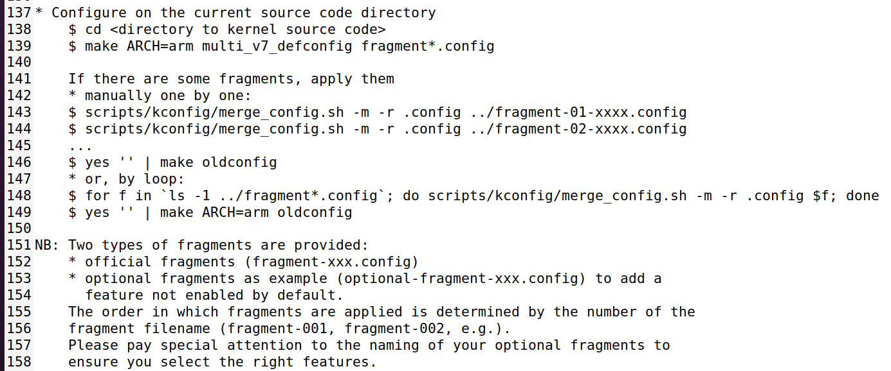
> 图：README.HOW_TO.txt第137-158行（生成默认配置的步骤）：$ cd <directory to kernel source code>；$ make ARCH=arm multi_v7_defconfig fragment*.config；If there are some fragments, apply them，manually one by one：$ scripts/kconfig/merge_config.sh -m -r .config ../fragment-01-xxxx.config、$ scripts/kconfig/merge_config.sh -m -r .config ../fragment-02-xxxx.config……然后$ yes '' | make oldconfig；or, by loop: $ for f in `ls -1 ../fragment*.config`; do scripts/kconfig/merge_config.sh -m -r .config $f; done、$ yes '' | make ARCH=arm oldconfig；NB: Two types of fragments are provided——official fragments (fragment-xxx.config)和optional fragments as example (optional-fragment-xxx.config)（用于添加默认未使能的功能），合并顺序由文件名编号决定（fragment-001、fragment-002……）

<!-- Slide number: 40 -->
生成的配置保存在<kernel source>/.config中，通过以下命令复制一份到<kernel source>/arch/arm/configs目录下
          cp .config arch/arm/configs/stm32_fsmp1a_defconfig
    以后加载FS-MP1A开发板默认配置执行如下命令即可：
          make ARCH=arm stm32_fsmp1a_defconfig

<!-- Slide number: 41 -->
# 5.4 Linux内核移植
3. 编译内核
修改内核源码顶层目录下的Makefile文件，指定处理器架构和交叉编译工具链。在Makefile中增加以下2行：
            ARCH := arm
                CROSS_COMPILE := arm-none-linux-gnueabihf-

增加这2行

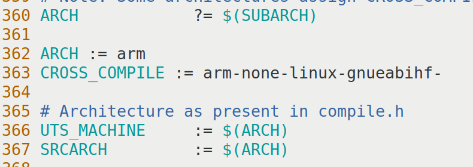
> 图：内核顶层Makefile片段（第360-367行）：原有第360行ARCH ?= $(SUBARCH)，第362-363行为新增的两行：ARCH := arm、CROSS_COMPILE := arm-none-linux-gnueabihf-；其后为# Architecture as present in compile.h、UTS_MACHINE := $(ARCH)、SRCARCH := $(ARCH)

<!-- Slide number: 42 -->
# 5.4 Linux内核移植
3. 编译内核
编译内核
       make uImage LOADADDR=0xC2000040 -j4
编译生成的uImage文件在arch/arm/boot目录下
说明：LOADADDR为内核加载地址，结合u-boot的启动命令，uImage放置在0xC2000000，uImage有一个0x40的文件头，因此内核的实际位置是0xC2000040

我们没对内核作任何修改，它适配的是ST官方开发板，实际上此内核已经可以在我们的FS-MP1A开发板上运行，运行方法见“运行内核”小节

<!-- Slide number: 43 -->
# 5.4 Linux内核移植
4. 生成设备树
5.4.31版本的内核需要配合设备树才能运行
参考ST官方的dk1开发板的设备树文件stm32mp15xx-dkx.dtsi和 stm32mp157a-dk1.dts，在arch/arm/boot/dts目录下添加stm32mp15xx-fsmp1x.dtsi和 stm32mp157a-fsmp1a.dts文件（文件内容暂时不用管，老师会提供文件）

<!-- Slide number: 44 -->
# 5.4 Linux内核移植
为了使新增的设备树文件能够被编译，修改arch/arm/boot/dts/Makefile文件

> 图：arch/arm/boot/dts/Makefile第981-993行：dtb-$(CONFIG_ARCH_STM32) += \ stm32f429-disco.dtb \ stm32f469-disco.dtb \ stm32f746-disco.dtb \ stm32f769-disco.dtb \ stm32429i-eval.dtb \ stm32746g-eval.dtb \ stm32h743i-eval.dtb \ stm32h743i-disco.dtb \ stm32mp157a-avenger96.dtb \ stm32mp157a-dk1.dtb \ stm32mp157a-fsmp1a.dtb \ stm32mp157d-dk1.dtb \，其中新增的第992行stm32mp157a-fsmp1a.dtb使新增的设备树文件能够被编译

新增此行

<!-- Slide number: 45 -->
# 5.4 Linux内核移植
编译设备树
make dtbs
在arch/arm/boot/dts目录会生成stm32mp157a-fsmp1a.dtb文件，即为设备树的二进制文件
此设备树文件与uImage文件一起用于启动内核，启动方法见“运行内核”小节
由于目前缺少eMMC驱动，内核启动时默认读取eMMC挂载根文件系统，启动过程会出现如下错误

<!-- Slide number: 46 -->

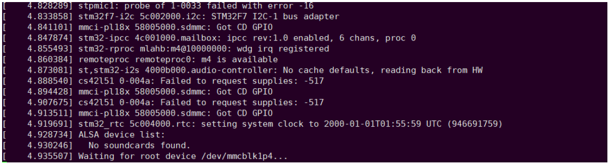
> 图：内核启动串口日志截图（缺少eMMC驱动时卡在等待根文件系统）：[ 4.828289] stpmic1: probe of 1-0033 failed with error -16、[ 4.838858] stm32f7-i2c 5c002000.i2c: STM32F7 I2C-1 bus adapter、[ 4.878406] st,stm32-i2s 4000b000.audio-controller: No cache defaults, reading back from HW、[ 4.855493] stm32-rproc mlahb:m4@10000000: wdg irq registered、[ 4.860384] remoteproc remoteproc0: m4 is available、[ 4.888540] cs42l51 0-004a: Failed to request supplies: -517、[ 4.894428] mmci-pl18x 58005000.sdmmc: Got CD GPIO、[ 4.919691] stm32_rtc 5c004000.rtc: setting system clock to 2000-01-01T01:55:59 UTC (946691759)、[ 4.928734] ALSA device list: No soundcards found，最后一行[ 4.935507] Waiting for root device /dev/mmcblk1p4...（一直等待eMMC上的根文件系统分区）

<!-- Slide number: 47 -->
# 5.4 Linux内核移植
5. 移植eMMC驱动（现在不需要看懂，照着改就行）
内核中已有eMMC驱动的代码，此处只需要修改设备树
在arch/arm/boot/dts/stm32mp15xx-fsmp1x.dtsi文件中，有FS-MP1A开发板的设备树资源定义
eMMC连接在sdmmc2总线上，当前的stm32mp15xx-fsmp1x.dtsi文件中没有sdmmc2的定义，因此，在该文件中添加如下内容

<!-- Slide number: 48 -->
在原有sdmmc1后面添加以下内容：
/*sdmmc2 eMMC*/
&sdmmc2 {
    pinctrl-names = "default", "opendrain", "sleep";
    pinctrl-0 = <&sdmmc2_b4_pins_a &sdmmc2_d47_pins_a>;
    pinctrl-1 = <&sdmmc2_b4_od_pins_a &sdmmc2_d47_pins_a>;
    pinctrl-2 = <&sdmmc2_b4_sleep_pins_a &sdmmc2_d47_sleep_pins_a>;
    non-removable;
    no-sd;
    no-sdio;
    st,neg-edge;
    bus-width = <8>;
    vmmc-supply = <&v3v3>;
    vqmmc-supply = <&vdd>;
    mmc-ddr-3_3v;
    status = "okay";
};

> 图：stm32mp15xx-fsmp1x.dtsi中添加的设备树代码截图（第150-165行）：/*sdmmc2 eMMC*/ &sdmmc2 { pinctrl-names = "default", "opendrain", "sleep"; pinctrl-0 = <&sdmmc2_b4_pins_a &sdmmc2_d47_pins_a>; pinctrl-1 = <&sdmmc2_b4_od_pins_a &sdmmc2_d47_pins_a>; pinctrl-2 = <&sdmmc2_b4_sleep_pins_a &sdmmc2_d47_sleep_pins_a>; non-removable; no-sd; no-sdio; st,neg-edge; bus-width = <8>; vmmc-supply = <&v3v3>; vqmmc-supply = <&vdd>; mmc-ddr-3_3v; status = "okay"; };

<!-- Slide number: 49 -->
# 5.4 Linux内核移植
修改内核配置，使eMMC驱动被编译
    执行以下命令打开图形化配置工具：
            make menuconfig
    按以下路径修改内核配置

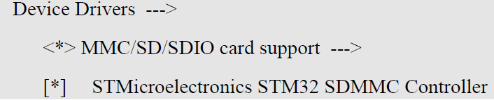
> 图：make menuconfig图形化配置工具中修改eMMC驱动的菜单路径：Device Drivers ---> <*> MMC/SD/SDIO card support --->，选中[*] STMicroelectronics STM32 SDMMC Controller

<!-- Slide number: 50 -->

> 图：menuconfig配置界面截图（.config - Linux/arm 5.4.31 Kernel Configuration，路径> Device Drivers > MMC/SD/SDIO card support），MMC/SD/SDIO card support菜单中：SDIO UART/GPS class support（< >）、MMC host test driver（< >）、*** MMC/SD/SDIO Host Controller Drivers ***、[ ] MMC host drivers debugging、<*> ARM AMBA Multimedia Card Interface support、高亮选中[*] STMicroelectronics STM32 SDMMC Controller、<*> Secure Digital Host Controller Interface support、<*> SDHCI platform and OF driver helper、<*> SDHCI OF support for the Arasan SDHCI controllers、< > SDHCI OF support for the ASPEED SDHCI controller，底部按钮<Select>、<Exit>、<Help>、<Save>、<Load>

<!-- Slide number: 51 -->
# 5.4 Linux内核移植
重新编译内核和设备树
make -j4 uImage dtbs LOADADDR=0xC2000040
用新内核和设备树启动系统

<!-- Slide number: 52 -->
# 5.4 Linux内核移植
6. 移植网卡驱动
在后续的开发、调试工作中，使用网络挂载根文件系统会更方便，因此需要在内核中移植网卡驱动
现在既无网卡驱动代码，又无设备树配置，因此内核代码和设备树都要修改
在开发板出厂源码中找到用于Linux内核的MAE0621A网卡驱动（注意不是用于u-boot的驱动），把phy_device.c和 maxio.c文件复制到内核源码下的 drivers/net/phy/目录下

<!-- Slide number: 53 -->
# 5.4 Linux内核移植
在drivers/net/phy/Makefile文件中添加MAE0621A驱动的编译项（标红部分），使驱动能够被编译

> 图：drivers/net/phy/Makefile中添加MAE0621A驱动的编译项截图：原有obj-$(CONFIG_MDIO_THUNDER) += mdio-thunder.o、obj-$(CONFIG_MDIO_XGENE) += mdio-xgene.o，标红新增一行obj-$(CONFIG_MAXIO_PHY) += maxio.o

<!-- Slide number: 54 -->
# 5.4 Linux内核移植
在drivers/net/phy/Kconfig文件中添加 MAE0621A驱动的配置项（标红部分），使图形化配置工具中增加MAE0621A网卡的配置项（配置项被选中，该驱动才会被编译）

> 图：drivers/net/phy/Kconfig中添加MAE0621A驱动的配置项截图：原有config REALTEK_PHY、tristate "Realtek PHYs"（---help--- Supports the Realtek 821x PHY.）和config RENESAS_PHY、tristate "Driver for Renesas PHYs"，标红新增config MAXIO_PHY、tristate "MAXIO PHYS"（---help--- Supports the Maxio MAEXXXX PHY.）

<!-- Slide number: 55 -->
# 5.4 Linux内核移植
在图形化配置工具中按以下路径修改配置，选中 MAE0621A网卡的配置项（标红部分）

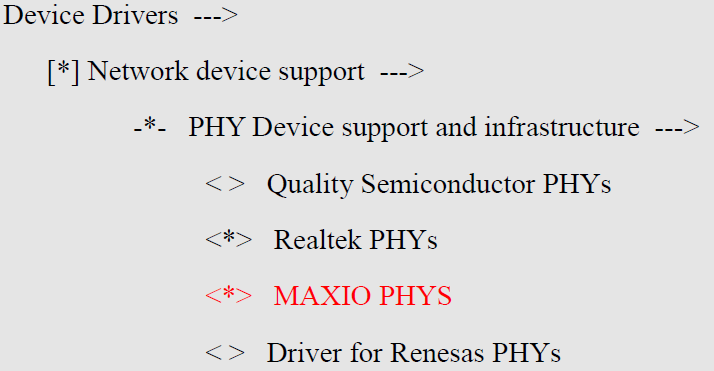
> 图：图形化配置工具中的菜单路径：Device Drivers ---> [*] Network device support ---> -*- PHY Device support and infrastructure --->，其下< > Quality Semiconductor PHYs（未选中）、<*> Realtek PHYs（已选中）、标红新增配置项<*> MAXIO PHYS（已选中）、< > Driver for Renesas PHYs（未选中）

<!-- Slide number: 56 -->
# 5.4 Linux内核移植
修改设备树，在arch/arm/boot/dts/stm32mp15xx-fsmp1x.dtsi文件末尾添加以下内容

重新编译内核和设备树
            make -j4 uImage dtbs LOADADDR=0xC2000040
/*网卡*/
&ethernet0 {
    status = "okay";
    pinctrl-0 = <&ethernet0_rgmii_pins_a>;
    pinctrl-1 = <&ethernet0_rgmii_pins_sleep_a>;
    pinctrl-names = "default", "sleep";
    phy-mode = "rgmii-id";
    max-speed = <1000>;
    phy-handle = <&phy0>;

    mdio0 {
        #address-cells = <1>;
        #size-cells = <0>;
        compatible = "snps,dwmac-mdio";
        phy0: ethernet-phy@0 {
            reg = <0>;
        };
    };
};

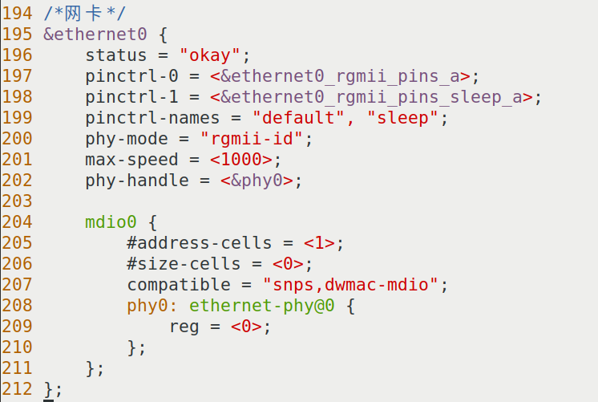
> 图：stm32mp15xx-fsmp1x.dtsi文件末尾添加的网卡设备树代码截图（第194-212行）：/*网卡*/ &ethernet0 { status = "okay"; pinctrl-0 = <&ethernet0_rgmii_pins_a>; pinctrl-1 = <&ethernet0_rgmii_pins_sleep_a>; pinctrl-names = "default", "sleep"; phy-mode = "rgmii-id"; max-speed = <1000>; phy-handle = <&phy0>; mdio0 { #address-cells = <1>; #size-cells = <0>; compatible = "snps,dwmac-mdio"; phy0: ethernet-phy@0 { reg = <0>; }; }; };

<!-- Slide number: 57 -->
# 5.5 搭建TFTP服务器
为了在开发板上运行内核，我们通过tftp把内核和设备树下载到开发板DRAM，然后从DRAM中运行
需要在电脑上搭建tftp服务器，搭建步骤如下

<!-- Slide number: 58 -->
# 5.5 搭建TFTP服务器
1. 安装tftp软件
安装服务端
sudo apt install tftpd-hpa
安装客户端
sudo apt install tftp-hpa
2. 创建tftp工作目录
mkdir /home/cnu/tftpboot
sudo chmod 777 /home/cnu/tftpboot

<!-- Slide number: 59 -->
# 5.5 搭建TFTP服务器
3. 配置服务端
编辑/etc/default/tftpd-hpa文件为如下内容

其中，TFTP_DIRECTORY为tftp工作目录，要与前面创建的目录一致；TFTP_ADDRESS为监听端口，必须为69；TFTP_OPTIONS的含义为：
-c: Allow new files to be created.
-s: Change  root  directory  on startup.
-l:  Run the server in standalone (listen) mode, rather than run from inetd.

> 图：/etc/default/tftpd-hpa配置文件内容截图：TFTP_USERNAME="tftp"、TFTP_DIRECTORY="/home/cnu/tftpboot"、TFTP_ADDRESS=":69"、TFTP_OPTIONS="-l -c -s"

<!-- Slide number: 60 -->
# 5.5 搭建TFTP服务器
4. 重启服务
重启服务
sudo service tftpd-hpa restart
查看服务运行状态
sudo service tftpd-hpa status
5. 测试
在 /home/cnu/tftpboot下放置一个测试文件，例如：123.txt ，之后输入进入 tftp 命令：
$ tftp 127.0.0.1
> get 123.txt
> q
如果服务器工作正常，在当前目录下会下载到123.txt文件

<!-- Slide number: 61 -->
# 5.5 搭建TFTP服务器
电脑与开发板的网络连接
使用TFTP时，电脑（Linux系统）与开发板要连接在同一局域网下
关于虚拟机的连接
如果电脑的Linux是虚拟机，虚拟机要添加一张桥接网卡，并桥接到物理网卡（有线、无线均可）上，此物理网卡与开发板的组成局域网
关于路由器的连接
开发板可以与电脑有线网卡直连
也可以开发板有线连接到路由器LAN口，电脑也连到同一路由器（有线、无线均可）的局域网下

<!-- Slide number: 62 -->
# 5.6 运行内核
启动内核
把内核文件（uImage）和设备树文件（ stm32mp157a-fsmp1a.dtb ）复制到TFTP的工作目录（/home/cnu/tftpboot）
在u-boot中执行命令，将上述文件下载到开发板的DRAM
下载内核到0xC2000000
         tftp c2000000 uImage
下载设备树到0xC4000000
         tftp c4000000 stm32mp157a-fsmp1a.dtb
在u-boot中执行命令，启动内核
                 bootm c2000000 - c4000000

<!-- Slide number: 63 -->
# 5.6 运行内核
关于根文件系统
由于还没有添加根文件系统，开发板的系统还不能进入到Linux的命令行界面
我们可以借用开发板出厂自带的根文件系统来启动Linux，验证内核和设备树是否正确
出厂根文件系统在eMMC的4号分区中，启动时挂载这个分区即可。在u-boot中设置bootargs环境变量如下：
   setenv bootargs 'console=ttySTM0,115200 root=/dev/mmcblk1p4 rootwait rw'
   saveenv
重新启动内核（按前一页的3条命令），如果内核和设备树都正常，则可以进入到Linux的命令行界面

<!-- Slide number: 64 -->
# 5.6 运行内核
使用出厂系统
在移植过程中也可用出厂内核或设备树，对自己移植的文件进行替换，以便定位自己的文件是哪一个有错
出厂内核和设备树在eMMC中的2号分区中，如需使用将它们加载到DRAM的相应位置即可
加载内核到0xC2000000
          ext4load mmc 1:2 c2000000 uImage
加载设备树到0xC4000000
         ext4load mmc 1:2 c4000000 stm32mp157a-fsmp1a-mipi050.dtb
如果内核、设备树、根文件系统都是出厂文件，而系统无法启动，就该回头去找u-boot的问题

<!-- Slide number: 65 -->
# 5.6 运行内核
自动启动
启动内核自行的3条命令可以写到u-boot的bootcmd环境变量中，开发板上电时自动自行
通过以下命令设置bootcmd
setenv bootcmd 'tftp c2000000 uImage; tftp c4000000 stm32mp157a-fsmp1a.dtb; bootm c2000000 - c4000000'    //这两行是一条命令
saveenv
