<!-- Slide number: 1 -->
# 第6章 构建Linux根文件系统

<!-- Slide number: 2 -->
# 6.1 Linux文件系统概述
Linux文件系统的特点
与Windows类似，Linux也可将磁盘、Flash（如NAND、eMMC、SD卡等）等存储设备划分为多个分区
与Windows的C盘类似，Linux也需要将系统启动所必需的文件（如内核映像文件、设备树文件、内核启动后运行的第一个程序（init）、shell程序、应用程序、共享库等）存放在一个分区中
在PC上这些文件通常全是在同一分区中
在嵌入式系统中，内核映像和设备树通常单独存放在一个分区中
除内核映像和设备树以外，上述文件的集合称为根文件系统，存放在一个分区中，内核启动后首先挂载这个分区，并自动执行其中的一些程序

<!-- Slide number: 3 -->
# 6.1 Linux文件系统概述
Linux以树状结构管理所有目录、文件，其他分区挂载在某个目录上，该目录被称为挂载点（mount point）
根文件系统挂载在根目录“/”上
在一个分区上存储文件需要遵循一定的格式，该格式称为文件系统类型（如fat、ntfs、ext2、ext3、ext4、jffs2、yaffs等）
Linux还有proc、sysfs、tmpfs等几种虚拟文件系统类型，它们的文件并不存储在实际的外存设备上，而是在访问它们时由内核临时生成（文件在内存中）
“文件系统类型”也常被简称为“文件系统”，需注意“文件系统”一词的含义

<!-- Slide number: 4 -->
# 6.1 Linux文件系统概述
Linux根文件系统的目录结构
Linux根文件系统一般包括如图所示的目录
bin目录（必须有）
存放所有用户（管理员和一般用户）都可以使用的基本命令
这些命令在挂载其他文件系统之前就可以使用
bin目录中的常用命令包括：chmod、sh、ls、mount、mkdir、mknod等
在有些Linux发行版中bin是一个指向/usr/bin的符号链接

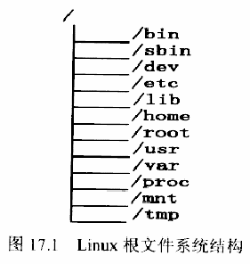
> 图：Linux根文件系统目录结构图（图17.1）：根目录“/”下依次列出 /bin、/sbin、/dev、/etc、/lib、/home、/root、/usr、/var、/proc、/mnt、/tmp 等目录

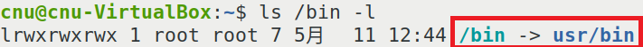
> 图：终端截图：执行 ls /bin -l 显示 “lrwxrwxrwx 1 root root 7 5月 11 12:44 /bin -> usr/bin”，红框标出 /bin 是指向 usr/bin 的符号链接

<!-- Slide number: 5 -->
# 6.1 Linux文件系统概述
sbin目录（必须有）
存放只有管理员能够使用的基本的系统命令，主要用于启动、修复系统
sbin中的命令在挂载其他文件系统之前就可使用，因此该目录必须位于根文件系统中
常用命令：shutdown、reboot、fdisk、fsck等
在有些Linux发行版中sbin是一个指向/usr/sbin的符号链接

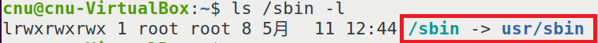
> 图：终端截图：执行 ls /sbin -l 显示 “lrwxrwxrwx 1 root root 8 5月 11 12:44 /sbin -> usr/sbin”，红框标出 /sbin 是指向 usr/sbin 的符号链接

<!-- Slide number: 6 -->
# 6.1 Linux文件系统概述
dev目录（必须有）
该目录存放的是设备文件
设备文件是Linux特有的一种特殊文件类型
Linux以文件读写的方式访问外设（如通过“/dev/ttySTM0”文件访问串口）
设备文件分为两类：字符设备、块设备
字符设备：按照字节流的方式被顺序访问，如串口、键盘
块设备：能随机访问固定大小数据块的设备称为块设备，如硬盘、Flash、CD-ROM驱动器

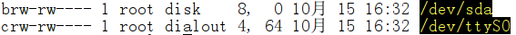
> 图：ls -l 显示的两类设备文件示例：“brw-rw---- 1 root disk 8, 0 10月 15 16:32 /dev/sda”（b开头，块设备，主设备号8、次设备号0）与 “crw-rw---- 1 root dialout 4, 64 10月 15 16:32 /dev/ttyS0”（c开头，字符设备，主设备号4、次设备号64）

<!-- Slide number: 7 -->
# 6.1 Linux文件系统概述
Linux为每个设备编号，设备编号由主设备号和次设备号组成
主设备号用于区分不同的设备
次设备号用于区分同一类型的多个设备
对于常用设备，Linux有约定的主设备号，如sata硬盘主设备号是8，串口终端主设备号是4
一个主设备号代表了一个特定的驱动程序，次设备号代表了使用该驱动程序的各个设备
设备文件可用mknod命令创建，如：
       mknod  /dev/ttySAC0  c  4  64

       mknod  /dev/hda1  b  3  1
创建一个串口文件（字符设备）
创建一个IDE硬盘文件（块设备）

<!-- Slide number: 8 -->
# 6.1 Linux文件系统概述
dev目录中的文件有3种创建方法：
（1）手动创建：即手动在dev目录下创建好要使用的设备文件，如ttySAC0、mtdblock0等
（2）使用devfs文件系统（已过时，在2.6.13版本之前的内核中有此功能）
（3）udev机制创建
udev是运行在用户空间中的一个程序
udev能够根据硬件设备的状态动态更新设备文件，包括文件的创建、删除等
通过udev不需手动的在dev目录下创建设备文件
内核需要支持sysfs文件系统（在/sys下挂载sysfs，sysfs用于为udev提供设备入口和uevent通道）
内核需要支持tmpfs文件系统（在/dev下挂载tmpfs，tmpfs为udev设备文件提供存放空间）
busybox中的mdev命令是udev命令的简化版本

<!-- Slide number: 9 -->
# 6.1 Linux文件系统概述
etc目录（必须有）
存放各种配置文件
包括系统的配置文件，和应用程序的配置文件
该目录中的文件依赖于系统中安装的应用程序，及这些程序是否需要配置
lib目录（必须有）
存放静态库（.a文件）、共享库（.so文件）、可加载模块（.ko文件，一般为驱动程序）
在嵌入式系统中，为节省存储空间，不存储静态库
该目录中的共享库用于系统启动和根文件系统中的可执行程序

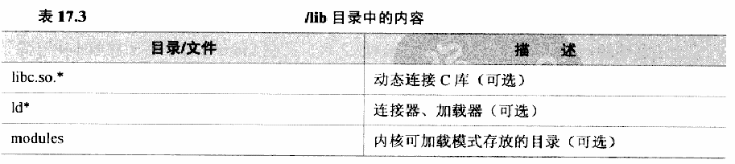
> 图：表17.3 “/lib 目录中的内容”：libc.so.* 为动态连接C库（可选）、ld* 为连接器、加载器（可选）、modules 为内核可加载模块存放的目录（可选）

<!-- Slide number: 10 -->
# 6.1 Linux文件系统概述
home目录
普通用户的登录目录
该目录是可选的（非必须）
每个普通用户在home目录下有一个以用户名命名的子目录，存放用户相关的配置文件
root目录
root用户的登录目录
usr目录
usr是 Unix Software Resource的缩写
存放共享、只读的程序和数据
目录中的文件应该是只读的

<!-- Slide number: 11 -->

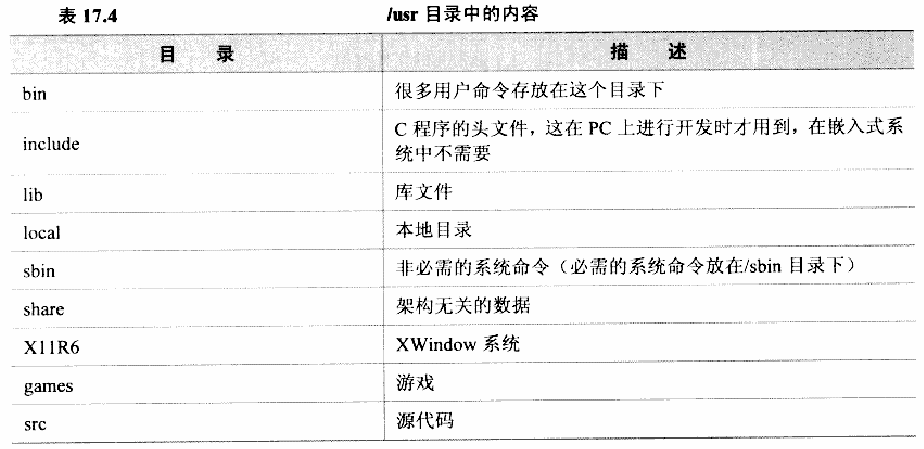
> 图：表17.4 “/usr 目录中的内容”：bin（很多用户命令存放在这个目录下）、include（C程序的头文件，PC上开发时才用到，嵌入式系统中不需要）、lib（库文件）、local（本地目录）、sbin（非必需的系统命令，必需的系统命令放在/sbin目录下）、share（架构无关的数据）、X11R6（X Window系统）、games（游戏）、src（源代码）

<!-- Slide number: 12 -->
# 6.1 Linux文件系统概述
var目录
存放可变的数据，如spool目录、log文件、临时文件
proc目录
是一个空目录
用作proc文件系统的挂载点
proc文件系统是一个虚拟文件系统，其中存放内核临时生成的目录、文件，用于表示系统运行状态，也可通过操作其中文件控制系统
mnt目录
通常是一个空目录
用于临时挂载某个文件系统的挂载点

<!-- Slide number: 13 -->
# 6.1 Linux文件系统概述
tmp目录
用于存放临时文件，通常是空目录
一些需要生成临时文件的程序会用到该目录
为减少对Flash的操作，可在tmp目录上挂载内存文件系统，命令如下：
mount  -t  tmpfs none  /tmp
sys目录
 sysfs文件系统的挂载点
它是系统设备管理的重要目录
它通过一定的组织结构向用户程序提供详细的内核数据结构信息

<!-- Slide number: 14 -->
# 6.1 Linux文件系统概述
opt目录
可选的文件、软件存放目录
由用户选择将哪些文件或软件放到此目录中

<!-- Slide number: 15 -->
# 6.1 Linux文件系统概述
Linux中的文件类型

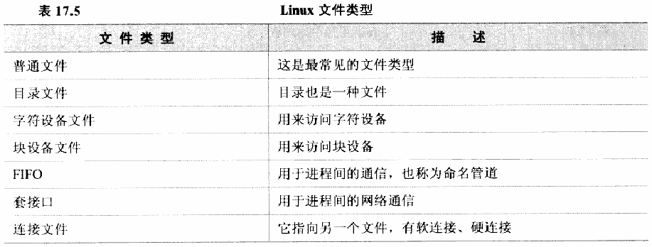
> 图：表17.5 “Linux 文件类型”：普通文件（最常见的文件类型）、目录文件（目录也是一种文件）、字符设备文件（用来访问字符设备）、块设备文件（用来访问块设备）、FIFO（用于进程间的通信，也称为命名管道）、套接口（用于进程间的网络通信）、连接文件（指向另一个文件，有软连接、硬连接）

<!-- Slide number: 16 -->
# 6.1 Linux文件系统概述
ls命令显示的文件信息

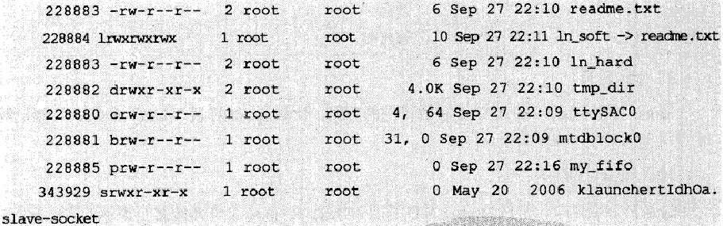
> 图：ls 命令输出的文件信息示例：readme.txt（-rw-r--r--，inode 228883，硬连接数2，普通文件）、ln_soft -> readme.txt（lrwxrwxrwx，符号连接）、ln_hard（-rw-r--r--，与readme.txt同inode 228883，硬连接）、tmp_dir（drwxr-xr-x，目录）、ttySAC0（crw-r--r--，字符设备 4, 64）、mtdblock0（brw-r--r--，块设备 31, 0）、my_fifo（prw-r--r--，管道）、klaunchertIdhOa.slave-socket（srwxr-xr-x，套接字），可对照inode、类型及权限、硬连接个数等字段
inode
类型及权限
硬连接个数

文件类型：“-”普通文件，“d”目录，“c”字符设备，“b”块设备，“p”管道（FIFO），“l"符号连接，“s”套接字（socket）

<!-- Slide number: 17 -->
# 6.2 Busybox构建根文件系统
Busybox简介
制作根文件系统，就是创建各种目录（如/bin、/sbin、/etc、/lib等），并在其中创建各种文件（如/bin中的可执行文件）
/bin、/sbin等目录中的可执行文件可由Busybox来创建
Busybox是一个开源项目
它将众多UNIX命令集合进一个很小的可执行程序中，可用来替换GNU coreutils工具集(www.gnu.org/software/coreutils/)
Busybox中的各种命令，提供的选项较少，但能够满足一般应用
Busybox为嵌入式系统提供了一个比较完整的工具集

<!-- Slide number: 18 -->
# 6.2 Busybox构建根文件系统
Busybox对文件大小进行了优化（动态连接的Busybox只有几百KB，静态连接的只有1MB左右）
Busybox按模块进行设计，可以很容易的加入、删除某些命令，或增减命令的某些选项
使用Busybox创建根文件系统，只需在/etc目录下创建配置文件即可
若使用动态连接，还要在/lib目录下包含共享库文件
Busybox的源码可从其官网下载 www.busybox.net

<!-- Slide number: 19 -->
# 6.2 Busybox构建根文件系统
准备Busybox源码
从官网下载1.32.0版本源码，并解压
修改Busybox源码顶层目录下的Makefile文件，通过CROSS_COMPILE宏指定交叉编译工具

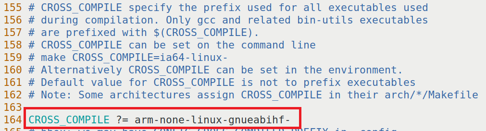
> 图：Busybox 顶层 Makefile 修改截图（第155~164行）：在第164行添加 “CROSS_COMPILE ?= arm-none-linux-gnueabihf-”（红框标出），上方注释说明 CROSS_COMPILE 用于指定编译所用可执行文件的前缀

<!-- Slide number: 20 -->
# 6.2 Busybox构建根文件系统
配置Busybox
在Busybox的顶层目录下执行命令“make menuconfig”可以进入配置界面，对Busybox进行配置

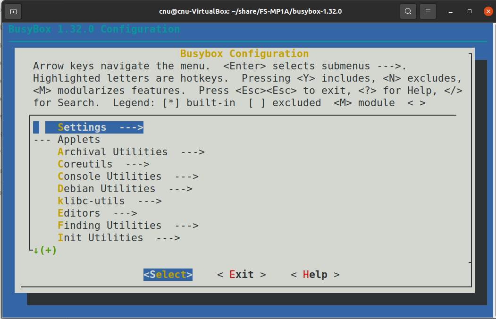
> 图：在 ~/share/FS-MP1A/busybox-1.32.0 目录下执行 make menuconfig 打开的 “Busybox Configuration” 配置主界面，菜单项包括：Settings、Applets、Archival Utilities、Coreutils、Console Utilities、Debian Utilities、klibc-utils、Editors、Finding Utilities、Init Utilities 等，当前高亮选中 Settings，底部按钮 <Select> <Exit> <Help>

<!-- Slide number: 21 -->
# 6.2 Busybox构建根文件系统
不使用静态库

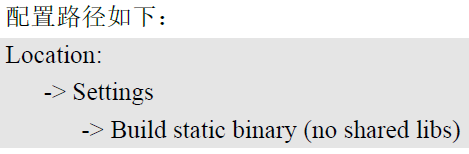
> 图：文字说明“配置路径如下：Location: -> Settings -> Build static binary (no shared libs)”

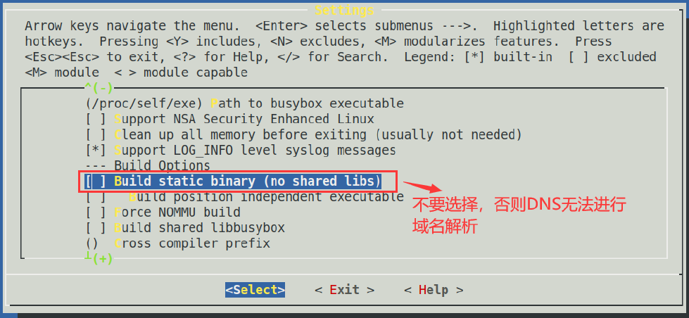
> 图：Busybox 的 Settings 菜单截图：Build Options 下的 “[ ] Build static binary (no shared libs)” 保持未选中（红框标出），红色箭头注明“不要选择，否则DNS无法进行域名解析”；同页还有 Path to busybox executable、Support NSA Security Enhanced Linux、Support LOG_INFO level syslog messages 等选项

<!-- Slide number: 22 -->
# 6.2 Busybox构建根文件系统
不使用Simplilifed modutils

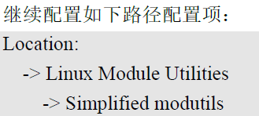
> 图：文字说明“继续配置如下路径配置项：Location: -> Linux Module Utilities -> Simplified modutils”

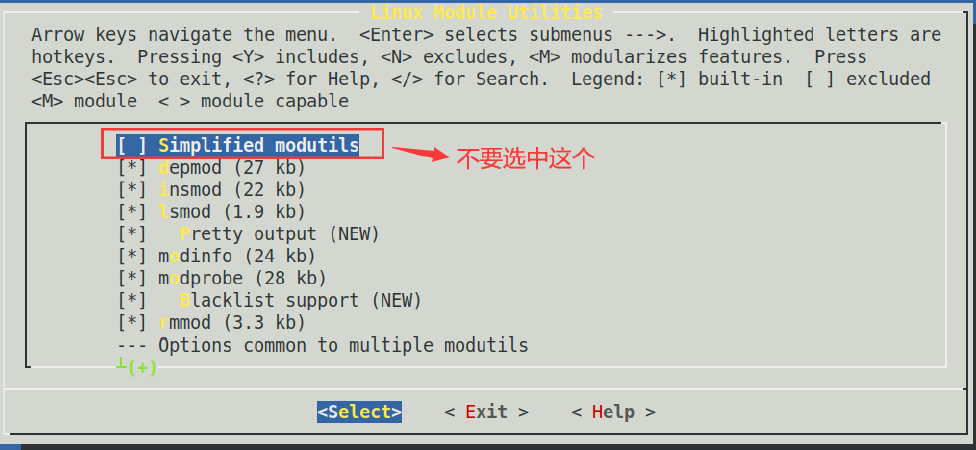
> 图：Busybox 的 Linux Module Utilities 菜单截图：“[ ] Simplified modutils” 未选中（红框标出，红色箭头注明“不要选中这个”）；[*] depmod (27 kb)、[*] insmod (22 kb)、[*] lsmod (1.9 kb)、[*] Pretty output (NEW)、[*] modinfo (24 kb)、[*] modprobe (28 kb)、[*] Blacklist support (NEW)、[*] rmmod (3.3 kb) 均已选中

<!-- Slide number: 23 -->
启用depmod
配置路径如下:
# 6.2 Busybox构建根文件系统
Location:
     -> Linux Module Utilities
          -> depmod (27 kb)

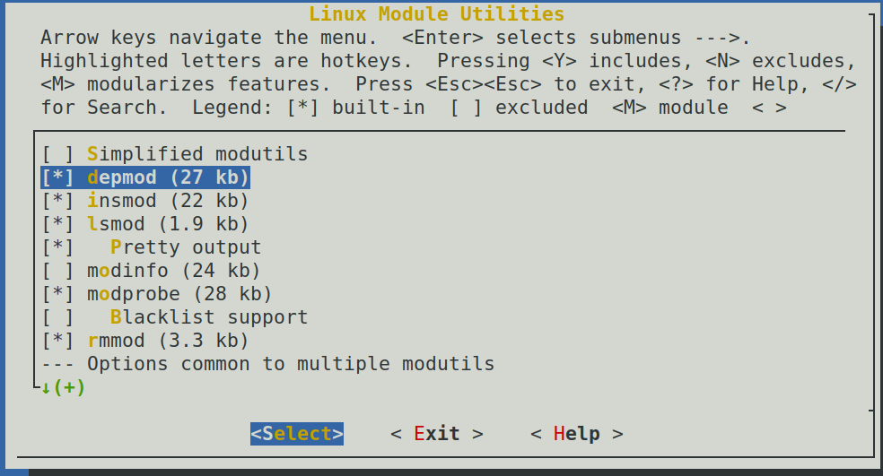
> 图：Busybox 的 Linux Module Utilities 菜单截图：“[*] depmod (27 kb)” 已选中（高亮显示），[*] insmod (22 kb)、[*] lsmod (1.9 kb)、[*] Pretty output、[*] modprobe (28 kb)、[*] rmmod (3.3 kb) 也已选中；[ ] Simplified modutils、[ ] modinfo (24 kb)、[ ] Blacklist support 未选中

<!-- Slide number: 24 -->
# 6.2 Busybox构建根文件系统
启用mdev

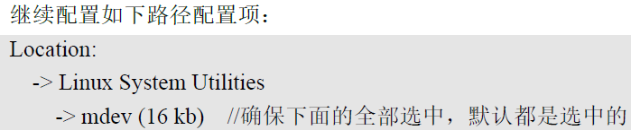
> 图：文字说明“继续配置如下路径配置项：Location: -> Linux System Utilities -> mdev (16 kb) //确保下面的全部选中，默认都是选中的”

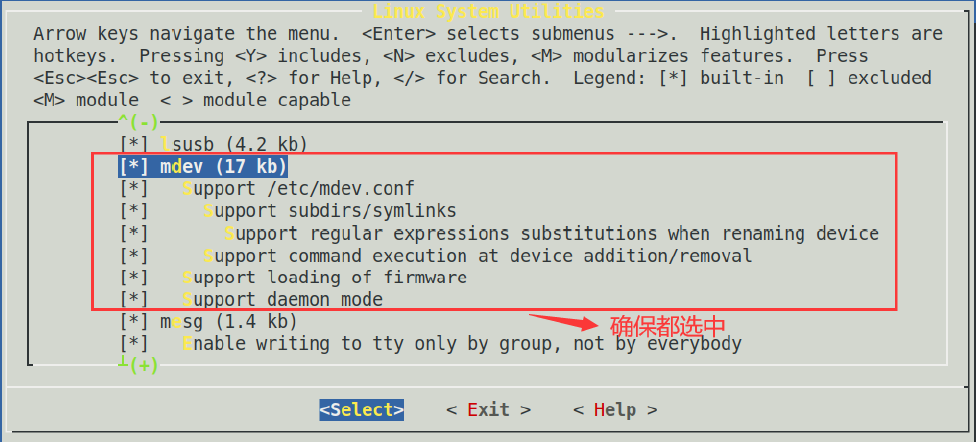
> 图：Busybox 的 Linux System Utilities 菜单截图（红框标出）：“[*] mdev (17 kb)” 已选中，其子选项 Support /etc/mdev.conf、Support subdirs/symlinks、Support regular expressions substitutions when renaming device、Support command execution at device addition/removal、Support loading of firmware、Support daemon mode 全部选中，红色箭头注明“确保都选中”

<!-- Slide number: 25 -->
# 6.2 Busybox构建根文件系统
配置说明
使用静态库编译出的文件更大，且DNS功能有问题，所以不使用静态库
不使用Simplilifed modutils是为了驱动移植部分，便于驱动开发和调试
启用mdev用于自动创建/dev下的设备文件

<!-- Slide number: 26 -->
# 6.2 Busybox构建根文件系统
编译Busybox
在源码顶层目录下执行“make”命令（无需带任何参数），编译Busybox

编译成功如下图所示

> 图：终端截图：在 cnu@cnu-VirtualBox:~/share/FS-MP1A/busybox-1.32.0 目录下执行 make 命令开始编译 Busybox

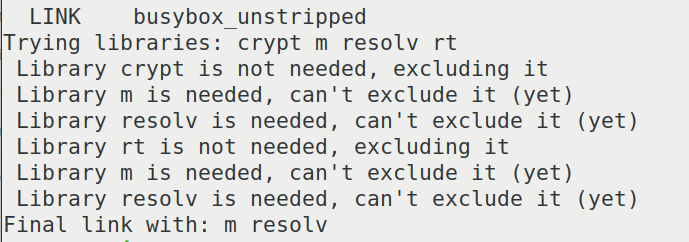
> 图：编译成功时的最后输出：“LINK busybox_unstripped”、“Trying libraries: crypt m resolv rt”、“Library crypt is not needed, excluding it”、“Library m is needed, can't exclude it (yet)”、“Library resolv is needed, can't exclude it (yet)”、“Library rt is not needed, excluding it”、“Final link with: m resolv”

<!-- Slide number: 27 -->
# 6.2 Busybox构建根文件系统
安装Busybox
	方法1. 执行如下命令将Busybox安装到源码目录下的_install目录：
             make install

	方法2. 通过设置CONFIG_PREFIX宏的值，将Busybox安装到指定的目录：
             make install CONFIG_PREFIX=dir_path
     其中dir_path是指定的安装目录
     例如，执行命令：
             make install CONFIG_PREFIX=../busybox_install
     将会创建“busybox_install”目录，并在该目录下创建以下文件和目录

<!-- Slide number: 28 -->

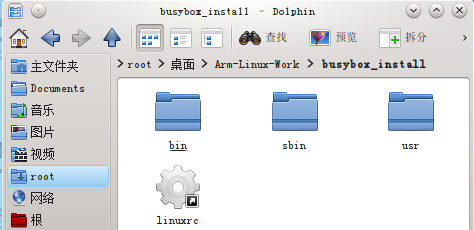
> 图：Dolphin 文件管理器截图：busybox_install 安装目录（root>桌面>Arm-Linux-Work>busybox_install）下生成的 bin、sbin、usr 三个目录和 linuxrc 文件

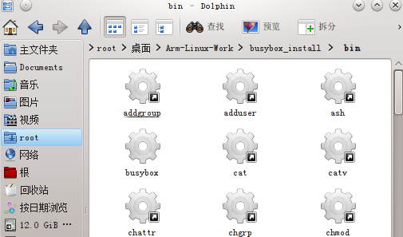
> 图：Dolphin 文件管理器截图：busybox_install/bin 目录下的命令文件 addgroup、adduser、ash、busybox、cat、catv、chattr、chgrp、chmod 等

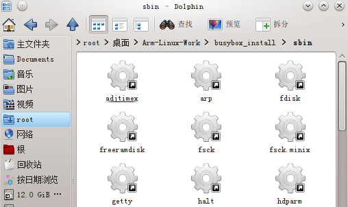
> 图：Dolphin 文件管理器截图：busybox_install/sbin 目录下的命令文件 adjtimex、arp、fdisk、freeramdisk、fsck、fsck.minix、getty、halt、hdparm 等

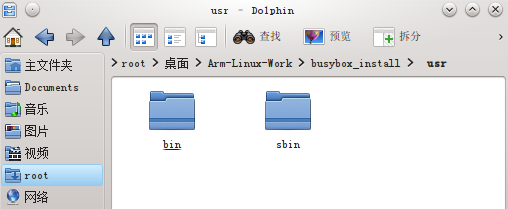
> 图：Dolphin 文件管理器截图：busybox_install/usr 目录下只有 bin、sbin 两个子目录

<!-- Slide number: 29 -->
其中，除bin/busybox外，其他所有文件都是指向bin/busybox的符号连接
bin/busybox是所有命令的集合体
每一个符号连接文件都对应于一个命令，可以直接运行
linuxrc和sbin/init功能完全一样，是init进程对应的可执行程序
如果busybox采用的动态编译，还需要在安装目录下手动创建lib目录，并在其中加入相应的共享库文件，bin/busybox程序才能正常运行
在busybox的安装目录下再增加其他目录和文件（如：dev、etc、mnt等），就可以构成根文件系统

<!-- Slide number: 30 -->
# 6.2 Busybox构建根文件系统
添加glibc库到根文件系统的lib目录
对于动态编译的可执行程序，需要把其依赖的共享库文件加入到lib目录中
可以使用交叉编译工具链提供的glic库
找到glibc库所在目录的方法：
    step1. 在编译器安装目录下搜索加载器：
           find -name "ld-linux*.so*"

    step2. 在搜到的加载器目录下查找是否存在glibc.so*文件

    如果glibc.so*存在，则此目录即为glibc库所在目录
经查找glibc库所在目录为： /usr/local/arm/gcc-arm-9.2-2019.12-x86_64-arm-none-linux-gnueabihf/arm-none-linux-gnueabihf/libc/lib

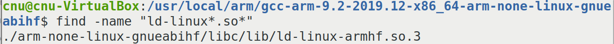
> 图：终端截图：在 /usr/local/arm/gcc-arm-9.2-2019.12-x86_64-arm-none-linux-gnueabihf 目录下执行 find -name "ld-linux*.so*"，输出 ./arm-none-linux-gnueabihf/libc/lib/ld-linux-armhf.so.3，即找到加载器所在目录

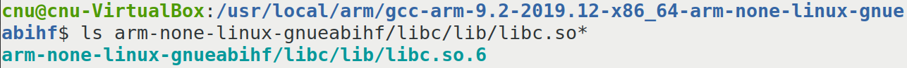
> 图：终端截图：执行 ls arm-none-linux-gnueabihf/libc/lib/libc.so*，输出 arm-none-linux-gnueabihf/libc/lib/libc.so.6，说明 glibc.so* 存在，该目录即为 glibc 库所在目录

<!-- Slide number: 31 -->
# 6.2 Busybox构建根文件系统
glibc库在该目录中（但并非全部属于glibc库），该目录下的文件和目录通常可以分以下几类（不同的编译工具有所差别）：
（1）加载器ld-*.so、ld-linux*.so.*
              用于加载共享库文件
（2）共享库文件（.so、.so.[0-9]*）
              动态连接时的库文件
（3）目标文件（.o）
              如crt1.o、crti.o、crtn.o等，生成可执行程序时需要连接它们
（4）静态库文件（.a）
              静态连接时的库文件
（5）libtool库文件（.la）
              连接库文件时用到的工具，程序运行时无需这些文件
（6）gconv目录
              里面是有头字符集的动态库
（7）ldscripts目录
              里面是各种连接脚本，编译程序时指定程序的运行地址、各段的位置等
我们只需要（1）和（2）

<!-- Slide number: 32 -->
# 6.2 Busybox构建根文件系统
安装glibc库
动态编译的程序需要正常运行，只需要把加载器和共享库文件添加到lib目录中即可，在glibc所在目录下执行以下命令：
       cp  *.so*  XXXX/lib  -d
   其中，XXXX为前面busybox的安装目录；-d表示复制符号连接文件时，复制的是连接文件本身，而不是其指向的文件
应用程序不会依赖以上复制的全部库文件，因此可以只复制程序依赖的库文件和加载器，查看程序依赖的库文件可以使用以下命令：
       arm-none-linux-gnueabihf-readelf –a XXXX | grep “Shared”
   其中，XXXX是应用程序的文件名

<!-- Slide number: 33 -->
# 6.2 Busybox构建根文件系统
例：通过以下命令，查看busybox程序依赖的库文件
         arm-none-linux-gnueabihf-readelf bin/busybox -a | grep "Shared"
注意：以上结果没有包含加载器

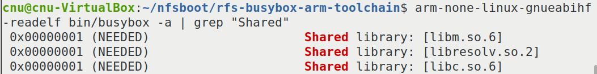
> 图：终端截图：在 ~/nfsboot/rfs-busybox-arm-toolchain 目录下执行 arm-none-linux-gnueabihf-readelf bin/busybox -a | grep "Shared"，输出 3 条NEEDED共享库：“Shared library: [libm.so.6]”、“Shared library: [libresolv.so.2]”、“Shared library: [libc.so.6]”（结果中未包含加载器）

<!-- Slide number: 34 -->
# 6.2 Busybox构建根文件系统
在Busybox安装目录下进一步添加根文件系统所需的其他目录和文件
1. 构建etc目录
    etc目录下的内容取决于要运行的程序（该目录是程序的配置文件），此处创建4个文件：inittab、init.d/rcS、fstab、profile
（1）创建etc/inittab文件
仿照Busybox的<busybox source>/examples/inittab文件，创建inittab文件，内容如下：

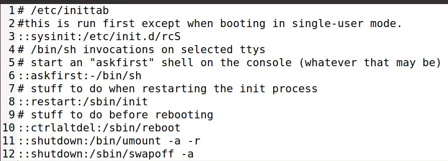
> 图：创建的 /etc/inittab 文件内容：1# /etc/inittab；3 ::sysinit:/etc/init.d/rcS；6 ::askfirst:-/bin/sh；8 ::restart:/sbin/init；10 ::ctrlaltdel:/sbin/reboot；11 ::shutdown:/bin/umount -a -r；12 ::shutdown:/sbin/swapoff -a（其余为注释行）

<!-- Slide number: 35 -->
# 6.2 Busybox构建根文件系统
init进程运行时，如果inittab文件存在，则会按其指示创建各种子进程（如调用脚本文件配置IP地址、挂载其他文件系统、启动shell等），否则使用默认配置创建子进程
inittab文件中每个条目用来定义一个子进程，格式为：
        <id>:<runlevels>:<action>:<process>
<id>：表示该子进程使用的控制台，若省略，则与init进程使用一样的控制台
<runlevels>：对于Busybox init程序，该字段无意义，省略
<actions>：表示init进程如何控制这个子进程，取值如表17.6：
<process>：要执行的程序，可以是可执行程序，也可以是脚本，如果该字段前有“-”符号，表示该程序是“交互的”

<!-- Slide number: 36 -->

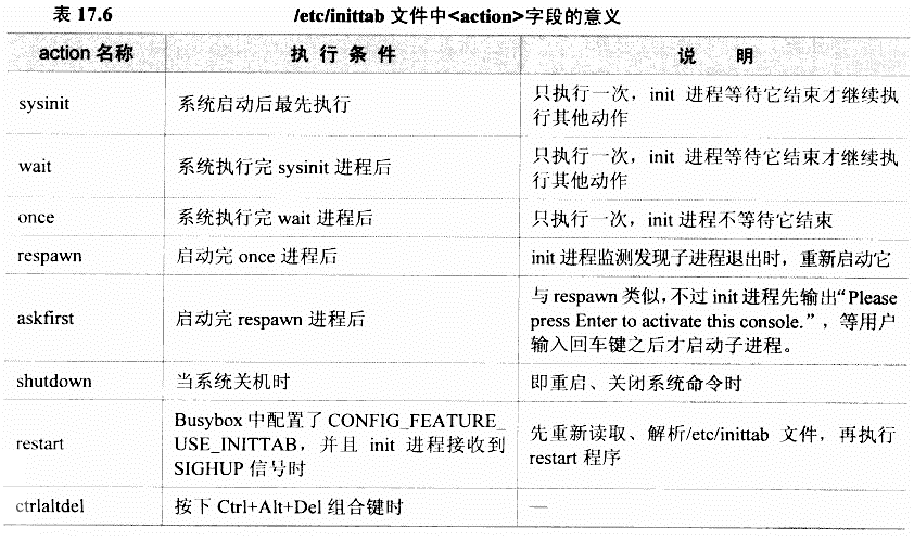
> 图：表17.6 “/etc/inittab 文件中<action>字段的意义”，三列分别为 action名称、执行条件、说明：sysinit（系统启动后最先执行，只执行一次，init进程等待它结束才继续执行其他动作）、wait（系统执行完sysinit进程后执行，只执行一次且等待结束）、once（系统执行完wait进程后执行，只执行一次，init进程不等待它结束）、respawn（启动完once进程后，init进程监测发现子进程退出时重新启动它）、askfirst（与respawn类似，不过init进程先输出“Please press Enter to activate this console.”，等用户输入回车键之后才启动子进程）、shutdown（当系统关机时即重启、关闭系统命令时执行）、restart（Busybox中配置了CONFIG_FEATURE_USE_INITTAB并且init进程接收到SIGHUP信号时，先重新读取、解析/etc/inittab文件，再执行restart程序）、ctrlaltdel（按下Ctrl+Alt+Del组合键时执行）

<!-- Slide number: 37 -->

> 图：表17.6（同上页）：“/etc/inittab 文件中<action>字段的意义”，列出 sysinit、wait、once、respawn、askfirst、shutdown、restart、ctrlaltdel 各action的执行条件与说明
在inittab文件的控制下，init进程的行为表现为：
在系统启动前期，init启动<action>为sysinit、wait、once的3类子进程
在系统正常运行期间，init启动<action>为respawn、askfirst的2类子进程，并监视它们，若某个子进程退出则重启它
在系统退出时，执行<action>为shutdown、restart、ctrlaltdel的3类子进程
# 6.2 Busybox构建根文件系统

<!-- Slide number: 38 -->
# 6.2 Busybox构建根文件系统
（2）创建etc/init.d/rcS文件
这是一个shell脚本文件，可以在里面添加想自动执行的命令
这个脚本在etc/inittab文件中被指定

此处rcS的内容为：
注意：需要设置脚本的可执行权限

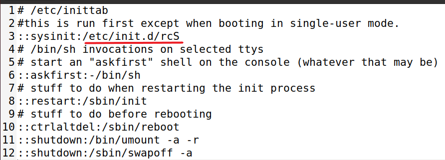
> 图：/etc/inittab 文件内容截图，第3行 “::sysinit:/etc/init.d/rcS” 中被下划线标出的 /etc/init.d/rcS，说明rcS脚本在inittab中被指定

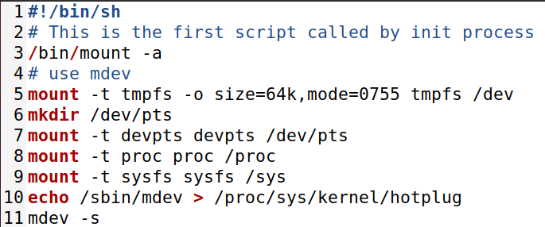
> 图：/etc/init.d/rcS 脚本内容：1 #!/bin/sh；2 # This is the first script called by init process；3 /bin/mount -a（挂载etc/fstab中指定的文件系统）；4 # use mdev；5 mount -t tmpfs -o size=64k,mode=0755 tmpfs /dev；6 mkdir /dev/pts；7 mount -t devpts devpts /dev/pts；8 mount -t proc proc /proc；9 mount -t sysfs sysfs /sys；10 echo /sbin/mdev > /proc/sys/kernel/hotplug；11 mdev -s（mdev命令用于创建设备文件）
挂载etc/fstab中指定的文件系统
mdev命令（用于创建设备文件）

<!-- Slide number: 39 -->
# 6.2 Busybox构建根文件系统
（3）创建etc/fstab文件
该文件配置了“mount -a”命令挂载的文件系统
此处该文件的内容为：

各字段的含义
 device：要挂载的设备。可以是设备文件（如/dev/mtdblock1）；可以是nfs文件系统（此时该字段为<host>:<dir>）；可以是其他类型的文件系统，对于proc、tmpfs等虚拟文件系统，该字段无意义，可以是任意值
mount-point：挂载点
type：文件系统类型。如ext4、yaffs、nfs、sysfs等，还可以是auto，表示系统自动检测文件系统类型

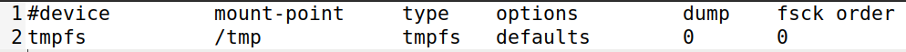
> 图：创建的 /etc/fstab 文件内容（表格形式）：第一行为字段名 device、mount-point、type、options、dump、fsck order；第二行为实际内容 “tmpfs  /tmp  tmpfs  defaults  0  0”

<!-- Slide number: 40 -->
options：挂载参数，以逗号隔开。常用参数如下：

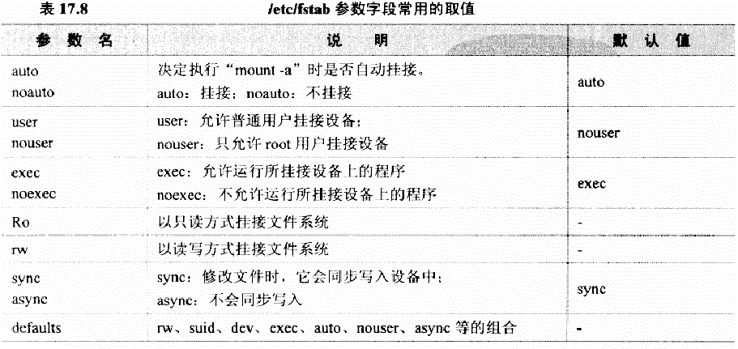
> 图：表17.8 “/etc/fstab 参数字段常用的取值”：auto/noauto（决定执行“mount -a”时是否自动挂接，默认auto）、user/nouser（user允许普通用户挂接设备，nouser只允许root用户挂接设备，默认nouser）、exec/noexec（是否允许运行所挂接设备上的程序，默认exec）、ro（以只读方式挂接文件系统）、rw（以读写方式挂接文件系统）、sync/async（sync修改文件时会同步写入设备中，async不会同步写入，默认sync）、defaults（rw、suid、dev、exec、auto、nouser、async等的组合）

<!-- Slide number: 41 -->
dump：dump程序根据该字段的值确定这个文件系统是否需要备份，0表示不备份
fsck order：执行fsck程序时（磁盘检测程序），程序根据该字段的值按顺序检查磁盘（数字越小优先级越高），0表示不检查，通常根文件系统设为1，其他文件系统设为2

<!-- Slide number: 42 -->
# 6.2 Busybox构建根文件系统
（4）创建etc/profile文件
该文件是一个shell脚本，用于设置系统的环境变量
用户登录时会执行该文件
内容如下

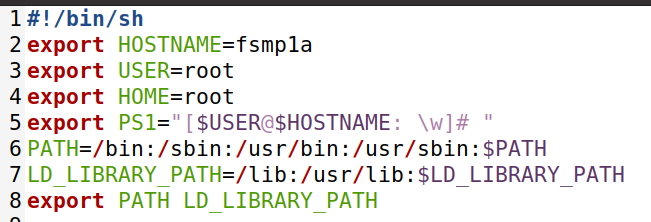
> 图：创建的 /etc/profile 文件内容：1 #!/bin/sh；2 export HOSTNAME=fsmpl1a；3 export USER=root；4 export HOME=root；5 export PS1="[$USER@$HOSTNAME: \w]# "（PS1设置命令行提示符）；6 PATH=/bin:/sbin:/usr/bin:/usr/sbin:$PATH；7 LD_LIBRARY_PATH=/lib:/usr/lib:$LD_LIBRARY_PATH；8 export PATH LD_LIBRARY_PATH
PS1设置命令行提示符

<!-- Slide number: 43 -->
# 6.2 Busybox构建根文件系统
2. 构建dev目录
使用mdev程序，动态创建dev目录下的文件
mdev通过读取内核信息来创建设备文件
使用mdev需要内核支持sysfs文件系统（内核默认配置已支持）
为减少对Flash的读写，内核启用tmpfs文件系统（内核默认配置已支持）

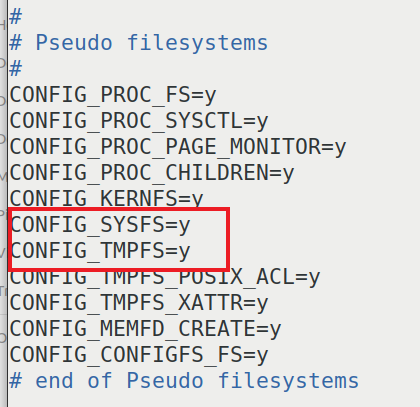
> 图：内核配置文件（.config）中 Pseudo filesystems（伪文件系统）段的截图：CONFIG_PROC_FS=y、CONFIG_PROC_SYSCTL=y、CONFIG_KERNFS=y、CONFIG_SYSFS=y、CONFIG_TMPFS=y（后两项用红框标出）、CONFIG_TMPFS_POSIX_ACL=y、CONFIG_CONFIGFS_FS=y 等
内核配置文件（.config）中的Pseudo文件系统配置

<!-- Slide number: 44 -->
# 6.2 Busybox构建根文件系统
<busybox source>/docs/mdev.txt给出了使用mdev自动管理设备文件的说明

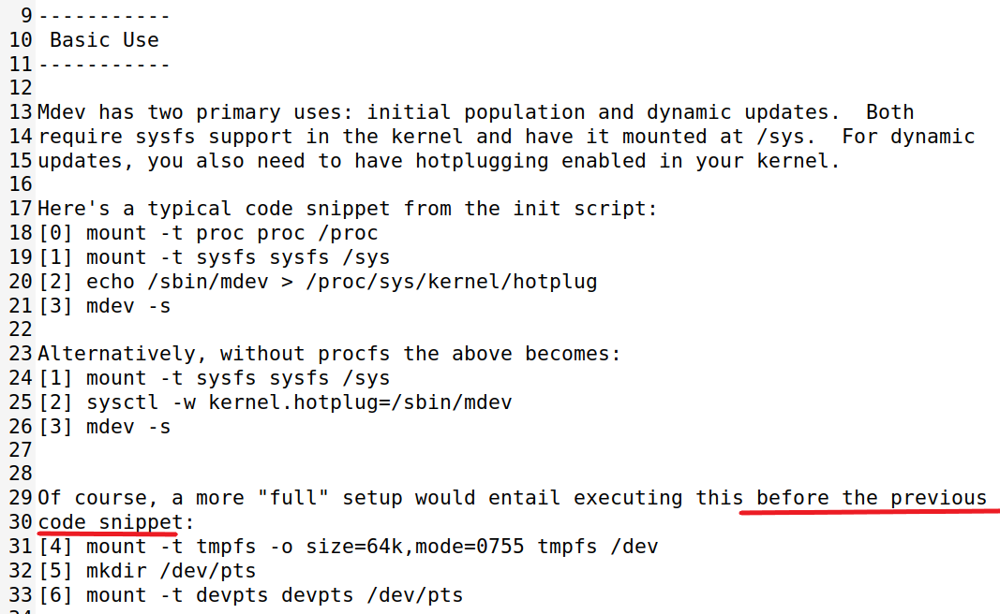
> 图：busybox 源码 <busybox source>/docs/mdev.txt 文档节选：Mdev 有 initial population 和 dynamic updates 两种用途，都需要内核支持sysfs并挂载在/sys，动态更新还需内核启用hotplugging；典型 init script 代码片段为 [0] mount -t proc proc /proc、[1] mount -t sysfs sysfs /sys、[2] echo /sbin/mdev > /proc/sys/kernel/hotplug、[3] mdev -s；更“full”的setup（红笔标注 before the previous code snippet）需先执行 [4] mount -t tmpfs -o size=64k,mode=0755 tmpfs /dev、[5] mkdir /dev/pts、[6] mount -t devpts devpts /dev/pts

<!-- Slide number: 45 -->
# 6.2 Busybox构建根文件系统
根据<busybox source>/docs/mdev.txt的说明，使用mdev自动管理dev的步骤为：
（1）在/dev目录下挂载tmpfs文件系统，减少对Flash的读写：
                mount -t tmpfs -o size=64k,mode=0755 tmpfs /dev
（2）创建dev/pts挂载点：
                mkdir  /dev/pts
（3）把devpts文件系统挂载到/dev/pts，用于支持远程虚拟终端（通过telnet网络连接的虚拟终端）：
                mount  -t  devpts  devpts  /dev/pts
（4）挂载proc文件系统，以便访问内核：
                mount  -t   proc           proc     /proc
（5）挂载sysfs文件系统，使得mdev程序可以通过sysfs文件系统获得设备信息：
                mount  -t  sysfs  sysfs  /sys
（6）设置内核，当有设备拔插时调用/sbin/mdev程序，以动态创建或删除设备文件
                echo  /sbin/mdev>/proc/sys/kernel/hotplug
（7）在/dev目录下生成内核启动时创建的所有设备文件：
                mdev  -s

<!-- Slide number: 46 -->
# 6.2 Busybox构建根文件系统
将上诉6个步骤的命令添加到etc/init.d/rcS文件中（前面已经添加），使内核启动时自动运行mdev：

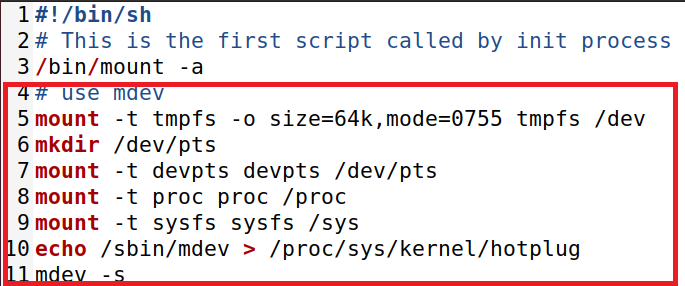
> 图：添加了mdev相关命令后的 /etc/init.d/rcS 脚本内容：#!/bin/sh、# This is the first script called by init process、/bin/mount -a、# use mdev，第4~11行用红框标出：mount -t tmpfs -o size=64k,mode=0755 tmpfs /dev、mkdir /dev/pts、mount -t devpts devpts /dev/pts、mount -t proc proc /proc、mount -t sysfs sysfs /sys、echo /sbin/mdev > /proc/sys/kernel/hotplug、mdev -s
注意要创建一个空目录dev

<!-- Slide number: 47 -->
# 6.2 Busybox构建根文件系统
使能内核uevent helper
系统启动时，执行到etc/init.d/rcS第11行会提示以下错误

需修改内核配置如下：

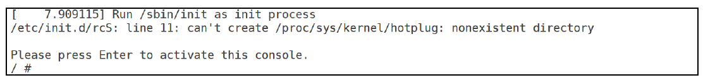
> 图：开发板串口输出的错误信息：“[    7.909115] Run /sbin/init as init process”、“/etc/init.d/rcS: line 11: can't create /proc/sys/kernel/hotplug: nonexistent directory”，以及提示 “Please press Enter to activate this console.”

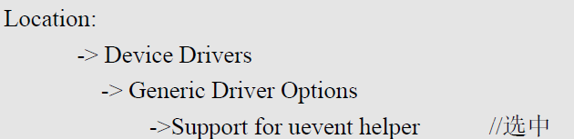
> 图：文字说明需修改的内核配置路径：Location: -> Device Drivers -> Generic Driver Options -> Support for uevent helper（//选中）

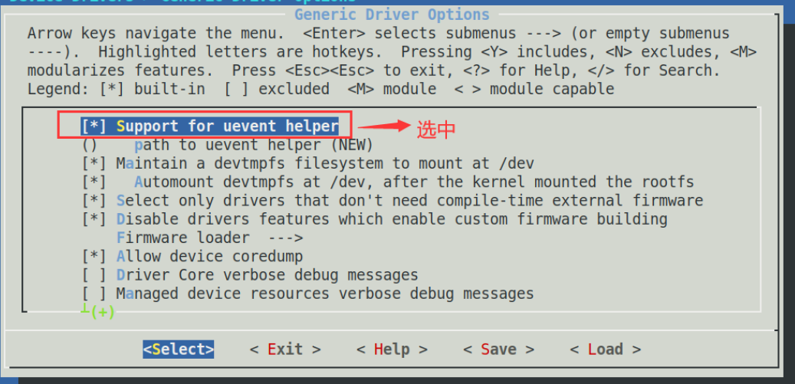
> 图：内核 menuconfig 的 Generic Driver Options 菜单截图：“[*] Support for uevent helper” 已选中（红框标出，红色箭头注明“选中”），下方还有 () path to uevent helper (NEW)、[*] Maintain a devtmpfs filesystem to mount at /dev、[*] Automount devtmpfs at /dev, after the kernel mounted the rootfs、[*] Firmware loader ---> 等选项

<!-- Slide number: 48 -->
# 6.2 Busybox构建根文件系统
3. 构建其他目录
根文件系统中，其他目录（proc、mnt、tmp、sys、root）可以是空目录，因此在busybox安装目录下用以下命令创建相应目录：
         mkdir  proc  mnt  tmp  sys  root

<!-- Slide number: 49 -->
# 6.2 Busybox构建根文件系统
通过nfs挂载根文件系统
服务器端（PC端Linux）配置
（1）在PC上安装nfs服务器程序
          sudo apt update
           sudo apt install nfs-kernel-server
（2）在PC上安装nfs客户端程序
           sudo apt install nfs-common

<!-- Slide number: 50 -->
# 6.2 Busybox构建根文件系统
（3）在PC的用户目录（此处为/home/cnu)下创建一个目录nfsboot，作为网络共享的目录
（4）在PC上对nfs服务器进行配置
   编辑/etc/exports文件，添加以下内容：
　　  /home/cnu/nfsboot  *(rw,sync,no_root_squash,no_subtree_check)

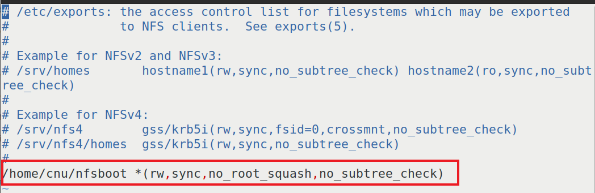
> 图：/etc/exports 文件截图：前面为注释掉的示例（NFSv2/v3：/srv/homes hostname1(rw,sync,no_subtree_check)...；NFSv4：/srv/nfs4 gss/krb5i(rw,sync,fsid=0,crossmnt,no_subtree_check)...），末行新添加 “/home/cnu/nfsboot *(rw,sync,no_root_squash,no_subtree_check)”（红框标出）

<!-- Slide number: 51 -->
# 6.2 Busybox构建根文件系统
   “/home/cnu/nfsboot”为第（3）步所创建的nfs共享目录

     “*”表示允许访问的客户端IP为任意IP，此处也可以是“192.168.1.*”等内容

    “rw”表示共享目录的访问权限为读/写

    “sync”表示数据同步写入到内存和磁盘，此处还可以为“async”表示数据先暂存于内存，而不同步写入磁盘，在用于挂载根文件系统时使用“sync”参数

    “no_root_squash”表示远程用户如果是root用户，则对该共享目录具有root权限，该参数极不安全，通常只用于挂载根文件系统时使用，通常情况使用参数“root_squash”

     “no_subtree_check”表示不检查父目录权限

<!-- Slide number: 52 -->
# 6.2 Busybox构建根文件系统
	（5）使能nfs v2版本（开发板上的nfs客户端是V2版本）
              在/etc/default/nfs-kernel-server中添加以下内容：
                   RPCNFSDOPTS="--nfs-version 2,3,4 --debug --syslog"

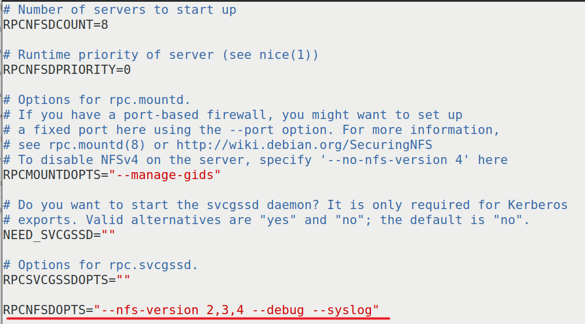
> 图：/etc/default/nfs-kernel-server 文件内容截图：RPCNFSDCOUNT=8、RPCNFSDPRIORITY=0、RPCMOUNTDOPTS="--manage-gids"、NEED_SVCGSSD=""、RPCSVCGSSDOPTS="" 等，末行添加的 “RPCNFSDOPTS="--nfs-version 2,3,4 --debug --syslog"” 用红色下划线标出

<!-- Slide number: 53 -->
# 6.2 Busybox构建根文件系统
	（5）执行如下命令，重启nfs服务器使配置生效：
                  sudo /etc/init.d/nfs-kernel-server  restart
	（6）把根文件系统的目录复制到/home/cnu/nfsboot目录下，并改名为rfs
    （7）在PC上验证nfs服务器是否正常工作
              在PC上执行如下命令，把/home/cnu/nfsboot/rfs挂
              载到/mnt目录:
       sudo mount localhost:/home/cnu/nfsboot/rfs /mnt -t nfs
             如能正常挂载，在/mnt下将能看到rfs目录中的内容

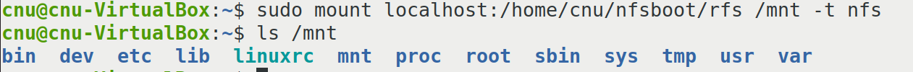
> 图：终端截图：执行 “sudo mount localhost:/home/cnu/nfsboot/rfs /mnt -t nfs” 后再执行 “ls /mnt”，输出 bin、dev、etc、lib、linuxrc、mnt、proc、root、sbin、sys、tmp、usr、var，说明能正常挂载、nfs服务器工作正常

<!-- Slide number: 54 -->
# 6.2 Busybox构建根文件系统
客户端（开发板）配置
  （1）在u-boot中通过以下命令配置bootargs环境变量：
    setenv bootargs 'console=ttySTM0,115200 root=/dev/nfs nfsroot=192.168.0.100:/home/cnu/nfsboot/rfs,proto=tcp rw ip=192.168.0.2:192.168.0.100:192.168.0.1:255.255.255.0::eth0:off'
	（2）通过以下命令保存环境变量：
       saveenv

<!-- Slide number: 55 -->
# 6.2 Busybox构建根文件系统
客户端（开发板）配置
  （1）在u-boot中通过以下命令配置bootargs环境变量：
    setenv bootargs 'console=ttySTM0,115200 root=/dev/nfs nfsroot=192.168.0.100:/home/cnu/nfsboot/rfs,proto=tcp rw ip=192.168.0.2:192.168.0.100:192.168.0.1:255.255.255.0::eth0:off'
	（2）通过以下命令保存环境变量：

<!-- Slide number: 56 -->
# 6.2 Busybox构建根文件系统
在Linux内核源码里面有相应的文档讲解如何设置nfs，文档为Documentation/filesystems/nfs/nfsroot.txt，格式如下：
   root=/dev/nfs nfsroot=[<server-ip>:]<root-dir>[,<nfs-options>] ip=<client-ip>:<server-ip>:<gw-ip>:<netmask>:<hostname>:<device>:<autoconf>:<dns0-ip>:<dns1-ip>

<hostname>：主机的名字，一般不设置，此值可以空着。
<device>：设备名，也就是网卡名，一般是eth0，eth1….，本开发板只有一个网口，名字为eth0。
<autoconf>：自动配置，一般不使用，所以设置为off。
<dns0-ip>：DNS0服务器IP地址，不使用。
<dns1-ip>：DNS1服务器IP地址，不使用。

<!-- Slide number: 57 -->
禁止git的hash值添加到内核版本号中
第5章的内核编译配置中，内核版本号额外添加了git生成的hash值，造成每次git提交之后内核版本号会发生变化
内核版本号与模块版本号不一致时，模块无法运行
在内核源码顶层目录下执行以下命令，并重新编译内核，得到版本号不含hash值的内核：
	 echo "" > .scmversion
后续实验中都使用不带hash值的内核
带hash值的内核镜像文件（即uImage文件）请保留！保留！保留！用于检查作业
# 修改内核

<!-- Slide number: 58 -->
# 6.3 Buildroot构建根文件系统
使用busybox构建根文件系统存在的不足
只能构建Linux的常用命令，其它目录和文件需要手动创建
默认没有用户名和密码，要添加也很繁琐
后续移植第三方软件和库时，需自己手动移植，且移植依赖库非常复杂

<!-- Slide number: 59 -->
# 6.3 Buildroot构建根文件系统
为解决以上问题可以使用buildroot、yocto等来制作根文件系统
直接生成完整的根文件系统
包含大量第三方软件和库，只需简单配置即可添加到根文件系统中
自动处理依赖问题
更适合做实际产品，缩短开发周期
半导体原厂常使用yocto制作系统包
yocto编译较复杂，且过程中对网络环境要求较高，因此我们选择buildroot

<!-- Slide number: 60 -->
# 6.3 Buildroot构建根文件系统
buildroot源码可从其官方网站https://buildroot.org 下载（本课程选择2020.02.6版本）

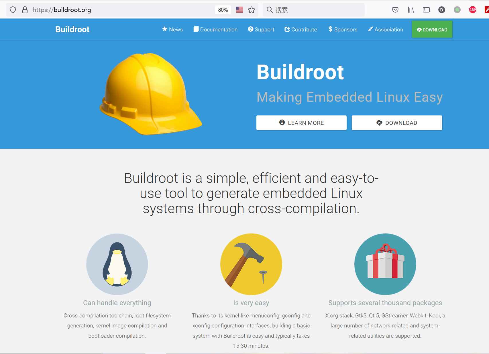
> 图：Buildroot 官网首页截图（https://buildroot.org）：黄色安全帽图标和口号 “Buildroot - Making Embedded Linux Easy”，带 LEARN MORE 与 DOWNLOAD 按钮；下方说明 “Buildroot is a simple, efficient and easy-to-use tool to generate embedded Linux systems through cross-compilation.”，并有三个特点：Can handle everything（交叉编译工具链、根文件系统生成、内核与bootloader编译）、Is very easy（类似内核的menuconfig配置界面，15-30分钟即可构建基本系统）、Supports several thousand packages（X.org、Gtk3、Qt 5、GStreamer、Webkit等数千软件包）

<!-- Slide number: 61 -->
# 6.3 Buildroot构建根文件系统
配置buildroot
在源码顶层目录执行以下命令打开配置界面
             make menuconfig

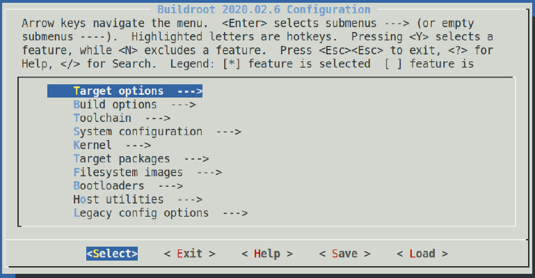
> 图：执行 make menuconfig 后的 “Buildroot 2020.02.6 Configuration” 配置主界面：Target options、Build options、Toolchain、System configuration、Kernel、Target packages、Filesystem images、Bootloaders、Host utilities、Legacy config options，当前高亮选中 Target options

<!-- Slide number: 62 -->
# 6.3 Buildroot构建根文件系统
配置buildroot
1. 配置Target options
该配置是开发板（即Target）处理相关的配置
按以下参数进行配置

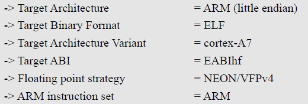
> 图：Target options 的配置参数文字列表：-> Target Architecture = ARM (little endian)；-> Target Binary Format = ELF；-> Target Architecture Variant = cortex-A7；-> Target ABI = EABIhf；-> Floating point strategy = NEON/VFPv4；-> ARM instruction set = ARM

> 图：buildroot 配置界面中 “Target options” 菜单标题的小截图

<!-- Slide number: 63 -->
# 6.3 Buildroot构建根文件系统
配置完成后如下图所示

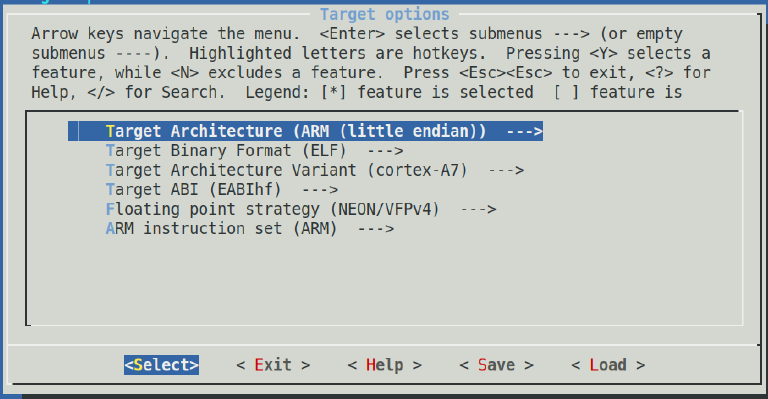
> 图：配置完成后的 Target options 菜单截图：Target Architecture (ARM (little endian))、Target Binary Format (ELF)、Target Architecture Variant (cortex-A7)、Target ABI (EABIhf)、Floating point strategy (NEON/VFPv4)、ARM instruction set (ARM)

<!-- Slide number: 64 -->
# 6.3 Buildroot构建根文件系统
配置说明
ARM处理器默认为little endian，如不确定可在PC上用如下命令查看之前生成的busybox

LSB代表Least Significant Bit first，即little endian
MSB代表Most Significant Bit first，即big endian
Linux系统中的可执行程序都是ELF格式
stm32mp157处理为双核A7+单核M4，Linux只使用A7核心
支持EABI+硬浮点（EABIhf）
处理器支持硬件浮点NEON/VFPv4
Linux下都是使用ARM指令集

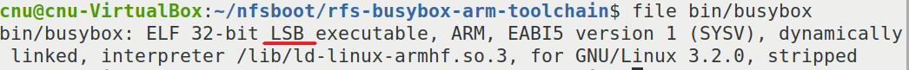
> 图：终端截图：在 ~/nfsboot/rfs-busybox-arm-toolchain 目录下执行 file bin/busybox，输出 “bin/busybox: ELF 32-bit LSB executable, ARM, EABI5 version 1 (SYSV), dynamically linked, interpreter /lib/ld-linux-armhf.so.3, for GNU/Linux 3.2.0, stripped”，其中 LSB（Least Significant Bit first，即little endian）被红笔圈出

<!-- Slide number: 65 -->
# 6.3 Buildroot构建根文件系统
2. 配置Toolchain
此项用于配置交叉编译工具链，配置如下

> 图：Toolchain 的配置参数文字列表：-> Toolchain type = External toolchain；-> Toolchain = Custom toolchain（用户自己的交叉编译器）；-> Toolchain origin = Pre-installed toolchain（预装的编译器）；-> Toolchain path = /usr/local/arm/gcc-arm-9.2-2019.12-x86_64-arm-none-linux-gnueabihf；-> Toolchain prefix = $(ARCH)-none-linux-gnueabihf（前缀）；-> External toolchain gcc version = 9.x；-> External toolchain kernel headers series = 4.20.x（交叉编译器的linux版本号）；-> External toolchain C library = glibc/eglibc；-> [*] Toolchain has SSP support? (NEW)（选中）；-> [*] Toolchain has RPC support? (NEW)（选中）

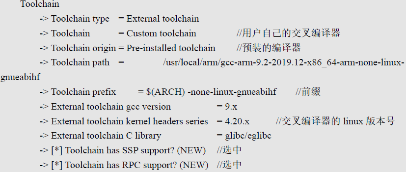
> 图：Toolchain 的配置参数文字列表（续）：-> [*] Toolchain has C++ support? //选中；-> [*] Enable MMU support (NEW) //选中

<!-- Slide number: 66 -->
# 6.3 Buildroot构建根文件系统
配置说明
Toolchain type可选择buildroot内置的toolchain（会在编译时从网上下载，下载非常慢！！！）和外部toolchain（非buildroot自带的），此处选择外部toolchain
Toolchain origin = Pre-installed tool chain, 表示选择PC上已安装的toolchain
这里只能使用自己安装的arm官方工具链，不能使用ST官方工具链或Ubuntu系统提供的工具链。在<buildroot source>/toolchain/helpers.mk中对toolchain有如下要求：

<!-- Slide number: 67 -->
#

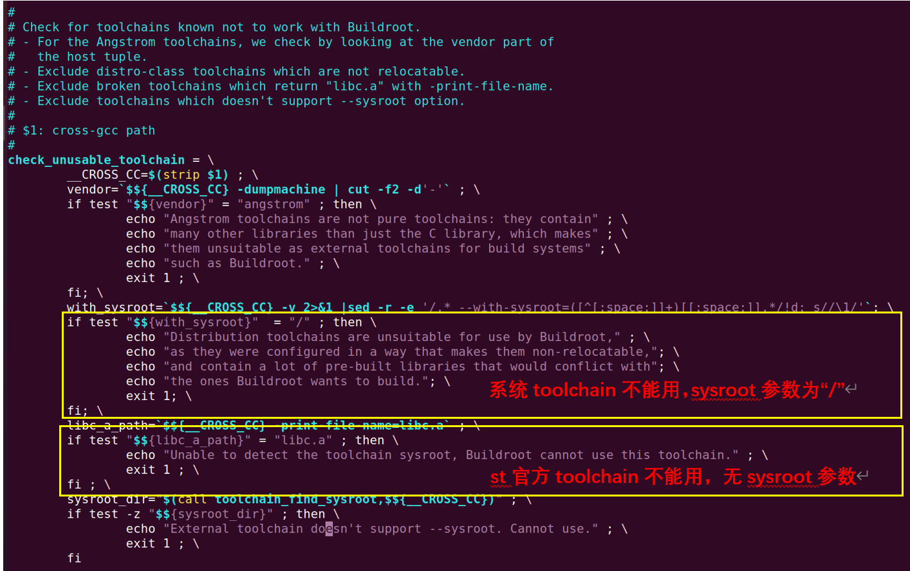
> 图：buildroot 源码 <buildroot source>/toolchain/helpers.mk 中 check_unusable_toolchain 的代码截图（深色终端）：注释说明检查不能与Buildroot配合使用的工具链（Angstrom工具链、不可重定位的发行版工具链、-print-file-name返回"libc.a"的工具链、不支持--sysroot的工具链）；黄框标出两段：if test "${with_sysroot}" = "/" 时输出 “Distribution toolchains are unsuitable for use by Buildroot...”（红色批注：系统toolchain不能用，sysroot参数为“/”）；if test "${libc_a_path}" = "libc.a" 时输出 “Unable to detect the toolchain sysroot, Buildroot cannot use this toolchain.”（红色批注：st官方toolchain不能用，无sysroot参数）

<!-- Slide number: 68 -->
# 6.3 Buildroot构建根文件系统
配置说明
Toolchain path指定到包含xxx-gcc的bin目录的祖父目录（即../../bin的路径）
 External toolchain gcc version 通过以下命令查看：
                  arm-none-linux-gnueabihf-gcc -v

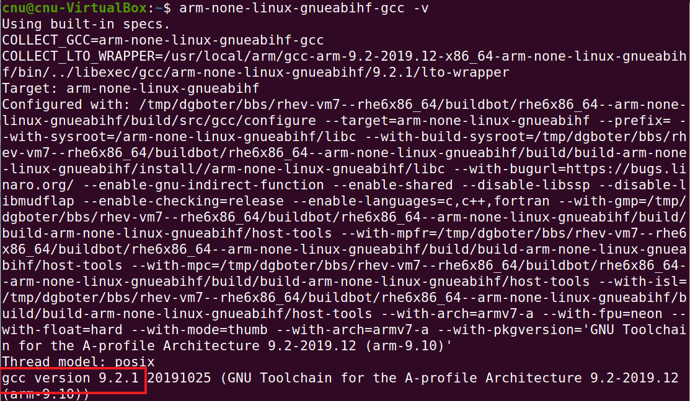
> 图：终端截图：执行 arm-none-linux-gnueabihf-gcc -v 的输出（Using built-in specs、COLLECT_GCC=arm-none-linux-gnueabihf-gcc、Target: arm-none-linux-gnueabihf、Configured with:... --with-arch=armv7-a --with-fpu=neon --with-float=hard、Thread model: posix 等），末行 “gcc version 9.2.1 20191025 (GNU Toolchain for the A-profile Architecture 9.2-2019.12 (arm-9.10))” 中 gcc version 9.2.1 被红框标出

<!-- Slide number: 69 -->
# 6.3 Buildroot构建根文件系统
配置说明
External toolchain kernel headers series 通过以下方式确定：
（1）在toolchain安装目录下搜索到文件version.h，查看其内容

（2）其中                  即为版本号，但需要进行转换
（3）上述数字为10进制数，将其转为16进制4140D
（4）根据
         把4140D从低位开始2位一组分组：04.14.0D
（5）把上述每一组数字从16进制转为10进制：4.20.13，即为我们需要的版本号

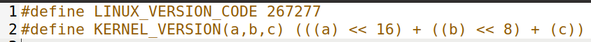
> 图：toolchain 安装目录下搜到的 version.h 文件内容：1 #define LINUX_VERSION_CODE 267277；2 #define KERNEL_VERSION(a,b,c) (((a) << 16) + ((b) << 8) + (c))

> 图：数字 “267277” 的放大截图，即 version.h 中 LINUX_VERSION_CODE 的十进制值

> 图：宏定义 “KERNEL_VERSION(a,b,c) (((a) << 16) + ((b) << 8) + (c))” 的放大截图

<!-- Slide number: 70 -->
# 6.3 Buildroot构建根文件系统
3. 配置System configuration
此选项用于设置一些系统配置，如开发板名字、欢迎语、用户名、密码等
参考配置如下

注意：Enable root login with password 要选中！！！密码可以留空

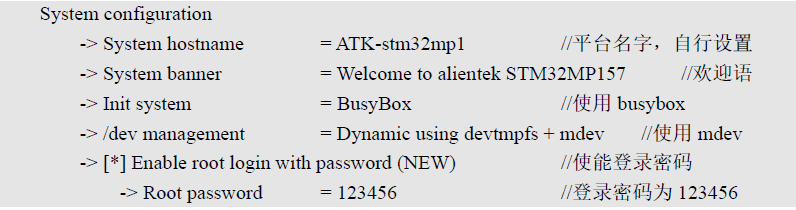
> 图：System configuration 的参考配置文字列表：-> System hostname = ATK-stm32mp1（平台名字，自行设置）；-> System banner = Welcome to alientek STM32MP157（欢迎语）；-> Init system = BusyBox（使用busybox）；-> /dev management = Dynamic using devtmpfs + mdev（使用mdev）；-> [*] Enable root login with password (NEW)（使能登录密码）；-> Root password = 123456（登录密码为123456）

<!-- Slide number: 71 -->
# 6.3 Buildroot构建根文件系统
配置说明
System hostname 为开发板名字，可任意设置
System banner 为用户登录前的欢迎语，可任意设置
Init system 为init进程，通常使用Busybox提供的init进程
/dev management 为设备文件的管理方式，需使用mdev
Enable root login with password 必须选中，否则无法登录系统
Root password 是root用户的登录密码，可以留空

<!-- Slide number: 72 -->
# 6.3 Buildroot构建根文件系统
4. 配置Filesystem images
此选项用于自动生成根文件系统的映像文件，如果需要自动生成映像文件，可参考如下配置

通常buildroot生成的根文件系统还需要微调，因此不需要自动生成映像文件（此处的配置保留默认配置即可），等微调好后，再手动生成映像文件

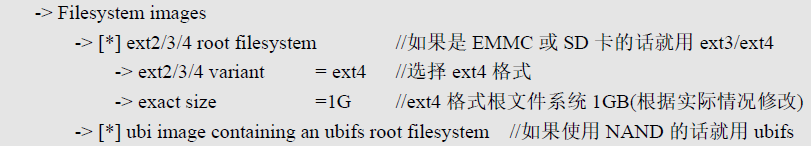
> 图：Filesystem images 的参考配置文字列表：-> [*] ext2/3/4 root filesystem（如果是EMMC或SD卡的话就用ext3/ext4）；-> ext2/3/4 variant = ext4（选择ext4格式）；-> exact size = 1G（ext4格式根文件系统1GB，根据实际情况修改）；-> [*] ubi image containing an ubifs root filesystem（如果使用NAND的话就用ubifs）

<!-- Slide number: 73 -->
# 6.3 Buildroot构建根文件系统
5. 禁止编译Linux内核和uboot
buildroot可以编译Linux内和uboot，
但是它是下载官方mainline版本进行编译，没有对开发板进行适配；并且对编译器版本有要求，可能导致编译失败
因此在buildroot中不要编译内核和uboot
配置如下

> 图：文字说明：-> Kernel -> [ ] Linux Kernel //不要选择编译Linux Kernel选项！

> 图：文字说明：-> Bootloaders -> [ ] U-Boot //不要选择编译U-Boot选项！

<!-- Slide number: 74 -->
# 6.3 Buildroot构建根文件系统
6. 配置Target packages
此选项用于配置要选择的第三方库或软件，比如 alsa-utils、 ffmpeg、 iperf等工具
这里暂时只选择内核模块加载相关的软件（先生成一个最小系统，再逐步丰富功能）
配置如下

该配置使能了内核模块相关的操作命令，比如 depmod

> 图：文字说明：-> Target packages -> System tools -> [*] kmod //使能内核模块相关命令

<!-- Slide number: 75 -->
# 6.3 Buildroot构建根文件系统
编译buildroot
使用以下命令进行编译（注意此时不要加-jx进行多线程编译）
           make
编译过程中会从网上下载源码，可能出现无法下载或下载很慢的情况，此时可终止编译，手动下载源码包，然后放到<buildroot source>/dl目录下，再重新编译

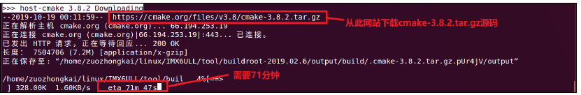
> 图：编译buildroot时的终端截图：正在从 https://cmake.org/files/v3.8/cmake-3.8.2.tar.gz 下载 cmake-3.8.2.tar.gz 源码（红框标出，旁注“从此网站下载cmake-3.8.2.tar.gz源码”），已连接主机 cmake.org (166.194.253.19) 的 196.251.174.143:443，长度7594706 (7.2M)，正在保存至 “…/buildroot-2020.02.6/output/build/.cmake-3.8.2.tar.gz.pUr4jV/output”，速度约2.00KB/s，“eta 71m 47s”（红框标注“需要71分钟”，部分IP地址被涂黑）

<!-- Slide number: 76 -->
# 6.3 Buildroot构建根文件系统
编译成功在<buildroot source>/output/images生成各种格式的根文件系统映像文件（文件格式由配置阶段的设置确定）。这里我们只需要rootfs.tar文件，它是根文件系统的压缩包
将此rootfs.tar压缩包复制到nfs的目录下（此处为/home/cnu/nfsboot），解压压缩包，并把目录名改为rfs（和开发板的bootargs设置一致），即可用此根文件系统启动开发板

<!-- Slide number: 77 -->
# 6.3 Buildroot构建根文件系统
根文件系统微调-微调busybox
系统启动时可能会看到以下错误

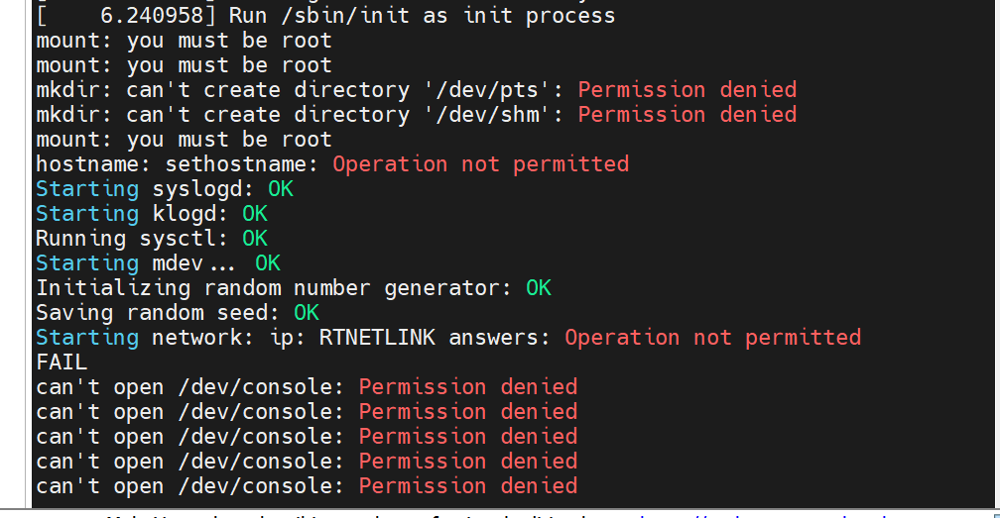
> 图：开发板启动时的串口输出（大量报错）：“[    6.240958] Run /sbin/init as init process”、mount: you must be root（两条）、mkdir: can't create directory '/dev/pts': Permission denied、mkdir: can't create directory '/dev/shm': Permission denied、hostname: sethostname: Operation not permitted、Starting syslogd: OK、Starting klogd: OK、Running sysctl: OK、Starting mdev... OK、Starting network: ip: RTNETLINK answers: Operation not permitted FAIL、can't open /dev/console: Permission denied（多条）

<!-- Slide number: 78 -->
# 6.3 Buildroot构建根文件系统
这是由于可执行程序busybox设置Set UID权限，权限造成任何用户在执行busybox时，都认为是busybox的属主用户在执行，出现Permission denied的错误
只需去掉根文件系统中bin/busybox的Set UID权限即可，执行以下命令去掉Set UID权限：
            chmod a-s busybox

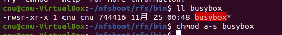
> 图：终端截图：在 ~/nfsboot/rfs/bin 目录下执行 ll busybox，显示 “-rwsr-xr-x 1 cnu cnu 744416 11月 25 00:48 busybox*”（权限中的 s 即Set UID权限），随后执行 chmod a-s busybox 去掉Set UID权限

<!-- Slide number: 79 -->
# 6.3 Buildroot构建根文件系统
根文件系统微调-微调busybox
在buildroot中busybox可以进行详细配置
在buildroot源码顶层目录下，执行以下命令可进入busybox配置界面
              make busybox-menuconfig
参考6.2节的配置，对busybox进行配置即可
如果需要对busybox进行修改（此处不需要修改！），其源码在<buildroot source>/output/build目录下
配置busybox后，需重新编译buildroot生成新的根文件系统

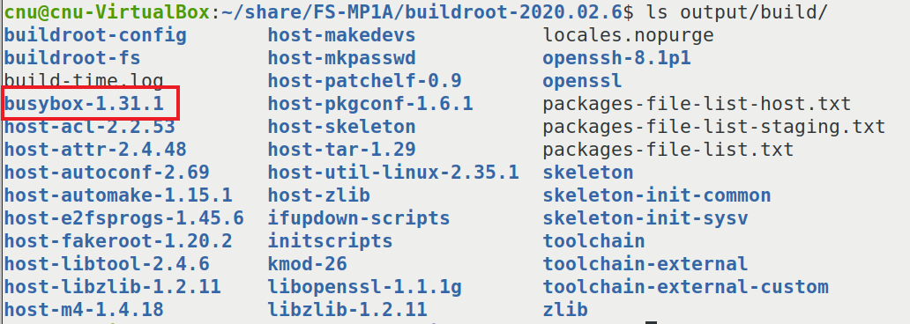
> 图：终端截图：在 ~/share/FS-MP1A/buildroot-2020.02.6 目录下执行 ls output/build/，输出中包括 buildroot-config、buildroot-fs、build-time.log、busybox-1.31.1（红框标出）、host-autoconf-2.69、host-automake-1.15.1、host-e2fsprogs-1.45.6、host-fakeroot-1.20.2、host-libtool-2.4.6、host-m4-1.4.18、host-makedevs、host-mkpasswd、host-util-linux-2.35.1、ifupdown-scripts、initscripts、kmod-26、libopenssl-1.1.1g、libzlib-1.2.11、locales.nopurge、openssh-8.1p1、openssl、skeleton、skeleton-init-common、skeleton-init-sysv、toolchain、toolchain-external、toolchain-external-custom、zlib 等

<!-- Slide number: 80 -->
# 6.3 Buildroot构建根文件系统
根文件系统微调-修改错误
启动开发板，进入Linux系统，会有以下出错提示

在根文件系统的/lib目录下创建modules目录即可

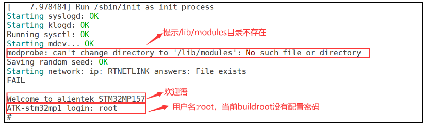
> 图：开发板启动时的串口输出：Starting syslogd: OK、Starting klogd: OK、Running sysctl: OK、Starting mdev... OK，其中红框报错 “modprobe: can't change directory to '/lib/modules': No such file or directory”（箭头注明“提示/lib/modules目录不存在”）；下方为欢迎语 “Welcome to alientek STM32MP157”（箭头注明“欢迎语”）和 “ATK-stm32mp1 login: root”（箭头注明“用户名:root，当前buildroot没有配置密码”）

<!-- Slide number: 81 -->
# 6.3 Buildroot构建根文件系统
根文件系统微调-修改错误
如果在busybox中使能了depmod命令（请参照6.2节的设置使能该命令）

启动开发板，进入Linux系统，会有以下出错提示

在根文件系统的/lib/modules目录下创建5.4.31目录即可

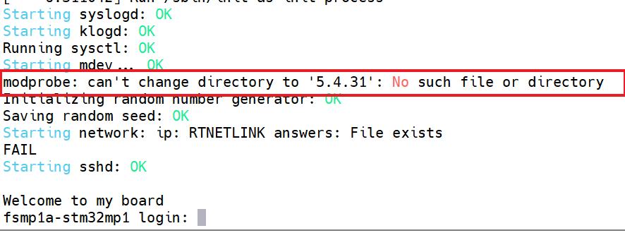
> 图：开发板启动时的串口输出：Starting syslogd: OK、Starting klogd: OK、Running sysctl: OK、Starting mdev... OK，红框报错 “modprobe: can't change directory to '5.4.31': No such file or directory”；其后 Initializing random number generator: OK、Saving random seed: OK、Starting network: ip: RTNETLINK answers: File exists FAIL、Starting sshd: OK，最后显示欢迎语 “Welcome to my board” 和 “fsmp1a-stm32mp1 login:”

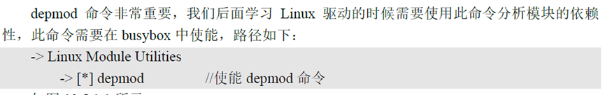
> 图：文字说明：depmod 命令非常重要，后面学习Linux驱动的时候需要使用此命令分析模块的依赖性，此命令需要在busybox中使能，路径如下：-> Linux Module Utilities -> [*] depmod //使能depmod命令

<!-- Slide number: 82 -->
# 6.3 Buildroot构建根文件系统
根文件系统微调-修改错误
启动开发板，进入Linux系统，会有以下出错提示

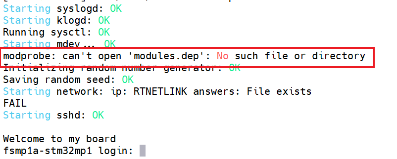
> 图：开发板启动时的串口输出：Starting syslogd: OK、Starting klogd: OK、Running sysctl: OK、Starting mdev... OK，红框报错 “modprobe: can't open 'modules.dep': No such file or directory”；其后 Initializing random number generator: OK、Saving random seed: OK、Starting network: ip: RTNETLINK answers: File exists FAIL、Starting sshd: OK，最后显示 “Welcome to my board” 和 “fsmp1a-stm32mp1 login:”

<!-- Slide number: 83 -->
# 6.3 Buildroot构建根文件系统
在开发板的Linux系统中执行以下命令，即可创建modules.dep文件
        depmod
如果创建后仍然提示此错误，可将modules.dep的访问权限设置为777
        chmod 777 /lib/modules/5.4.31/modules.dep

<!-- Slide number: 84 -->
# 6.3 Buildroot构建根文件系统
根文件系统微调-修改命令行提示符
在/etc/profile.d目录下创建一个名为myprofile.sh的shell脚本文件，其内容如下

此脚本把命令行提示符定义为如下格式：
       [user@hostname]:currentpath#           //root用户
       [user@hostname]:currentpath$           //非root用户

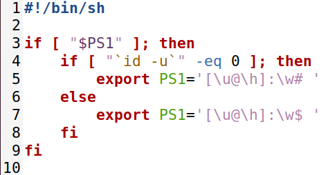
> 图：/etc/profile.d/myprofile.sh 脚本内容：1 #!/bin/sh；3 if [ "$PS1" ] ; then；4 if [ "`id -u`" -eq 0 ] ; then；5 export PS1='[\u@\h]:\w# '；6 else；7 export PS1='[\u@\h]:\w$ '；8 fi；9 fi

<!-- Slide number: 85 -->
# 6.3 Buildroot构建根文件系统
说明：
用户登录时，会执行/etc/profile，它是一个shell脚本，这个脚本又会遍历执行/etc/profile.d下的.sh文件，它们用于设置环境变量
myprofile.sh是参考/etc/profile 的以下片段编写的

其中环境变量PS1用于设置命令行提示符

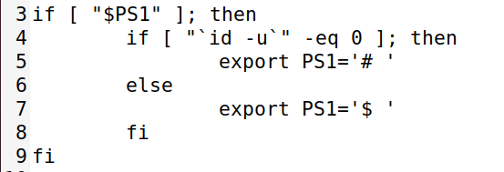
> 图：/etc/profile 中用于参考的片段（第3~9行）：if [ "$PS1" ] ; then / if [ "`id -u`" -eq 0 ] ; then / export PS1='# ' / else / export PS1='$ ' / fi / fi，其中环境变量PS1用于设置命令行提示符

<!-- Slide number: 86 -->

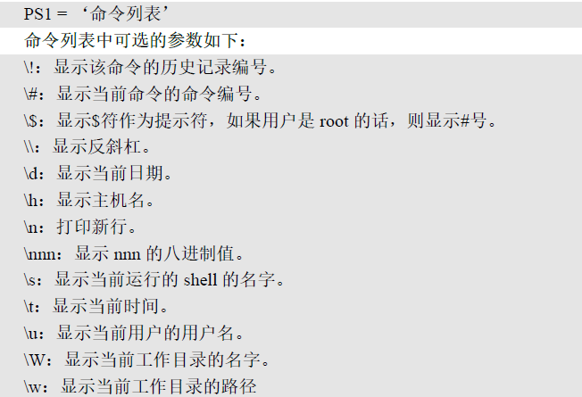
> 图：PS1 命令列提示符参数说明：PS1 = ‘命令列表’；命令列表中可选的参数如下：\! 显示该命令的历史记录编号；\# 显示当前命令的命令编号；\$ 显示$符作为提示符，如果用户是root的话则显示#号；\\ 显示反斜杠；\d 显示当前日期；\h 显示主机名；\n 打印新行；\nnn 显示nnn的八进制值；\s 显示当前运行的shell的名字；\t 显示当前时间；\u 显示当前用户的用户名；\W 显示当前工作目录的名字；\w 显示当前工作目录的路径

<!-- Slide number: 87 -->
# 6.3 Buildroot构建根文件系统
根文件系统微调-使能sysfs debug目录
在驱动调试时可能要访问/sys/kernel/debug目录中的文件，但现在该目录中没有任何文件
需要在上述目录下挂载debugfs文件系统，内核才会在其中创建文件
挂载方法为：在/etc/init.d目录下创建一个名为Sautorun的文件，其内容如下

> 图：创建的 /etc/init.d/Sautorun 脚本内容：1 #!/bin/sh；2 mount -t debugfs none /sys/kernel/debug

<!-- Slide number: 88 -->
# 6.3 Buildroot构建根文件系统
说明：
系统启动时/etc/init.d/rcS脚本会自动执行，该脚本里有如下代码，会遍历执行/etc/init.d目录中大写S开头的文件

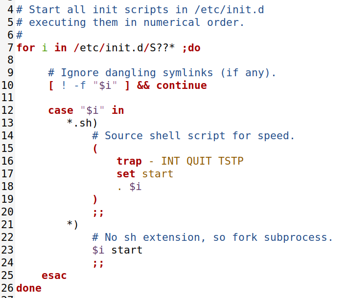
> 图：/etc/init.d/rcS 脚本片段（第4~26行）：“for i in /etc/init.d/S??* ;do” 遍历执行/etc/init.d目录中大写S开头的文件；[ ! -f "$i" ] && continue 忽略无效的符号连接；case "$i" in *.sh) 分支用 trap - INT QUIT TSTP、set start、. $i 方式执行shell脚本，*) 分支以 $i start 派生子进程执行；esac、done 结束

<!-- Slide number: 89 -->
# 6.3 Buildroot构建根文件系统
添加第三方软件和库
buildroot已内置了很多第三方软件，只需在配置时将相应软件选中即可
第三方软件在配置程序主界面的Target packages菜单下，按需选中即可

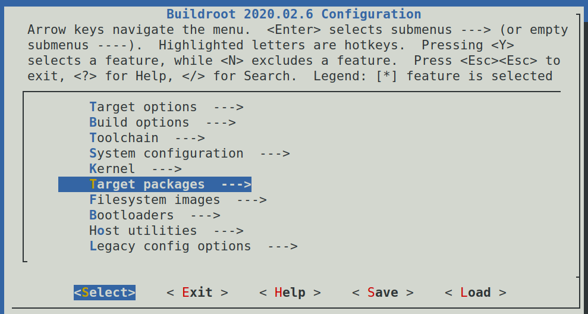
> 图：“Buildroot 2020.02.6 Configuration” 配置主菜单截图，高亮选中 “Target packages --->”，其余菜单为 Target options、Build options、Toolchain、System configuration、Kernel、Filesystem images、Bootloaders、Host utilities、Legacy config options

<!-- Slide number: 90 -->

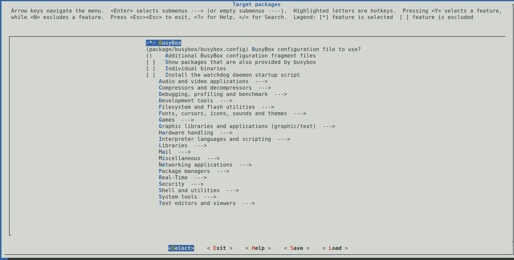
> 图：buildroot 配置界面的 Target packages 菜单截图：顶部为 “- * - BusyBox”（提示 package/busybox/busybox.config，BusyBox configuration file to use?），下方还有 [ ] Additional BusyBox configuration fragment files、[ ] Show packages that are also provided by busybox、[ ] Individual binaries、[ ] Install the watchdog daemon startup script，以及 Audio and video applications、Compressors and decompressors、Debugging, profiling and benchmark、Development tools、Filesystem and flash utilities、Graphic libraries and applications (graphic/text)、Hardware handling、Interpreter languages and scripting、Libraries、Miscellaneous、Networking applications、Package managers、Real-Time、Security、Shell and utilities、System tools、Text editors and viewers 等第三方软件分类子菜单
