<!-- Slide number: 1 -->
# 第7章 字符设备驱动

<!-- Slide number: 2 -->
# 7.1 Linux驱动程序开发概述
一个软件系统从上到下可分为：应用程序、库、操作系统内核和驱动程序
对于相邻层，只需要知道它们之间的接口，无需关注实现细节

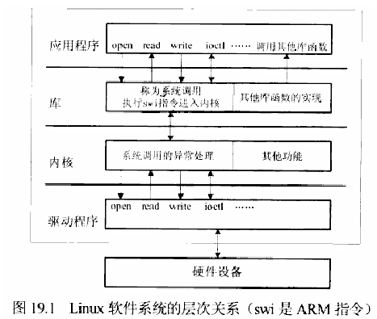
> 图：Linux软件系统层次关系框图（图19.1 Linux软件系统的层次关系，swi是ARM指令）。从上到下分四层：应用程序层（open、read、write、ioctl……调用其他库函数）；库层（"称为系统调用，执行swi指令进入内核"+"其他库函数的实现"）；内核层（"系统调用的异常处理"+"其他功能"）；驱动程序层（open、read、write、ioctl……），最底部为"硬件设备"，各层之间用双向箭头表示调用关系

<!-- Slide number: 3 -->
# 7.1 Linux驱动程序开发概述
内核为应用程序提供一组特殊的接口函数，应用程序通过这组接口获得内核提供的服务，这组函数称为系统调用
系统调用都是设置好相关寄存器后，执行某条指令引发异常（对于ARM架构的CPU，指令为swi或svc），进入内核空间
应用程序运行于用户空间，系统调用运行于内核空间

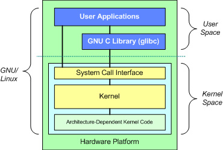
> 图：GNU/Linux系统分层结构图。上方为User Space（用户空间），包含User Applications（用户应用程序）和GNU C Library (glibc)；下方为Kernel Space（内核空间），依次为System Call Interface（系统调用接口）、Kernel（内核）、Architecture-Dependent Kernel Code（体系结构相关内核代码）；最底层为Hardware Platform（硬件平台），用户空间与内核空间之间以虚线分隔

<!-- Slide number: 4 -->
# 7.1 Linux驱动程序开发概述
内核的异常处理函数会根据传入的参数，找到相应的驱动程序（根据设备文件的文件名），并调用驱动程序相关的函数
当应用程序调用open、read、write等系统调用访问设备时，将会使用驱动程序中的open、read、write等函数来完成相关的操作
内核与驱动程序之间没有界线，驱动程序都要通过静态链接或动态加载编入内核
驱动程序从不主动运行，它被应用程序调用
安装驱动程序实际是向内核“注册”，驱动程序并没运行

<!-- Slide number: 5 -->
# 7.1 Linux驱动程序开发概述
Linux驱动程序的分类
Linux的外设可分为3类：字符设备、块设备、网络设备
3种类型的设备驱动程序具有不同的特点
字符设备逐字节地读写
块设备对用户提供的驱动程序接口与字符设备相同，但在驱动程序内部需要构造（写数据时）和解析（读数据时）特定格式的数据块
网络设备的数据（报文、包、帧）是具有特定结构的数据块，但数据块的大小不固定
内核对网络设备的访问方法是给它分配唯一的名字（如eth0），但在/dev目录中没有对应的设备文件
计算机中绝大部分设备都是字符设备（辅存通常是块设备，网卡是网络设备，其余几乎都是字符设备）

<!-- Slide number: 6 -->
# 7.1 Linux驱动程序开发概述
Linux驱动程序开发步骤
（1）查看原理图、数据手册，了解设备的操作方法
（2）在内核中找到相近的驱动，以此为模板开发；若没有相近的驱动，则需从零开始
（3）实现驱动程序的初始化函数和清除函数（初始化函数向内核注册这个驱动程序，使应用程序访问设备文件时，内核能找到对应的驱动；清除函数用于从内核注销驱动程序）
（4）实现具体的操作函数，如open、read、write、ioctl等
（5）如果需要，实现中断服务函数
（6）把驱动编译进内核或模块（模块使用insmod或modprobe命令动态加载到内核）
（7）测试

<!-- Slide number: 7 -->
# 7.1 Linux驱动程序开发概述
驱动程序的加载和卸载
配置内核时，配置项选择“y”则编进内核，选择“m”则编译成模块（模块可动态加载）
驱动程序既可编译进内核，也可编译成模块
模块文件的后缀为".ko"，假设模块名为module_example.ko，在内核启动后，使用insmod命令可加载模块：
           insmod   module_example
    使用rmmod命令卸载模块：
           rmmod  module_example
    使用lsmod命令查看内核已加载的模块

<!-- Slide number: 8 -->
# 7.1 Linux驱动程序开发概述
加载模块也可使用modprobe命令，例如：
          modprobe module_example
与insmod的差别在于， modprobe可自动解决模块依赖问题
若使用modprobe，一个新模块添加到文件系统时，需先使用“depmod”命令分析模块依赖

<!-- Slide number: 9 -->
# 7.1 Linux驱动程序开发概述
加载模块时，调用其初始化函数，将模块向内核注册
卸载模块时，调用其清除函数，将模块从内核中注销
驱动代码中，初始化函数和清除函数要么取固定名字：init_module、cleanup_module；要么用以下方式来标记：
        module_init(XXX);         //XXX为初始化函数的名称
        module_exit(YYY);        //YYY为清除函数的名称

<!-- Slide number: 10 -->
# 7.1 Linux驱动程序开发概述
设备号
Linux中每个设备都有一个设备号
设备号是一个32bit无符号数，其中高12bit为主设备号，低20bit为次设备号
因此主设备号范围是0~4095，次设备号范围是0~（220-1）

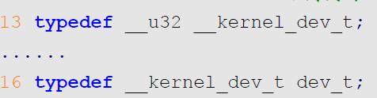
> 图：include/linux/types.h中对dev_t定义的代码截图：第13行 `typedef __u32 __kernel_dev_t;`……第16行 `typedef __kernel_dev_t dev_t;`，说明dev_t实质是32位无符号类型__u32
设备号的数据类型为dev_t，include/linux/types.h对dev_t的定义

<!-- Slide number: 11 -->
include/linux/kdev_t.h中定义的设备号操作宏：

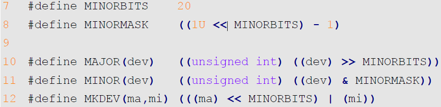
> 图：include/linux/kdev_t.h中设备号操作宏的代码截图：第7行 `#define MINORBITS 20`；第8行 `#define MINORMASK ((1U << MINORBITS) - 1)`；第10行 `#define MAJOR(dev) ((unsigned int)((dev) >> MINORBITS))`；第11行 `#define MINOR(dev) ((unsigned int)((dev) & MINORMASK))`；第12行 `#define MKDEV(ma,mi) (((ma) << MINORBITS) | (mi))`

<!-- Slide number: 12 -->
# 7.1 Linux驱动程序开发概述
一个设备的设备号，可用ls命令查看其设备文件得到，例如，下图中fb0的主设备号为29，次设备号为0

用“cat /proc/devices”可以查看所有已分配的主设备号

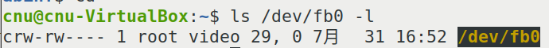
> 图：终端截图，命令 `cnu@cnu-VirtualBox:~$ ls /dev/fb0 -l`，输出 `crw-rw---- 1 root video 29, 0 7月 31 16:52 /dev/fb0`（c表示字符设备，主设备号29、次设备号0）

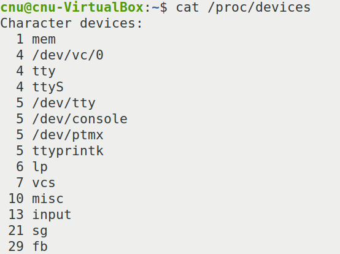
> 图：终端截图，命令 `cnu@cnu-VirtualBox:~$ cat /proc/devices`，Character devices（字符设备）已分配主设备号列表：1 mem、4 /dev/vc/0、4 tty、4 ttyS、5 /dev/tty、5 /dev/console、5 /dev/ptmx、5 ttyprintk、6 lp、7 vcs、10 misc、13 input、21 sg、29 fb

<!-- Slide number: 13 -->
# 7.2 字符设备驱动程序开发
在glibc库中（fcntl.h、unistd.h、sys/ioctl.h等文件中）可以找到以下用户空间的函数

对于上述函数，各个设备的驱动程序中都有一个与之对应的内核空间的函数，驱动程序的开发就是要实现这些函数（根据实际需求，不一定需要实现所有的函数）

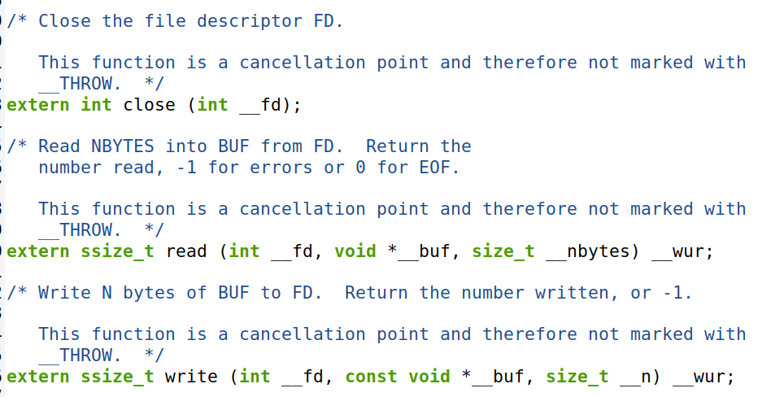
> 图：glibc库中用户空间文件访问函数原型代码截图：`extern int close (int __fd);`；`extern ssize_t read (int __fd, void *__buf, size_t __nbytes) __wur;`（注释：Read NBYTES into BUF from FD. Return the number read, -1 for errors or 0 for EOF）；`extern ssize_t write (int __fd, const void *__buf, size_t __n) __wur;`（注释：Write N bytes of BUF to FD. Return the number written, or -1）

<!-- Slide number: 14 -->
# 7.2 字符设备驱动程序开发
对于字符设备，上述这些驱动程序函数集合在一个file_operations类型的结构体中，该结构体的定义在内核的include/linux/fs.h文件中：

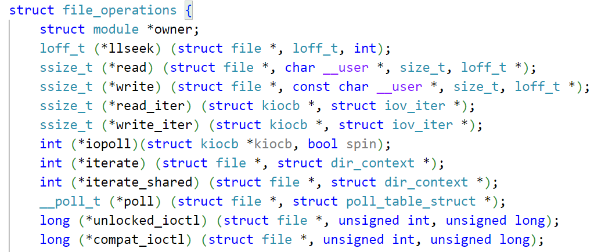
> 图：内核include/linux/fs.h中file_operations结构体定义的代码截图：`struct file_operations {`，成员依次为 `struct module *owner;`、`loff_t (*llseek) (struct file *, loff_t, int);`、`ssize_t (*read) (struct file *, char __user *, size_t, loff_t *);`、`ssize_t (*write) (struct file *, const char __user *, size_t, loff_t *);`、`ssize_t (*read_iter) (struct kiocb *, struct iov_iter *);`、`ssize_t (*write_iter) (struct kiocb *, struct iov_iter *);`、`int (*iopoll)(struct kiocb *kiocb, bool spin);`、`int (*iterate) (struct file *, struct dir_context *);`、`int (*iterate_shared) (struct file *, struct dir_context *);`、`__poll_t (*poll) (struct file *, struct poll_table_struct *);`、`long (*unlocked_ioctl) (struct file *, unsigned int, unsigned long);`、`long (*compat_ioctl) (struct file *, unsigned int, unsigned long);` 等

<!-- Slide number: 15 -->
# 7.2 字符设备驱动程序开发
Linux中设备都被抽象为文件
应用程序使用某个文件访问函数访问设备时，该设备的驱动程序的file_operations结构体中对应成员被调用
例如，使用read函数读串口的数据时，串口驱动程序中file_operations结构体的read成员将被调用
内核通过设备文件的主设备号，将一个特定设备与一个特定的file_operations结构体关联起来，即找到了该设备的驱动

<!-- Slide number: 16 -->
# 7.2 字符设备驱动程序开发
编写字符设备驱动程序的核心步骤：
（1）编写初始化函数，包括：硬件初始化（也可在真正使用硬件时初始化）、向内核注册驱动程序
（2）编写清除函数，即（1）的逆过程，包括：停止硬件工作、从内核注销驱动
（3）实现file_operations结构中需要用到的各个成员函数

<!-- Slide number: 17 -->
# 7.3 字符设备驱动编写
设备号分配方法
手动指定
内核自动分配
设备文件创建方法
手动创建
使用mknod命令
和手动指定设备号组合使用
自动创建
利用udev机制创建设备文件
驱动程序中有创建设备文件的相应代码
和自动分配设备号组合使用

<!-- Slide number: 18 -->
# 7.3 字符设备驱动编写
例：实现一个虚拟的字符设备的驱动程序
此字符设备无实际的物理设备，只是内核空间中的一块数据
应用程序对任何设备的访问都可视为对内核空间的数据访问

<!-- Slide number: 19 -->
# 7.3 字符设备驱动编写
步骤1. 实现向内核注册和注销一个驱动
实现代码见toychar1.c
注册、注销函数的原型可参考内核中的其它驱动
编译此驱动的Makefile文件内容如下，它在驱动源码目录下进行编译，不需把驱动源码放入内核源码中
此Makefile是通用模板，编译其它驱动只需修改第3行

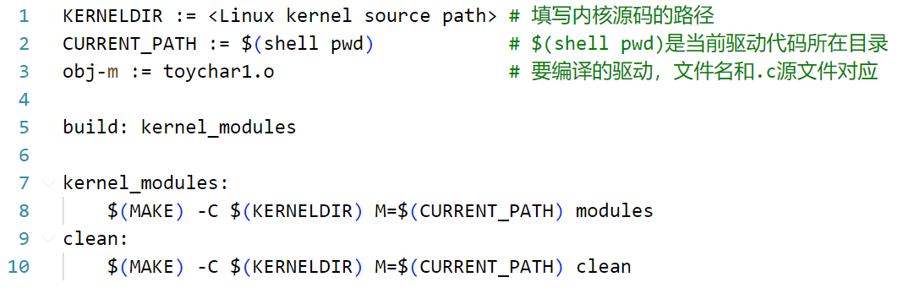
> 图：驱动编译Makefile代码截图（带行号）：第1行 `KERNELDIR := <Linux kernel source path>`（注释：填写内核源码的路径）；第2行 `CURRENT_PATH := $(shell pwd)`（注释：$(shell pwd)是当前驱动代码所在目录）；第3行 `obj-m := toychar1.o`（注释：要编译的驱动, 文件名和.c源文件对应）；第5行 `build: kernel_modules`；第7行 `kernel_modules:`；第8行 `$(MAKE) -C $(KERNELDIR) M=$(CURRENT_PATH) modules`；第9行 `clean:`；第10行 `$(MAKE) -C $(KERNELDIR) M=$(CURRENT_PATH) clean`

<!-- Slide number: 20 -->
# 7.3 字符设备驱动编写
注意：必须使用与编译内核相同的编译器，否则编译会出错
编译生成toychar1.ko即为驱动文件
使用buildroot版根文件系统
把toychar1.ko复制到根文件系统的lib/modules/5.4.31目录下，其中“5.4.31”是内核版本号，此目录务必与内核版本号一致
执行以下命令分析模块依赖
	depmod
执行以下命令加载驱动
	modprobe toychar1.ko
执行以下命令卸载驱动
	rmmod toychar1.ko

<!-- Slide number: 21 -->
# 7.3 字符设备驱动编写
第一次加载驱动时，会有如下驱动未签名的提示：

处理方法（以下3选1）：
（1）直接无视它。
（2）对驱动签名。在电脑上的内核源码目录下，执行以下命令：
scripts/sign-file sha256 certs/signing_key.pem certs/signing_key.x509 <module path>/<module name>.ko
其中，scripts/sign-file是签名程序；参数1是签名的HASH算法，根据内核配置确定；参数2是私钥文件（编译内核时会生成）；参数3是公钥文件；参数4是驱动文件
（3）修改内核设置，关闭签名校验，需要重新编译内核

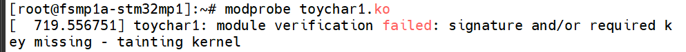
> 图：开发板串口终端截图，执行 `[root@fsmp1a-stm32mp1]:~# modprobe toychar1.ko` 后输出驱动未签名的提示：`[ 719.556751] toychar1: module verification failed: signature and/or required key missing - tainting kernel`

<!-- Slide number: 22 -->
设置路径：

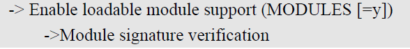
> 图：内核配置项路径文字截图：`-> Enable loadable module support (MODULES [=y])` 下的 `-> Module signature verification`

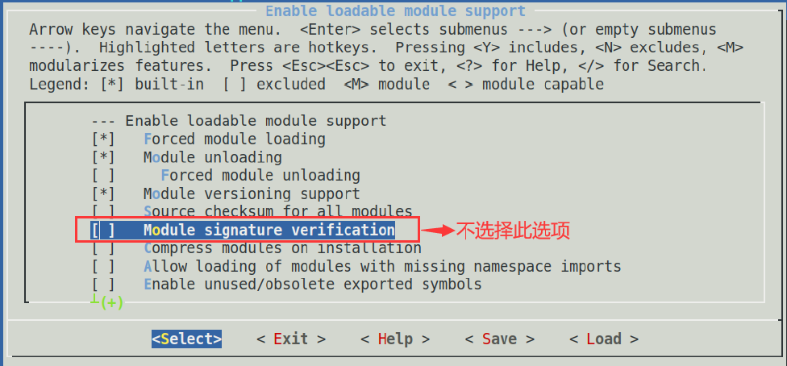
> 图：menuconfig配置界面截图（"Enable loadable module support"子菜单），选项包括：[*] Forced module loading、[*] Module unloading、[*] Module versioning support、[ ] Source checksum for all modules、[ ] Module signature verification（该项被红框标出，红色箭头标注"不选择此选项"，即关闭签名校验）、[ ] Compress modules on installation、[ ] Allow loading of modules with missing namespace imports、[ ] Enable unused/obsolete exported symbols；底部为<Select> <Exit> <Help> <Save> <Load>操作按钮

<!-- Slide number: 23 -->
# 7.3 字符设备驱动编写
步骤2. 添加字符设备注册
实现代码见toychar2.c
注意函数register_chrdev和unregister_chrdev一定是成对出现
函数register_chrdev把设备名、设备号、file_operations结构体绑定到了一起，因此用户空间对一个设备文件的访问能唯一对应到内核空间中的一个file_operations结构体

<!-- Slide number: 24 -->
# 7.3 字符设备驱动编写
步骤3. 实现设备操作函数
实现代码见toychar3.c
用户空间与内核空间不能直接相互访问内存，需使用函数copy_to_user和copy_from_use传递数据
file_operations的成员很多，只需根据实际需求实现要用到的部分成员
file_operations每个成员对应的函数原型，可查看file_operations的定义得到

<!-- Slide number: 25 -->
# 7.3 字符设备驱动编写
编写用户程序，测试驱动
实现代码见toychatApp.c
应使用arm-none-linux-gnueabihf-gcc编译器把程序编译成arm架构的代码，命令如下：
 arm-none-linux-gnueabihf-gcc toychatApp.c -o toychatApp

可使用“file”命令查看程序支持的架构

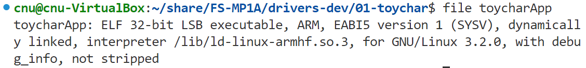
> 图：终端截图，在 `cnu@cnu-VirtualBox:~/share/FS-MP1A/drivers-dev/01-toychar$` 下执行 `file toycharApp`，输出：`toycharApp: ELF 32-bit LSB executable, ARM, EABI5 version 1 (SYSV), dynamically linked, interpreter /lib/ld-linux-armhf.so.3, for GNU/Linux 3.2.0, with debug_info, not stripped`，说明已编译为ARM架构可执行文件

<!-- Slide number: 26 -->
# 7.3 字符设备驱动编写
创建设备文件
当前的驱动无法自动创建设备文件，因此需要手动创建设备文件
在开发板的Linux系统中，执行以下命令
       mknod /dev/toychar c 200 1

与驱动程序代码中的主设备号一致

<!-- Slide number: 27 -->
# 7.3 字符设备驱动编写
运行测试程序
把编译生成的测试程序toycharApp复制到开发板根文件系统的/bin目录下
在开发板的Linux系统中执行如下命令，运行测试程序
     toycharApp /dev/toychar 1     //读设备（获取设备输入）
     toycharApp /dev/toychar 2     //写设备（向设备输出数据）
