<!-- Slide number: 1 -->
# 第8章 GPIO端口

<!-- Slide number: 2 -->
# 8.1 GPIO硬件介绍
GPIO(General Purpose I/O ports，通用输入/输出端口)是一些芯片引脚，通过它们可以输入或输出高低电平
stm32mp157有176个GPIO引脚，分为A～K、Z共12组，每组称为一个Port，记为GPIOx (x=A to K, Z)
每组有16个引脚（GPIOK、GPIOZ分别为8个引脚），引脚记为Pxy (x=A to K, Z, y=0 to 15)，例如PB2表示B组2号引脚

<!-- Slide number: 3 -->
# 8.1 GPIO硬件介绍
一个GPIO引脚的工作模式通常有输入、输出、复用、模拟功能4种
GPIO引脚工作于哪种模式，以及在各种模式下的参数细节，通过设置寄存器来确定（由程序来设置）
GPIO的操作是所有硬件操作的基础，由此扩展开来可以了解所有硬件的操作：
GPIO引脚的工作模式通过设置寄存器确定，输入/输出的数据通过读/写寄存器确定，因此对GPIO的操作实际上是对寄存器的读写操作
其他外设的操作原理与GPIO相同，也是对寄存器的读写
对于每一个寄存器都分配了一个内存地址，因此对寄存器的读写转换为了内存读写操作
因此，对任何外设的控制实际上都是通过内存读写操作来实现的，只是此时读写的是特定地址的内存单元（寄存器）

<!-- Slide number: 4 -->
# 8.2 GPIO的寄存器
各组GPIO引脚（A～K、Z），有自己的寄存器，各组引脚的寄存器是相似的，这些寄存器包括：
4个32bit的配置寄存器
GPIOx_MODER：GPIO port mode register
GPIOx_OTYPER：GPIO port output type register
GPIOx_OSPEEDR：GPIO port output speed register
GPIOx_PUPDR：GPIO port pull-up/pull-down register
2个32bit的数据寄存器
GPIOx_IDR：GPIO port input data register
GPIOx_ODR：GPIO port output data register

<!-- Slide number: 5 -->
# 8.2 GPIO的寄存器
1个32bit的置位/复位寄存器
GPIOx_BSRR：GPIO port bit set/reset register
其它寄存器
GPIOx_LCKR、GPIOx_AFRH、GPIOx_AFRL、……

<!-- Slide number: 6 -->
# 8.2 GPIO的寄存器
1. GPIOx_MODER寄存器
用于配置引脚功能

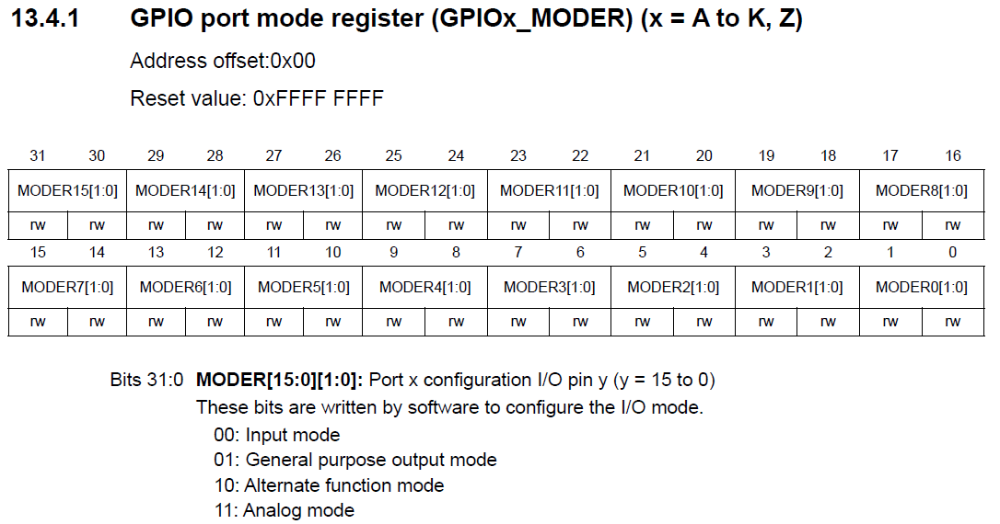
> 图：芯片手册13.4.1节 GPIO port mode register (GPIOx_MODER) (x = A to K, Z)，Address offset: 0x00，Reset value: 0xFFFF FFFF；位域为MODER15[1:0]～MODER0[1:0]（均rw）。Bits 31:0 MODER[15:0][1:0]: Port x configuration I/O pin y (y = 15 to 0)，由软件写入配置I/O模式：00: Input mode（输入模式），01: General purpose output mode（通用输出模式），10: Alternate function mode（复用功能模式），11: Analog mode（模拟模式）

<!-- Slide number: 7 -->
# 8.2 GPIO的寄存器
2. GPIOx_OTYPER寄存器
用于设置输出类型

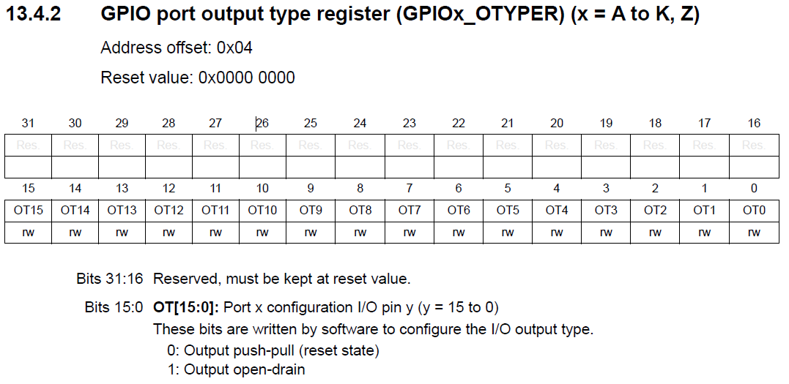
> 图：芯片手册13.4.2节 GPIO port output type register (GPIOx_OTYPER) (x = A to K, Z)，Address offset: 0x04，Reset value: 0x0000 0000；位15～0为OT15～OT0（rw），位31:16为Res.（保留）。Bits 31:16 Reserved, must be kept at reset value；Bits 15:0 OT[15:0]: Port x configuration I/O pin y (y = 15 to 0)，由软件写入配置I/O输出类型：0: Output push-pull (reset state)（推挽输出，复位值），1: Output open-drain（开漏输出）

<!-- Slide number: 8 -->

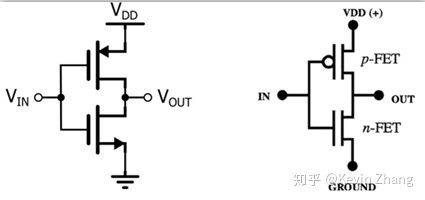
> 图：推挽输出电路——左图为CMOS反相器结构，两只互补MOS管串联，上管接VDD、下管接地，输入V_IN、输出V_OUT；右图为其等价画法：IN经p-FET接VDD(+)、经n-FET接GROUND，中间引出OUT（图右下角水印：知乎 @Kevin Zhang）

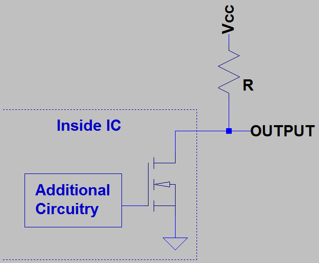
> 图：开漏输出电路——"Inside IC"虚线框内为Additional Circuitry（附加电路）驱动一只开漏输出MOS管（漏极开路、源极接地），片外须经上拉电阻R接Vcc，节点引出为OUTPUT
推挽输出
开漏输出

<!-- Slide number: 9 -->
# 8.2 GPIO的寄存器
3. GPIOx_OSPEEDR寄存器
设置引脚传输信号的（上限）速度

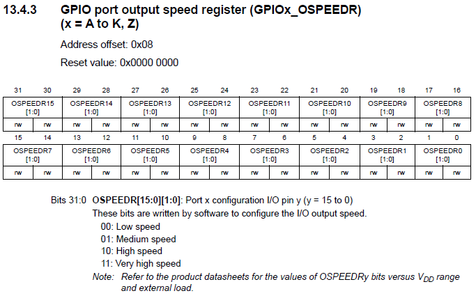
> 图：芯片手册13.4.3节 GPIO port output speed register (GPIOx_OSPEEDR) (x = A to K, Z)，Address offset: 0x08，Reset value: 0x0000 0000；位域为OSPEEDR15[1:0]～OSPEEDR0[1:0]（均rw）。Bits 31:0 OSPEEDR[15:0][1:0]: Port x configuration I/O pin y (y = 15 to 0)：00: Low speed（低速），01: Medium speed（中速），10: High speed（高速），11: Very high speed（极高速）；Note: OSPEEDRy位取值与V_DD范围及外部负载有关，参见产品数据手册

<!-- Slide number: 10 -->
# 8.2 GPIO的寄存器
4. GPIOx_PUPDR寄存器
设置是否使用内部上拉/下拉电阻

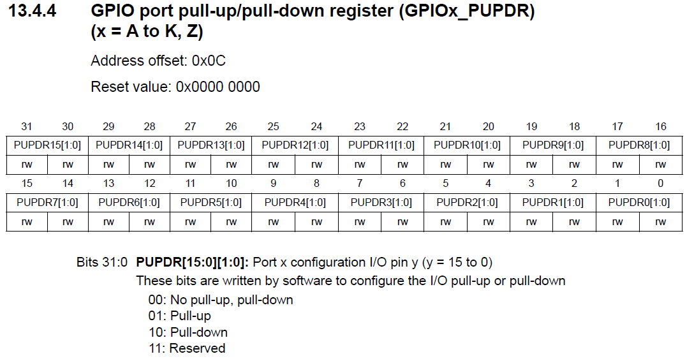
> 图：芯片手册13.4.4节 GPIO port pull-up/pull-down register (GPIOx_PUPDR) (x = A to K, Z)，Address offset: 0x0C，Reset value: 0x0000 0000；位域为PUPDR15[1:0]～PUPDR0[1:0]（均rw）。Bits 31:0 PUPDR[15:0][1:0]: Port x configuration I/O pin y (y = 15 to 0)，由软件写入配置I/O上拉/下拉：00: No pull-up, pull-down（无上拉/下拉），01: Pull-up（上拉），10: Pull-down（下拉），11: Reserved（保留）

<!-- Slide number: 11 -->

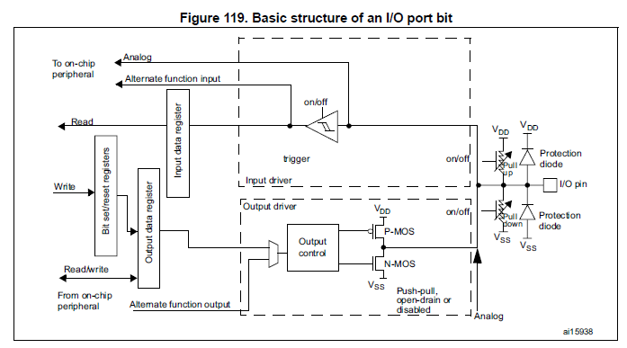
> 图：芯片手册Figure 119 "Basic structure of an I/O port bit"（I/O端口位的基本结构框图）：左侧为位设置/复位寄存器（Bit set/reset registers）、输出数据寄存器（Output data register）、输入数据寄存器（Input data register），支持Read/Write、Read、模拟（Analog）及复用功能输入/输出（Alternate function input/output）通路；右侧为输入驱动（Input driver，含trigger施密特触发器和on/off开关）与输出驱动（Output driver，含Output control及P-MOS/N-MOS对管，push-pull/open-drain or disabled推挽/开漏或禁用）；I/O pin引脚带保护二极管（Protection diode，接V_DD/V_SS）和可开关的上拉/下拉电阻（Pull-up/Pull-down，on/off控制）；左侧还标注From/To on-chip peripheral（来自/去往片上外设）；图号ai15938

<!-- Slide number: 12 -->
# 8.2 GPIO的寄存器
5. GPIOx_IDR寄存器
存放输入数据（输入模式时，是输入数据；输出模式时，是引脚上的当前数据）

> 图：芯片手册13.4.5节 GPIO port input data register (GPIOx_IDR) (x = A to K, Z)，Address offset: 0x10，Reset value: 0x0000 XXXX

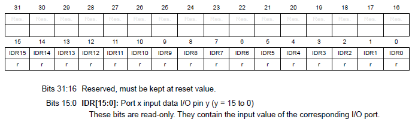
> 图：GPIOx_IDR寄存器位表：位31～16为Res.（保留），位15～0为IDR15～IDR0（只读r）。Bits 31:16 Reserved, must be kept at reset value；Bits 15:0 IDR[15:0]: Port x input data I/O pin y (y = 15 to 0)，These bits are read-only. They contain the input value of the corresponding I/O port.（这些位只读，存放对应I/O端口的输入值）

<!-- Slide number: 13 -->
# 8.2 GPIO的寄存器
6. GPIOx_ODR寄存器
设置输出数据

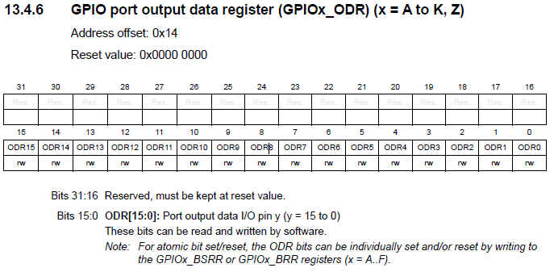
> 图：芯片手册13.4.6节 GPIO port output data register (GPIOx_ODR) (x = A to K, Z)，Address offset: 0x14，Reset value: 0x0000 0000；位31:16保留，位15～0为ODR15～ODR0（rw）。Bits 15:0 ODR[15:0]: Port output data I/O pin y (y = 15 to 0)，由软件读/写；Note: For atomic bit set/reset, the ODR bits can be individually set and/or reset by writing to the GPIOx_BSRR or GPIOx_BRR registers (x = A..F)（如需原子置位/复位，可通过写GPIOx_BSRR或GPIOx_BRR寄存器逐位设置/清除ODR位）

<!-- Slide number: 14 -->
# 8.2 GPIO的寄存器
7. GPIOx_BSRR寄存器
置位/复位输出

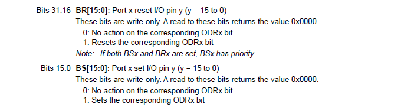
> 图：GPIOx_BSRR寄存器位说明：Bits 31:16 BR[15:0]: Port x reset I/O pin y (y = 15 to 0)，These bits are write-only. A read to these bits returns the value 0x0000（只写，读返回0x0000）；0: No action on the corresponding ODRx bit，1: Resets the corresponding ODRx bit；Note: If both BSx and BRx are set, BSx has priority（BSx与BRx同时置位时BSx优先）；Bits 15:0 BS[15:0]: Port x set I/O pin y (y = 15 to 0)，同样write-only；0: No action on the corresponding ODRx bit，1: Sets the corresponding ODRx bit

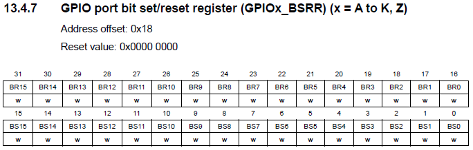
> 图：芯片手册13.4.7节 GPIO port bit set/reset register (GPIOx_BSRR) (x = A to K, Z)，Address offset: 0x18，Reset value: 0x0000 0000；位31～16为BR15～BR0（复位位，w），位15～0为BS15～BS0（置位位，w）

<!-- Slide number: 15 -->
# 8.3 LED驱动
LED连接到GPIO上，通过控制GPIO的输出，控制LED的亮灭
FS-MP1A开发板的LED连接原理图，如下

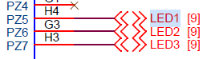
> 图：LED连接原理图（左半）：网络标号PZ5经引脚H4、PZ6经G3、PZ7经H3，分别接到LED1[9]、LED2[9]、LED3[9]网络

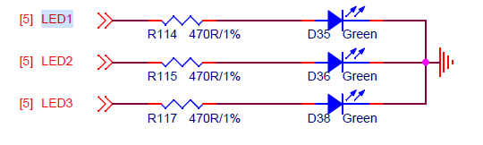
> 图：LED连接原理图（右半）：[5]LED1经限流电阻R114 470R/1%接绿色LED（D35 Green），[5]LED2经R115 470R/1%接D36 Green，[5]LED3经R117 470R/1%接D38 Green，三只LED负极共同接地

<!-- Slide number: 16 -->
# 8.3 LED驱动
可见使用的是GPIOZ
GPIO引脚PZ5、PZ6、PZ7分别控制LED1、LED2、LED3
GPIO相应引脚输出高电平时，LED点亮；输出低电时平，LED熄灭
通过程序控制GPIO输出高、低电平，即可控制LED亮灭

<!-- Slide number: 17 -->
# 8.3 LED驱动
程序控制设备基本流程
（1）使能设备（设备上电，通常是使能时钟）
（2）配置设备（模式、参数等）
（3）操作设备
（4）使用完毕，关闭设备（复位到初始状态；可能还需要设备断电——即关闭时钟）
在驱动程序中，以上4步对应于：
注册驱动，完成（1）、（2）
file_operations结构体中的设备操作函数，完成（3）
注销驱动，完成（4）

<!-- Slide number: 18 -->
# 8.3 LED驱动
Linux驱动程序中对寄存器的读写
Linux使用了虚拟内存技术，程序中使用的地址都是虚拟地址
从芯片手册查到的寄存器地址都是物理地址，因此程序中访问寄存器时，需要转换为虚拟地址
Linux提供了ioremap和iounmap两个函数：
void __iomem *ioremap(resource_size_t res_cookie, size_t size)	//res_cookie为要映射物理首地址
			//size为要映射的地址长度

void iounmap (volatile void __iomem *addr)
			//addr为要解除映射的虚拟首地址
			//虚拟地址使用完毕，必须解除映射

<!-- Slide number: 19 -->
# 8.3 LED驱动
访问寄存器时，不要直接使用指针操作，直接指针操作不能保证程序执行时是按源代码中的顺序访问寄存器（乱序执行）
访问寄存器应使用以下函数

readb、 readw和 readl分别对应 8bit、 16bit和 32bit读操作，参数addr是要读取写内存地址，返回值就是读取到的数据

参数value是要写入的数据，addr是要写入的地址

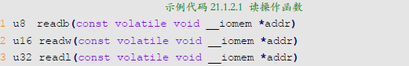
> 图：示例代码 21.1.2.1 读操作函数：u8 readb(const volatile void __iomem *addr)、u16 readw(const volatile void __iomem *addr)、u32 readl(const volatile void __iomem *addr)（分别对应8bit、16bit、32bit读操作）

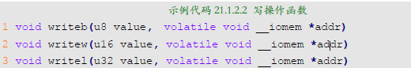
> 图：示例代码 21.1.2.2 写操作函数：void writeb(u8 value, volatile void __iomem *addr)、void writew(u16 value, volatile void __iomem *addr)、void writel(u32 value, volatile void __iomem *addr)（value为要写入的数据，addr为要写入的地址）

<!-- Slide number: 20 -->

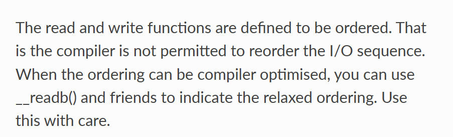
> 图：内核文档英文说明："The read and write functions are defined to be ordered. That is the compiler is not permitted to reorder the I/O sequence. When the ordering can be compiler optimised, you can use __readb() and friends to indicate the relaxed ordering. Use this with care."（读写函数被定义为有序的，编译器不允许重排I/O访问顺序；若顺序可由编译器优化，可使用__readb()等接口表示宽松排序，须谨慎使用）
https://www.kernel.org/doc/html/v4.13/driver-api/device-io.html

<!-- Slide number: 21 -->
# 8.3 LED驱动
GPIO寄存器物理地址
在8.2节中，已从芯片手册查到各寄存器的偏移地址，再查出基址，就可算出寄存器的物理地址
在芯片手册中查出GPIOZ的基址为0x54004000

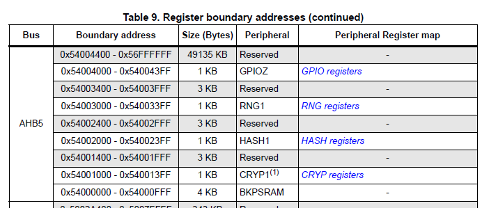
> 图：芯片手册Table 9 "Register boundary addresses (continued)"（AHB5总线寄存器边界地址表）：0x54004400–0x56FFFFFF（49135 KB，Reserved）、0x54004000–0x540043FF（1 KB，GPIOZ，GPIO registers）、0x54003400–0x54003FFF（3 KB，Reserved）、0x54003000–0x540033FF（1 KB，RNG1，RNG registers）、0x54002400–0x54002FFF（3 KB，Reserved）、0x54002000–0x540023FF（1 KB，HASH1，HASH registers）、0x54001400–0x54001FFF（3 KB，Reserved）、0x54001000–0x540013FF（1 KB，CRYP1(1)，CRYP registers）、0x54000000–0x54000FFF（4 KB，BKPSRAM）

<!-- Slide number: 22 -->
# 8.3 LED驱动
实际上，直接查阅芯片手册确定寄存器及其地址非常繁琐、困难！一般会参考已有的相近程序，确定大致范围，再查阅芯片手册。

<!-- Slide number: 23 -->
# 8.3 LED驱动
使能GPIOZ的时钟
stm32mp157芯片中有一个Reset and Clock Control (RCC)模块，用于控制芯片上各种设备的时钟
GPIOZ的时钟也由RCC控制
经查阅芯片手册，对RCC的RCC_MP_AHB5ENSETR寄存器进行设置，可使能GPIOZ的时钟

<!-- Slide number: 24 -->

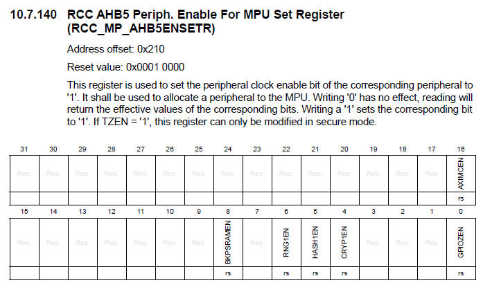
> 图：芯片手册10.7.140节 RCC AHB5 Periph. Enable For MPU Set Register (RCC_MP_AHB5ENSETR)，Address offset: 0x210，Reset value: 0x0001 0000；该寄存器用于置位对应外设的外设时钟使能位，写'1'使能外设时钟，写'0'无效果，读返回各位的有效值（When TZEN = '1'，此寄存器只能在安全模式下修改）；位域：位16为AXIMCEN（rs），位8 BKPSRAMEN、位6 RNG1EN、位5 HASH1EN、位4 CRYPT1EN、位0 GPIOZEN（均rs），其余保留

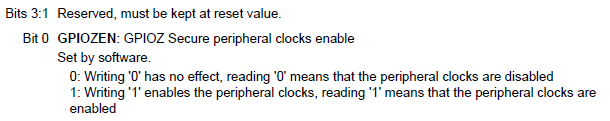
> 图：RCC_MP_AHB5ENSETR位说明：Bits 3:1 Reserved, must be kept at reset value；Bit 0 GPIOZEN: GPIOZ Secure peripheral clocks enable，Set by software：0——写'0'无效果，读'0'表示外设时钟已关闭；1——写'1'使能外设时钟，读'1'表示外设时钟已使能

<!-- Slide number: 25 -->
# 8.3 LED驱动
在实际编写的LED驱动中，GPIOZ时钟使能的代码都被注释掉，基于以下原因：
开发板的出厂TF-A代码中已经使能了GPIOZ的时钟，我们无需再次使能
RCC_MP_AHB5ENSETR寄存器属于“安全世界” （AHB5总线上的设备都属于“安全世界”），“非安全世界”的程序无法对它进行写操作
为了给出完整的设备操作示例，驱动源码中给出了时钟使能的代码，但都注释掉了

<!-- Slide number: 26 -->

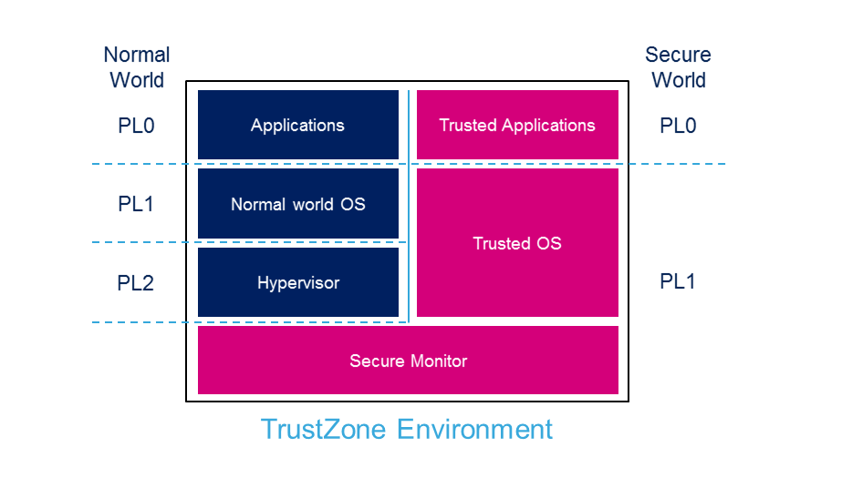
> 图：TrustZone Environment（TrustZone环境）框图：左侧为Normal World（正常世界），从上到下按特权级分为PL0层Applications（应用）、PL1层Normal world OS（普通世界操作系统）、PL2层Hypervisor（虚拟机监控器）；右侧为Secure World（安全世界），PL0层为Trusted Applications（可信应用）、PL1层为Trusted OS（可信操作系统）；底部横跨两个世界的为Secure Monitor（安全监视器），两侧虚线为世界分界线

<!-- Slide number: 27 -->
# 8.3 LED驱动
例1.控制开发板上LED1的驱动程序
源码见led.c
测试驱动的应用程序源码见ledApp.c
注意，此驱动需要手动创建设备文件

<!-- Slide number: 28 -->
# 8.3 LED驱动
自动创建设备文件
驱动注册函数中，用以下函数替换register_chrdev函数，完成字符设备注册，及设备文件创建：
1. alloc_chrdev_region	// 向内核申请设备号
2. cdev_init		// 初始化cdev结构体，cdev是内核管理驱动			// 的数据结构（类比管理进程的PCB）
3. cdev_add		// 向内核添加一个cdev
4. class_create	// 创建class结构体，它用于创建设备文件
5. device_create	// 创建设备文件

<!-- Slide number: 29 -->
# 8.3 LED驱动
驱动注销函数中，用以下函数替换unregister_chrdev函数，完成已分配资源释放：
1. unregister_chrdev_region	// 注销已申请的设备号
2. 无
3. cdev_del		// 从内核中删除一个cdev结构体
4. class_destroy	// 删除class结构体
5. device_destroy	// 删除设备文件
注意：此页的5步操作与前一页的5步一一对应，在执行顺序上前一页按1、2、3、4、5的顺序执行，此页按5、4、3、2、1的顺序执行

<!-- Slide number: 30 -->
# 8.3 LED驱动
int alloc_chrdev_region(dev_t *dev, unsigned baseminor, unsigned count, const char *name)
	dev：内核分配的设备号存入dev中，注意它是主设备号和次设	         备号存在一个u32整数中
	baseminor：起始次设备号
	count：次设备号数量
	name：设备名（设备文件名）
void unregister_chrdev_region(dev_t from, unsigned count)
	from：要注销的起始设备号
	count：注销设备号数量

<!-- Slide number: 31 -->
# 8.3 LED驱动
void cdev_init(struct cdev *cdev, const struct file_operations *fops)	cdev：要初始化的cdev结构体
	fops：file_operations结构体
int cdev_add(struct cdev *p, dev_t dev, unsigned count)
	p：前一步所初始化的cdev结构体
	dev：设备号
	count：使用此驱动的设备数量（次设备号数量）
void cdev_del(struct cdev *p)
	p：要删除的cdev结构体

<!-- Slide number: 32 -->
# 8.3 LED驱动
struct class *class_create (struct module *owner, const char *name)	owner：设备的属主，通常值为THIS_MODULE（即本驱动）
	name：设备名（设备文件名）
	返回值：class类型结构体的一个指针
void class_destroy(struct class *cls)
	cls： class_create函数所创建的class结构体

<!-- Slide number: 33 -->
# 8.3 LED驱动
struct device *device_create(struct class *cls, struct device *parent, dev_t devt, void *drvdata, const char *fmt, ...)
	cls：前面创建的class结构体
	parent：指向父设备的指针，通常为NULL
	devt：设备号
	drvdata：设备可能会用到的私有数据，通常为NULL
	fmt：设备名（设备文件名）
	返回值：device结构体，它记录了设备的相关信息
void device_destroy(struct class *cls, dev_t devt)
	cls：前面创建的class结构体
	devt：设备号

以上函数的使用说明可在内核API帮助文档中找到： https://docs.kernel.org/index.html

<!-- Slide number: 34 -->
# 8.3 LED驱动
例2：把例1的LED1驱动程序修改为自动创建设备文件
源码见mdevled.c
测试驱动的应用程序仍是例1的ledApp.c
