<!-- Slide number: 1 -->
# 第9章 设备树

<!-- Slide number: 2 -->
# 9.1 设备树简介
早期版本的ARM Linux并不使用设备树，板级硬件描述采用硬编码的方式写在源码中
源码中有很多arch/arm/plat-xxx和arch/arm/mach-xxx之类的文件用于描述板级细节，对内核来说这些都是垃圾代码
每款开发板都有自己的板级信息，内核代码维护困难

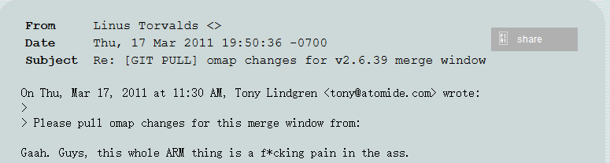
> 图：LKML邮件列表截图：发件人Linus Torvalds，日期Thu, 17 Mar 2011 19:50:36 -0700，主题"Re: [GIT PULL] omap changes for v2.6.39 merge window"，正文为Linus回复Tony Lindgren的omap改动合并请求，并写道"Gaah. Guys, this whole ARM thing is a f*cking pain in the ass."（表达对ARM板级硬编码代码混乱的不满）
https://lkml.org/lkml/2011/3/17/492

<!-- Slide number: 3 -->
# 9.1 设备树简介
设备树（Flattened Device Tree）最早用在PowerPC平台，后借鉴到Arm平台
新版内核都支持设备树，新出的ARM CPU出厂系统也都使用设备树
设备树用于描述设备细节，对设备的控制留在内核代码中，实现二者的分离
设备树编译成二进制文件（.dtb文件），内核启动时由bootloader传给内核

<!-- Slide number: 4 -->
# 9.1 设备树简介
描述设备树的文件叫DTS（Device Tree Source），它采用树形结构描述开发板上的设备信息
这些信息包括：有哪些设备，每个设备的具体参数（如数量、所在总线、地址、中断号、电器特性等）

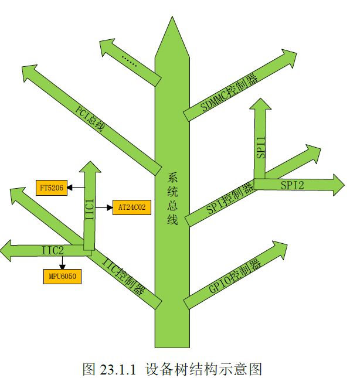
> 图：设备树结构示意图（图23.1.1 设备树结构示意图）：以"系统总线"为主干，分出PCI总线、SDMMC控制器等分支，右侧为SPI控制器（下分SPI1、SPI2）和GPIO控制器，左侧为IIC控制器（IIC1下挂FT5206，IIC2下挂AT24C02和MPU6050），树形结构反映开发板上设备的组织与挂载关系

<!-- Slide number: 5 -->
# 9.1 设备树简介
dts、dtb和dtc
dts文件是设备树源文件
dtb文件是由dts编译生成的二进制文件，供内核使用
dtc是编译设备树用到的编译器，它的源码在内核的scripts/dtc目录下，编译内核时会生成它的可执行文件
编译内核时，使用命令“make dtbs” 编译所有设备树文件，使用“make xxx.dtb”编译指定设备树文件
哪些设备树文件能够被编译是由arch/arm/boot/dts/Makefile文件决定的，新增开发板的设备树编译项，需要添加到此Makefile中

<!-- Slide number: 6 -->

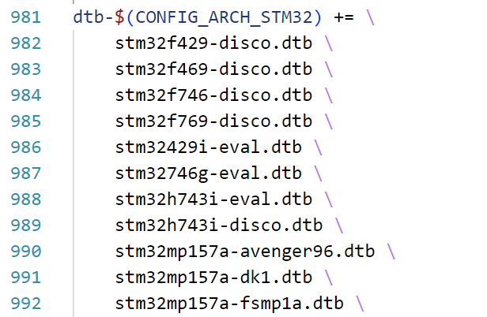
> 图：内核arch/arm/boot/dts/Makefile第981~992行：dtb-$(CONFIG_ARCH_STM32) += \，其下依次列出stm32f429-disco.dtb、stm32f469-disco.dtb、stm32f746-disco.dtb、stm32f769-disco.dtb、stm32429i-eval.dtb、stm32746g-eval.dtb、stm32h743i-eval.dtb、stm32h743i-disco.dtb、stm32mp157a-avenger96.dtb、stm32mp157a-dk1.dtb、stm32mp157a-fsmp1a.dtb等设备树编译项
Makefile中stm32开发板的设备树编译项

<!-- Slide number: 7 -->
# 9.2 设备树语法
头文件
在.dts文件中，可用“#include”引用c语言头文件（.h）及设备树源文件（.dts、.dtsi）
.h文件中通常是寄存器定义
.dtsi文件本质上仍然是设备树源文件，内容形式上与.dts文件相同
.dtsi用于描述公共的设备信息，例如CPU芯片内部的设备信息

<!-- Slide number: 8 -->

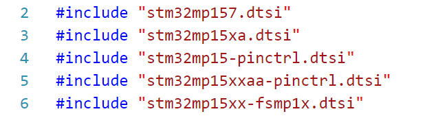
> 图：stm32mp157a-fsmp1a.dts中引用的头文件（第2~6行）：#include "stm32mp157.dtsi"、#include "stm32mp15xa.dtsi"、#include "stm32mp15-pinctrl.dtsi"、#include "stm32mp15xxaa-pinctrl.dtsi"、#include "stm32mp15xx-fsmp1x.dtsi"
stm32mp157a-fsmp1a.dts中引用的头文件
stm32mp157c-ev1.dts中引用的头文件

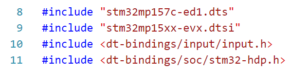
> 图：stm32mp157c-ev1.dts中引用的头文件（第8~11行）：#include "stm32mp157c-ed1.dts"、#include "stm32mp15xx-evx.dtsi"、#include <dt-bindings/input/input.h>、#include <dt-bindings/soc/stm32-hdp.h>

<!-- Slide number: 9 -->
# 9.2 设备树语法
设备节点
设备树使用树型结构描述开发板的设备组织结构及设备信息
树的每一个节点对应一个设备，称为设备节点
每个设备节点有一系列属性，用于描述设备信息
每个属性用键-值对表示，为 xxx = yyy 的形式，属性的值也可以为空，即xxx的形式
一个开发板只有一棵设备树，该树有唯一的根节点，用符号“/”表示
在.dts文件中会引用其它.dtsi、.dts文件，这些文件中也有根节点，所有这些文件的根节点合并成1个根节点

<!-- Slide number: 10 -->

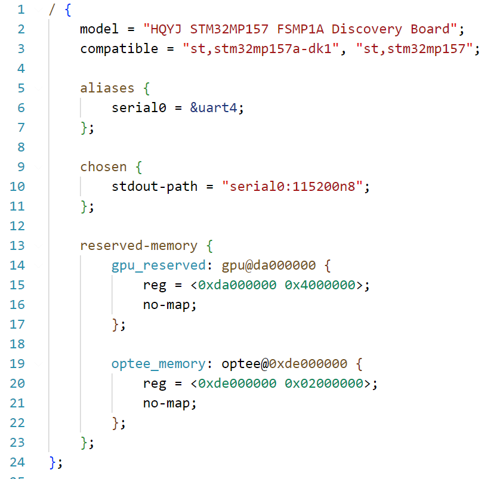
> 图：stm32mp157a-fsmp1a.dts中的设备树源码（根节点部分）：根节点"/"内有model = "HQYJ STM32MP157 FSMP1A Discovery Board"；compatible = "st,stm32mp157a-dk1", "st,stm32mp157"；aliases子节点中serial0 = &uart4；chosen子节点中stdout-path = "serial0:115200n8"；reserved-memory子节点下有gpu_reserved: gpu@da000000（reg = <0xda000000 0x40000000>，no-map）和optee_memory: optee@0xde000000（reg = <0xde000000 0x02000000>，no-map）
stm32mp157a-fsmp1a.dts中的设备树描述

<!-- Slide number: 11 -->
stm32mp157a-fsmp1a.dts中的设备树描述

> 图：stm32mp157a-fsmp1a.dts设备树源码：根节点内有model = "HQYJ STM32MP157 FSMP1A Discovery Board"、compatible = "st,stm32mp157a-dk1", "st,stm32mp157"属性；一级子节点aliases（serial0 = &uart4）、chosen（stdout-path = "serial0:115200n8"）、reserved-memory；reserved-memory下的二级子节点gpu_reserved: gpu@da000000（reg = <0xda000000 0x40000000>，no-map）和optee_memory: optee@0xde000000（reg = <0xde000000 0x02000000>，no-map）

<!-- Slide number: 12 -->

> 图：stm32mp157a-fsmp1a.dts中的设备树描述（一级子节点）：根节点"/"下的一级子节点有aliases（serial0 = &uart4）、chosen（stdout-path = "serial0:115200n8"）、reserved-memory，另有model = "HQYJ STM32MP157 FSMP1A Discovery Board"、compatible = "st,stm32mp157a-dk1", "st,stm32mp157"属性
一级子节点

stm32mp157a-fsmp1a.dts中的设备树描述

<!-- Slide number: 13 -->

> 图：stm32mp157a-fsmp1a.dts中的设备树描述（二级子节点）：reserved-memory下的两个二级子节点——gpu_reserved: gpu@da000000（reg = <0xda000000 0x40000000>，no-map）和optee_memory: optee@0xde000000（reg = <0xde000000 0x02000000>，no-map）
二级子节点

stm32mp157a-fsmp1a.dts中的设备树描述

<!-- Slide number: 14 -->
# 9.2 设备树语法
节点名
除根节点外，每个节点都有一个ASCII字符串形式的节点名，命名格式为
              node-name[@unit-address]
node-name： 为节点名字，它需要清晰反应节点的功能，例如“cpus”、“uart1”、“timer”
unit-address：为节点地址，是什么类型的地址取决于设备，如果是片上外设，则是寄存器基址
unit-address可以没有，如果有unit-address，则整个node-name@unit-address作为节点名

<!-- Slide number: 15 -->
# 9.2 设备树语法
节点名前面还可增加标签（label），格式如下
            label: node-name@unit-address
引入label是为了方便引用节点，通过“&label”就可以引用到节点，而不需要写节点的全名
stm32mp15xx-fsmp1a.dtsi中对节点的引用

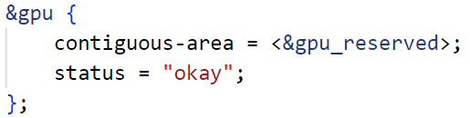
> 图：通过&gpu引用节点并修改其内容：contiguous-area = <&gpu_reserved>; status = "okay";（引用节点中新增contiguous-area属性、覆盖status属性，原dtsi文件不作改动）

<!-- Slide number: 16 -->
# 9.2 设备树语法
在编译时，引用节点中所写的内容会合并到原节点下，合并方式为：新增属性追加，重复属性覆盖

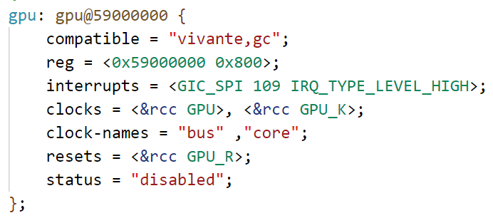
> 图：stm32mp15xx-fsmp1a.dtsi中gpu节点的原始定义：gpu: gpu@59000000 { compatible = "vivante,gc"; reg = <0x59000000 0x800>; interrupts = <GIC_SPI 109 IRQ_TYPE_LEVEL_HIGH>; clocks = <&rcc GPU>, <&rcc GPU_K>; clock-names = "bus", "core"; resets = <&rcc GPU_R>; status = "disabled"; }

> 图：用户自己编写的.dts中通过&gpu引用该节点并写入：contiguous-area = <&gpu_reserved>; status = "okay";

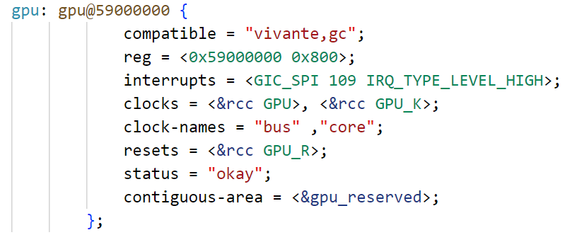
> 图：编译合并后的gpu节点：gpu: gpu@59000000 { compatible = "vivante,gc"; reg = <0x59000000 0x800>; interrupts = <GIC_SPI 109 IRQ_TYPE_LEVEL_HIGH>; clocks = <&rcc GPU>, <&rcc GPU_K>; clock-names = "bus", "core"; resets = <&rcc GPU_R>; status = "okay"; contiguous-area = <&gpu_reserved>; }——status由"disabled"覆盖为"okay"（重复属性覆盖），追加了contiguous-area（新增属性追加）

<!-- Slide number: 17 -->
# 9.2 设备树语法
“&lable”引用节点的目的是对节点内容进行修改
这种修改只需要写在自己编写的.dts文件中，而保持原有的dtsi文件不作任何改动

<!-- Slide number: 18 -->
# 9.2 设备树语法
节点属性
属性为键-值对
键：除了一些规定的标准属性外，键是自定义的（属性自定义）
值：标准属性有特定数据类型的值，其它属性的值是任意字节流或空值

<!-- Slide number: 19 -->
# 9.2 设备树语法
属性值的一些常用数据类型：
字符串，例如

字符串列表

cell，用“<>”括起来，里面是u32整数
                                                        //单个值
                                                        //一组值
phandle，节点的引用，本质上是一个u32整数

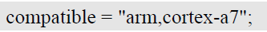
> 图：字符串类型属性值示例：compatible = "arm,cortex-a7";

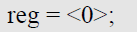
> 图：cell类型属性值示例（单个值，用"<>“括起来的u32整数）：reg = <0>;

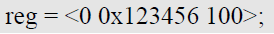
> 图：cell类型属性值示例（一组值）：reg = <0 0x123456 100>;

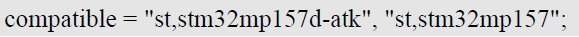
> 图：字符串列表类型属性值示例：compatible = "st,stm32mp157d-atk", "st,stm32mp157";

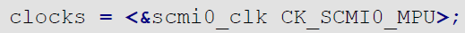
> 图：phandle类型属性值示例（节点的引用）：clocks = <&scmi0_clk CK_SCMI0_MPU>;

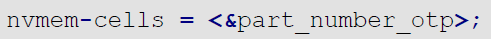
> 图：phandle类型属性值示例（节点的引用）：nvmem-cells = <&part_number_otp>;

<!-- Slide number: 20 -->
# 9.2设备树语法
标准属性
不同设备需要的属性不同，用户可以为设备自定义属性
设备有一些共同的属性，Linux中定义了一些标准属性，常见的有：
compatible
model
status
#address-cell和#size-cell
reg
ranges

<!-- Slide number: 21 -->
# 9.2设备树语法
compatible属性
根节点的compatible属性有特殊意义，这里只针对非根节点
描述驱动的“兼容性”，即驱动匹配的设备
它的值是一个字符串列表，列表中每个元素的格式通常为：
                      "manufacturer,model"
    manufacturer表示厂商， model表示设备。
通常在驱动程序中有一个OF匹配表，里面保存了一些compatible值，当驱动程序中的一个compatible值与设备树中的一个值匹配时，驱动程序与设备节点匹配上

<!-- Slide number: 22 -->
stm32mp151.dtsi中的usart节点

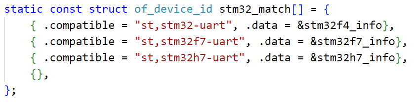
> 图：stm32mp151.dtsi中的usart2节点：usart2: serial@4000e000 { compatible = "st,stm32h7-uart"; reg = <0x4000e000 0x400>; }

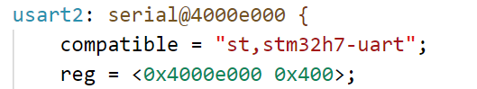
> 图：驱动文件stm32-uart.c中的OF匹配表：static const struct of_device_id stm32_match[] = { { .compatible = "st,stm32-uart", .data = &stm32f4_info }, { .compatible = "st,stm32f7-uart", .data = &stm32f7_info }, { .compatible = "st,stm32h7-uart", .data = &stm32h7_info }, {}, };——其中"st,stm32h7-uart"与设备树usart2节点的compatible值匹配
驱动文件stm32-uart.c中的OF匹配表

<!-- Slide number: 23 -->
# 9.2设备树语法
model属性
值是字符串
用于描述开发板的名字或者设备模块信息

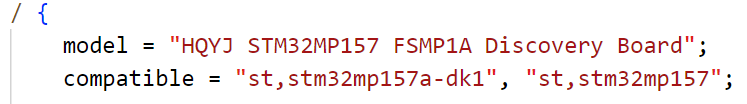
> 图：stm32mp157a-fsmp1a.dts根节点：model = "HQYJ STM32MP157 FSMP1A Discovery Board"; compatible = "st,stm32mp157a-dk1", "st,stm32mp157";（model属性为字符串，描述开发板名字）
stm32mp157a-fsmp1a.dts中的model属性

<!-- Slide number: 24 -->
# 9.2设备树语法
status属性
描述设备状态
值是字符串，可选值如下

最常用的值是“okay”和“disabled”

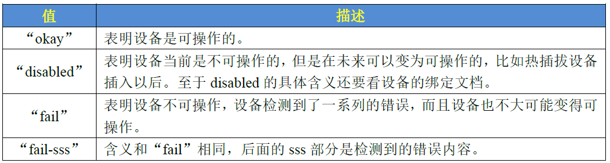
> 图：status属性可选值表格——"okay"：表明设备是可操作的；"disabled"：表明设备当前是不可操作的，但是在未来可以变为可操作的（比如热插拔设备插入以后），disabled的具体含义还要看设备的绑定文档；"fail"：表明设备不可操作，设备检测到了一系列的错误，而且设备也不大可能变得可操作；"fail-sss"：含义和"fail"相同，后面的sss部分是检测到的错误内容

<!-- Slide number: 25 -->
stm32mp15xx-fsmp1a.dtsi中gpu节点的status属性

> 图：通过&gpu引用将gpu节点的status属性设置为"okay"：contiguous-area = <&gpu_reserved>; status = "okay";（gpu节点被使能）

<!-- Slide number: 26 -->
# 9.2设备树语法
#address-cells和#size-cells属性
“#”代表number
值的数据类型为<u32>
用于描述子节点的reg属性的值如何解析
reg属性描述设备的地址，采用<基址  长度>的形式表示地址
#address-cells指定基址占的cell数
#size-cells指定长度占的cell数

<!-- Slide number: 27 -->

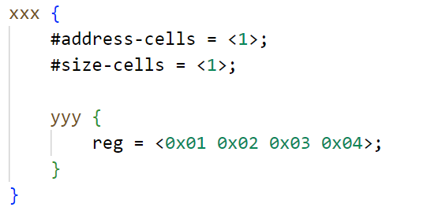
> 图：#address-cells = <1>、#size-cells = <1>时子节点reg的解析：xxx节点下yyy节点 reg = <0x01 0x02 0x03 0x04>，前两个u32（0x01、0x02）为基址，后两个u32（0x03、0x04）为长度，即一条"基址 长度"记录
基址
长度

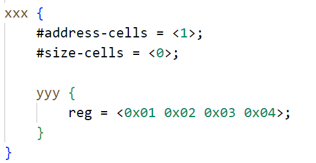
> 图：#address-cells = <1>、#size-cells = <0>时子节点reg的解析：xxx节点下yyy节点 reg = <0x01 0x02 0x03 0x04>，每个u32都是一个基址、没有长度字段，即两条地址记录
基址

<!-- Slide number: 28 -->
# 9.2设备树语法
reg属性
表示设备的地址
值通常是<基址  长度>的形式，
如果设备的地址为内存地址，基址和长度通常用16进制数表示

<!-- Slide number: 29 -->
# 9.2设备树语法
ranges属性
属性值为空或者按<子总线基址  父总线基址  长度>的格式编写
ranges属性定义了一个地址映射表，描述了子总线和父总线的地址映射关系
子总线上的一个地址x，映射到父总线上的地址为y，则它们的关系为：
           x - 子总线基址 = y - 父总线基址

<!-- Slide number: 30 -->

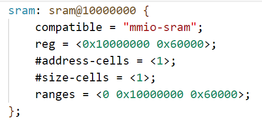
> 图：stm32mp151.dtsi中的sram节点：sram: sram@10000000 { compatible = "mmio-sram"; reg = <0x10000000 0x60000>; #address-cells = <1>; #size-cells = <1>; ranges = <0 0x10000000 0x60000>; }——ranges表示子总线地址0起、长度0x60000的一段空间映射到父总线地址0x10000000
stm32mp151.dtsi中的sram节点

<!-- Slide number: 31 -->
# 9.2设备树语法
根节点的compatible属性
通常它的值有2个元素，第一个元素描述开发板名字，第二个元素描述CPU芯片的名字
Linux内核利用此属性检测开发板是否与内核匹配，匹配才能启动内核（compatible中任意一个值与内核匹配上即可）

> 图：stm32mp157a-fsmp1a.dts根节点的compatible属性：model = "HQYJ STM32MP157 FSMP1A Discovery Board"; compatible = "st,stm32mp157a-dk1", "st,stm32mp157";（第一个元素描述开发板名字，第二个元素描述CPU芯片名字）
stm32mp157a-fsmp1a.dts中的compatible属性

<!-- Slide number: 32 -->
# 9.2设备树语法
内核中定义了一个machine_desc结构体，它的dt_compat 成员记录了内核兼容的开发板，当设备树根节点compatible属性与dt_compat 记录的某一开发板匹配时才能启动内核

<!-- Slide number: 33 -->

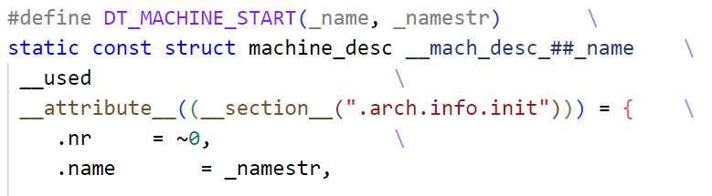
> 图：arch/arm/mach-stm32/board-dt.c中记录的兼容开发板：static const char *const stm32_compat[] __initconst = { "st,stm32f429", "st,stm32f469", "st,stm32f746", "st,stm32f769", "st,stm32h743", "st,stm32mp151", "st,stm32mp153", "st,stm32mp157", NULL }; 以及DT_MACHINE_START(STM32DT, "STM32 (Device Tree Support)")中.dt_compat = stm32_compat（#ifdef CONFIG_ARM_SINGLE_ARMV7M时.restart = armv7m_restart），最后MACHINE_END

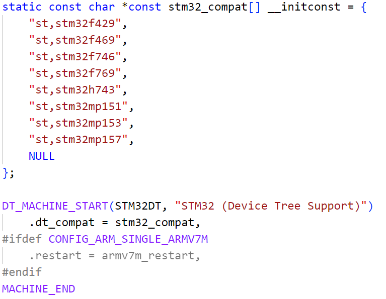
> 图：DT_MACHINE_START宏定义：#define DT_MACHINE_START(_name, _namestr) static const struct machine_desc __mach_desc_##_name __used __attribute__((__section__(".arch.info.init"))) = { .nr = ~0, .name = _namestr, ……（machine_desc结构体由此宏定义并被放入.arch.info.init段）
arch/arm/mach-stm32/board-dt.c中记录的兼容开发板
DT_MACHINE_STAR宏定义

<!-- Slide number: 34 -->
# 9.2设备树语法
特殊节点
根节点下有两个特殊节点：aliases和chosen
aliases用于为现有节点定义别名，
别名主要是用在驱动代码中（有些设备在驱动中有习惯性命名）
在设备树中访问节点，&lable更常用
chosen用于传递内核启动参数

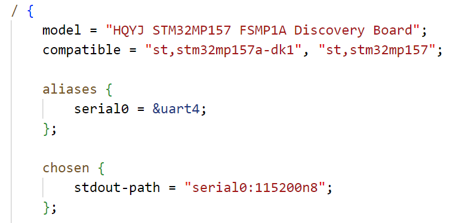
> 图：根节点下的aliases和chosen特殊节点：aliases { serial0 = &uart4; };（为uart4节点定义别名serial0），chosen { stdout-path = "serial0:115200n8"; };（用于传递内核启动参数），根节点还有model = "HQYJ STM32MP157 FSMP1A Discovery Board"、compatible = "st,stm32mp157a-dk1", "st,stm32mp157"属性

<!-- Slide number: 35 -->
# 9.2 设备树语法
chosen节点
在不使用设备树的内核中，启动参数存放在内存中特定位置，uboot将启动参数的存放地址传递给内核
在使用设备树的的内核中，uboot在chosen下创建一个bootargs属性，并将bootargs环境变量的值赋值给该属性

<!-- Slide number: 36 -->
# 9.2设备树语法
在Linux中查看设备树
在开发板的Linux系统中，可以查看当前使用的设备树
Linux系统中用目录树来表示设备树
设备节点用目录表示
节点属性用目录中的文件表示
属性的值用文件的内容表示
设备根节点对应目录“/proc/device-tree”

<!-- Slide number: 37 -->
例，使用ls 命令查看根节点的属性和一级子节点

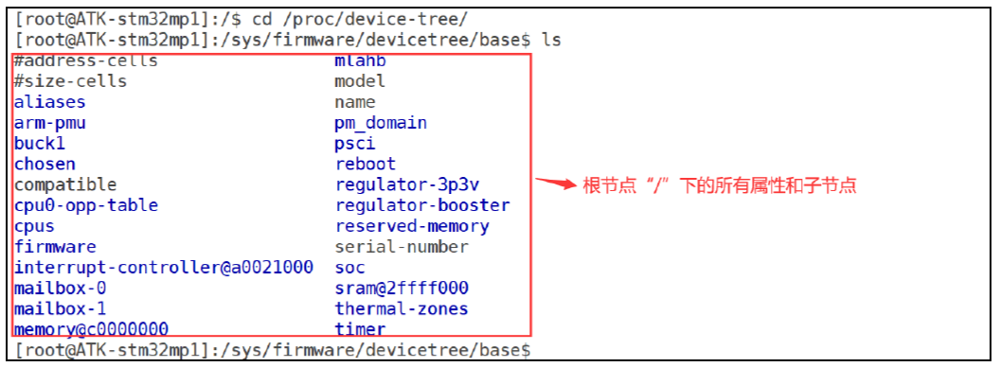
> 图：开发板串口终端执行cd /proc/device-tree/（对应/sys/firmware/devicetree/base）后用ls查看根节点：可见#address-cells、#size-cells、aliases、arm-pmu、buck1、chosen、compatible、cpu0-opp-table、cpus、firmware、interrupt-controller@a0021000、mailbox-0、mailbox-1、memory@c0000000、model、name、pm_domain、psci、reboot、regulator-3p3v、regulator-booster、reserved-memory、serial-number、soc、sram@2ffff000、thermal-zones、timer等目录和文件（红框标注：根节点"/"下的所有属性和子节点）

<!-- Slide number: 38 -->
例，使用cat命令查看bootargs属性的值

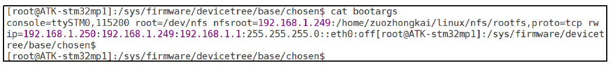
> 图：在/sys/firmware/devicetree/base/chosen目录下执行cat bootargs，读出内核启动参数：console=ttySTM0,115200 root=/dev/nfs nfsroot=192.168.1.249:/home/zuozhongkai/linux/nfs/rootfs,proto=tcp rw ip=192.168.1.250:192.168.1.249:192.168.1.1:255.255.255.0::eth0:off

<!-- Slide number: 39 -->
# 9.3 bindings文档
由于属性自定义的特点，不同设备的属性不同，不同厂商生产的同类设备属性定义也不同
节点属性的描述没有标准规范，各厂商都有自己的描述方式
在编写特定设备的设备树节点时，需要参考厂商提说明文档或模板
有很多说明文档已经放在了内核源码中，在Documentation/devicetree/bindings目录下
这些文档被称为bindings文档

<!-- Slide number: 40 -->

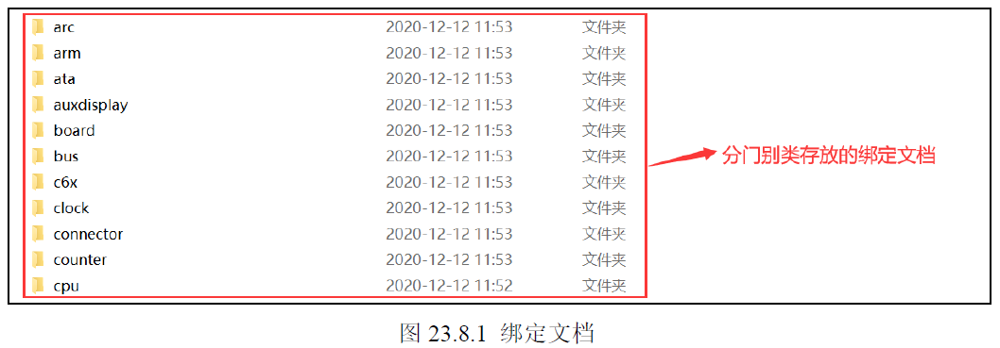
> 图：内核源码Documentation/devicetree/bindings目录（图23.8.1 绑定文档）：arc、arm、ata、auxdisplay、board、bus、c6x、clock、connector、counter、cpu等子文件夹（红箭头标注：分门别类存放的绑定文档）

<!-- Slide number: 41 -->
# 9.4 OF函数
Linux内核提供一系列函数用于访问设备树，以获取节点或属性信息
这些函数的函数名都以“of_”开头，通常被叫做OF函数
OF函数的原型定义在include/linux/of.h中
OF函数的帮助可在以下文档查看：
https://docs.kernel.org/devicetree/kernel-api.html

<!-- Slide number: 42 -->
# 9.4 OF函数
查找节点的OF函数
要获取节点属性，必须先从设备树中查找到节点，然后再读取节点属性
Linux内核使用device_node结构体来描述一个节点，它定义在include/linux/of.h

<!-- Slide number: 43 -->

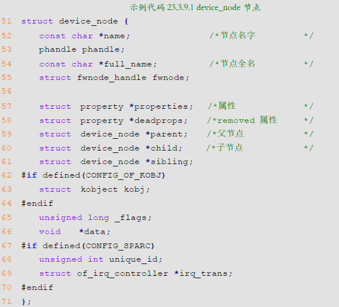
> 图：device_node结构体定义（include/linux/of.h，示例代码23.3.9.1 device_node节点）：const char *name（节点名字）、phandle phandle、const char *full_name（节点全名）、struct fwnode_handle *fwnode；struct property *properties（属性）、struct property *deadprops（removed属性）、struct device_node *parent（父节点）、*child（子节点）、*sibling（兄弟节点）；#if defined(CONFIG_OF_KOBJ)时有struct kobject kobj；另有unsigned long _flags、void *data；#if defined(CONFIG_SPARC)时有unsigned int unique_id、struct of_irq_controller *irq_trans

<!-- Slide number: 44 -->
# 9.4 OF函数
（1）of_find_node_by_name函数
通过节点名查找节点

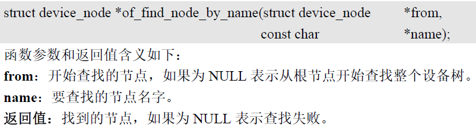
> 图：of_find_node_by_name函数原型：struct device_node *of_find_node_by_name(struct device_node *from, const char *name)。参数from：开始查找的节点，为NULL表示从根节点开始查找整个设备树；name：要查找的节点名字。返回值：找到的节点，为NULL表示查找失败

<!-- Slide number: 45 -->
# 9.4 OF函数
（2）of_find_node_by_path函数
通过路径（节点在设备树中的位置）来查找节点

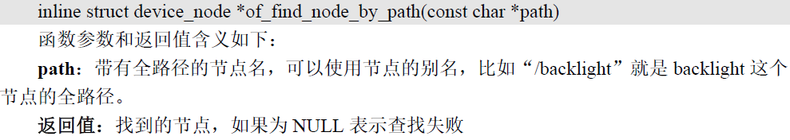
> 图：of_find_node_by_path函数原型：inline struct device_node *of_find_node_by_path(const char *path)。参数path：带有全路径的节点名，可以使用节点的别名，比如"/backlight"就是backlight这个节点的全路径。返回值：找到的节点，为NULL表示查找失败

<!-- Slide number: 46 -->
# 9.4 OF函数
（3）of_find_compatible_node函数
根据device_type和 compatible这两个属性查找指定节点

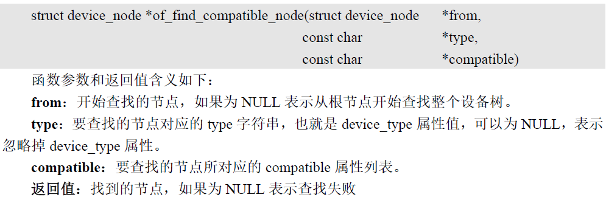
> 图：of_find_compatible_node函数原型：struct device_node *of_find_compatible_node(struct device_node *from, const char *type, const char *compatible)。参数from：开始查找的节点，为NULL表示从根节点开始查找整个设备树；type：要查找的节点对应的type字符串，也就是device_type属性值，可以为NULL表示忽略掉device_type属性；compatible：要查找的节点所对应的compatible属性列表。返回值：找到的节点，为NULL表示查找失败

<!-- Slide number: 47 -->
# 9.4 OF函数
（4）of_find_matching_node_and_match函数
通过 of_device_id匹配表来查找指定的节点

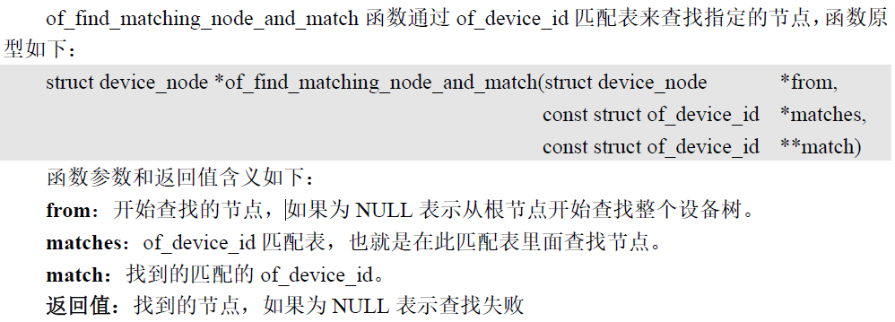
> 图：of_find_matching_node_and_match函数通过of_device_id匹配表来查找指定的节点，原型：struct device_node *of_find_matching_node_and_match(struct device_node *from, const struct of_device_id *matches, const struct of_device_id **match)。参数from：开始查找的节点，为NULL表示从根节点开始查找整个设备树；matches：of_device_id匹配表，也就是在此匹配表里面查找节点；match：找到的匹配的of_device_id。返回值：找到的节点，为NULL表示查找失败

<!-- Slide number: 48 -->
# 9.4 OF函数
查找父 /子节点的 OF函数
（1）of_get_parent函数
查找指定节点的父节点

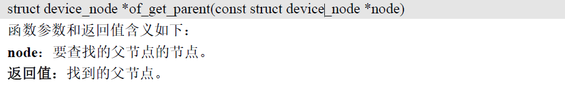
> 图：of_get_parent函数原型：struct device_node *of_get_parent(const struct device_node *node)。参数node：要查找其父节点的节点。返回值：找到的父节点

<!-- Slide number: 49 -->
# 9.4 OF函数
（2）of_get_next_child函数
迭代查找子节点

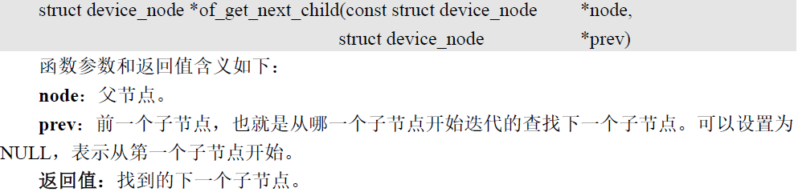
> 图：of_get_next_child函数原型：struct device_node *of_get_next_child(const struct device_node *node, struct device_node *prev)。参数node：父节点；prev：前一个子节点，也就是从哪一个子节点开始迭代的查找下一个子节点，可以设置为NULL表示从第一个子节点开始。返回值：找到的下一个子节点

<!-- Slide number: 50 -->
# 9.4 OF函数
提取属性值的OF函数
Linux内核使用结构体 property表示属性
此结构体定义在文件 include/linux/of.h中

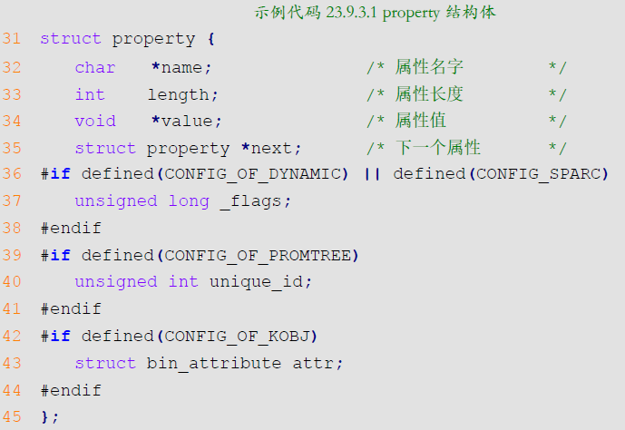
> 图：property结构体定义（include/linux/of.h，示例代码23.9.3.1 property结构体）：char *name（属性名字）、int length（属性长度）、void *value（属性值）、struct property *next（下一个属性）；#if defined(CONFIG_OF_DYNAMIC) || defined(CONFIG_SPARC)时有unsigned long _flags；#if defined(CONFIG_OF_PROMTREE)时有unsigned int unique_id；#if defined(CONFIG_OF_KOBJ)时有struct bin_attribute attr

<!-- Slide number: 51 -->
# 9.4 OF函数
（1）of_find_property函数
用于查找指定的属性

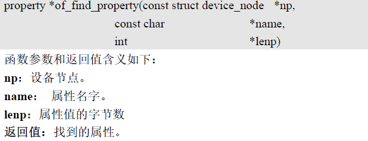
> 图：of_find_property函数原型：property *of_find_property(const struct device_node *np, const char *name, int *lenp)。参数np：设备节点；name：属性名字；lenp：属性值的字节数（不确定字节数时，此参数为NULL）。返回值：找到的属性
，不确定字节数时，此参数为NULL

<!-- Slide number: 52 -->
# 9.4 OF函数
（2）of_property_count_elems_of_size函数
用于获取属性中元素的数量
例如 reg属性值是一个数组，使用此函数可以获取到这个数组的大小

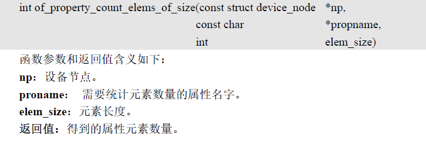
> 图：of_property_count_elems_of_size函数原型：int of_property_count_elems_of_size(const struct device_node *np, const char *propname, int elem_size)。参数np：设备节点；propname：需要统计元素数量的属性名字；elem_size：元素长度。返回值：得到的属性元素数量

<!-- Slide number: 53 -->
# 9.4 OF函数
（3）of_property_read_u32_index函数
用于从属性中获取指定标号的 u32类型数据值
某个属性有多个 u32类型的值，就可以使用此函数来获取指定标号的数据值

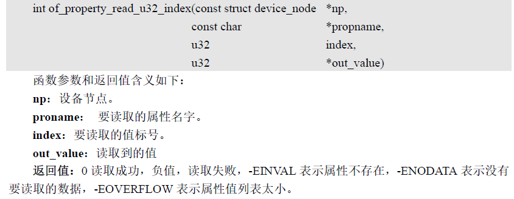
> 图：of_property_read_u32_index函数原型：int of_property_read_u32_index(const struct device_node *np, const char *propname, u32 index, u32 *out_value)。参数np：设备节点；proname：要读取的属性名字；index：要读取的值标号；out_value：读取到的值。返回值：0读取成功，负值读取失败，-EINVAL表示属性不存在，-ENODATA表示没有要读取的数据，-EOVERFLOW表示属性值列表太小

<!-- Slide number: 54 -->
# 9.4 OF函数
（4）of_property_read_u32函数
用于读取整型值的属性

> 图：of_property_read_u32函数原型：int of_property_read_u32(const struct device_node *np, const char *propname, u32 *out_value)（用于读取整型值的属性）

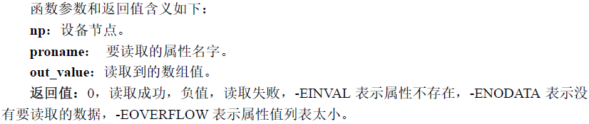
> 图：函数参数和返回值含义：np：设备节点；proname：要读取的属性名字；out_value：读取到的数组值；返回值：0读取成功，负值读取失败，-EINVAL表示属性不存在，-ENODATA表示没有要读取的数据，-EOVERFLOW表示属性值列表太小

<!-- Slide number: 55 -->
# 9.4 OF函数
（5）of_property_read_u32_array函数
读取属性中u32类型的数组
比如通常 reg属性都是u32数组，可以使用这个函数一次读取出reg属性中的所有数据

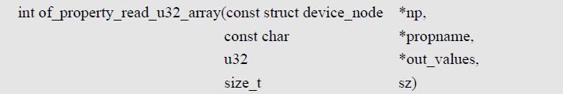
> 图：of_property_read_u32_array函数原型：int of_property_read_u32_array(const struct device_node *np, const char *propname, u32 *out_values, size_t sz)

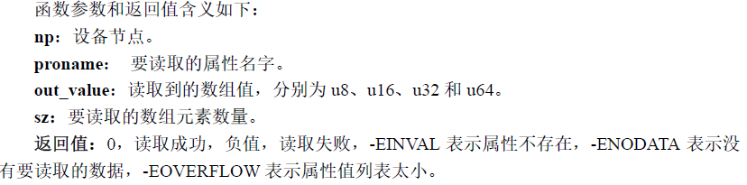
> 图：函数参数和返回值含义：np：设备节点；proname：要读取的属性名字；out_value：读取到的数组值，分别为u8、u16、u32和u64；sz：要读取的数组元素数量；返回值：0读取成功，负值读取失败，-EINVAL表示属性不存在，-ENODATA表示没有要读取的数据，-EOVERFLOW表示属性值列表太小

<!-- Slide number: 56 -->
# 9.4 OF函数
（6）of_property_read_string函数
用于读取属性中字符串值

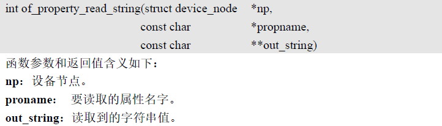
> 图：of_property_read_string函数原型：int of_property_read_string(struct device_node *np, const char *propname, const char **out_string)。参数np：设备节点；propname：要读取的属性名字；out_string：读取到的字符串值

> 图：of_property_read_string函数返回值：0读取成功，负值读取失败

<!-- Slide number: 57 -->
# 9.5 使用设备树的LED驱动
例，将上一章的LED驱动修改为使用设备树的版本
在开发板的设备树文件stm32mp157a-fsmp1a.dts中添加LED节点
LED节点可添加到设备树的任意节点下，为了简单，此处添加到根节点下，添加后的设备树见stm32mp157a-fsmp1a.dts
设备树修改后需要重新编译，用新设备树启动内核。编译命令为:
                               make dtbs
  驱动程序代码见dtsled.c
